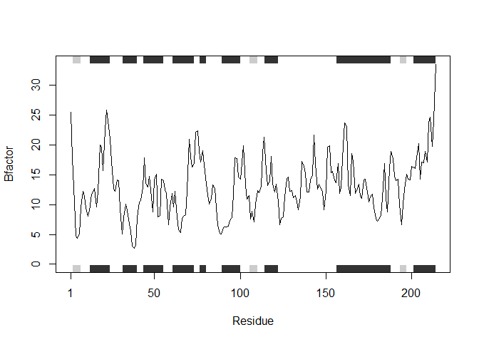
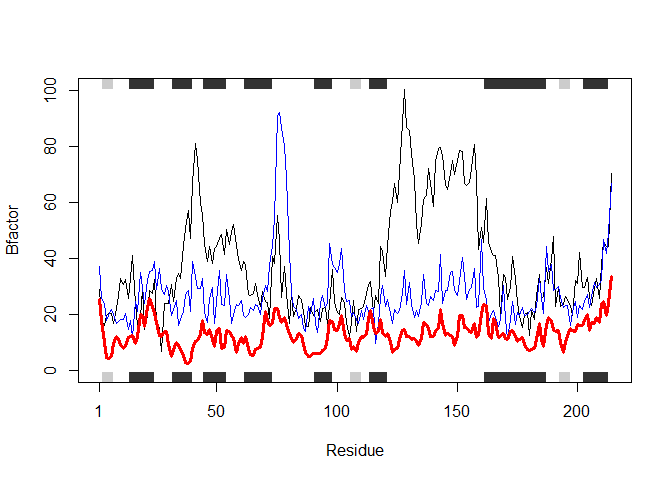

Class 6: R functions
================
Alberto Carreno
1/24/2020

## R Markdown

## this is a level 2 heading

``` r
x <- c(1:10)
x
```

    ##  [1]  1  2  3  4  5  6  7  8  9 10

here is my analyssis , the mean fof your data is 5.5

this is **regular** old *text*\!

and a list of stuff

``` r
plot(1:5, col = "blue", type = "o")
```

<!-- -->

\-a thing -another thing -and a third

### this is a level 3 heading

## more on reading input files

we will use the read.table() function again

This is an R Markdown document. Markdown is a simple formatting syntax
for authoring HTML, PDF, and MS Word documents. For more details on
using R Markdown see <http://rmarkdown.rstudio.com>.

When you click the **Knit** button a document will be generated that
includes both content as well as the output of any embedded R code
chunks within the document. You can embed an R code chunk like this:

``` r
summary(cars)
```

    ##      speed           dist       
    ##  Min.   : 4.0   Min.   :  2.00  
    ##  1st Qu.:12.0   1st Qu.: 26.00  
    ##  Median :15.0   Median : 36.00  
    ##  Mean   :15.4   Mean   : 42.98  
    ##  3rd Qu.:19.0   3rd Qu.: 56.00  
    ##  Max.   :25.0   Max.   :120.00

## Including Plots

You can also embed plots, for example:

<!-- -->

Note that the `echo = FALSE` parameter was added to the code chunk to
prevent printing of the R code that generated the plot.

``` r
x <- read.table("test1.txt" ,header = TRUE, sep = ",")
x
```

    ##   Col1 Col2 Col3
    ## 1    1    2    3
    ## 2    4    5    6
    ## 3    7    8    9
    ## 4    a    b    c

``` r
y <- read.table("test2.txt", sep = "$", header = T)
y
```

    ##   Col1 Col2 Col3
    ## 1    1    2    3
    ## 2    4    5    6
    ## 3    7    8    9
    ## 4    a    b    c

``` r
z <- read.table("test3.txt")
z
```

    ##   V1 V2 V3
    ## 1  1  6  a
    ## 2  2  7  b
    ## 3  3  8  c
    ## 4  4  9  d
    ## 5  5 10  e

\#\#Time to work on functions\!

``` r
add <- function(x,y = 1){
  x+y
}
```

``` r
add(c(1,2,3),22)
```

    ## [1] 23 24 25

``` r
a <- range(c(1,2,3,4))
a[2]
```

    ## [1] 4

``` r
rescale <- function(x){
  rng <- range(x)
  (x-rng[1])/(rng[2] -rng[1])
}
```

``` r
rescale(c(1:10,30,100))
```

    ##  [1] 0.00000000 0.01010101 0.02020202 0.03030303 0.04040404 0.05050505
    ##  [7] 0.06060606 0.07070707 0.08080808 0.09090909 0.29292929 1.00000000

``` r
x <- c(1:10)
rng <- range(x,na.rm = T)
rng
```

    ## [1]  1 10

``` r
rescale2 <- function(x){
  rng <- range(x, na.rm = TRUE)
  (x-rng[1])/(rng[2] -rng[1])
}
```

``` r
rescale(c(1:10,NA))
```

    ##  [1] NA NA NA NA NA NA NA NA NA NA NA

``` r
 rescale2(c(1:10,NA))
```

    ##  [1] 0.0000000 0.1111111 0.2222222 0.3333333 0.4444444 0.5555556 0.6666667
    ##  [8] 0.7777778 0.8888889 1.0000000        NA

``` r
 rescale(c(1,10,NA))
```

    ## [1] NA NA NA

``` r
 rescale2(c(1,10,NA))
```

    ## [1]  0  1 NA

``` r
rescale3 <- function(x, na.rm=TRUE, plot=FALSE) {
 if(na.rm) {
 rng <-range(x, na.rm=na.rm)
 } else {
 rng <-range(x)
 }
 print("Hello")
 answer <- (x - rng[1]) / (rng[2] - rng[1])
 print("is it me you are looking for?")
 if(plot) {
 plot(answer, typ="b", lwd=4)
 }
 print("I can see it in ...")
 return(answer)
}
```

``` r
rescale3(x)
```

    ## [1] "Hello"
    ## [1] "is it me you are looking for?"
    ## [1] "I can see it in ..."

    ##  [1] 0.0000000 0.1111111 0.2222222 0.3333333 0.4444444 0.5555556 0.6666667
    ##  [8] 0.7777778 0.8888889 1.0000000

``` r
#install.packages("bio3d")
```

``` r
library(bio3d)
```

``` r
# Can you improve this analysis code?
library(bio3d)
s1 <- read.pdb("4AKE") # kinase with drug
```

    ##   Note: Accessing on-line PDB file

``` r
s2 <- read.pdb("1AKE") # kinase no drug
```

    ##   Note: Accessing on-line PDB file
    ##    PDB has ALT records, taking A only, rm.alt=TRUE

``` r
s3 <- read.pdb("1E4Y") # kinase with drug
```

    ##   Note: Accessing on-line PDB file

``` r
s1.chainA <- trim.pdb(s1, chain="A", elety="CA")
s2.chainA <- trim.pdb(s2, chain="A", elety="CA")
s3.chainA <- trim.pdb(s3, chain="A", elety="CA")
s1.b <- s1.chainA$atom$b
s2.b <- s2.chainA$atom$b
s3.b <- s3.chainA$atom$b
plotb3(s1.b, sse=s1.chainA, typ="l", ylab="Bfactor")
```

<!-- -->

``` r
plotb3(s2.b, sse=s2.chainA, typ="l", ylab="Bfactor")
```

<!-- -->

``` r
plotb3(s3.b, sse=s3.chainA, typ="l", ylab="Bfactor")
```

<!-- -->

``` r
library(bio3d)
s1 <- read.pdb("4AKE") # kinase with drug
```

    ##   Note: Accessing on-line PDB file

    ## Warning in get.pdb(file, path = tempdir(), verbose = FALSE): C:
    ## \Users\acarr\AppData\Local\Temp\Rtmpc78eyk/4AKE.pdb exists. Skipping download

``` r
s2 <- read.pdb("1AKE") # kinase no drug
```

    ##   Note: Accessing on-line PDB file

    ## Warning in get.pdb(file, path = tempdir(), verbose = FALSE): C:
    ## \Users\acarr\AppData\Local\Temp\Rtmpc78eyk/1AKE.pdb exists. Skipping download

    ##    PDB has ALT records, taking A only, rm.alt=TRUE

``` r
s3 <- read.pdb("1E4Y") # kinase with drug
```

    ##   Note: Accessing on-line PDB file

    ## Warning in get.pdb(file, path = tempdir(), verbose = FALSE): C:
    ## \Users\acarr\AppData\Local\Temp\Rtmpc78eyk/1E4Y.pdb exists. Skipping download

``` r
s4 <- read.pdb("1BG2") #test
```

    ##   Note: Accessing on-line PDB file

``` r
s1.chainA <- trim.pdb(s1, chain="A", elety="CA")
s2.chainA <- trim.pdb(s2, chain="A", elety="CA")
s3.chainA <- trim.pdb(s3, chain="A", elety="CA")
s1.b <- s1.chainA$atom$b
s2.b <- s2.chainA$atom$b
s3.b <- s3.chainA$atom$b
plotb3(s1.b, sse=s1.chainA, typ="l", ylab="Bfactor")
```

<!-- -->

``` r
plotb3(s2.b, sse=s2.chainA, typ="l", ylab="Bfactor")
```

<!-- -->

``` r
plotb3(s3.b, sse=s3.chainA, typ="l", ylab="Bfactor")
```

<!-- -->

``` r
#a,b, and c are values stores as read.pdb("protein")
threeinone <- function(a,b,c) {
 sa.chainA <- trim.pdb(a, chain = "A", elety = "CA")
  sa.b <- sa.chainA$atom$b
  plotb3(sa.b, sse=sa.chainA, typ = "l", ylab= "Bfactor")
  
   sb.chainA <- trim.pdb(b, chain = "A", elety = "CA")
  sb.b <- sb.chainA$atom$b
  plotb3(sb.b, sse=sb.chainA, typ = "l", ylab= "Bfactor")
  
   sc.chainA <- trim.pdb(c, chain = "A", elety = "CA")
  sc.b <- sc.chainA$atom$b
  plotb3(sc.b, sse=sc.chainA, typ = "l", ylab= "Bfactor")
  
plotb3(sa.b, sse=s1.chainA, typ="l", ylab="Bfactor")
points(sb.b, col="blue", typ="l")
points(sc.b, col="red", typ="l", lwd=3)
  
}
threeinone(s1,s2,s3)
```

<!-- --><!-- --><!-- --><!-- -->

## BEGINNING OF MY FUNCTION

``` r
#a,b, and c are values stored as read.pdb("protein")
library(bio3d)
threeinone <- function(a,b,c) {
 sa.chainA <- trim.pdb(a, chain = "A", elety = "CA") #take variable "a" (which is a read.pdb variable for a given protein) and filter out/trim structures from the original PDB input and select for Chain and atom type.
  sa.b <- sa.chainA$atom$b #isolate the atoms in chain A from sa.chainA to get just the atom vector coordinates.
  plotb3(sa.b, sse=sa.chainA, typ = "l", ylab= "Bfactor") #plot for variable as a line and setting the Bfactor values on the y axis
  
   sb.chainA <- trim.pdb(b, chain = "A", elety = "CA")#repeat for second,b, variable 
  sb.b <- sb.chainA$atom$b
  plotb3(sb.b, sse=sb.chainA, typ = "l", ylab= "Bfactor")#plot for second variable
  
   sc.chainA <- trim.pdb(c, chain = "A", elety = "CA") #repeat for third,c, variable 
  sc.b <- sc.chainA$atom$b
  plotb3(sc.b, sse=sc.chainA, typ = "l", ylab= "Bfactor") #plot for third variable
#now overlay all three inputs into one graph
plotb3(sa.b, sse=s1.chainA, typ="l", ylab="Bfactor")
points(sb.b, col="blue", typ="l")
points(sc.b, col="red", typ="l", lwd=3)
  
}
```

``` r
#a,b, and c are values stores as read.pdb("protein")
threeinone(s1,s2,s3)
```

<!-- --><!-- --><!-- --><!-- -->
