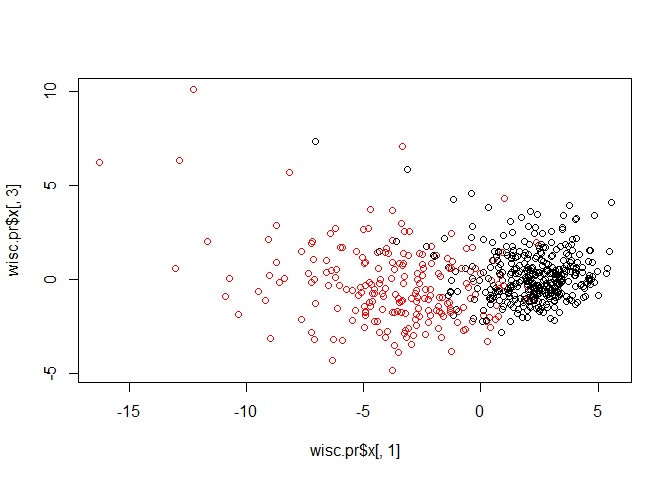
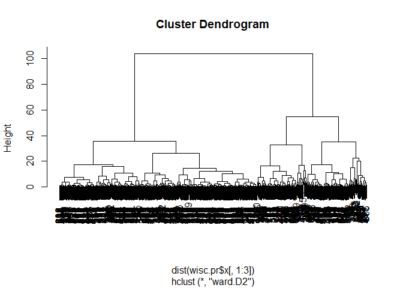
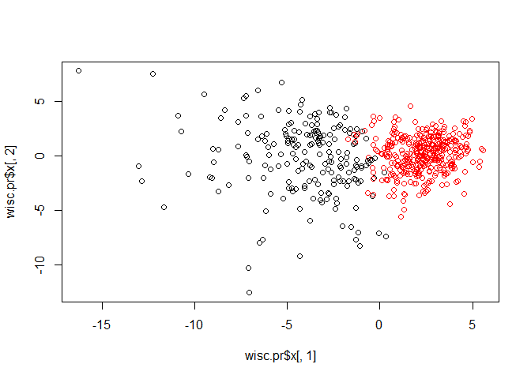
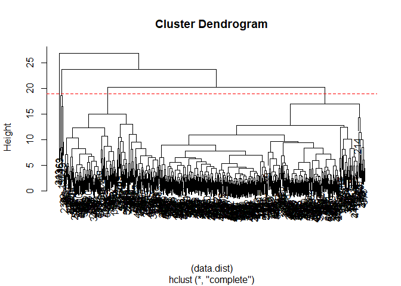

Class\_10\_markdown
================

fna.data \<- “data/WisconsinCancer.csv”

``` r
fna.data <- "data/WisconsinCancer.csv"
wisc.df <- read.csv("WisconsinCancer.csv")
```

``` r
wisc.data <- as.matrix(wisc.df[,3:32])
head(wisc.data)
```

    ##      radius_mean texture_mean perimeter_mean area_mean smoothness_mean
    ## [1,]       17.99        10.38         122.80    1001.0         0.11840
    ## [2,]       20.57        17.77         132.90    1326.0         0.08474
    ## [3,]       19.69        21.25         130.00    1203.0         0.10960
    ## [4,]       11.42        20.38          77.58     386.1         0.14250
    ## [5,]       20.29        14.34         135.10    1297.0         0.10030
    ## [6,]       12.45        15.70          82.57     477.1         0.12780
    ##      compactness_mean concavity_mean concave.points_mean symmetry_mean
    ## [1,]          0.27760         0.3001             0.14710        0.2419
    ## [2,]          0.07864         0.0869             0.07017        0.1812
    ## [3,]          0.15990         0.1974             0.12790        0.2069
    ## [4,]          0.28390         0.2414             0.10520        0.2597
    ## [5,]          0.13280         0.1980             0.10430        0.1809
    ## [6,]          0.17000         0.1578             0.08089        0.2087
    ##      fractal_dimension_mean radius_se texture_se perimeter_se area_se
    ## [1,]                0.07871    1.0950     0.9053        8.589  153.40
    ## [2,]                0.05667    0.5435     0.7339        3.398   74.08
    ## [3,]                0.05999    0.7456     0.7869        4.585   94.03
    ## [4,]                0.09744    0.4956     1.1560        3.445   27.23
    ## [5,]                0.05883    0.7572     0.7813        5.438   94.44
    ## [6,]                0.07613    0.3345     0.8902        2.217   27.19
    ##      smoothness_se compactness_se concavity_se concave.points_se symmetry_se
    ## [1,]      0.006399        0.04904      0.05373           0.01587     0.03003
    ## [2,]      0.005225        0.01308      0.01860           0.01340     0.01389
    ## [3,]      0.006150        0.04006      0.03832           0.02058     0.02250
    ## [4,]      0.009110        0.07458      0.05661           0.01867     0.05963
    ## [5,]      0.011490        0.02461      0.05688           0.01885     0.01756
    ## [6,]      0.007510        0.03345      0.03672           0.01137     0.02165
    ##      fractal_dimension_se radius_worst texture_worst perimeter_worst area_worst
    ## [1,]             0.006193        25.38         17.33          184.60     2019.0
    ## [2,]             0.003532        24.99         23.41          158.80     1956.0
    ## [3,]             0.004571        23.57         25.53          152.50     1709.0
    ## [4,]             0.009208        14.91         26.50           98.87      567.7
    ## [5,]             0.005115        22.54         16.67          152.20     1575.0
    ## [6,]             0.005082        15.47         23.75          103.40      741.6
    ##      smoothness_worst compactness_worst concavity_worst concave.points_worst
    ## [1,]           0.1622            0.6656          0.7119               0.2654
    ## [2,]           0.1238            0.1866          0.2416               0.1860
    ## [3,]           0.1444            0.4245          0.4504               0.2430
    ## [4,]           0.2098            0.8663          0.6869               0.2575
    ## [5,]           0.1374            0.2050          0.4000               0.1625
    ## [6,]           0.1791            0.5249          0.5355               0.1741
    ##      symmetry_worst fractal_dimension_worst
    ## [1,]         0.4601                 0.11890
    ## [2,]         0.2750                 0.08902
    ## [3,]         0.3613                 0.08758
    ## [4,]         0.6638                 0.17300
    ## [5,]         0.2364                 0.07678
    ## [6,]         0.3985                 0.12440

Q1.. What type of object is returned from the read.csv() function? data
frame

Q2. How many observations (i.e. patients) are in this dataset? 569

Q3. How many of the observations have a malignant diagnosis? 212

Q4. How many variables/features in the data are suffixed with \_mean?
there are 10

``` r
nrow(wisc.data)
```

    ## [1] 569

``` r
table(wisc.df$diagnosis)
```

    ## 
    ##   B   M 
    ## 357 212

``` r
colnames(wisc.df)
```

    ##  [1] "id"                      "diagnosis"              
    ##  [3] "radius_mean"             "texture_mean"           
    ##  [5] "perimeter_mean"          "area_mean"              
    ##  [7] "smoothness_mean"         "compactness_mean"       
    ##  [9] "concavity_mean"          "concave.points_mean"    
    ## [11] "symmetry_mean"           "fractal_dimension_mean" 
    ## [13] "radius_se"               "texture_se"             
    ## [15] "perimeter_se"            "area_se"                
    ## [17] "smoothness_se"           "compactness_se"         
    ## [19] "concavity_se"            "concave.points_se"      
    ## [21] "symmetry_se"             "fractal_dimension_se"   
    ## [23] "radius_worst"            "texture_worst"          
    ## [25] "perimeter_worst"         "area_worst"             
    ## [27] "smoothness_worst"        "compactness_worst"      
    ## [29] "concavity_worst"         "concave.points_worst"   
    ## [31] "symmetry_worst"          "fractal_dimension_worst"
    ## [33] "X"

``` r
grep("_mean",colnames(wisc.df),value = T)
```

    ##  [1] "radius_mean"            "texture_mean"           "perimeter_mean"        
    ##  [4] "area_mean"              "smoothness_mean"        "compactness_mean"      
    ##  [7] "concavity_mean"         "concave.points_mean"    "symmetry_mean"         
    ## [10] "fractal_dimension_mean"

``` r
length(grep("_mean",colnames(wisc.df)))
```

    ## [1] 10

## Enter Principal Component Analysis

First we need ot check whether our input dara should be scaled or not…

first we need to look at the mean value and standard deviation of the
columns, if they are close then we do not need to use scale. If they are
not…we need to scale\!

``` r
colMeans(wisc.data)
```

    ##             radius_mean            texture_mean          perimeter_mean 
    ##            1.412729e+01            1.928965e+01            9.196903e+01 
    ##               area_mean         smoothness_mean        compactness_mean 
    ##            6.548891e+02            9.636028e-02            1.043410e-01 
    ##          concavity_mean     concave.points_mean           symmetry_mean 
    ##            8.879932e-02            4.891915e-02            1.811619e-01 
    ##  fractal_dimension_mean               radius_se              texture_se 
    ##            6.279761e-02            4.051721e-01            1.216853e+00 
    ##            perimeter_se                 area_se           smoothness_se 
    ##            2.866059e+00            4.033708e+01            7.040979e-03 
    ##          compactness_se            concavity_se       concave.points_se 
    ##            2.547814e-02            3.189372e-02            1.179614e-02 
    ##             symmetry_se    fractal_dimension_se            radius_worst 
    ##            2.054230e-02            3.794904e-03            1.626919e+01 
    ##           texture_worst         perimeter_worst              area_worst 
    ##            2.567722e+01            1.072612e+02            8.805831e+02 
    ##        smoothness_worst       compactness_worst         concavity_worst 
    ##            1.323686e-01            2.542650e-01            2.721885e-01 
    ##    concave.points_worst          symmetry_worst fractal_dimension_worst 
    ##            1.146062e-01            2.900756e-01            8.394582e-02

``` r
round(apply(wisc.data,2,sd),2)
```

    ##             radius_mean            texture_mean          perimeter_mean 
    ##                    3.52                    4.30                   24.30 
    ##               area_mean         smoothness_mean        compactness_mean 
    ##                  351.91                    0.01                    0.05 
    ##          concavity_mean     concave.points_mean           symmetry_mean 
    ##                    0.08                    0.04                    0.03 
    ##  fractal_dimension_mean               radius_se              texture_se 
    ##                    0.01                    0.28                    0.55 
    ##            perimeter_se                 area_se           smoothness_se 
    ##                    2.02                   45.49                    0.00 
    ##          compactness_se            concavity_se       concave.points_se 
    ##                    0.02                    0.03                    0.01 
    ##             symmetry_se    fractal_dimension_se            radius_worst 
    ##                    0.01                    0.00                    4.83 
    ##           texture_worst         perimeter_worst              area_worst 
    ##                    6.15                   33.60                  569.36 
    ##        smoothness_worst       compactness_worst         concavity_worst 
    ##                    0.02                    0.16                    0.21 
    ##    concave.points_worst          symmetry_worst fractal_dimension_worst 
    ##                    0.07                    0.06                    0.02

``` r
wisc.pr <- prcomp(wisc.data,scale = T)
```

``` r
summary(wisc.pr)
```

    ## Importance of components:
    ##                           PC1    PC2     PC3     PC4     PC5     PC6     PC7
    ## Standard deviation     3.6444 2.3857 1.67867 1.40735 1.28403 1.09880 0.82172
    ## Proportion of Variance 0.4427 0.1897 0.09393 0.06602 0.05496 0.04025 0.02251
    ## Cumulative Proportion  0.4427 0.6324 0.72636 0.79239 0.84734 0.88759 0.91010
    ##                            PC8    PC9    PC10   PC11    PC12    PC13    PC14
    ## Standard deviation     0.69037 0.6457 0.59219 0.5421 0.51104 0.49128 0.39624
    ## Proportion of Variance 0.01589 0.0139 0.01169 0.0098 0.00871 0.00805 0.00523
    ## Cumulative Proportion  0.92598 0.9399 0.95157 0.9614 0.97007 0.97812 0.98335
    ##                           PC15    PC16    PC17    PC18    PC19    PC20   PC21
    ## Standard deviation     0.30681 0.28260 0.24372 0.22939 0.22244 0.17652 0.1731
    ## Proportion of Variance 0.00314 0.00266 0.00198 0.00175 0.00165 0.00104 0.0010
    ## Cumulative Proportion  0.98649 0.98915 0.99113 0.99288 0.99453 0.99557 0.9966
    ##                           PC22    PC23   PC24    PC25    PC26    PC27    PC28
    ## Standard deviation     0.16565 0.15602 0.1344 0.12442 0.09043 0.08307 0.03987
    ## Proportion of Variance 0.00091 0.00081 0.0006 0.00052 0.00027 0.00023 0.00005
    ## Cumulative Proportion  0.99749 0.99830 0.9989 0.99942 0.99969 0.99992 0.99997
    ##                           PC29    PC30
    ## Standard deviation     0.02736 0.01153
    ## Proportion of Variance 0.00002 0.00000
    ## Cumulative Proportion  1.00000 1.00000

``` r
biplot(wisc.pr)
```

<!-- -->

``` r
(wisc.pr)
```

    ## Standard deviations (1, .., p=30):
    ##  [1] 3.64439401 2.38565601 1.67867477 1.40735229 1.28402903 1.09879780
    ##  [7] 0.82171778 0.69037464 0.64567392 0.59219377 0.54213992 0.51103950
    ## [13] 0.49128148 0.39624453 0.30681422 0.28260007 0.24371918 0.22938785
    ## [19] 0.22243559 0.17652026 0.17312681 0.16564843 0.15601550 0.13436892
    ## [25] 0.12442376 0.09043030 0.08306903 0.03986650 0.02736427 0.01153451
    ## 
    ## Rotation (n x k) = (30 x 30):
    ##                                 PC1          PC2          PC3          PC4
    ## radius_mean             -0.21890244  0.233857132 -0.008531243  0.041408962
    ## texture_mean            -0.10372458  0.059706088  0.064549903 -0.603050001
    ## perimeter_mean          -0.22753729  0.215181361 -0.009314220  0.041983099
    ## area_mean               -0.22099499  0.231076711  0.028699526  0.053433795
    ## smoothness_mean         -0.14258969 -0.186113023 -0.104291904  0.159382765
    ## compactness_mean        -0.23928535 -0.151891610 -0.074091571  0.031794581
    ## concavity_mean          -0.25840048 -0.060165363  0.002733838  0.019122753
    ## concave.points_mean     -0.26085376  0.034767500 -0.025563541  0.065335944
    ## symmetry_mean           -0.13816696 -0.190348770 -0.040239936  0.067124984
    ## fractal_dimension_mean  -0.06436335 -0.366575471 -0.022574090  0.048586765
    ## radius_se               -0.20597878  0.105552152  0.268481387  0.097941242
    ## texture_se              -0.01742803 -0.089979682  0.374633665 -0.359855528
    ## perimeter_se            -0.21132592  0.089457234  0.266645367  0.088992415
    ## area_se                 -0.20286964  0.152292628  0.216006528  0.108205039
    ## smoothness_se           -0.01453145 -0.204430453  0.308838979  0.044664180
    ## compactness_se          -0.17039345 -0.232715896  0.154779718 -0.027469363
    ## concavity_se            -0.15358979 -0.197207283  0.176463743  0.001316880
    ## concave.points_se       -0.18341740 -0.130321560  0.224657567  0.074067335
    ## symmetry_se             -0.04249842 -0.183848000  0.288584292  0.044073351
    ## fractal_dimension_se    -0.10256832 -0.280092027  0.211503764  0.015304750
    ## radius_worst            -0.22799663  0.219866379 -0.047506990  0.015417240
    ## texture_worst           -0.10446933  0.045467298 -0.042297823 -0.632807885
    ## perimeter_worst         -0.23663968  0.199878428 -0.048546508  0.013802794
    ## area_worst              -0.22487053  0.219351858 -0.011902318  0.025894749
    ## smoothness_worst        -0.12795256 -0.172304352 -0.259797613  0.017652216
    ## compactness_worst       -0.21009588 -0.143593173 -0.236075625 -0.091328415
    ## concavity_worst         -0.22876753 -0.097964114 -0.173057335 -0.073951180
    ## concave.points_worst    -0.25088597  0.008257235 -0.170344076  0.006006996
    ## symmetry_worst          -0.12290456 -0.141883349 -0.271312642 -0.036250695
    ## fractal_dimension_worst -0.13178394 -0.275339469 -0.232791313 -0.077053470
    ##                                  PC5           PC6           PC7          PC8
    ## radius_mean             -0.037786354  0.0187407904 -0.1240883403  0.007452296
    ## texture_mean             0.049468850 -0.0321788366  0.0113995382 -0.130674825
    ## perimeter_mean          -0.037374663  0.0173084449 -0.1144770573  0.018687258
    ## area_mean               -0.010331251 -0.0018877480 -0.0516534275 -0.034673604
    ## smoothness_mean          0.365088528 -0.2863744966 -0.1406689928  0.288974575
    ## compactness_mean        -0.011703971 -0.0141309489  0.0309184960  0.151396350
    ## concavity_mean          -0.086375412 -0.0093441809 -0.1075204434  0.072827285
    ## concave.points_mean      0.043861025 -0.0520499505 -0.1504822142  0.152322414
    ## symmetry_mean            0.305941428  0.3564584607 -0.0938911345  0.231530989
    ## fractal_dimension_mean   0.044424360 -0.1194306679  0.2957600240  0.177121441
    ## radius_se                0.154456496 -0.0256032561  0.3124900373 -0.022539967
    ## texture_se               0.191650506 -0.0287473145 -0.0907553556  0.475413139
    ## perimeter_se             0.120990220  0.0018107150  0.3146403902  0.011896690
    ## area_se                  0.127574432 -0.0428639079  0.3466790028 -0.085805135
    ## smoothness_se            0.232065676 -0.3429173935 -0.2440240556 -0.573410232
    ## compactness_se          -0.279968156  0.0691975186  0.0234635340 -0.117460157
    ## concavity_se            -0.353982091  0.0563432386 -0.2088237897 -0.060566501
    ## concave.points_se       -0.195548089 -0.0312244482 -0.3696459369  0.108319309
    ## symmetry_se              0.252868765  0.4902456426 -0.0803822539 -0.220149279
    ## fractal_dimension_se    -0.263297438 -0.0531952674  0.1913949726 -0.011168188
    ## radius_worst             0.004406592 -0.0002906849 -0.0097099360 -0.042619416
    ## texture_worst            0.092883400 -0.0500080613  0.0098707439 -0.036251636
    ## perimeter_worst         -0.007454151  0.0085009872 -0.0004457267 -0.030558534
    ## area_worst               0.027390903 -0.0251643821  0.0678316595 -0.079394246
    ## smoothness_worst         0.324435445 -0.3692553703 -0.1088308865 -0.205852191
    ## compactness_worst       -0.121804107  0.0477057929  0.1404729381 -0.084019659
    ## concavity_worst         -0.188518727  0.0283792555 -0.0604880561 -0.072467871
    ## concave.points_worst    -0.043332069 -0.0308734498 -0.1679666187  0.036170795
    ## symmetry_worst           0.244558663  0.4989267845 -0.0184906298 -0.228225053
    ## fractal_dimension_worst -0.094423351 -0.0802235245  0.3746576261 -0.048360667
    ##                                  PC9         PC10        PC11         PC12
    ## radius_mean             -0.223109764  0.095486443 -0.04147149  0.051067457
    ## texture_mean             0.112699390  0.240934066  0.30224340  0.254896423
    ## perimeter_mean          -0.223739213  0.086385615 -0.01678264  0.038926106
    ## area_mean               -0.195586014  0.074956489 -0.11016964  0.065437508
    ## smoothness_mean          0.006424722 -0.069292681  0.13702184  0.316727211
    ## compactness_mean        -0.167841425  0.012936200  0.30800963 -0.104017044
    ## concavity_mean           0.040591006 -0.135602298 -0.12419024  0.065653480
    ## concave.points_mean     -0.111971106  0.008054528  0.07244603  0.042589267
    ## symmetry_mean            0.256040084  0.572069479 -0.16305408 -0.288865504
    ## fractal_dimension_mean  -0.123740789  0.081103207  0.03804827  0.236358988
    ## radius_se                0.249985002 -0.049547594  0.02535702 -0.016687915
    ## texture_se              -0.246645397 -0.289142742 -0.34494446 -0.306160423
    ## perimeter_se             0.227154024 -0.114508236  0.16731877 -0.101446828
    ## area_se                  0.229160015 -0.091927889 -0.05161946 -0.017679218
    ## smoothness_se           -0.141924890  0.160884609 -0.08420621 -0.294710053
    ## compactness_se          -0.145322810  0.043504866  0.20688568 -0.263456509
    ## concavity_se             0.358107079 -0.141276243 -0.34951794  0.251146975
    ## concave.points_se        0.272519886  0.086240847  0.34237591 -0.006458751
    ## symmetry_se             -0.304077200 -0.316529830  0.18784404  0.320571348
    ## fractal_dimension_se    -0.213722716  0.367541918 -0.25062479  0.276165974
    ## radius_worst            -0.112141463  0.077361643 -0.10506733  0.039679665
    ## texture_worst            0.103341204  0.029550941 -0.01315727  0.079797450
    ## perimeter_worst         -0.109614364  0.050508334 -0.05107628 -0.008987738
    ## area_worst              -0.080732461  0.069921152 -0.18459894  0.048088657
    ## smoothness_worst         0.112315904 -0.128304659 -0.14389035  0.056514866
    ## compactness_worst       -0.100677822 -0.172133632  0.19742047 -0.371662503
    ## concavity_worst          0.161908621 -0.311638520 -0.18501676 -0.087034532
    ## concave.points_worst     0.060488462 -0.076648291  0.11777205 -0.068125354
    ## symmetry_worst           0.064637806 -0.029563075 -0.15756025  0.044033503
    ## fractal_dimension_worst -0.134174175  0.012609579 -0.11828355 -0.034731693
    ##                                PC13         PC14         PC15        PC16
    ## radius_mean              0.01196721  0.059506135 -0.051118775 -0.15058388
    ## texture_mean             0.20346133 -0.021560100 -0.107922421 -0.15784196
    ## perimeter_mean           0.04410950  0.048513812 -0.039902936 -0.11445396
    ## area_mean                0.06737574  0.010830829  0.013966907 -0.13244803
    ## smoothness_mean          0.04557360  0.445064860 -0.118143364 -0.20461325
    ## compactness_mean         0.22928130  0.008101057  0.230899962  0.17017837
    ## concavity_mean           0.38709081 -0.189358699 -0.128283732  0.26947021
    ## concave.points_mean      0.13213810 -0.244794768 -0.217099194  0.38046410
    ## symmetry_mean            0.18993367  0.030738856 -0.073961707 -0.16466159
    ## fractal_dimension_mean   0.10623908 -0.377078865  0.517975705 -0.04079279
    ## radius_se               -0.06819523  0.010347413 -0.110050711  0.05890572
    ## texture_se              -0.16822238 -0.010849347  0.032752721 -0.03450040
    ## perimeter_se            -0.03784399 -0.045523718 -0.008268089  0.02651665
    ## area_se                  0.05606493  0.083570718 -0.046024366  0.04115323
    ## smoothness_se            0.15044143 -0.201152530  0.018559465 -0.05803906
    ## compactness_se           0.01004017  0.491755932  0.168209315  0.18983090
    ## concavity_se             0.15878319  0.134586924  0.250471408 -0.12542065
    ## concave.points_se       -0.49402674 -0.199666719  0.062079344 -0.19881035
    ## symmetry_se              0.01033274 -0.046864383 -0.113383199 -0.15771150
    ## fractal_dimension_se    -0.24045832  0.145652466 -0.353232211  0.26855388
    ## radius_worst            -0.13789053  0.023101281  0.166567074 -0.08156057
    ## texture_worst           -0.08014543  0.053430792  0.101115399  0.18555785
    ## perimeter_worst         -0.09696571  0.012219382  0.182755198 -0.05485705
    ## area_worst              -0.10116061 -0.006685465  0.314993600 -0.09065339
    ## smoothness_worst        -0.20513034  0.162235443  0.046125866  0.14555166
    ## compactness_worst        0.01227931  0.166470250 -0.049956014 -0.15373486
    ## concavity_worst          0.21798433 -0.066798931 -0.204835886 -0.21502195
    ## concave.points_worst    -0.25438749 -0.276418891 -0.169499607  0.17814174
    ## symmetry_worst          -0.25653491  0.005355574  0.139888394  0.25789401
    ## fractal_dimension_worst -0.17281424 -0.212104110 -0.256173195 -0.40555649
    ##                                 PC17          PC18        PC19         PC20
    ## radius_mean              0.202924255  0.1467123385  0.22538466 -0.049698664
    ## texture_mean            -0.038706119 -0.0411029851  0.02978864 -0.244134993
    ## perimeter_mean           0.194821310  0.1583174548  0.23959528 -0.017665012
    ## area_mean                0.255705763  0.2661681046 -0.02732219 -0.090143762
    ## smoothness_mean          0.167929914 -0.3522268017 -0.16456584  0.017100960
    ## compactness_mean        -0.020307708  0.0077941384  0.28422236  0.488686329
    ## concavity_mean          -0.001598353 -0.0269681105  0.00226636 -0.033387086
    ## concave.points_mean      0.034509509 -0.0828277367 -0.15497236 -0.235407606
    ## symmetry_mean           -0.191737848  0.1733977905 -0.05881116  0.026069156
    ## fractal_dimension_mean   0.050225246  0.0878673570 -0.05815705 -0.175637222
    ## radius_se               -0.139396866 -0.2362165319  0.17588331 -0.090800503
    ## texture_se               0.043963016 -0.0098586620  0.03600985 -0.071659988
    ## perimeter_se            -0.024635639 -0.0259288003  0.36570154 -0.177250625
    ## area_se                  0.334418173  0.3049069032 -0.41657231  0.274201148
    ## smoothness_se            0.139595006 -0.2312599432 -0.01326009  0.090061477
    ## compactness_se          -0.008246477  0.1004742346 -0.24244818 -0.461098220
    ## concavity_se             0.084616716 -0.0001954852  0.12638102  0.066946174
    ## concave.points_se        0.108132263  0.0460549116 -0.01216430  0.068868294
    ## symmetry_se             -0.274059129  0.1870147640 -0.08903929  0.107385289
    ## fractal_dimension_se    -0.122733398 -0.0598230982  0.08660084  0.222345297
    ## radius_worst            -0.240049982 -0.2161013526  0.01366130 -0.005626909
    ## texture_worst            0.069365185  0.0583984505 -0.07586693  0.300599798
    ## perimeter_worst         -0.234164147 -0.1885435919  0.09081325  0.011003858
    ## area_worst              -0.273399584 -0.1420648558 -0.41004720  0.060047387
    ## smoothness_worst        -0.278030197  0.5015516751  0.23451384 -0.129723903
    ## compactness_worst       -0.004037123 -0.0735745143  0.02020070  0.229280589
    ## concavity_worst         -0.191313419 -0.1039079796 -0.04578612 -0.046482792
    ## concave.points_worst    -0.075485316  0.0758138963 -0.26022962  0.033022340
    ## symmetry_worst           0.430658116 -0.2787138431  0.11725053 -0.116759236
    ## fractal_dimension_worst  0.159394300  0.0235647497 -0.01149448 -0.104991974
    ##                                  PC21        PC22          PC23        PC24
    ## radius_mean             -0.0685700057 -0.07292890 -0.0985526942 -0.18257944
    ## texture_mean             0.4483694667 -0.09480063 -0.0005549975  0.09878679
    ## perimeter_mean          -0.0697690429 -0.07516048 -0.0402447050 -0.11664888
    ## area_mean               -0.0184432785 -0.09756578  0.0077772734  0.06984834
    ## smoothness_mean         -0.1194917473 -0.06382295 -0.0206657211  0.06869742
    ## compactness_mean         0.1926213963  0.09807756  0.0523603957 -0.10413552
    ## concavity_mean           0.0055717533  0.18521200  0.3248703785  0.04474106
    ## concave.points_mean     -0.0094238187  0.31185243 -0.0514087968  0.08402770
    ## symmetry_mean           -0.0869384844  0.01840673 -0.0512005770  0.01933947
    ## fractal_dimension_mean  -0.0762718362 -0.28786888 -0.0846898562 -0.13326055
    ## radius_se                0.0863867747  0.15027468 -0.2641253170 -0.55870157
    ## texture_se               0.2170719674 -0.04845693 -0.0008738805  0.02426730
    ## perimeter_se            -0.3049501584 -0.15935280  0.0900742110  0.51675039
    ## area_se                  0.1925877857 -0.06423262  0.0982150746 -0.02246072
    ## smoothness_se           -0.0720987261 -0.05054490 -0.0598177179  0.01563119
    ## compactness_se          -0.1403865724  0.04528769  0.0091038710 -0.12177779
    ## concavity_se             0.0630479298  0.20521269 -0.3875423290  0.18820504
    ## concave.points_se        0.0343753236  0.07254538  0.3517550738 -0.10966898
    ## symmetry_se             -0.0976995265  0.08465443 -0.0423628949  0.00322620
    ## fractal_dimension_se     0.0628432814 -0.24470508  0.0857810992  0.07519442
    ## radius_worst             0.0072938995  0.09629821 -0.0556767923 -0.15683037
    ## texture_worst           -0.5944401434  0.11111202 -0.0089228997 -0.11848460
    ## perimeter_worst         -0.0920235990 -0.01722163  0.0633448296  0.23711317
    ## area_worst               0.1467901315  0.09695982  0.1908896250  0.14406303
    ## smoothness_worst         0.1648492374  0.06825409  0.0936901494 -0.01099014
    ## compactness_worst        0.1813748671 -0.02967641 -0.1479209247  0.18674995
    ## concavity_worst         -0.1321005945 -0.46042619  0.2864331353 -0.28885257
    ## concave.points_worst     0.0008860815 -0.29984056 -0.5675277966  0.10734024
    ## symmetry_worst           0.1627085487 -0.09714484  0.1213434508 -0.01438181
    ## fractal_dimension_worst -0.0923439434  0.46947115  0.0076253382  0.03782545
    ##                                PC25         PC26         PC27          PC28
    ## radius_mean             -0.01922650 -0.129476396 -0.131526670  2.111940e-01
    ## texture_mean             0.08474593 -0.024556664 -0.017357309 -6.581146e-05
    ## perimeter_mean           0.02701541 -0.125255946 -0.115415423  8.433827e-02
    ## area_mean               -0.21004078  0.362727403  0.466612477 -2.725083e-01
    ## smoothness_mean          0.02895489 -0.037003686  0.069689923  1.479269e-03
    ## compactness_mean         0.39662323  0.262808474  0.097748705 -5.462767e-03
    ## concavity_mean          -0.09697732 -0.548876170  0.364808397  4.553864e-02
    ## concave.points_mean     -0.18645160  0.387643377 -0.454699351 -8.883097e-03
    ## symmetry_mean           -0.02458369 -0.016044038 -0.015164835  1.433026e-03
    ## fractal_dimension_mean  -0.20722186 -0.097404839 -0.101244946 -6.311687e-03
    ## radius_se               -0.17493043  0.049977080  0.212982901 -1.922239e-01
    ## texture_se               0.05698648 -0.011237242 -0.010092889 -5.622611e-03
    ## perimeter_se             0.07292764  0.103653282  0.041691553  2.631919e-01
    ## area_se                  0.13185041 -0.155304589 -0.313358657 -4.206811e-02
    ## smoothness_se            0.03121070 -0.007717557 -0.009052154  9.792963e-03
    ## compactness_se           0.17316455 -0.049727632  0.046536088 -1.539555e-02
    ## concavity_se             0.01593998  0.091454968 -0.084224797  5.820978e-03
    ## concave.points_se       -0.12954655 -0.017941919 -0.011165509 -2.900930e-02
    ## symmetry_se             -0.01951493 -0.017267849 -0.019975983 -7.636526e-03
    ## fractal_dimension_se    -0.08417120  0.035488974 -0.012036564  1.975646e-02
    ## radius_worst             0.07070972 -0.197054744 -0.178666740  4.126396e-01
    ## texture_worst           -0.11818972  0.036469433  0.021410694 -3.902509e-04
    ## perimeter_worst          0.11803403 -0.244103670 -0.241031046 -7.286809e-01
    ## area_worst              -0.03828995  0.231359525  0.237162466  2.389603e-01
    ## smoothness_worst        -0.04796476  0.012602464 -0.040853568 -1.535248e-03
    ## compactness_worst       -0.62438494 -0.100463424 -0.070505414  4.869182e-02
    ## concavity_worst          0.11577034  0.266853781 -0.142905801 -1.764090e-02
    ## concave.points_worst     0.26319634 -0.133574507  0.230901389  2.247567e-02
    ## symmetry_worst           0.04529962  0.028184296  0.022790444  4.920481e-03
    ## fractal_dimension_worst  0.28013348  0.004520482  0.059985998 -2.356214e-02
    ##                                  PC29          PC30
    ## radius_mean              2.114605e-01  0.7024140910
    ## texture_mean            -1.053393e-02  0.0002736610
    ## perimeter_mean           3.838261e-01 -0.6898969685
    ## area_mean               -4.227949e-01 -0.0329473482
    ## smoothness_mean         -3.434667e-03 -0.0048474577
    ## compactness_mean        -4.101677e-02  0.0446741863
    ## concavity_mean          -1.001479e-02  0.0251386661
    ## concave.points_mean     -4.206949e-03 -0.0010772653
    ## symmetry_mean           -7.569862e-03 -0.0012803794
    ## fractal_dimension_mean   7.301433e-03 -0.0047556848
    ## radius_se                1.184421e-01 -0.0087110937
    ## texture_se              -8.776279e-03 -0.0010710392
    ## perimeter_se            -6.100219e-03  0.0137293906
    ## area_se                 -8.592591e-02  0.0011053260
    ## smoothness_se            1.776386e-03 -0.0016082109
    ## compactness_se           3.158134e-03  0.0019156224
    ## concavity_se             1.607852e-02 -0.0089265265
    ## concave.points_se       -2.393779e-02 -0.0021601973
    ## symmetry_se             -5.223292e-03  0.0003293898
    ## fractal_dimension_se    -8.341912e-03  0.0017989568
    ## radius_worst            -6.357249e-01 -0.1356430561
    ## texture_worst            1.723549e-02  0.0010205360
    ## perimeter_worst          2.292180e-02  0.0797438536
    ## area_worst               4.449359e-01  0.0397422838
    ## smoothness_worst         7.385492e-03  0.0045832773
    ## compactness_worst        3.566904e-06 -0.0128415624
    ## concavity_worst         -1.267572e-02  0.0004021392
    ## concave.points_worst     3.524045e-02 -0.0022884418
    ## symmetry_worst           1.340423e-02  0.0003954435
    ## fractal_dimension_worst  1.147766e-02  0.0018942925

“now that is one huge pile of crap”

``` r
attributes(wisc.pr)
```

    ## $names
    ## [1] "sdev"     "rotation" "center"   "scale"    "x"       
    ## 
    ## $class
    ## [1] "prcomp"

we want the $x component to make our pca plot

``` r
plot(wisc.pr$x[,1:2],col=wisc.df$diagnosis)
```

<!-- -->

We want the $x component to make our PCA plot\!

``` r
plot(wisc.pr$x[,1], wisc.pr$x[,2], col=wisc.df$diagnosis)
```

<!-- -->

``` r
plot(wisc.pr$x[,1], wisc.pr$x[,3], col=wisc.df$diagnosis)
```

<!-- -->

``` r
data.scaled <- scale(wisc.data)
```

``` r
data.dist <- dist(data.scaled)
```

``` r
wisc.clust <- hclust((data.dist))
```

``` r
wisc.pr.hc <- hclust(dist(wisc.pr$x[,1:3]),method = "ward.D2")
plot(wisc.pr.hc)
```

<!-- -->

``` r
grps <- cutree(wisc.pr.hc,k=2)
table(grps)
```

    ## grps
    ##   1   2 
    ## 203 366

``` r
table(grps,wisc.df$diagnosis)
```

    ##     
    ## grps   B   M
    ##    1  24 179
    ##    2 333  33

``` r
plot(wisc.pr$x[,1],wisc.pr$x[,2],col = grps)
```

<!-- -->

``` r
plot(wisc.clust)
abline(h=19,col = "red" ,lty=2)
```

<!-- -->

wisc.hclust.clusters

``` r
wisc.hclust.clusters <- cutree((wisc.clust),k=4)
```

\#\#Section 7

``` r
new <- read.csv("new_samples.csv")
npc <- predict(wisc.pr, newdata=new)
npc
```

    ##            PC1       PC2        PC3        PC4       PC5        PC6        PC7
    ## [1,]  2.576616 -3.135913  1.3990492 -0.7631950  2.781648 -0.8150185 -0.3959098
    ## [2,] -4.754928 -3.009033 -0.1660946 -0.6052952 -1.140698 -1.2189945  0.8193031
    ##             PC8       PC9       PC10      PC11      PC12      PC13     PC14
    ## [1,] -0.2307350 0.1029569 -0.9272861 0.3411457  0.375921 0.1610764 1.187882
    ## [2,] -0.3307423 0.5281896 -0.4855301 0.7173233 -1.185917 0.5893856 0.303029
    ##           PC15       PC16        PC17        PC18        PC19       PC20
    ## [1,] 0.3216974 -0.1743616 -0.07875393 -0.11207028 -0.08802955 -0.2495216
    ## [2,] 0.1299153  0.1448061 -0.40509706  0.06565549  0.25591230 -0.4289500
    ##            PC21       PC22       PC23       PC24        PC25         PC26
    ## [1,]  0.1228233 0.09358453 0.08347651  0.1223396  0.02124121  0.078884581
    ## [2,] -0.1224776 0.01732146 0.06316631 -0.2338618 -0.20755948 -0.009833238
    ##              PC27        PC28         PC29         PC30
    ## [1,]  0.220199544 -0.02946023 -0.015620933  0.005269029
    ## [2,] -0.001134152  0.09638361  0.002795349 -0.019015820

``` r
plot(wisc.pr$x[,1],wisc.pr$x[,2], col=wisc.df$diagnosis)
points(npc[,1], npc[,2], col="blue", pch=16, cex=3)
text(npc[,1], npc[,2], c(1,2), col="white")
```

<!-- -->
