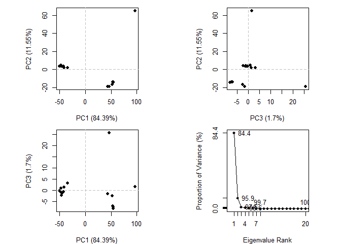

class\_12
================

## R Markdown

Download a CSV file from the PDB site (accessible from “Analyze” \> “PDB
Statistics” \> “by Experimental Method and Molecular Type”. Move this
CSV file into your RStudio project and use it to answer the following
questions:

> Q: What percentage of structures in the PDB are solved by X-Ray and
> Electron Microscopy. xray = 8.95 and EM = 2.72

``` r
stats <-  read.csv("Data Export Summary.csv", row.names = 1)
stats
```

    ##                     Proteins Nucleic.Acids Protein.NA.Complex Other  Total
    ## X-Ray                 133756          2086               6884     8 142734
    ## NMR                    11308          1317                265     8  12898
    ## Electron Microscopy     3241            35               1095     0   4371
    ## Other                    284             4                  6    13    307
    ## Multi Method             146             5                  2     1    154

``` r
total_sum <- sum(stats$Total)
```

``` r
ans <- round(stats$Total / total_sum * 100,2)
names(ans) <- rownames(stats)
ans
```

    ##               X-Ray                 NMR Electron Microscopy               Other 
    ##               88.95                8.04                2.72                0.19 
    ##        Multi Method 
    ##                0.10

> Q: What proportion of structures in the PDB are protein?

``` r
round(sum(stats$Proteins)/total_sum *100,2)
```

    ## [1] 92.69

> Q: Type HIV in the PDB website search box on the home page and
> determine how many HIV-1 protease structures are in the current PDB?

there are 1289 hiv protease structures \#\# Section 2. Using bio3d to
analyse protein structure data

Use the Bio3d package from CRAN

``` r
library(bio3d)

pdb <- read.pdb("1hsg")
```

    ##   Note: Accessing on-line PDB file

``` r
pdb
```

    ## 
    ##  Call:  read.pdb(file = "1hsg")
    ## 
    ##    Total Models#: 1
    ##      Total Atoms#: 1686,  XYZs#: 5058  Chains#: 2  (values: A B)
    ## 
    ##      Protein Atoms#: 1514  (residues/Calpha atoms#: 198)
    ##      Nucleic acid Atoms#: 0  (residues/phosphate atoms#: 0)
    ## 
    ##      Non-protein/nucleic Atoms#: 172  (residues: 128)
    ##      Non-protein/nucleic resid values: [ HOH (127), MK1 (1) ]
    ## 
    ##    Protein sequence:
    ##       PQITLWQRPLVTIKIGGQLKEALLDTGADDTVLEEMSLPGRWKPKMIGGIGGFIKVRQYD
    ##       QILIEICGHKAIGTVLVGPTPVNIIGRNLLTQIGCTLNFPQITLWQRPLVTIKIGGQLKE
    ##       ALLDTGADDTVLEEMSLPGRWKPKMIGGIGGFIKVRQYDQILIEICGHKAIGTVLVGPTP
    ##       VNIIGRNLLTQIGCTLNF
    ## 
    ## + attr: atom, xyz, seqres, helix, sheet,
    ##         calpha, remark, call

``` r
pdb <- read.pdb("1AKE")
```

    ##   Note: Accessing on-line PDB file
    ##    PDB has ALT records, taking A only, rm.alt=TRUE

``` r
pdb
```

    ## 
    ##  Call:  read.pdb(file = "1AKE")
    ## 
    ##    Total Models#: 1
    ##      Total Atoms#: 3804,  XYZs#: 11412  Chains#: 2  (values: A B)
    ## 
    ##      Protein Atoms#: 3312  (residues/Calpha atoms#: 428)
    ##      Nucleic acid Atoms#: 0  (residues/phosphate atoms#: 0)
    ## 
    ##      Non-protein/nucleic Atoms#: 492  (residues: 380)
    ##      Non-protein/nucleic resid values: [ AP5 (2), HOH (378) ]
    ## 
    ##    Protein sequence:
    ##       MRIILLGAPGAGKGTQAQFIMEKYGIPQISTGDMLRAAVKSGSELGKQAKDIMDAGKLVT
    ##       DELVIALVKERIAQEDCRNGFLLDGFPRTIPQADAMKEAGINVDYVLEFDVPDELIVDRI
    ##       VGRRVHAPSGRVYHVKFNPPKVEGKDDVTGEELTTRKDDQEETVRKRLVEYHQMTAPLIG
    ##       YYSKEAEAGNTKYAKVDGTKPVAEVRADLEKILGMRIILLGAPGA...<cut>...KILG
    ## 
    ## + attr: atom, xyz, seqres, helix, sheet,
    ##         calpha, remark, call

``` r
aa <- get.seq("1ake_A")
```

    ## Warning in get.seq("1ake_A"): Removing existing file: seqs.fasta

    ## Fetching... Please wait. Done.

``` r
aa
```

    ##              1        .         .         .         .         .         60 
    ## pdb|1AKE|A   MRIILLGAPGAGKGTQAQFIMEKYGIPQISTGDMLRAAVKSGSELGKQAKDIMDAGKLVT
    ##              1        .         .         .         .         .         60 
    ## 
    ##             61        .         .         .         .         .         120 
    ## pdb|1AKE|A   DELVIALVKERIAQEDCRNGFLLDGFPRTIPQADAMKEAGINVDYVLEFDVPDELIVDRI
    ##             61        .         .         .         .         .         120 
    ## 
    ##            121        .         .         .         .         .         180 
    ## pdb|1AKE|A   VGRRVHAPSGRVYHVKFNPPKVEGKDDVTGEELTTRKDDQEETVRKRLVEYHQMTAPLIG
    ##            121        .         .         .         .         .         180 
    ## 
    ##            181        .         .         .   214 
    ## pdb|1AKE|A   YYSKEAEAGNTKYAKVDGTKPVAEVRADLEKILG
    ##            181        .         .         .   214 
    ## 
    ## Call:
    ##   read.fasta(file = outfile)
    ## 
    ## Class:
    ##   fasta
    ## 
    ## Alignment dimensions:
    ##   1 sequence rows; 214 position columns (214 non-gap, 0 gap) 
    ## 
    ## + attr: id, ali, call

\#BLAST or hmmr search

``` r
b <- blast.pdb(aa)
```

    ##  Searching ... please wait (updates every 5 seconds) RID = 4EBXA1KF016 
    ##  ..
    ##  Reporting 99 hits

``` r
hits <- plot(b)
```

    ##   * Possible cutoff values:    197 -3 
    ##             Yielding Nhits:    16 99 
    ## 
    ##   * Chosen cutoff value of:    197 
    ##             Yielding Nhits:    16

<!-- -->

``` r
head(hits$pdb.id)
```

    ## [1] "1AKE_A" "4X8M_A" "6S36_A" "6RZE_A" "4X8H_A" "3HPR_A"

``` r
hits <- NULL
hits$pdb.id <- c('1AKE_A','4X8M_A','6S36_A','6RZE_A','4X8H_A','3HPR_A','1E4V_A','5EJE_A','1E4Y_A','3X2S_A','6HAP_A','6HAM_A','4K46_A','4NP6_A','3GMT_A','4PZL_A')
```

``` r
files <- get.pdb(hits$pdb.id, path = "pdbs" , split = TRUE , gzip = TRUE)
```

    ## Warning in get.pdb(hits$pdb.id, path = "pdbs", split = TRUE, gzip = TRUE): pdbs/
    ## 1AKE.pdb exists. Skipping download

    ## Warning in get.pdb(hits$pdb.id, path = "pdbs", split = TRUE, gzip = TRUE): pdbs/
    ## 4X8M.pdb exists. Skipping download

    ## Warning in get.pdb(hits$pdb.id, path = "pdbs", split = TRUE, gzip = TRUE): pdbs/
    ## 6S36.pdb exists. Skipping download

    ## Warning in get.pdb(hits$pdb.id, path = "pdbs", split = TRUE, gzip = TRUE): pdbs/
    ## 6RZE.pdb exists. Skipping download

    ## Warning in get.pdb(hits$pdb.id, path = "pdbs", split = TRUE, gzip = TRUE): pdbs/
    ## 4X8H.pdb exists. Skipping download

    ## Warning in get.pdb(hits$pdb.id, path = "pdbs", split = TRUE, gzip = TRUE): pdbs/
    ## 3HPR.pdb exists. Skipping download

    ## Warning in get.pdb(hits$pdb.id, path = "pdbs", split = TRUE, gzip = TRUE): pdbs/
    ## 1E4V.pdb exists. Skipping download

    ## Warning in get.pdb(hits$pdb.id, path = "pdbs", split = TRUE, gzip = TRUE): pdbs/
    ## 5EJE.pdb exists. Skipping download

    ## Warning in get.pdb(hits$pdb.id, path = "pdbs", split = TRUE, gzip = TRUE): pdbs/
    ## 1E4Y.pdb exists. Skipping download

    ## Warning in get.pdb(hits$pdb.id, path = "pdbs", split = TRUE, gzip = TRUE): pdbs/
    ## 3X2S.pdb exists. Skipping download

    ## Warning in get.pdb(hits$pdb.id, path = "pdbs", split = TRUE, gzip = TRUE): pdbs/
    ## 6HAP.pdb exists. Skipping download

    ## Warning in get.pdb(hits$pdb.id, path = "pdbs", split = TRUE, gzip = TRUE): pdbs/
    ## 6HAM.pdb exists. Skipping download

    ## Warning in get.pdb(hits$pdb.id, path = "pdbs", split = TRUE, gzip = TRUE): pdbs/
    ## 4K46.pdb exists. Skipping download

    ## Warning in get.pdb(hits$pdb.id, path = "pdbs", split = TRUE, gzip = TRUE): pdbs/
    ## 4NP6.pdb exists. Skipping download

    ## Warning in get.pdb(hits$pdb.id, path = "pdbs", split = TRUE, gzip = TRUE): pdbs/
    ## 3GMT.pdb exists. Skipping download

    ## Warning in get.pdb(hits$pdb.id, path = "pdbs", split = TRUE, gzip = TRUE): pdbs/
    ## 4PZL.pdb exists. Skipping download

    ##   |                                                                              |                                                                      |   0%  |                                                                              |====                                                                  |   6%  |                                                                              |=========                                                             |  12%  |                                                                              |=============                                                         |  19%  |                                                                              |==================                                                    |  25%  |                                                                              |======================                                                |  31%  |                                                                              |==========================                                            |  38%  |                                                                              |===============================                                       |  44%  |                                                                              |===================================                                   |  50%  |                                                                              |=======================================                               |  56%  |                                                                              |============================================                          |  62%  |                                                                              |================================================                      |  69%  |                                                                              |====================================================                  |  75%  |                                                                              |=========================================================             |  81%  |                                                                              |=============================================================         |  88%  |                                                                              |==================================================================    |  94%  |                                                                              |======================================================================| 100%

``` r
# Align releated PDBs
pdbs <- pdbaln(files, fit = TRUE, exefile="msa")
```

    ## Reading PDB files:
    ## pdbs/split_chain/1AKE_A.pdb
    ## pdbs/split_chain/4X8M_A.pdb
    ## pdbs/split_chain/6S36_A.pdb
    ## pdbs/split_chain/6RZE_A.pdb
    ## pdbs/split_chain/4X8H_A.pdb
    ## pdbs/split_chain/3HPR_A.pdb
    ## pdbs/split_chain/1E4V_A.pdb
    ## pdbs/split_chain/5EJE_A.pdb
    ## pdbs/split_chain/1E4Y_A.pdb
    ## pdbs/split_chain/3X2S_A.pdb
    ## pdbs/split_chain/6HAP_A.pdb
    ## pdbs/split_chain/6HAM_A.pdb
    ## pdbs/split_chain/4K46_A.pdb
    ## pdbs/split_chain/4NP6_A.pdb
    ## pdbs/split_chain/3GMT_A.pdb
    ## pdbs/split_chain/4PZL_A.pdb
    ##    PDB has ALT records, taking A only, rm.alt=TRUE
    ## ..   PDB has ALT records, taking A only, rm.alt=TRUE
    ## .   PDB has ALT records, taking A only, rm.alt=TRUE
    ## ..   PDB has ALT records, taking A only, rm.alt=TRUE
    ## ..   PDB has ALT records, taking A only, rm.alt=TRUE
    ## ....   PDB has ALT records, taking A only, rm.alt=TRUE
    ## .   PDB has ALT records, taking A only, rm.alt=TRUE
    ## ....
    ## 
    ## Extracting sequences
    ## 
    ## pdb/seq: 1   name: pdbs/split_chain/1AKE_A.pdb 
    ##    PDB has ALT records, taking A only, rm.alt=TRUE
    ## pdb/seq: 2   name: pdbs/split_chain/4X8M_A.pdb 
    ## pdb/seq: 3   name: pdbs/split_chain/6S36_A.pdb 
    ##    PDB has ALT records, taking A only, rm.alt=TRUE
    ## pdb/seq: 4   name: pdbs/split_chain/6RZE_A.pdb 
    ##    PDB has ALT records, taking A only, rm.alt=TRUE
    ## pdb/seq: 5   name: pdbs/split_chain/4X8H_A.pdb 
    ## pdb/seq: 6   name: pdbs/split_chain/3HPR_A.pdb 
    ##    PDB has ALT records, taking A only, rm.alt=TRUE
    ## pdb/seq: 7   name: pdbs/split_chain/1E4V_A.pdb 
    ## pdb/seq: 8   name: pdbs/split_chain/5EJE_A.pdb 
    ##    PDB has ALT records, taking A only, rm.alt=TRUE
    ## pdb/seq: 9   name: pdbs/split_chain/1E4Y_A.pdb 
    ## pdb/seq: 10   name: pdbs/split_chain/3X2S_A.pdb 
    ## pdb/seq: 11   name: pdbs/split_chain/6HAP_A.pdb 
    ## pdb/seq: 12   name: pdbs/split_chain/6HAM_A.pdb 
    ##    PDB has ALT records, taking A only, rm.alt=TRUE
    ## pdb/seq: 13   name: pdbs/split_chain/4K46_A.pdb 
    ##    PDB has ALT records, taking A only, rm.alt=TRUE
    ## pdb/seq: 14   name: pdbs/split_chain/4NP6_A.pdb 
    ## pdb/seq: 15   name: pdbs/split_chain/3GMT_A.pdb 
    ## pdb/seq: 16   name: pdbs/split_chain/4PZL_A.pdb

``` r
# Vector containing PDB codes for figure axis
ids <- basename.pdb(pdbs$id)

# Draw schematic alignment
plot(pdbs, labels=ids)
```

<!-- -->

``` r
library(bio3d.view)
library(rgl)

view(pdbs)
```

``` r
anno <- pdb.annotate(ids)
```

    ## Warning in pdb.annotate(ids): ids should be standard 4 character PDB-IDs: trying
    ## first 4 characters...

``` r
unique(anno$source)
```

    ## [1] "Escherichia coli"          "Photobacterium profundum" 
    ## [3] "Vibrio cholerae"           "Burkholderia pseudomallei"
    ## [5] "Francisella tularensis"

``` r
#anno11
```

## Principal Component Analysis

``` r
# Perform PCA
pc.xray <- pca(pdbs)
plot(pc.xray)
```

<!-- -->

``` r
# Calculate RMSD
rd <- rmsd(pdbs)
```

    ## Warning in rmsd(pdbs): No indices provided, using the 204 non NA positions

``` r
# Structure-based clustering
hc.rd <- hclust(dist(rd))
grps.rd <- cutree(hc.rd, k=3)

plot(pc.xray, 1:2, col="grey50", bg=grps.rd, pch=21, cex=1)
```

<!-- -->

``` r
# Visualize first principal component
pc1 <- mktrj(pc.xray, pc=1, file="pc_1.pdb")
```

\#\#GGPLOT TIME

``` r
#Plotting results with ggplot2
library(ggplot2)
library(ggrepel)

df <- data.frame(x=pc.xray$z[,1], y=pc.xray$z[,2])
col <- as.factor(grps.rd)

p <- ggplot(df, aes(x, y)) +
 geom_point(aes(col=col), size=2) +
 xlab("PC1") +
 ylab("PC2") +
 scale_color_discrete(name="Clusters") +
 geom_text_repel(aes(label=ids))
p
```

<!-- -->
