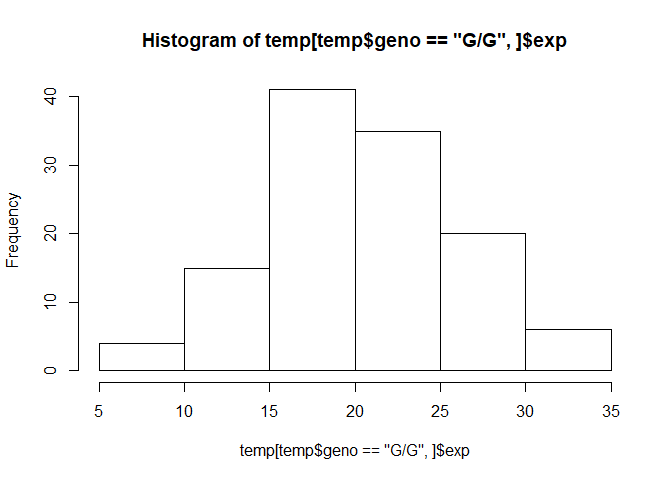

class15
================
Alberto Carreno
2/26/2020

\#read sample genotype data from ENSEMBLE

we downloaded genotype data from ENSEMBLE on the MXL mexican ancestry in
los angeles,california dataset

what proportion of this data areG/G etc

``` r
mxl <- read.csv("373531-SampleGenotypes-Homo_sapiens_Variation_Sample_rs12936231.csv")
```

We want to look at the second column that contains the genotype
information

``` r
table(mxl$Genotype..forward.strand.)
```

    ## 
    ## C|C C|G G|C G|G 
    ##  22  21  12   9

\#\#RNA-seq result analysis for different genotypes of this SNP

``` r
temp <- read.table("rs8067378_ENSG00000172057.6.txt")
head(temp)
```

    ##    sample geno      exp
    ## 1 HG00367  A/G 28.96038
    ## 2 NA20768  A/G 20.24449
    ## 3 HG00361  A/A 31.32628
    ## 4 HG00135  A/A 34.11169
    ## 5 NA18870  G/G 18.25141
    ## 6 NA11993  A/A 32.89721

``` r
x <- 1:10
x[x>5]
```

    ## [1]  6  7  8  9 10

``` r
summary(temp[temp$geno == "G/G",]$exp)
```

    ##    Min. 1st Qu.  Median    Mean 3rd Qu.    Max. 
    ##   6.675  16.903  20.074  20.594  24.457  33.956

``` r
mean(temp[temp$geno == "G/G",]$exp)
```

    ## [1] 20.59371

``` r
hist(temp[temp$geno == "G/G",]$exp)
```

<!-- -->

``` r
summary("rs8067378_ENSG00000172057.6.txt")
```

    ##    Length     Class      Mode 
    ##         1 character character

``` r
summary(temp[temp$geno == "G/G",]$exp)
```

    ##    Min. 1st Qu.  Median    Mean 3rd Qu.    Max. 
    ##   6.675  16.903  20.074  20.594  24.457  33.956

``` r
summary(temp[temp$geno == "A/G",]$exp)
```

    ##    Min. 1st Qu.  Median    Mean 3rd Qu.    Max. 
    ##   7.075  20.626  25.065  25.397  30.552  48.034

``` r
summary(temp[temp$geno == "A/A",]$exp)
```

    ##    Min. 1st Qu.  Median    Mean 3rd Qu.    Max. 
    ##   11.40   27.02   31.25   31.82   35.92   51.52

``` r
mean(temp[temp$geno == "G/G",]$exp)
```

    ## [1] 20.59371

``` r
mean(temp[temp$geno == "A/G",]$exp)
```

    ## [1] 25.3968

``` r
mean(temp[temp$geno == "A/A",]$exp)
```

    ## [1] 31.81864

``` r
boxplot(exp ~ geno, data = temp,notch = T)
```

<!-- -->

``` r
nrow(temp)
```

    ## [1] 462
