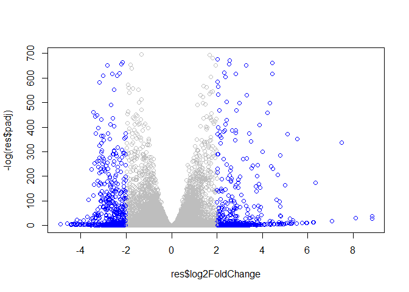

Class16
================

``` r
library("DESeq2")
```

    ## Loading required package: S4Vectors

    ## Loading required package: stats4

    ## Loading required package: BiocGenerics

    ## Loading required package: parallel

    ## 
    ## Attaching package: 'BiocGenerics'

    ## The following objects are masked from 'package:parallel':
    ## 
    ##     clusterApply, clusterApplyLB, clusterCall, clusterEvalQ,
    ##     clusterExport, clusterMap, parApply, parCapply, parLapply,
    ##     parLapplyLB, parRapply, parSapply, parSapplyLB

    ## The following objects are masked from 'package:stats':
    ## 
    ##     IQR, mad, sd, var, xtabs

    ## The following objects are masked from 'package:base':
    ## 
    ##     anyDuplicated, append, as.data.frame, basename, cbind, colnames,
    ##     dirname, do.call, duplicated, eval, evalq, Filter, Find, get, grep,
    ##     grepl, intersect, is.unsorted, lapply, Map, mapply, match, mget,
    ##     order, paste, pmax, pmax.int, pmin, pmin.int, Position, rank,
    ##     rbind, Reduce, rownames, sapply, setdiff, sort, table, tapply,
    ##     union, unique, unsplit, which, which.max, which.min

    ## 
    ## Attaching package: 'S4Vectors'

    ## The following object is masked from 'package:base':
    ## 
    ##     expand.grid

    ## Loading required package: IRanges

    ## 
    ## Attaching package: 'IRanges'

    ## The following object is masked from 'package:grDevices':
    ## 
    ##     windows

    ## Loading required package: GenomicRanges

    ## Loading required package: GenomeInfoDb

    ## Loading required package: SummarizedExperiment

    ## Loading required package: Biobase

    ## Welcome to Bioconductor
    ## 
    ##     Vignettes contain introductory material; view with
    ##     'browseVignettes()'. To cite Bioconductor, see
    ##     'citation("Biobase")', and for packages 'citation("pkgname")'.

    ## Loading required package: DelayedArray

    ## Loading required package: matrixStats

    ## 
    ## Attaching package: 'matrixStats'

    ## The following objects are masked from 'package:Biobase':
    ## 
    ##     anyMissing, rowMedians

    ## Loading required package: BiocParallel

    ## 
    ## Attaching package: 'DelayedArray'

    ## The following objects are masked from 'package:matrixStats':
    ## 
    ##     colMaxs, colMins, colRanges, rowMaxs, rowMins, rowRanges

    ## The following objects are masked from 'package:base':
    ## 
    ##     aperm, apply, rowsum

``` r
metaFile <- "GSE37704_metadata.csv"
countFile <- "GSE37704_featurecounts.csv"
```

``` r
# Import metadata and take a peak
colData = read.csv(metaFile, row.names=1)
head(colData)
```

    ##               condition
    ## SRR493366 control_sirna
    ## SRR493367 control_sirna
    ## SRR493368 control_sirna
    ## SRR493369      hoxa1_kd
    ## SRR493370      hoxa1_kd
    ## SRR493371      hoxa1_kd

``` r
# Import countdata
rawcountData = read.csv(countFile, row.names=1)
head(rawcountData)
```

    ##                 length SRR493366 SRR493367 SRR493368 SRR493369 SRR493370
    ## ENSG00000186092    918         0         0         0         0         0
    ## ENSG00000279928    718         0         0         0         0         0
    ## ENSG00000279457   1982        23        28        29        29        28
    ## ENSG00000278566    939         0         0         0         0         0
    ## ENSG00000273547    939         0         0         0         0         0
    ## ENSG00000187634   3214       124       123       205       207       212
    ##                 SRR493371
    ## ENSG00000186092         0
    ## ENSG00000279928         0
    ## ENSG00000279457        46
    ## ENSG00000278566         0
    ## ENSG00000273547         0
    ## ENSG00000187634       258

``` r
countData <- rawcountData[,-1]
head(countData)
```

    ##                 SRR493366 SRR493367 SRR493368 SRR493369 SRR493370 SRR493371
    ## ENSG00000186092         0         0         0         0         0         0
    ## ENSG00000279928         0         0         0         0         0         0
    ## ENSG00000279457        23        28        29        29        28        46
    ## ENSG00000278566         0         0         0         0         0         0
    ## ENSG00000273547         0         0         0         0         0         0
    ## ENSG00000187634       124       123       205       207       212       258

``` r
dim(countData)
```

    ## [1] 19808     6

``` r
countData <- countData[rowSums(countData) != 0,]
head(countData)
```

    ##                 SRR493366 SRR493367 SRR493368 SRR493369 SRR493370 SRR493371
    ## ENSG00000279457        23        28        29        29        28        46
    ## ENSG00000187634       124       123       205       207       212       258
    ## ENSG00000188976      1637      1831      2383      1226      1326      1504
    ## ENSG00000187961       120       153       180       236       255       357
    ## ENSG00000187583        24        48        65        44        48        64
    ## ENSG00000187642         4         9        16        14        16        16

``` r
dim(countData)
```

    ## [1] 15975     6

``` r
dds = DESeqDataSetFromMatrix(countData=countData,
                             colData=colData,
                             design=~condition)
dds = DESeq(dds)
```

    ## estimating size factors

    ## estimating dispersions

    ## gene-wise dispersion estimates

    ## mean-dispersion relationship

    ## final dispersion estimates

    ## fitting model and testing

``` r
dds
```

    ## class: DESeqDataSet 
    ## dim: 15975 6 
    ## metadata(1): version
    ## assays(4): counts mu H cooks
    ## rownames(15975): ENSG00000279457 ENSG00000187634 ... ENSG00000276345
    ##   ENSG00000271254
    ## rowData names(22): baseMean baseVar ... deviance maxCooks
    ## colnames(6): SRR493366 SRR493367 ... SRR493370 SRR493371
    ## colData names(2): condition sizeFactor

``` r
res = results(dds)
res
```

    ## log2 fold change (MLE): condition hoxa1 kd vs control sirna 
    ## Wald test p-value: condition hoxa1 kd vs control sirna 
    ## DataFrame with 15975 rows and 6 columns
    ##                         baseMean     log2FoldChange              lfcSE
    ##                        <numeric>          <numeric>          <numeric>
    ## ENSG00000279457 29.9135794276176   0.17925708367269  0.324821565250145
    ## ENSG00000187634 183.229649921658  0.426457118403306  0.140265820376892
    ## ENSG00000188976 1651.18807619944 -0.692720464846366 0.0548465415913946
    ## ENSG00000187961 209.637938486147  0.729755610585225  0.131859899969345
    ## ENSG00000187583 47.2551232589398 0.0405765278756312  0.271892808601774
    ## ...                          ...                ...                ...
    ## ENSG00000273748 35.3026523877463  0.674387102558605  0.303666187454139
    ## ENSG00000278817 2.42302393023632 -0.388988266500022   1.13039377720313
    ## ENSG00000278384 1.10179649846993  0.332990658240634    1.6602614216556
    ## ENSG00000276345 73.6449563127136 -0.356180759105173   0.20771565839825
    ## ENSG00000271254 181.595902546813 -0.609666545167282  0.141320482803512
    ##                               stat               pvalue                 padj
    ##                          <numeric>            <numeric>            <numeric>
    ## ENSG00000279457  0.551863246932648    0.581042050747032      0.6865547778329
    ## ENSG00000187634   3.04034951107421  0.00236303749730996  0.00515718149494361
    ## ENSG00000188976  -12.6301576133481 1.43989540156582e-36  1.7654890539332e-35
    ## ENSG00000187961   5.53432552849563  3.1242824807768e-08 1.13412993107607e-07
    ## ENSG00000187583  0.149237223611387    0.881366448669148    0.919030615571381
    ## ...                            ...                  ...                  ...
    ## ENSG00000273748   2.22081723425481    0.026363342804782   0.0479091179108357
    ## ENSG00000278817 -0.344117487502873    0.730757932009185    0.809772069001658
    ## ENSG00000278384  0.200565196478864    0.841038574220432    0.892653531513564
    ## ENSG00000276345  -1.71475160732598   0.0863907773559434    0.139761501281218
    ## ENSG00000271254  -4.31407063627813 1.60275699407084e-05 4.53647639305091e-05

``` r
summary(res)
```

    ## 
    ## out of 15975 with nonzero total read count
    ## adjusted p-value < 0.1
    ## LFC > 0 (up)       : 4349, 27%
    ## LFC < 0 (down)     : 4396, 28%
    ## outliers [1]       : 0, 0%
    ## low counts [2]     : 1237, 7.7%
    ## (mean count < 0)
    ## [1] see 'cooksCutoff' argument of ?results
    ## [2] see 'independentFiltering' argument of ?results

``` r
plot( res$log2FoldChange, -log(res$padj) )
```

<!-- -->

``` r
mycols <- rep("gray", nrow(res))
mycols[ abs(res$log2FoldChange) > 2 ] <- "blue"
plot(res$log2FoldChange, -log(res$padj), col=mycols)
```

<!-- -->

To add annotation to my gene list I will install some bioconductor
packages

``` r
BiocManager::install("AnnotationDbi")
```

    ## Bioconductor version 3.10 (BiocManager 1.30.10), R 3.6.2 (2019-12-12)

    ## Installing package(s) 'AnnotationDbi'

    ## package 'AnnotationDbi' successfully unpacked and MD5 sums checked
    ## 
    ## The downloaded binary packages are in
    ##  C:\Users\acarr\AppData\Local\Temp\RtmpcBBsc3\downloaded_packages

    ## Installation path not writeable, unable to update packages: boot, foreign,
    ##   lattice, MASS, nlme, nnet

    ## Old packages: 'covr', 'digest', 'fs', 'ggplot2', 'lifecycle', 'plyr', 'rlang',
    ##   'testthat', 'vctrs'

``` r
BiocManager::install("org.hs.eg.db")
```

    ## Bioconductor version 3.10 (BiocManager 1.30.10), R 3.6.2 (2019-12-12)

    ## Installing package(s) 'org.hs.eg.db'

    ## Warning: package 'org.hs.eg.db' is not available (for R version 3.6.2)

    ## Warning: Perhaps you meant 'org.Hs.eg.db' ?

    ## Installation path not writeable, unable to update packages: boot, foreign,
    ##   lattice, MASS, nlme, nnet

    ## Old packages: 'covr', 'digest', 'fs', 'ggplot2', 'lifecycle', 'plyr', 'rlang',
    ##   'testthat', 'vctrs'

``` r
library(AnnotationDbi)
library(org.Hs.eg.db)
```

    ## 

``` r
columns(org.Hs.eg.db)
```

    ##  [1] "ACCNUM"       "ALIAS"        "ENSEMBL"      "ENSEMBLPROT"  "ENSEMBLTRANS"
    ##  [6] "ENTREZID"     "ENZYME"       "EVIDENCE"     "EVIDENCEALL"  "GENENAME"    
    ## [11] "GO"           "GOALL"        "IPI"          "MAP"          "OMIM"        
    ## [16] "ONTOLOGY"     "ONTOLOGYALL"  "PATH"         "PFAM"         "PMID"        
    ## [21] "PROSITE"      "REFSEQ"       "SYMBOL"       "UCSCKG"       "UNIGENE"     
    ## [26] "UNIPROT"

Let’s map our ENSEMBLE gene ids to the more conventional gene SYMBOL

``` r
res$symbol <- mapIds(org.Hs.eg.db,
             keys = row.names(res),
              keytype = "ENSEMBL",
              column = "SYMBOL",
              multiVals = "first")
```

    ## 'select()' returned 1:many mapping between keys and columns

``` r
head(res)
```

    ## log2 fold change (MLE): condition hoxa1 kd vs control sirna 
    ## Wald test p-value: condition hoxa1 kd vs control sirna 
    ## DataFrame with 6 rows and 7 columns
    ##                         baseMean     log2FoldChange              lfcSE
    ##                        <numeric>          <numeric>          <numeric>
    ## ENSG00000279457 29.9135794276176   0.17925708367269  0.324821565250145
    ## ENSG00000187634 183.229649921658  0.426457118403306  0.140265820376892
    ## ENSG00000188976 1651.18807619944 -0.692720464846366 0.0548465415913946
    ## ENSG00000187961 209.637938486147  0.729755610585225  0.131859899969345
    ## ENSG00000187583 47.2551232589398 0.0405765278756312  0.271892808601774
    ## ENSG00000187642 11.9797501642461  0.542810491577363  0.521559849534146
    ##                              stat               pvalue                 padj
    ##                         <numeric>            <numeric>            <numeric>
    ## ENSG00000279457 0.551863246932648    0.581042050747032      0.6865547778329
    ## ENSG00000187634  3.04034951107421  0.00236303749730996  0.00515718149494361
    ## ENSG00000188976 -12.6301576133481 1.43989540156582e-36  1.7654890539332e-35
    ## ENSG00000187961  5.53432552849563  3.1242824807768e-08 1.13412993107607e-07
    ## ENSG00000187583 0.149237223611387    0.881366448669148    0.919030615571381
    ## ENSG00000187642  1.04074439790984    0.297994191720983    0.403379309754068
    ##                      symbol
    ##                 <character>
    ## ENSG00000279457          NA
    ## ENSG00000187634      SAMD11
    ## ENSG00000188976       NOC2L
    ## ENSG00000187961      KLHL17
    ## ENSG00000187583     PLEKHN1
    ## ENSG00000187642       PERM1

``` r
res$entrez = mapIds(org.Hs.eg.db,
                    keys=row.names(res),
                    keytype="ENSEMBL",
                    column="ENTREZID",
                    multiVals="first")
```

    ## 'select()' returned 1:many mapping between keys and columns

``` r
head(res)
```

    ## log2 fold change (MLE): condition hoxa1 kd vs control sirna 
    ## Wald test p-value: condition hoxa1 kd vs control sirna 
    ## DataFrame with 6 rows and 8 columns
    ##                         baseMean     log2FoldChange              lfcSE
    ##                        <numeric>          <numeric>          <numeric>
    ## ENSG00000279457 29.9135794276176   0.17925708367269  0.324821565250145
    ## ENSG00000187634 183.229649921658  0.426457118403306  0.140265820376892
    ## ENSG00000188976 1651.18807619944 -0.692720464846366 0.0548465415913946
    ## ENSG00000187961 209.637938486147  0.729755610585225  0.131859899969345
    ## ENSG00000187583 47.2551232589398 0.0405765278756312  0.271892808601774
    ## ENSG00000187642 11.9797501642461  0.542810491577363  0.521559849534146
    ##                              stat               pvalue                 padj
    ##                         <numeric>            <numeric>            <numeric>
    ## ENSG00000279457 0.551863246932648    0.581042050747032      0.6865547778329
    ## ENSG00000187634  3.04034951107421  0.00236303749730996  0.00515718149494361
    ## ENSG00000188976 -12.6301576133481 1.43989540156582e-36  1.7654890539332e-35
    ## ENSG00000187961  5.53432552849563  3.1242824807768e-08 1.13412993107607e-07
    ## ENSG00000187583 0.149237223611387    0.881366448669148    0.919030615571381
    ## ENSG00000187642  1.04074439790984    0.297994191720983    0.403379309754068
    ##                      symbol      entrez
    ##                 <character> <character>
    ## ENSG00000279457          NA          NA
    ## ENSG00000187634      SAMD11      148398
    ## ENSG00000188976       NOC2L       26155
    ## ENSG00000187961      KLHL17      339451
    ## ENSG00000187583     PLEKHN1       84069
    ## ENSG00000187642       PERM1       84808

``` r
res$name = mapIds(org.Hs.eg.db,
                    keys=row.names(res),
                    keytype="ENSEMBL",
                    column="GENENAME",
                    multiVals="first")
```

    ## 'select()' returned 1:many mapping between keys and columns

``` r
head(res)
```

    ## log2 fold change (MLE): condition hoxa1 kd vs control sirna 
    ## Wald test p-value: condition hoxa1 kd vs control sirna 
    ## DataFrame with 6 rows and 9 columns
    ##                         baseMean     log2FoldChange              lfcSE
    ##                        <numeric>          <numeric>          <numeric>
    ## ENSG00000279457 29.9135794276176   0.17925708367269  0.324821565250145
    ## ENSG00000187634 183.229649921658  0.426457118403306  0.140265820376892
    ## ENSG00000188976 1651.18807619944 -0.692720464846366 0.0548465415913946
    ## ENSG00000187961 209.637938486147  0.729755610585225  0.131859899969345
    ## ENSG00000187583 47.2551232589398 0.0405765278756312  0.271892808601774
    ## ENSG00000187642 11.9797501642461  0.542810491577363  0.521559849534146
    ##                              stat               pvalue                 padj
    ##                         <numeric>            <numeric>            <numeric>
    ## ENSG00000279457 0.551863246932648    0.581042050747032      0.6865547778329
    ## ENSG00000187634  3.04034951107421  0.00236303749730996  0.00515718149494361
    ## ENSG00000188976 -12.6301576133481 1.43989540156582e-36  1.7654890539332e-35
    ## ENSG00000187961  5.53432552849563  3.1242824807768e-08 1.13412993107607e-07
    ## ENSG00000187583 0.149237223611387    0.881366448669148    0.919030615571381
    ## ENSG00000187642  1.04074439790984    0.297994191720983    0.403379309754068
    ##                      symbol      entrez
    ##                 <character> <character>
    ## ENSG00000279457          NA          NA
    ## ENSG00000187634      SAMD11      148398
    ## ENSG00000188976       NOC2L       26155
    ## ENSG00000187961      KLHL17      339451
    ## ENSG00000187583     PLEKHN1       84069
    ## ENSG00000187642       PERM1       84808
    ##                                                                     name
    ##                                                              <character>
    ## ENSG00000279457                                                       NA
    ## ENSG00000187634                 sterile alpha motif domain containing 11
    ## ENSG00000188976 NOC2 like nucleolar associated transcriptional repressor
    ## ENSG00000187961                              kelch like family member 17
    ## ENSG00000187583                 pleckstrin homology domain containing N1
    ## ENSG00000187642             PPARGC1 and ESRR induced regulator, muscle 1

``` r
write.csv(res,file = "deseq_results.csv")
```

``` r
library(gage)
library(gageData)

data(kegg.sets.hs)
data(sigmet.idx.hs)
```

``` r
# Focus on signaling and metabolic pathways only
kegg.sets.hs = kegg.sets.hs[sigmet.idx.hs]

# Examine the first 3 pathways
head(kegg.sets.hs, 3)
```

    ## $`hsa00232 Caffeine metabolism`
    ## [1] "10"   "1544" "1548" "1549" "1553" "7498" "9"   
    ## 
    ## $`hsa00983 Drug metabolism - other enzymes`
    ##  [1] "10"     "1066"   "10720"  "10941"  "151531" "1548"   "1549"   "1551"  
    ##  [9] "1553"   "1576"   "1577"   "1806"   "1807"   "1890"   "221223" "2990"  
    ## [17] "3251"   "3614"   "3615"   "3704"   "51733"  "54490"  "54575"  "54576" 
    ## [25] "54577"  "54578"  "54579"  "54600"  "54657"  "54658"  "54659"  "54963" 
    ## [33] "574537" "64816"  "7083"   "7084"   "7172"   "7363"   "7364"   "7365"  
    ## [41] "7366"   "7367"   "7371"   "7372"   "7378"   "7498"   "79799"  "83549" 
    ## [49] "8824"   "8833"   "9"      "978"   
    ## 
    ## $`hsa00230 Purine metabolism`
    ##   [1] "100"    "10201"  "10606"  "10621"  "10622"  "10623"  "107"    "10714" 
    ##   [9] "108"    "10846"  "109"    "111"    "11128"  "11164"  "112"    "113"   
    ##  [17] "114"    "115"    "122481" "122622" "124583" "132"    "158"    "159"   
    ##  [25] "1633"   "171568" "1716"   "196883" "203"    "204"    "205"    "221823"
    ##  [33] "2272"   "22978"  "23649"  "246721" "25885"  "2618"   "26289"  "270"   
    ##  [41] "271"    "27115"  "272"    "2766"   "2977"   "2982"   "2983"   "2984"  
    ##  [49] "2986"   "2987"   "29922"  "3000"   "30833"  "30834"  "318"    "3251"  
    ##  [57] "353"    "3614"   "3615"   "3704"   "377841" "471"    "4830"   "4831"  
    ##  [65] "4832"   "4833"   "4860"   "4881"   "4882"   "4907"   "50484"  "50940" 
    ##  [73] "51082"  "51251"  "51292"  "5136"   "5137"   "5138"   "5139"   "5140"  
    ##  [81] "5141"   "5142"   "5143"   "5144"   "5145"   "5146"   "5147"   "5148"  
    ##  [89] "5149"   "5150"   "5151"   "5152"   "5153"   "5158"   "5167"   "5169"  
    ##  [97] "51728"  "5198"   "5236"   "5313"   "5315"   "53343"  "54107"  "5422"  
    ## [105] "5424"   "5425"   "5426"   "5427"   "5430"   "5431"   "5432"   "5433"  
    ## [113] "5434"   "5435"   "5436"   "5437"   "5438"   "5439"   "5440"   "5441"  
    ## [121] "5471"   "548644" "55276"  "5557"   "5558"   "55703"  "55811"  "55821" 
    ## [129] "5631"   "5634"   "56655"  "56953"  "56985"  "57804"  "58497"  "6240"  
    ## [137] "6241"   "64425"  "646625" "654364" "661"    "7498"   "8382"   "84172" 
    ## [145] "84265"  "84284"  "84618"  "8622"   "8654"   "87178"  "8833"   "9060"  
    ## [153] "9061"   "93034"  "953"    "9533"   "954"    "955"    "956"    "957"   
    ## [161] "9583"   "9615"

our input will be a vector of fld change value

``` r
foldchanges = res$log2FoldChange
names(foldchanges) = res$entrez
head(foldchanges)
```

    ##        <NA>      148398       26155      339451       84069       84808 
    ##  0.17925708  0.42645712 -0.69272046  0.72975561  0.04057653  0.54281049

``` r
foldchanges
```

    ##          <NA>        148398         26155        339451         84069 
    ##  1.792571e-01  4.264571e-01 -6.927205e-01  7.297556e-01  4.057653e-02 
    ##         84808         57801          9636        375790        401934 
    ##  5.428105e-01  2.057064e+00  2.573837e-01  3.899088e-01  7.859552e-01 
    ##         54991          8784          7293         51150        126792 
    ##  1.965923e-01 -3.118430e-01  1.725788e+00  3.866289e-01  4.250793e-01 
    ##        388581        118424          6339        116983        126789 
    ##  3.280347e-01  4.303263e-01  8.101459e-01  5.821462e-01  8.392173e-02 
    ##         54973         80772         83756          1855         54587 
    ## -2.094969e-01 -2.164111e-01  5.829105e-02 -1.445137e-01  5.162155e-01 
    ##         54998         81669         55052        441869         64856 
    ##  9.747933e-02  4.870933e-01 -1.196977e-01 -5.912003e-02  1.654059e-01 
    ##        219293         83858         55210        339453         29101 
    ##  7.846811e-01 -7.918035e-01 -6.643678e-01  4.978943e-01  4.895691e-02 
    ##        643988        142678          8510           984        728661 
    ##  3.364252e-01  4.194649e-01 -3.855171e-02  7.271456e-02  8.778105e-01 
    ##        728642          9906         65220          2782        163688 
    ##  4.035933e-01  1.268887e+00  1.471959e-02  4.432024e-02  1.667159e+00 
    ##        339456          5590        199990          6497         79906 
    ## -5.130525e-01  5.621936e-01  2.411387e-01 -7.093016e-01  8.907536e-02 
    ##         11079          5192          9651         55229          8764 
    ##  7.512557e-02 -2.465346e-01 -5.467231e-01 -9.806538e-02  1.218157e+00 
    ##        127281         79258     100287898         63976         27237 
    ## -1.333273e+00 -1.758140e-01  1.206186e+00  3.582883e-01  1.754314e+00 
    ##          1953        127262         49856          7161        148870 
    ##  2.769177e-01  3.212996e-01  1.391715e-01 -1.292171e+00 -1.454431e+00 
    ##        388588         57470          9731          1677        339448 
    ## -4.523397e-01 -4.615616e-01  3.691880e-01 -3.323944e-01 -7.928108e-02 
    ##         55966        261734          8514         26038          6146 
    ## -1.020732e-01  7.865118e-01  3.302364e-01  1.290956e+00 -5.226267e-02 
    ##        388591         23463        387509         11332         54626 
    ## -9.281639e-01 -3.851749e-01  9.523847e-03 -3.617610e-01  2.954722e+00 
    ##         83715          8718         57449         79707         80835 
    ##  1.269269e+00  1.216429e+00  8.405447e-01 -6.479705e-01 -1.137598e+00 
    ##          3104          9903        148479         90326         55735 
    ##  2.643635e-01  7.820909e-01 -8.380511e-02 -4.307578e-01 -5.645303e-01 
    ##         23261          9341          8863         10911          3604 
    ## -8.689637e-02 -6.727952e-01 -2.055402e-01 -1.758136e-01 -2.112013e+00 
    ##         11315         54206         50651           473          2023 
    ## -3.376431e-01 -9.788130e-01 -8.852005e-02 -7.288329e-01 -1.338931e+00 
    ##           765          6518         80045          9563         80176 
    ## -1.137598e+00  1.658165e+00 -9.094138e-01 -4.446769e-01  2.461103e-01 
    ##         84275        199953          5293         22883         56998 
    ##  8.381301e-02  1.126237e-01 -6.313370e-01 -1.201923e-01 -2.163518e-01 
    ##         84328         64802        116362         10277         23095 
    ## -9.725403e-01 -2.957367e-01  1.760024e+00  7.372844e-01 -1.997769e-01 
    ##          5226     100526739        378708          1325          1676 
    ##  1.239409e-01  2.080913e-01 -4.600076e-04 -3.364718e-01 -1.990974e-01 
    ##          5195         54897         23435          <NA>         10747 
    ## -2.038660e-01 -9.767759e-01 -2.749263e-01 -1.137598e+00 -4.106070e-01 
    ##          6723          5394          2475         10218         29914 
    ## -1.263609e+00 -1.640501e-01 -1.493729e-02 -1.588493e+00 -3.291315e-01 
    ##         57540         26232         93611         26270         10459 
    ##  1.931528e+00  1.169250e+00 -3.096945e-02 -2.316791e-01 -3.177784e-01 
    ##        374946         57085          4524          1185          4878 
    ##  3.047707e+00  5.350652e-01  2.928403e-01  7.077413e-01  2.980366e+00 
    ##          4879         90231          5351          9927         60672 
    ##  1.095847e+00  8.564835e-02  8.644130e-02 -2.326925e-01 -6.266927e-01 
    ##           943          7133         55187          9249        343069 
    ## -1.851570e+00 -6.915792e-01  3.155317e-01  1.491683e+00 -1.518452e+00 
    ##         65122        649330        440563     101060301         10630 
    ##  7.859552e-01  7.859552e-01 -1.137598e+00 -2.288391e-01  8.599902e-01 
    ##          7799         23254         55092        114827         79180 
    ## -3.974616e-01 -6.168001e-01  1.293557e+00  3.880714e-01 -1.265134e+00 
    ##         11330           842         23341         79814         84301 
    ##  7.859552e-01  2.285604e-01  5.765618e-01  2.422704e-01  9.714571e-01 
    ##         23207        284723         54751        440567         23013 
    ##  2.377117e-01  1.154703e+00 -1.035338e-01 -5.155249e-02 -1.225884e-01 
    ##          7709         27129          1187          1188        348487 
    ##  9.763489e-02 -1.626389e+00  7.859552e-01 -2.674902e+00 -1.909812e-01 
    ##          1969        128272         79363         54455         26099 
    ##  4.806021e-01  5.243036e-02  4.713513e-01  2.422240e-02  5.922283e-01 
    ##        374955         55707         55672          9696          4237 
    ##  7.859555e-01 -6.646019e-02 -1.759180e-01  5.013767e-01  1.951774e+00 
    ##         23400          6390         29943         55920         55160 
    ##  2.257992e-01 -8.426756e-01 -1.681771e+00  7.502182e-01 -5.348972e-01 
    ##         81569          8659        126917         23352         23065 
    ## -9.990609e-01  3.395684e-01  5.146537e-03  3.804782e-03 -4.935389e-01 
    ##         51154         22977          8574         54896           832 
    ## -6.425138e-01 -1.810251e-01 -2.247769e-02  6.229386e-01 -2.407987e-01 
    ##        440574          4681          3362        255104         23252 
    ## -2.442057e-01 -4.931602e-01 -1.137598e+00 -6.390638e-01  3.552525e-02 
    ##          5322        127733        127731         55450         79594 
    ## -6.833662e-01  7.859552e-01  7.859555e-01 -2.226424e-01  7.268585e-02 
    ##        163933           978         65018          1650         57576 
    ##  7.286779e-01 -4.044367e+00 -5.107333e-01  1.856856e-01 -1.185555e+00 
    ##        400745         50809          8672          1889         84224 
    ## -9.750010e-01  1.142182e-01  5.928276e-01  2.053238e-01 -2.509794e-02 
    ##           249          5909         84196        401944          3339 
    ## -7.182810e-01  1.843535e+00 -6.268493e-02 -2.072645e-01 -5.159720e-01 
    ##           998         54361          9923          2046          2048 
    ##  3.390790e-03  1.460738e+00  5.595678e-01  7.859552e-01 -1.058477e-01 
    ##         23028          7798          3352         10236         80818 
    ##  2.948244e-01 -1.754825e-01  1.265341e+00 -1.016137e+00  3.195175e-01 
    ##          6920         55616          1870          3399        259283 
    ## -1.554086e+00 -2.225689e-02 -1.507522e+00  8.560093e-01  2.947528e+00 
    ##          6135          6924         57095         11313          2582 
    ## -4.849590e-01 -5.382654e-01 -2.755458e-01  9.399157e-01 -3.267635e-01 
    ##          3155          2517          1269         55629         10772 
    ## -7.872319e-01  1.148650e+00  7.859555e-01 -1.024029e+00 -2.680290e-01 
    ##        127294         57822         90529         57185         11123 
    ## -1.182601e+00  7.857948e-01 -1.553121e+00 -2.472553e-01 -5.035105e-01 
    ##         10250         25932           864         25949         57035 
    ## -5.178402e-01 -2.731275e-01  2.859256e+00  8.358090e-01  6.985300e-01 
    ##          6007         23585          6006         55219         26119 
    ##  1.519536e+00  6.135478e-01 -4.695114e-01  3.723057e-01  8.464381e-02 
    ##         57134         57190         56181         79000        164091 
    ##  5.891540e-01  3.954476e-01 -5.171257e-04 -2.017067e+00  2.766862e-01 
    ##          3925          5051          2134          7780        149420 
    ## -5.286254e-01 -4.102712e-01 -2.487884e+00 -1.758136e-01 -1.274451e-01 
    ##         51042         10256         64793         83442         91544 
    ## -2.535479e+00 -1.011415e+00 -1.327809e+00 -1.047338e-01  1.299970e-01 
    ##          1043         55057         79727         79947          3151 
    ##  1.346345e+00  1.681213e+00  7.859552e-01 -7.142393e-01 -4.776501e-01 
    ##          6195          8289         55650         84243         54707 
    ##  7.980429e-01 -2.154922e-01 -3.999063e-01 -4.319507e-01 -7.583367e-02 
    ##         63906         10726          8431        126695        388610 
    ##  4.013993e-01 -3.832825e-01 -2.071892e+00  1.519602e+00  1.162354e-01 
    ##        115572          <NA>          6548         23038         84065 
    ## -1.851620e+00 -1.758140e-01  2.646830e-02 -9.491220e-01  3.304765e-01 
    ##         84958          9064          8547          2827         10163 
    ##  2.002987e-01 -2.976811e-01 -2.907650e+00  6.131405e-01 -4.229652e-01 
    ##         27245          2537        199870         23673          5511 
    ## -4.602561e-01  6.443959e-01  9.892605e-02 -1.276710e-01 -6.939079e-01 
    ##          9473          6118         55113          2140          5724 
    ## -7.790784e-01 -2.826022e-01  4.020653e-01  2.688566e-01  6.925093e-01 
    ##         22826         93974         83667         54797         65979 
    ## -3.147731e-01 -9.219743e-02 -7.470001e-02  3.950151e-01 -4.954129e-01 
    ##          1104         54952          6883        115273         10691 
    ## -5.569340e-02 -2.328459e-01  2.745680e-01 -9.152947e-01  5.118585e-01 
    ##         51441          4985          2035        399474          6429 
    ##  4.223518e-01 -1.588965e+00 -1.840526e+00 -1.034619e+00 -1.670019e-01 
    ##         51102         10076          4146          7805          9672 
    ## -1.848000e-01  8.543907e-01  3.385022e-01  1.176325e+00 -2.401302e-01 
    ##          9698         79570          9410         51538          2170 
    ##  2.141615e-01  2.856837e+00 -4.397129e-01  1.855779e-01 -2.374068e-01 
    ##        347735         64129          3061        553115          1307 
    ## -3.075092e-01  1.017472e+00  1.786279e+00 -5.096476e-01 -7.377765e-01 
    ##           576         90853          8073         10657         55116 
    ## -2.048556e-01 -1.445783e+00 -2.947609e-02 -1.721680e-01 -1.939637e-01 
    ##         23633        200081         79140         55721        149069 
    ##  3.569519e-01  2.568861e-01 -6.523748e-02 -8.972261e-01  1.283246e+00 
    ##         56063          8668         84734          3932          3065 
    ##  3.228831e-01 -7.512577e-01  3.703139e-01 -1.137598e+00  1.461347e-01 
    ##         65108         81629     100128071         55108        653121 
    ##  7.648628e-01 -2.203175e-01  1.186329e+00  4.251944e-01  3.573879e-01 
    ##        339487          5928         81493         57648          8565 
    ## -3.501396e-01  6.852923e-01 -3.522670e+00 -1.870201e+00 -9.746339e-01 
    ##         64766        252995          3208        113452        127544 
    ##  2.121492e-01  4.875845e-01  4.032899e-01 -5.583230e-01  5.129253e-01 
    ##           204        113451         55223        149076        127550 
    ## -5.722929e-01  3.840572e-01 -2.266623e-01 -1.662662e-01 -1.446902e-01 
    ##          1912          7579        114784        113444          2709 
    ##  3.820955e-01 -2.716496e-02 -8.474214e-02  2.217460e-01  9.832974e-01 
    ##          2707          2701         58512          <NA>     100506144 
    ##  7.859552e-01  7.859552e-01  2.308231e+00  7.859552e-01  7.067330e-01 
    ##          9204         79830          6421          9202         79932 
    ##  2.788966e-01 -2.690966e-01 -1.966422e-01  2.247280e-01  4.826574e-01 
    ##         23154        339488          5690        127703         63967 
    ##  4.593018e-01  1.464489e+00 -4.102482e-02  3.240752e-01 -2.424113e+00 
    ##        192670         26523        192669         27285         54936 
    ##  6.395442e-01 -1.264430e-01  1.541304e-01 -3.026745e+00 -4.714777e-02 
    ##          1296         27095         55700          9967         79729 
    ## -1.519166e+00  2.189561e-02  3.698199e-02  1.419831e-02 -8.304939e-01 
    ##         55194         83931         84967        127700         64960 
    ##  6.676510e-01 -1.110482e+00  1.218057e-01  6.156309e-01 -2.854882e-02 
    ##         80149         64769         79753          7802         29889 
    ##  1.679787e+00  3.579283e-01  3.480520e-01  2.216684e-01 -1.597734e-01 
    ##         54955         55143        149175         79693        127687 
    ##  8.408446e-02 -3.199817e+00  1.237462e+00  5.512926e-01  3.444830e-01 
    ##          4520          3633         10946          2275         51118 
    ##  6.968943e-01 -3.934777e-01 -3.031586e-01 -7.560512e-01 -2.558543e-03 
    ##          5453         64121         26292          <NA>         81025 
    ##  2.026319e+00 -7.813878e-01 -1.149917e+00  7.859555e-01  1.614152e+00 
    ##         54933         79647          4725         23499        353500 
    ## -1.214233e+00 -1.744441e+00  2.491563e-01  2.240143e-01  1.337715e+00 
    ##          8761         26508         10450           656         54802 
    ## -5.666613e-01  3.597813e+00 -2.626441e-01 -1.665076e-01 -5.497995e-01 
    ##          4610         84879         10487          5538          6018 
    ##  5.350227e-01 -7.105754e-01 -3.412363e-01 -3.033029e-01  1.606435e-01 
    ##         10269          1298         64744         65243        339559 
    ##  1.096241e-02  2.912984e-02 -1.262464e-01  8.409710e-01  6.260898e-01 
    ##         64789        127396          9783          4802          9132 
    ##  2.200960e-01 -1.608804e-01 -4.882915e-01 -6.636114e-02 -2.154298e-01 
    ##        163732          1503        200172         22955     100132074 
    ##  1.956448e+00 -1.432510e-01  6.928576e-01 -2.580703e-01  7.859552e-01 
    ##          1907         59269         22887        284716         84217 
    ##  7.859552e-01 -1.062313e+00  1.417864e-01  7.859552e-01  1.347217e+00 
    ##         79717        728621         10465          4904         64175 
    ##  3.952536e-01  1.020606e-01 -6.064195e-01 -3.616819e-01  5.232634e-01 
    ##         79078        374969        114625         51058          6513 
    ## -2.026872e-01  1.057276e+00 -4.864280e-02 -7.493968e-02  7.739934e-01 
    ##        440585         10969        149465        149466          7075 
    ##  1.258783e+00 -7.487438e-01 -3.652960e-01 -1.137599e+00 -9.550062e-01 
    ##           991         64834        112950         23334         81888 
    ## -3.233404e+00 -2.814091e-01 -4.593841e-01  6.882511e-02 -2.737536e-01 
    ##          5792          9682          6487          9048          9670 
    ## -7.681002e-01 -3.891575e-02 -6.452729e-01 -7.031010e-01  8.641401e-03 
    ##          1802           533          8704        149473          6536 
    ## -5.743171e-01  7.288166e-01 -5.666143e-01 -5.813987e-01 -7.772443e-01 
    ##        128209         55929         79033         55182         79639 
    ## -1.618705e+00 -8.521812e-02 -1.672762e-02  2.481121e-01  1.184791e-01 
    ##        339541         11004          6202        266675          1263 
    ##  9.564877e-01 -2.953025e+00 -3.757383e-01 -7.020382e-01  6.168472e-01 
    ##        343521        149478          8643          8891         79654 
    ##  1.590144e+00  9.799380e-01  1.901676e+00 -1.400928e-01 -6.400072e-01 
    ##          7389         57643         84842          4595        114034 
    ##  1.984061e-01  2.829892e+00 -6.470675e-01 -5.507966e-02 -9.642695e-02 
    ##         10420        126661         25974          5052         10327 
    ##  1.736839e+00 -3.863886e-01 -9.348147e-01  2.600230e-01 -1.153732e-01 
    ##          4678        149483         60313         51249          3652 
    ## -3.164015e-01  1.910537e+00 -4.110758e-01  4.325327e-01 -4.420760e-01 
    ##         23139          8503         10103         55624        541468 
    ## -7.028125e-01 -9.497761e-01 -1.339145e+00  1.397280e-01 -1.310024e+00 
    ##          8438         10489          7388        387338          2166 
    ## -2.882815e+00 -5.499065e-02 -1.009176e-01  4.146259e-01 -1.533302e+00 
    ##          8569        148932         64756        374973          9813 
    ##  1.653911e-01 -1.223076e-01 -2.410299e-01 -1.062512e+00 -5.634844e-01 
    ##          6491         51727          2301          2306        388630 
    ## -1.881498e+00 -6.740148e-02  3.486316e-01 -3.311062e-01  2.719865e+00 
    ##        200010         54558         79656         63950         11124 
    ##  3.096153e+00  9.890077e-01 -4.678220e-01  7.859552e-01 -3.314387e-01 
    ##          1031         26994         22996          2060        114883 
    ## -2.757140e+00  3.768105e-01 -1.846112e-01 -2.086797e+00 -1.837410e-01 
    ##          4898          5865         51060        112970         91408 
    ##  7.510941e-03 -1.739054e-01  1.899882e-01  3.518376e-01 -5.528629e-02 
    ##          9372        200014          4998         84950         23318 
    ## -1.674302e-01 -1.943113e-01 -2.540319e+00  1.073100e-01  4.233581e-02 
    ##          2882         65260         79699        440590         55268 
    ## -2.415782e-01 -1.479796e+00 -1.171591e-01 -1.832650e+00 -1.458011e-01 
    ##          6342        127435          6512          1376         54987 
    ##  1.427667e-01  3.167954e-01  7.906509e-01 -6.174954e-01 -3.686799e-01 
    ##          4116          7804        148979         55706         54432 
    ## -2.696988e-01 -4.702156e-01  1.805776e-01 -1.664760e+00  3.295288e-01 
    ##          1733         51668        115353          9528        127428 
    ## -3.175741e-01  2.530658e-01 -4.117151e-01  7.934793e-01 -2.281750e-01 
    ##        606495         51253         23648         26027        338094 
    ## -9.641452e-01 -4.201091e-01  9.372894e-02 -1.050721e+00 -4.014382e-01 
    ##          7268         25973          1718        255738         23358 
    ## -9.320627e-01 -6.178995e-01 -9.981411e-01  6.155679e-01 -2.856253e-01 
    ##          8613          5563        199920          1600        115209 
    ## -1.398361e+00 -6.575400e-01  8.448621e-01  7.308445e-01  8.284076e-02 
    ##          4070        114803          3725         55277         51361 
    ##  1.568764e+00  3.574648e-01 -3.342586e-01 -1.994647e-02  7.859555e-01 
    ##          1573          4774         83941         10207          7398 
    ##  1.754314e+00 -2.065641e+00  4.219524e-01 -1.103703e+00 -1.169467e+00 
    ##         85440         27329         84938         29929         23421 
    ## -1.960217e-01  1.928430e+00 -1.831722e-01  4.911355e-01 -1.501524e+00 
    ##         84455          5236          4919        148581         57685 
    ##  1.547408e-01 -6.475486e-01 -1.548108e+00 -1.137598e+00  3.685466e-02 
    ##         55225          3716           205          9829         54741 
    ## -6.559465e-01  1.987337e-01 -1.976730e+00 -5.548446e-03  5.200175e-01 
    ##          3953          5142         84251        200132         79819 
    ##  2.070531e-02  9.916909e-01  1.005824e+00  1.282673e+00  1.040269e+00 
    ##         57708         23169          3595         26135          1647 
    ##  7.062767e-01 -3.907568e-01  1.681213e+00 -3.157748e-01 -4.414974e-01 
    ##         55970          9077         79971          6121         55635 
    ## -6.614771e-01 -6.725187e-01  1.675695e+00  1.231143e+00 -2.832793e+00 
    ##         57554         55631          9295         81573         11147 
    ## -3.270640e-01  6.478357e-02  1.288289e-01  1.725305e-01 -4.795991e-02 
    ##          1491          5733          9406        257194        127255 
    ## -3.587705e-01  7.337854e-01 -2.200942e-01 -6.563963e-01 -4.480894e-01 
    ##          8790     100526835         51086          1429        127253 
    ## -4.793278e-01 -9.135553e-01 -1.137599e+00 -5.172779e-01  2.073660e-01 
    ##        204962            34          5876          4438        256435 
    ##  5.697870e-01 -3.487767e-01  5.029118e-02  1.763284e+00 -7.033067e-02 
    ##         81849         10026         26289         26009         23032 
    ## -2.254168e+00 -1.764217e-01  2.841242e-01  1.569879e-01  5.594442e-01 
    ##        374986         91624          8880         11080         54810 
    ##  4.124098e-01 -1.369561e-01 -3.491324e-01 -9.012321e-01 -1.662182e+00 
    ##          5737         10964         10561         64123         23266 
    ## -1.291158e+00 -1.920501e+00 -8.408150e-01 -1.637022e+00  9.184149e-01 
    ##         79739          5567        148418         58511         80135 
    ##  3.150513e-01  3.103684e-01  1.247935e-01 -1.137598e+00  4.799327e-01 
    ##          2787          1486        117178         23566        255231 
    ##  4.074062e-01  2.445844e-01  1.123284e+00  3.355027e+00 -2.175445e-01 
    ##        126820         55283         84144        148423          8915 
    ##  1.089289e+00  2.175301e+00 -7.228380e-01  2.406604e-01  3.383180e-01 
    ##         23576          3491         54680        255631         57489 
    ## -1.238023e+00 -1.777616e+00  6.765760e-02  6.990074e-01  3.017923e-01 
    ##          9635         51100          9403          9653          8543 
    ##  3.789535e+00 -2.401928e-01 -1.326874e-01  9.390731e-02 -7.871728e-01 
    ##          5586          2959         56267        494115          2635 
    ## -1.048070e+00  4.862852e-01 -2.715109e-01 -6.555515e-01 -3.061594e-02 
    ##          2633          2634        388646        115361         23507 
    ## -2.205412e+00 -2.322368e+00  7.859555e-01  3.535371e+00  5.446748e-01 
    ##         84230         55144        284695         84146        164045 
    ##  1.285410e+00 -5.613735e-01  1.831973e-02  5.115544e-01 -1.437534e-01 
    ##          8317          7049        253152        646817         23285 
    ## -1.843538e+00 -1.647643e+00  1.154632e+00 -2.927243e+00 -1.330241e-01 
    ##          <NA>        388649         11146         79871          2672 
    ## -8.034566e-01 -1.758140e-01  3.269398e-01 -1.620469e-02 -6.888035e-01 
    ##          7813          6125        388650         22823         50999 
    ## -7.688790e-01 -1.868093e-01 -8.948779e-02  7.678572e-01  2.446214e-01 
    ##        343099          1810         54874          8412         30836 
    ## -1.076211e+00 -3.232768e-01 -6.267744e-02 -3.737269e-01 -4.217784e-01 
    ##          2730            24          9411          5825          2152 
    ## -9.523866e-01 -4.447584e-01 -2.180433e+00  5.365603e-02 -2.829396e-01 
    ##        126969          1266        199857        148534     100527978 
    ##  6.484595e-01 -2.422719e+00 -3.917967e-01  1.573241e-01 -6.362288e-01 
    ##         25950         58155          1806         51375        163404 
    ## -6.922049e-02  7.460765e-01 -7.130821e-01 -5.591720e-01 -4.261942e+00 
    ##          9890         54873        391059           178         23443 
    ## -1.115500e+00 -8.410612e-01 -1.194441e+00  5.523057e-02 -5.794731e-01 
    ##         64645        163786         54482        127495          1629 
    ##  6.344760e-01 -9.417518e-01 -6.629274e-01  6.423334e-01  7.070290e-01 
    ##          8634          8556         54112          7412          2135 
    ## -7.759491e-02  7.424691e-01  1.195929e+00 -1.878949e+00 -2.165619e-01 
    ##        148867         51611          1901          1301         55599 
    ## -7.573669e-02 -9.586904e-02 -4.183928e-01 -1.188439e-01  3.056932e-01 
    ##           280         55170         22854         10451         29957 
    ##  9.805107e-01  6.072269e-02 -1.649114e+00 -1.373613e+00  2.465995e-01 
    ##        284611        113802         55119        163479          6814 
    ##  8.561331e-01 -1.268960e-01  1.552655e-01 -1.072639e-01  1.565347e-01 
    ##        254268         29899         23155         22911          6884 
    ##  1.583271e+00 -1.716291e+00 -2.836884e-01  7.163779e-01  1.661592e-01 
    ##         56900        127003         57535          6301          1952 
    ##  2.137830e-01 -2.050679e+00 -9.025543e-01 -8.151458e-01 -8.433400e-02 
    ##         84722        343263          6272          5686        284612 
    ## -2.086113e+00  1.695701e+00 -6.330193e-01 -7.697997e-02  8.778427e-01 
    ##        127002        284613         57463         83873          2773 
    ##  7.833681e-02  2.343491e-01 -1.456183e+00 -1.986394e+00 -2.849620e-01 
    ##           271          2948          2946          2944          2949 
    ##  1.126667e-02  6.541086e-02 -5.239932e-01 -1.137598e+00 -5.096297e-01 
    ##          2947          1435         10768         85369        388662 
    ##  3.205012e-02 -1.893201e-01 -1.430297e-03 -4.020835e-02 -2.546143e-02 
    ##          3749         64783          9122         10542         84432 
    ## -2.191553e-01  2.320417e-01 -1.147395e-01  5.051874e-01 -1.758138e-01 
    ##          3737          3738         55791        128338         10390 
    ## -1.068337e+00 -1.771742e+00 -9.608812e-02  2.728065e-01 -8.085656e-02 
    ##         79961          1117        128344          5016         79084 
    ## -1.693692e+00  4.978879e-01  4.481381e+00  1.225848e+00 -5.220789e-01 
    ##           515        128346         57413          5906         55924 
    ## -5.648235e-02  4.877196e-01  6.610293e-01  9.547798e-02  3.450789e-01 
    ##         11218          3752         55917          7482         54879 
    ##  1.922507e-01 -1.951778e+00 -1.095796e+00 -3.465657e-02  2.880028e-01 
    ##           829          4343           389        333926        284467 
    ## -1.761887e-01 -1.817427e+00 -4.261160e-01 -1.659033e+00 -2.385973e+00 
    ##          6566          9860        260425         10745         54665 
    ## -1.331323e-01  4.785937e-02 -6.609130e-01  7.694156e-01  5.335620e-01 
    ##         26191        440603         10717         64858        204851 
    ##  1.493600e-01  8.977174e-01 -3.910380e-01 -8.763702e-01  2.407616e-01 
    ##         56944         51592         10286        163259          4893 
    ## -1.210208e-01  3.252263e-01 -4.636431e-01 -1.023177e+00  2.816672e-03 
    ##          7812         80143         10100          4803         81839 
    ## -4.861430e-02  3.405780e-01  2.979141e-01 -1.875260e+00 -1.289812e+00 
    ##          4808         55356           476           965          3321 
    ##  1.681213e+00  1.270728e+00  3.371834e-01 -6.835197e-01 -3.792918e-01 
    ##          5738          9398          8458         80263         10905 
    ##  1.890536e+00  7.859552e-01 -1.170754e+00 -7.587740e-01  3.824957e-01 
    ##         54855         54834         10885        200162         10352 
    ##  3.201955e+00  7.783622e-01  9.274354e-02  7.094516e-01 -7.702177e-02 
    ##         90874         26227          4853          9554          <NA> 
    ##  1.180048e+00 -2.328005e+00 -1.355928e+00 -3.075532e-02 -7.449811e-01 
    ##     101060684        653505          <NA>        653820        653464 
    ## -5.906811e-01 -1.758136e-01 -3.401856e+00 -2.229490e+00 -5.403614e-01 
    ##        554282        730262        284565        647135        728833 
    ## -2.677177e+00 -1.137599e+00  3.206605e-01 -2.919905e-01 -1.987827e+00 
    ##          <NA>     100288142        653519          5174         11126 
    ## -1.254040e-01  2.031473e-01 -7.519097e-02 -1.177043e+00  4.148679e-02 
    ##         27246         10623        200035         10401        148741 
    ##  6.341620e-02 -1.668385e-01 -5.282029e-01  1.909319e-01 -1.076041e+00 
    ##          8515          8799          9939        128077        284615 
    ##  6.572354e-01  2.296171e-01  1.794595e-01  6.714250e-01 -8.783627e-01 
    ##         84265         10628     100132406        388677        149013 
    ## -9.094968e-02  2.331976e-01 -5.672705e-01 -2.366682e+00  4.018138e-01 
    ##          5565          2330          9557           607         51205 
    ##  6.702805e-01 -2.890865e-01 -5.758248e-01 -1.510880e-01 -2.642942e-01 
    ##          2702         51463        200030          <NA>         25832 
    ## -1.137599e+00  2.048068e-01  2.252369e-01  2.305160e-01 -5.582861e-01 
    ##          9659        400818     101060226        653598          2209 
    ## -1.380416e+00  1.769066e-01  1.565940e-01 -1.137598e+00  2.587556e+00 
    ##        440689        653604          8370        126961          8337 
    ##  8.670559e-01 -1.584689e+00  1.150390e+00 -1.758132e-01 -1.204800e-01 
    ##          8349        723790        333932        554313          8338 
    ##  1.699511e+00  2.548889e+00 -1.137598e+00 -1.446902e-01 -1.395269e+00 
    ##        317772         51027          9900         10262         10903 
    ##  3.058708e+00 -1.536051e-01  2.413589e-01 -1.453744e-02  1.972599e-01 
    ##         56957         11311         51177         81611         23632 
    ##  1.627661e-01  4.147515e-02  3.961542e-01 -8.359169e-01  5.854031e-01 
    ##         51107         79630        148523         54460          <NA> 
    ##  5.208713e-01  1.048693e+00  1.110114e-01  2.857377e-01 -1.758136e-01 
    ##          9129         23248         80222          1893         54507 
    ## -9.044206e-02 -2.784064e-02  1.485688e-01  3.289090e-01  2.930956e-01 
    ##          4170          2029         55204         84072          1520 
    ##  9.007709e-01 -1.138309e-01  2.147391e-01  7.859555e-01  1.622314e+00 
    ##          1513           405          9869         29956          8416 
    ##  6.736460e-01 -1.169436e-01  1.245218e-01 -3.284028e-02 -4.496719e-02 
    ##         55793         58497        149428         54964         56882 
    ## -5.277511e-01  3.205431e-01 -2.142434e-01  2.371266e-01  8.469094e-01 
    ##         10962        126626         10500         79626         79005 
    ##  1.220948e+00  2.535701e-01  1.136930e+00  2.429564e-01  2.354596e-01 
    ##        388695          6944          8394          5710         57592 
    ##  7.022326e-01  9.002936e-02 -6.243117e-02 -1.925475e-01 -1.754148e-02 
    ##          5298          5993          8991          5692         23126 
    ## -5.377848e-01 -6.131286e-01 -2.122019e+00  1.041690e-02 -5.548697e-02 
    ##         57530          7286         81609         11189         65005 
    ## -5.927577e-01 -8.828688e-01  5.930876e-01  7.859555e-01 -9.618423e-01 
    ##         51686         11022     100191040        284486        117145 
    ##  2.885213e-01 -9.872823e-01  1.213034e+00 -5.415101e-02 -1.942008e-01 
    ##          6281          6282          7062        388697          2312 
    ## -1.149962e+00 -9.776383e-02  2.416756e-01  8.787422e-01  5.748405e-01 
    ##        388698        353140         26239        353139        199834 
    ## -1.137598e+00 -1.758132e-01 -1.137598e+00 -1.244548e-01 -1.758138e-01 
    ##        448834        353137          6277          6276          6275 
    ##  7.859552e-01  7.859552e-01 -7.334603e-01 -3.004274e+00 -9.727401e-01 
    ##          6274          6273        140576         57402          6284 
    ## -5.687326e-01 -1.056234e+00 -3.101500e-01  8.163079e-01  1.838799e-01 
    ##          6271         26097         23557          3608          4881 
    ##  5.220945e-01 -7.621317e-02  3.359278e-02 -2.776640e-01 -1.137598e+00 
    ##         65123         11000         57459          9909        200186 
    ## -2.992614e-01  5.772073e-01 -3.091873e-01 -1.414348e-01  5.095611e-01 
    ##         27173        148327         10899          5872          6232 
    ##  3.752175e-01 -2.127760e-01  5.294875e-02  3.659853e-01  3.589163e-03 
    ##         91181          7170         25912          9898         10456 
    ## -5.573671e-01 -9.017070e-01 -2.066538e-01  1.995122e-01 -3.337471e-01 
    ##         89872         57198          3570        126669        126668 
    ##  7.859552e-01 -9.872654e-01 -2.219406e-01  1.519602e+00  7.859555e-01 
    ##         55585          1141           103          3782         10654 
    ##  6.526230e-01  2.124959e+00  9.597772e-02 -1.758134e-01 -7.646953e-01 
    ##         57326         90780          6464          1163         80308 
    ##  1.810567e+00  3.036619e-01  4.154465e-01 -2.532932e+00  4.691044e-01 
    ##         55891         51043        127579        149095          8751 
    ##  1.827073e+00 -7.700553e-01  3.194490e+00 -1.758131e-01  1.188687e-01 
    ##          1945          1944          1942         55974         54344 
    ##  7.124410e-01 -1.159958e-01  7.162566e-01 -4.967355e-01  3.579359e-01 
    ##        200185         80128          4582          <NA>          7059 
    ##  1.427470e-01  1.913685e-01 -2.630155e-01  1.681213e+00  2.220944e-01 
    ##          4580          2629         10712         10067          1196 
    ##  1.862934e-01  6.235844e-01  1.966300e-01  5.266429e-01  3.783070e-01 
    ##         57657          2224         23623         55870         55154 
    ##  1.189164e+00  2.251793e-01  2.764463e-01 -3.061948e-02 -1.001744e+00 
    ##         55249          7818         54856         23208          6016 
    ## -2.900761e-01 -1.392687e-01  7.674565e-02  5.003843e-02  7.820415e-01 
    ##         22889        339403          9181          6746         56893 
    ##  2.214339e-01  7.859552e-01 -6.075947e-01  8.692095e-02  1.425248e-01 
    ##         28956         57111         92312          4000         64218 
    ##  3.625021e-01  7.859552e-01  1.625502e+00 -6.896383e-01 -4.970753e-01 
    ##          9673     100527963         11243           632         79957 
    ## -1.719445e-01  7.859552e-01 -2.194454e-01 -1.137598e+00  7.262461e-01 
    ##         23381         84283        112770        391104          7203 
    ## -3.345987e-01  1.681195e-01  6.355971e-01 -1.137598e+00 -1.547716e-01 
    ##        128229         10485          4209        128239        128240 
    ## -9.499877e-01  7.859552e-01  8.562989e-01 -2.813737e+00 -7.939307e-02 
    ##         54865          <NA>         60484         63827         10763 
    ## -4.512135e-01 -1.228729e+00  1.614152e+00  2.560605e-01 -6.696059e-01 
    ##          1382         81875         51093         79590          3068 
    ## -9.683130e-01 -2.330411e-01  4.045192e-01 -5.843567e-01 -5.576025e-02 
    ##          5546          9047          4914        375033        149499 
    ## -5.672711e-02  8.429913e-01  7.859552e-01 -1.178746e+00 -1.588965e+00 
    ##          9826        440695          2117         55243           912 
    ## -2.610636e-01 -1.137598e+00  5.536362e-01  4.592778e-01  5.299741e+00 
    ##        149628          3428          9447         54935         56833 
    ##  2.324800e+00 -2.370781e-01 -1.137598e+00  1.926553e-01  1.978795e-01 
    ##          <NA>        391123         25790          8407         57549 
    ##  2.335587e-01 -8.316469e-01 -1.425602e+00 -1.057876e+00 -1.137598e+00 
    ##         89886         93183          3766         93185           844 
    ##  1.827073e+00 -3.545005e-01  7.859552e-01  8.555962e-01  3.620357e-01 
    ##          8682         50717          <NA>          5824          1314 
    ## -7.038888e-01  2.431757e-01 -5.514148e-02 -9.807543e-03 -4.791258e-01 
    ##         23385          4807         57216         50848     100131187 
    ##  3.894326e-01  2.471279e+00  9.131016e-01  4.107783e-01  4.997298e-01 
    ##          7391        257106         81607        126823          5202 
    ##  5.112291e-01  5.235853e-01  2.481593e+00  6.950422e-02 -3.373009e-03 
    ##          4817          9191         51506         27005          5498 
    ## -1.390200e-01 -3.780733e-01  3.256844e-01 -8.813389e-01  2.277904e-01 
    ##          8703          9507          4720          2207         84134 
    ##  4.924747e-01 -5.913970e-01  5.897073e-02  9.908913e-01 -3.557543e-01 
    ##          9970        654790          4359          6391          2212 
    ##  1.002949e-01  5.840039e-01  1.165736e+00  1.467368e-01  1.824245e+00 
    ##          3310         84824        127943         11266         22926 
    ##  1.984870e-01 -6.152960e-01 -7.988713e-02 -3.120322e-01 -9.167276e-01 
    ##         25903          9722        400793        284680        117157 
    ##  5.858910e-01  2.603999e+00  2.758495e+00  1.614152e+00 -9.998369e-01 
    ##        127933          6675          4921         51478        339512 
    ##  6.484107e-01 -1.698819e+00 -8.389250e-01  1.005997e+00 -2.033030e-01 
    ##          5999          8490         83540          5087          4259 
    ##  6.781222e-01  2.038051e+00 -2.802685e+00 -3.003816e-01  1.186595e-01 
    ##           223         54499          7371        149297         57645 
    ## -1.452769e+00  1.915456e-01 -1.260410e-01  8.743013e-01 -8.920349e-01 
    ##        117143        387597         84944          5451          8804 
    ## -6.427233e-01 -1.046641e+00  7.859555e-01  3.838872e-01  8.079479e-01 
    ##         92241          9019         55811         25874         55827 
    ##  7.859552e-01 -8.316986e-01 -1.197456e+00  3.146914e-02 -3.290204e-01 
    ##         23432        261726        375035          9095           481 
    ##  4.722585e-01 -3.948769e-01 -7.323529e-01  4.984339e-01 -8.022127e-01 
    ##         29922          8548         57821         10560          2153 
    ##  2.113739e-01 -5.687438e-01 -1.782479e+00  1.379524e+00  7.859552e-01 
    ##         55732         92342         57147         22920         92344 
    ## -1.453366e+00 -3.326061e-01 -9.457162e-01  4.042711e-01 -2.926472e-01 
    ##          5396          2328          2327          2326          2329 
    ## -2.756475e-01  2.485255e-01 -3.649227e+00 -1.933062e+00 -5.544353e-01 
    ##         23215          8674         51603         26052          5279 
    ##  3.863261e-01  7.043724e-01  2.734058e-01  1.307355e+00  9.507793e-02 
    ##         92346         51430           356          8995          7292 
    ## -1.137598e+00  6.348308e-01  1.753750e+00  2.246467e+00 -1.469889e+00 
    ##          9588        339416         27252         91687         55157 
    ## -4.321048e-02 -9.998369e-01  1.646525e-01 -6.144823e-01 -8.076327e-01 
    ##         84614           462        149041          9910          9293 
    ##  5.226391e-01 -9.486807e-01  7.423261e-01 -5.099599e-01  7.859555e-01 
    ##         27101         63931          9674         64326         60676 
    ## -7.595368e-01 -8.638472e-01 -1.758134e-01  3.572949e-01 -2.608837e+00 
    ##           460         57795         89866          9462         55103 
    ##  9.362265e-01  3.070858e+00 -3.011487e+00 -2.313613e-01 -4.999935e-01 
    ##          9068          9917         64222            27          6646 
    ##  1.754314e+00 -2.339919e-01 -7.058530e-01 -3.088233e-02  1.556617e-02 
    ##        126859        163590         26092          9857          5768 
    ##  6.610293e-01 -2.170837e-01  4.721040e-02  1.869811e-01 -4.552975e-02 
    ##         89884         84320          9213         57710         10228 
    ##  4.927961e-01 -1.523913e-01 -3.388367e-02 -5.316858e-02  7.152075e-01 
    ##          3140         51278           777          2752          6041 
    ## -8.503078e-01 -3.296259e-01  7.859555e-01  5.791815e-03  1.446315e-01 
    ##          6004         80896          1660         81626          3915 
    ##  1.944652e+00  8.176129e-01 -2.523497e-01 -1.137598e+00 -7.986034e-01 
    ##          3918         23057          9887          4688         10092 
    ## -1.568706e-01 -3.376074e-01 -2.983809e-01 -8.516259e-01 -7.539630e-01 
    ##         23179        403314         23127        116461         81563 
    ##  1.206155e+00 -1.137598e+00 -2.180140e+00 -1.229886e+00 -1.143237e+00 
    ##         80267        116496          6045         81627         54823 
    ##  9.903290e-02 -1.950499e+00  2.043715e-01  1.199035e-01  1.018237e+00 
    ##         10625         83872         10216          7175         54953 
    ##  4.687638e-01  2.057209e+00  2.229421e+00  4.137813e-01  4.894498e-01 
    ##          <NA>         10896          5743          5321        339479 
    ## -1.758134e-01  2.229397e-01  6.337747e+00  2.934825e+00  2.265525e+00 
    ##         64407          5996          5997         51377          6738 
    ##  3.021783e+00 -1.758136e-01  1.060504e+00 -4.233569e-01 -1.357167e-01 
    ##         51022         79577          8707        343450          3075 
    ## -2.090593e-03 -1.312838e+00 -2.752634e+00 -1.774559e+00  4.489822e-02 
    ##        259266        360023         23418        163486        388722 
    ## -3.100489e+00  2.824725e-01 -6.737160e-01 -1.294113e+00 -2.444801e-02 
    ##         56956        140609          5788          2494         23528 
    ## -4.456375e-01 -1.629677e-01  7.177929e-01  2.563281e+00  6.475631e-01 
    ##          9928         83479         23271         55765         23046 
    ## -2.455683e+00  3.535139e-01  8.034149e-01 -8.200640e-01  2.311911e+00 
    ##        647219        252839         91156          5317          7139 
    ## -1.758136e-01  5.204205e-02 -1.161831e+00 -1.824451e+00 -2.642797e+00 
    ##          3898         23612          1465         89796         55705 
    ## -1.137598e+00  4.170698e-01 -2.313738e+00  3.857768e-01 -7.553082e-02 
    ##        149345         25802         10440          6051          1999 
    ## -1.870244e-01 -2.829262e+00 -4.266545e-01  8.004915e-02  7.859552e-01 
    ##        127829          5778         29089          4660        127833 
    ##  6.359771e-01 -1.137598e+00 -1.775767e+00 -5.182473e-01 -1.000730e+00 
    ##         10765          5877         59349         51094         51706 
    ##  2.172024e-01  4.792405e-01 -2.577382e-01 -6.912857e-01  2.289920e-01 
    ##         92703          8497           134          4608          1116 
    ## -6.929929e-02 -1.738588e+00  1.172239e+00 -1.137598e+00  1.855206e+00 
    ##          1118          7832          2331          5549         26254 
    ##  1.784775e+00  1.962567e+00  1.083156e+00 -6.178327e-01 -1.105707e+00 
    ##           493          9877     100381270          6635          9580 
    ## -1.211100e+00  4.075380e-01  6.379301e-01 -1.793446e-01 -2.582343e-02 
    ##         55224          5972          3814        127845         22874 
    ## -8.478799e-01  6.935632e-01 -9.514890e-01  3.837894e-01 -1.824239e+00 
    ##         84919          5287          4194         10446         23114 
    ##  7.121343e-01 -1.857088e+00 -2.038324e-01  6.632696e-01 -1.485230e+00 
    ##          6900        388730          5929         25778          9911 
    ## -2.657237e+00 -3.048105e-01 -4.855549e-02 -9.334794e-02 -1.727134e+00 
    ##         81788         55220          5129        148808          2005 
    ## -9.518945e-01 -1.758138e-01  2.438110e+00  1.436033e+00 -1.364916e-01 
    ##         85414         64710          8934        254428        338382 
    ##  4.152011e-01 -3.659961e-01  4.583311e-01 -1.243285e-01 -7.635123e-01 
    ##        729533         23380          9641         83593          1939 
    ## -1.451717e+00 -3.140766e-01 -5.168032e-01 -1.098565e+00 -1.707254e+00 
    ##          8444          9261         50604         11009          9214 
    ##  1.044692e+00  5.164512e-01  2.937395e+00  7.052098e+00  2.281358e+00 
    ##          5284         79098          5208         55432           725 
    ##  7.859552e-01 -1.818158e+00  6.729460e-01 -1.133494e-01 -1.137598e+00 
    ##          1604          1379          4179           947          5362 
    ##  9.732380e-01 -1.137599e+00  6.503470e-01 -3.520875e+00 -1.892449e-01 
    ##         57172          3914         50486          3290         80342 
    ##  1.432632e+00 -9.536736e-01  2.719504e+00  2.446981e+00 -1.161831e+00 
    ##        148304          3664         27042        255928         56256 
    ## -9.598734e-01  1.940972e-01  1.169763e+00  2.609258e+00  2.462215e-02 
    ##         55733          3756         55758          7188        343035 
    ##  5.288087e-01 -1.084007e+00 -7.277955e-02 -1.946087e+00 -1.137599e+00 
    ##          7779          4751          9926         25896         51514 
    ##  2.467622e-01 -3.436331e+00  1.557997e-01 -7.949310e-01 -2.758391e+00 
    ##          5525         55248         29937           467         55509 
    ## -1.353623e-01  1.048720e+00  1.122769e-01  1.329255e+00 -1.122521e+00 
    ##         25936        128387        149643         28982         79805 
    ## -2.677963e-01  4.427888e-01 -7.039442e-01 -2.849893e-01  2.209232e+00 
    ##         90806         26750          5629         56950          5784 
    ##  5.801371e-01 -6.042527e-01  1.812267e+00 -9.280129e-01 -3.530946e-01 
    ##          1063          3776         51133          7399          2104 
    ## -2.825112e+00 -1.654563e+00 -2.476544e-01 -1.603308e+00 -1.611881e+00 
    ##         55105        128153         51018          7042        127018 
    ##  7.518354e-02  1.257128e+00 -7.005074e-01  3.366684e-01 -2.340014e-01 
    ##         55532          2058         10380         55699         25782 
    ##  7.859555e-01 -1.065343e+00  9.825237e-02 -1.439683e-02 -7.639516e-01 
    ##          4139         79762         54996         64757          3142 
    ##  7.859552e-01  1.653371e+00 -9.312208e-01 -3.019661e-01 -3.822153e-01 
    ##         11221         79802          9015        375056         64853 
    ## -4.037627e-01  2.512823e-01  1.487989e-01 -3.489045e-01 -2.224084e-01 
    ##        148362        400823         84976          7100         55061 
    ##  1.358395e-01  7.859552e-01  2.278210e-01 -9.327914e-01 -1.661584e+00 
    ##           824          7159         23219          8560          4931 
    ## -7.945974e-01  2.180143e-02 -2.626947e-01 -1.444376e-01 -4.303537e-01 
    ##         29097         80232        149111        127602          3930 
    ##  3.326154e-02  3.644025e-01  1.857194e+00  1.355396e-01 -7.360663e-01 
    ##         55740          6726          2052          9725         29920 
    ## -1.192590e+00  1.268359e-02  6.250317e-01  2.655447e-02 -3.063359e-01 
    ##        163859          3020         64746         83881        286826 
    ##  3.952672e-01  4.715101e-01 -5.041513e-04  1.307861e+00 -1.108112e+00 
    ##           142          3707          5664         56997          8476 
    ## -2.617476e+00 -1.532161e-01 -1.656599e-02 -8.702128e-02 -3.998001e-01 
    ##        339500        116841         65094          7483           375 
    ##  7.870638e-01  2.227831e-01 -9.714350e-02  3.602582e-01 -2.911680e-01 
    ##         79169        128308          2987         57165        200205 
    ## -1.627983e-01  2.991829e-02  1.550822e-02 -1.752945e-01  4.129083e-01 
    ##        574407         84033         81559         51127          8290 
    ##  1.384511e+00  8.434166e-01  4.183695e-01 -7.227374e-01 -1.758138e-01 
    ##         92815        128312        149603         58480          5867 
    ##  1.149578e+00  1.143280e+00  2.302517e-01  3.082217e-01  1.659760e-01 
    ##        126731            58         55746         23456         27097 
    ##  8.082206e-03 -1.368019e+00  1.121372e-01 -1.762952e+00 -6.666477e-01 
    ##          9816          2590         79605         22796           183 
    ## -1.400209e-01 -5.707576e-01  8.150514e-01 -2.086247e-01  1.785681e+00 
    ##         10753         84886         79573         64801        375061 
    ## -3.082550e+00 -1.157878e+00 -3.472345e-01 -2.713302e-01  1.433130e+00 
    ##        440730        128061          8443        149371         83932 
    ##  2.308418e+00  1.102028e-01  1.895548e-03  3.122495e-01  5.701680e-01 
    ##         54583          7257         27185         57568         54627 
    ## -7.859789e-02  3.447963e-01 -3.856931e-01  2.420149e+00 -3.397334e-01 
    ##         84284         80003         84451          3775        148641 
    ## -3.760381e-04  5.327272e-01  6.522851e-01  3.396957e-01  1.449991e+00 
    ##        388753          6894        359948          9804         23029 
    ##  1.833149e-01 -7.592755e-01 -6.232586e-04  4.238020e-01  4.889793e-01 
    ##         51742          9453          <NA>        148789          2786 
    ##  6.659136e-02  9.078475e-02 -6.987506e-01  1.574931e-01 -5.982957e-01 
    ##          1130          4811          7107         56605        128178 
    ##  6.116436e-01  5.955948e-01  1.040546e+00  7.246399e-01 -1.137598e+00 
    ##          3964         55127            88          4548          6262 
    ##  3.299889e-01 -1.488488e-01 -8.802551e-01 -1.158097e-01  7.859552e-01 
    ##          1131         56776         64388          6000          2271 
    ##  1.218693e+00 -1.379976e+00  7.737141e-03 -7.590443e-01 -1.076873e+00 
    ##          8564         23596          1122        128025          9156 
    ## -9.998369e-01  2.535058e-01 -6.618240e-01 -1.661183e+00 -2.502836e+00 
    ##        440738        200150          9859         10806         10000 
    ## -1.758132e-01  7.859552e-01 -5.934942e-01  3.835095e-01  5.729336e-01 
    ##         10472        200159           159        257044         51029 
    ## -3.048393e-01  2.352361e+00  7.701124e-01  8.182703e-01 -5.307957e-01 
    ##        116228          <NA>          3192         84288         55083 
    ## -3.284847e-01  2.220127e+00 -2.368323e-02  3.407771e-01 -2.591872e-02 
    ##         64754         64216        163882         51097         25909 
    ## -5.255859e-01  2.742079e-01 -6.201507e-01 -1.985402e-01 -8.125001e-02 
    ##         57116     100533111         93474         79862          7678 
    ## -2.684979e+00  7.859552e-01  5.610101e-01  1.195978e+00  1.463719e+00 
    ##         84838        114548        148823         25893        343171 
    ##  3.995400e-02  3.736845e-01  7.859552e-01 -6.223197e-01 -3.755040e-01 
    ##        343172         80851         79894         55657        267002 
    ## -1.137599e+00  1.729118e-01  1.678385e-01 -1.133680e-01  6.753162e-01 
    ##         26751            52        285016        129787         54221 
    ##  1.980622e-01 -6.013161e-01 -2.367052e+00 -3.474915e-01  8.989646e-01 
    ##          7173          7837          7260         51112         55256 
    ##  2.360712e+00  4.555714e-01 -1.369223e-01 -6.617236e-02  3.224296e-01 
    ##        246243          6201         78989          6664        129607 
    ## -2.864004e-02 -1.274109e-01  2.613473e+00 -6.456549e-01  1.304872e+00 
    ##         91543          9781          3398         57498        129642 
    ##  1.218693e+00  1.330848e+00 -7.827446e-01  4.829999e-01 -5.169977e-01 
    ##          8853          9270         51692        285148          6868 
    ## -1.949717e-01 -4.085973e-01 -7.943089e-02 -2.210208e-01  7.770164e-02 
    ##         10971          9014         29841          8462        192668 
    ## -9.428055e-02 -1.663922e-03 -8.649141e-01  8.128323e-01 -7.385080e-01 
    ##          6241          3241          4953         79954        245973 
    ## -2.532806e+00  6.827990e-01  8.752596e-01 -3.306085e-01  2.491242e-01 
    ##         10130          3754        130813        130814          9475 
    ##  4.980541e-02  2.240953e+00  3.070858e+00 -2.485714e-01  1.479237e-01 
    ##          1876          9687         23175         28951        151354 
    ##  5.204955e-01  2.235251e+00 -6.659700e-02 -3.852242e-01  2.597521e+00 
    ##         51594          1653         81553          7447         79677 
    ## -4.590911e-01 -3.261496e-01 -5.646952e-01 -5.612952e-01  1.709681e-01 
    ##        348654          3790         57665         93034        130497 
    ## -2.194388e-01 -4.828472e-01 -1.655034e-01 -1.506696e+00 -2.508195e+00 
    ##        130502         57539          4148          9741          6382 
    ##  2.647275e-01  1.193545e+00 -1.024109e-01  7.986686e-01 -1.699595e+00 
    ##         23369           388         64342        151449         60526 
    ##  5.055419e-01  5.468033e-01  3.093131e-01  2.067803e+00  7.940470e-02 
    ##           338        114818         54454        165324        388931 
    ##  7.859552e-01  4.348073e-01  5.298641e-01  6.332148e-01 -2.004403e-01 
    ##         80304          2281         51639        375190          9540 
    ## -6.283859e-02  1.671792e-01 -6.458500e-01 -7.066327e-01  8.554244e-01 
    ##        375189        653140         50618          8648        391356 
    ## -5.995733e-01 -1.818158e+00 -3.695254e-01 -7.943955e-02  1.484709e-02 
    ##         79172           109         51277         22979          5443 
    ## -7.213420e-01  9.996937e-01  7.620826e-02  2.487301e-01 -3.084515e-01 
    ##          1788          1838         55252          3797         10890 
    ## -1.603021e-01  3.181949e-01 -1.050906e+00  3.550716e-01 -9.101930e-02 
    ##        150946          3030          3032        165082         85465 
    ## -5.724267e-01 -1.603248e-03  3.539049e-01  3.708766e-01  4.667132e-01 
    ##         92749          9381          3777         54978          1058 
    ## -7.576670e-02  1.681213e+00 -1.163009e+00  5.539135e-01 -2.890641e+00 
    ##         22924         54867         60509     100128731         11117 
    ##  9.771588e-02 -7.258524e-01 -5.056684e-01 -6.405584e-01  2.838613e-01 
    ##          3795         10669         84696         10113          8884 
    ## -1.897032e+00 -5.875558e-01  7.612268e-01  2.765265e-01  3.002638e-01 
    ##         51374           790          7781         57159          7349 
    ##  2.378601e-01 -6.035401e-01  1.897200e+00 -8.338975e-01  5.281784e-01 
    ##          4358          2976          8890          9784        130557 
    ## -1.036168e-02  2.550412e-01 -1.013722e-01 -7.557114e-02  5.776850e-01 
    ##          5496         29959        200634         26160         64838 
    ## -2.127654e-01  1.812142e-01 -9.981281e-01 -2.800941e-01 -9.252675e-02 
    ##          2646          <NA>          <NA>         84226         84450 
    ##  9.669839e-01  2.263466e+00  7.859555e-01  4.324928e-01 -5.497028e-01 
    ##         79635         11321          9913         22950          9553 
    ## -1.216479e+00 -1.162328e+00  2.828834e-01  9.949841e-02 -1.848469e-01 
    ##         64080          9577          2355        151056          5500 
    ##  7.518195e-02 -4.860159e-01 -2.024173e+00 -7.992146e-01 -2.242439e-01 
    ##        245711         55006         23160        165186         79745 
    ##  7.518993e-01 -3.292217e-01 -1.506619e-01 -1.137599e+00 -5.073587e-02 
    ##           238         51646         81606        253558         79623 
    ##  2.216288e+00  5.801391e-01 -2.413983e+00 -7.431867e-01 -2.277222e-01 
    ##        440854         30845          7498         51072         84661 
    ##  6.784678e-01  8.259862e-02 -1.351657e+00  2.113241e-01  4.905955e-02 
    ##          6683         55676         58484         84272         57448 
    ##  7.295048e-02 -6.780444e-01  6.294050e-01  5.584838e-01 -3.022175e-01 
    ##         55622          4052         25780         25940         51232 
    ## -4.133446e-01 -6.159651e-01  2.816501e+00 -7.424787e-01 -2.059631e+00 
    ##          9637          5212          6801         54497        253635 
    ## -1.554907e+00 -1.137598e+00 -3.172160e-01 -2.739216e-01  1.241387e-01 
    ##          5610     100505876         10153         55471         23683 
    ##  2.199162e-01 -3.932643e-01 -1.692206e-01 -1.450724e-01 -2.901405e-01 
    ##         25797         10602        151393          1545         64225 
    ## -3.327274e-01 -2.020287e+00  7.628735e-01  1.205664e+00  3.135790e-01 
    ##         92906        130589          6432         79833         90957 
    ##  2.684513e-02 -1.467123e-01 -7.926747e-01 -2.552956e-01 -8.923819e-01 
    ##        729967     100271715          6654        344387          8491 
    ##  7.915878e-02  1.459362e-02  2.475803e-01  2.681370e+00  1.030039e+00 
    ##        130733         80745          6546         91461         27436 
    ##  3.752092e-01 -1.755052e-01 -9.646013e-01 -1.994988e+00 -1.568157e+00 
    ##          9167        170850         57504         23498           678 
    ##  3.208794e-01 -1.758132e-01 -1.050235e+00 -5.737503e-01 -7.344560e-01 
    ##         63892        130271         51626         10128          5495 
    ##  6.210967e-02  1.718198e+00  1.834254e-02  2.975321e-01  2.509753e-01 
    ##          6519          9581         79823         10736         55133 
    ## -1.105242e+00 -1.115337e+00 -6.997634e-01  7.859552e-01 -4.736440e-01 
    ##          5581          2034         90423         23433          5281 
    ##  4.471609e-01 -1.888019e+00 -7.636110e-01 -9.697533e-02 -3.776043e-01 
    ##          9419          9655         90411         57217        285051 
    ##  2.766982e-01 -3.443504e-01 -9.689051e-01 -7.496039e-01 -2.457989e-01 
    ##           805          4072          4436         56660          2956 
    ## -1.845136e-01  6.736735e-01 -4.754294e-01  1.101452e+00 -6.668210e-01 
    ##         80204          3344        129285         11037          3973 
    ## -4.925044e-01 -4.781997e-01 -1.835060e-01  5.142619e-01 -1.758134e-01 
    ##          9378         51130          <NA>        494143         27248 
    ##  3.632143e-01 -2.162401e-02  3.749466e-01 -1.129148e+00  3.087023e-01 
    ##         10936         23198            98        388951          6711 
    ##  4.487210e-01  8.444099e-02 -8.327143e-02 -1.137599e+00 -8.521332e-01 
    ##        400954         57142        130162          6233          4528 
    ##  1.795733e+00 -5.778363e-01  2.141621e-01 -2.410951e-01 -1.720986e-01 
    ##         55704        112942         57223         87178          2202 
    ## -9.779618e-01  4.148839e-01  2.080720e-01 -3.182675e-02  4.386344e-01 
    ##        114800          7444         55120         53335         64895 
    ## -1.785224e+00  4.543600e-01  1.011919e-01  3.480009e-01  4.698575e-01 
    ##          5966        150962          5194         84542        339804 
    ## -4.950560e-01 -1.020104e-01  9.201594e-02 -5.656596e-01 -2.391848e-01 
    ##        130872          9736          7514         84140         10575 
    ##  6.429732e-01 -4.845991e-01 -1.062906e+00 -6.897629e-01 -2.901541e-01 
    ##        150684         10678        200728         23301          5013 
    ## -6.335748e-01  3.574162e-01  7.499536e-01  8.859854e-02 -1.617595e+00 
    ##         51057          4190          7360         51542         57162 
    ##  4.675264e-01  1.163593e-01 -5.410783e-01 -1.008377e+00  1.529688e+00 
    ##         29094         54812          9792          6509         23177 
    ## -5.726383e-01  1.789393e-01 -9.986203e-01 -1.179356e+00 -9.855069e-01 
    ##          5861         10097        200734          4211         54465 
    ## -2.669173e-01 -6.283698e-01 -7.730675e-01  7.691110e-02 -2.630011e-01 
    ##         10438        116143         56902          5534         25927 
    ##  1.807788e-01  2.228536e-01  2.745710e-01  3.837147e-01 -2.022444e+00 
    ##          5341        554251        200558         10887          9938 
    ##  3.436389e-01 -7.147430e-01 -2.240352e-02  1.519602e+00  3.116614e-01 
    ##         27302         56287         84168          2673         27247 
    ##  7.859555e-01 -1.137599e+00  7.732565e-01 -2.957595e-01 -5.520301e-02 
    ##         22848           307         64395         11017          4084 
    ## -7.604871e-01  8.037326e-01  7.994986e-01  8.105586e-02 -1.014596e-01 
    ##          <NA>        151516          5093         54980          7072 
    ##  1.681213e+00  1.331513e+00 -3.456786e-01 -5.730728e-03  6.296614e-01 
    ##         51449          6637         84908          7039         25806 
    ## -2.861136e-01 -1.909704e-02 -2.723994e-01 -9.998369e-01  4.893164e-01 
    ##           525          <NA>         79998        113419         55577 
    ##  3.077758e-01 -1.432542e+00 -1.003335e+00 -3.594023e-02 -4.505847e-01 
    ##         84693         10199        400961         27332          8291 
    ## -4.545761e-01  1.425791e-01 -3.320658e+00  3.010294e-01 -6.560313e-01 
    ##         56603         23233          6697          2016         94097 
    ##  3.539342e+00 -9.044272e-02  7.439562e-02 -1.137598e+00 -5.048583e-01 
    ##         26056         10322         84279         10574        150726 
    ## -9.362208e-01 -3.386901e-01 -4.694188e-01 -5.862974e-01  4.590477e-01 
    ##          1961          7840          9027         51002          8446 
    ##  1.545937e+00  1.739805e-03  7.859552e-01  5.219064e-02  7.651013e-02 
    ##         10617            72          1716        200424        388962 
    ## -2.454898e-01 -1.870952e+00  7.913566e-02 -4.593382e-01 -9.754595e-01 
    ##         55233         10797          <NA>         57835          1639 
    ##  3.109853e-01 -1.948252e+00 -1.818158e+00 -2.058950e-01 -6.097012e-01 
    ##          <NA>         84058          6242         83444     100532735 
    ##  7.026399e-01  8.153500e-02  3.406754e-02 -5.107253e-02 -1.137598e+00 
    ##         23559          7841        116540         84865         64427 
    ##  8.819599e-01  9.731533e-03 -1.416401e-02  1.563804e-02  3.229700e-02 
    ##         85474         84759        165545           550         27429 
    ##  7.533644e-03  9.475377e-01  6.632696e-01  3.646823e-01  5.204167e-02 
    ##         84695          1796        130951         10505          3099 
    ##  1.164795e-01 -5.610475e-01 -1.884716e-01 -6.548892e-01  1.922400e+00 
    ##         56655          6869         84141          9801          6936 
    ##  3.962253e-02  2.889153e+00 -1.695651e+00 -2.149173e-01 -6.238240e-01 
    ##          1496          8802          1768        129293          9168 
    ##  2.236432e+00 -4.524709e-01  2.447582e+00 -6.764237e-01 -3.343511e-01 
    ##         56888         83439         10618         54884         84173 
    ## -5.319236e-01 -1.301382e-01  2.514006e-01  2.313031e-01 -2.843005e-02 
    ##           822        284948          4144          2677          8673 
    ## -1.313048e+00 -1.994107e+00  2.293506e-01 -4.825864e-01 -3.012634e-01 
    ##         10791         51255        129303         10713        388969 
    ## -9.022072e-01 -1.395861e-01  6.683741e-01 -1.646497e-01  2.743898e-01 
    ##          6439         10578         84913          8869         25885 
    ##  1.614152e+00 -1.758138e-01  5.524493e-01 -1.402262e-02 -9.848499e-02 
    ##         55037         10989         51318         65055         55818 
    ## -1.363645e-01 -5.373091e-01  9.012667e-02 -7.550207e-01  3.173065e-01 
    ##         51652     100526767          7844         64795        400966 
    ##  3.353329e-02 -1.279508e-01  5.430803e-01  1.546692e+00  1.544362e-01 
    ##          5342        729857         51315         55258        344167 
    ##  1.645129e+00  2.044705e+00 -1.702272e-01  7.334677e-01  7.859552e-01 
    ##          9451         22934          4118         64969         84874 
    ## -1.285938e+00  2.998141e-01  1.760024e+00 -7.434600e-02  2.597099e-01 
    ##          7549          <NA>        150696         30818         51011 
    ##  2.399508e-01  1.443316e+00  1.529768e+00 -5.416066e-01 -3.288421e-01 
    ##        400986        150763        431705          1844         56910 
    ##  1.039092e+00 -1.174570e+00  7.859552e-01  5.210268e-01  2.364137e-01 
    ##         55654          9391         23020        150771         23397 
    ##  8.874784e-01  1.502068e-01 -2.306819e-02 -1.892717e+00 -3.126418e+00 
    ##         10865         55683         90342         81562         26504 
    ##  2.345170e-01 -6.326835e-01 -8.102253e-01 -2.467775e-01  4.559938e-01 
    ##         26505        200539         51239         54910        151313 
    ##  1.034752e+00  5.204627e-01 -6.566831e-01  1.547577e+00 -9.965759e-01 
    ##        375248         57730          1329         10120          7535 
    ##  7.365955e-01  2.945978e-01  9.837222e-02  7.089069e-02 -3.671681e-01 
    ##         23505          1261          3631        493753         25972 
    ## -1.413805e-01  1.378916e+00  1.618175e-01  4.521626e-01  5.690956e-01 
    ##         11320         80705        150590          <NA>         51601 
    ##  3.180917e+00  8.195314e-01  3.423137e-01 -8.951873e-01 -4.160002e-02 
    ##        129531         51263        254773        129530         10190 
    ##  2.948479e-02 -2.740607e-01  6.047739e-01  8.266639e-01  7.994963e-02 
    ##          9669         51455          3899        164832          9486 
    ##  5.954494e-02 -1.603057e-01  3.929031e-01 -4.671565e-01  2.071625e-01 
    ##         79031          4862          6160         11138         55571 
    ## -8.070686e-02 -1.192506e+00 -1.625598e-01  2.112887e+00  2.916551e-01 
    ##        284996        200407        731220          9448          7850 
    ##  1.934401e-01  3.046999e+00 -2.162813e-01  5.385805e-01  2.308306e+00 
    ##          3554          8808          9173          8809          8807 
    ##  2.152051e+00  2.256683e+00  2.163757e+00  2.817697e+00  2.761118e+00 
    ##        389015          6549         84804        130827         64965 
    ## -1.758132e-01  3.317992e+00  7.458888e-01 -8.985725e-02 -6.935771e-01 
    ##          9392         79074          2274          8440         80146 
    ##  1.255812e-01  2.291922e-01 -1.050091e+00  7.616609e-01  1.225459e-01 
    ##        653489         84620        285190          6819         27233 
    ##  1.735135e-01  3.716888e+00  1.697353e+00  7.846811e-01 -9.840153e-02 
    ##          9648          3987          5903        165055        344558 
    ##  7.713566e-01  6.369938e-01  2.609134e-01 -7.722878e-01  2.911777e-01 
    ##          <NA>        151011         65124         84220         96626 
    ##  7.859552e-01 -1.270599e+00 -6.870500e-01 -4.118820e-01  2.613473e+00 
    ##          7851          4867        205251     100288695        729540 
    ## -3.321786e+00  1.240416e-03  6.273823e-02  7.859552e-01  1.697353e+00 
    ##           699         55289         10018         64682         10461 
    ## -3.032368e+00 -1.758136e-01  6.752886e-01 -3.694067e-01 -9.594378e-04 
    ##         84910        129804         84524        376940        727851 
    ## -3.274926e-01  9.071662e-03 -3.669828e-01  2.210572e-01  2.345074e-01 
    ##        150465         84172         84269          6574        284958 
    ## -1.267662e-01 -4.781695e-01  1.061093e-01 -1.202661e-02  7.859552e-01 
    ##        150468          3552          3553         56300         23550 
    ## -2.696053e+00  2.557703e+00  4.469851e+00  7.859555e-01 -8.373189e-01 
    ##          7849        150472        200350         11159         80255 
    ## -4.924081e-01 -1.652380e-01 -5.786197e-02  8.346274e-01  5.257994e-01 
    ##         10096          8886         54520         51141          2019 
    ## -2.939351e-01 -5.869280e-02  4.868647e-02  2.102974e-01  7.859555e-01 
    ##        165257         55240        130355          1622        140738 
    ##  7.859552e-01 -7.125682e-01 -4.445328e-01 -1.634751e-01 -2.677632e-01 
    ##        200373         80775          5775         57669         79134 
    ## -1.137598e+00 -5.146396e-01 -3.371207e-01  9.942188e-01 -3.993008e-02 
    ##          5899          <NA>          3625          2736         23332 
    ## -3.012403e-01  7.859552e-01 -1.432101e+00 -4.072836e-01  2.896052e-01 
    ##         84365          7247          2995           274        339761 
    ## -6.828429e-02 -3.195045e-01 -8.411358e-02  1.041929e-01  1.746373e+00 
    ##          2071         10746          5624         55677          4648 
    ##  2.356629e-01  6.956803e-01 -1.121145e-01  6.446770e-02 -1.451178e+00 
    ##         55679          2840         55339          5433         83607 
    ## -2.133848e+00 -3.904593e+00 -3.857269e-02 -3.528771e-01  1.782620e-01 
    ##         79595         56886          9394         84084        728378 
    ## -1.891842e-01 -4.877402e-01  7.314248e-01 -5.899111e-01 -1.798259e+00 
    ##         91409         55627         80097        112714         84317 
    ## -6.122025e-01 -1.576245e+00 -3.968824e-01 -7.749098e-01  2.662598e-01 
    ##         92856         26469        653269        653781         50649 
    ## -1.579114e-01  3.055151e-01 -1.880318e+00 -1.466832e+00 -5.366923e-01 
    ##        130074         55041        445582        653784        113457 
    ##  2.065426e-01  2.528991e-01 -1.105151e+00 -6.060074e-01 -7.735497e-01 
    ##         90557          2863        116372        344148          4249 
    ## -3.001005e-01 -2.100518e+00  1.139704e+00  1.167905e+00  7.168311e-01 
    ##         81615        130013           905         80122         22930 
    ##  7.337854e-01  2.059544e+00  7.816764e-01 -2.026536e+00 -7.321730e-01 
    ##         84083         23518         23190          3938          4175 
    ## -6.652837e-01 -5.161061e-01  4.301585e-01 -1.588965e+00 -2.104976e+00 
    ##          1615          7852          3176        339745         53353 
    ## -2.722424e-01  1.681213e+00 -1.249110e+00  5.791534e-01  3.473982e+00 
    ##          8942         55843         79712          9839            92 
    ##  3.790555e+00  2.169711e+00 -4.789435e-01 -2.517159e-01  3.602422e-01 
    ##          5000         55777         26122          3800        130576 
    ##  2.465111e-01  5.844776e-01  4.819202e-01  1.096570e+00 -1.147225e+00 
    ##        130574         27249           390        375287          9111 
    ## -1.424460e+00  5.363293e-01  1.805331e+00  5.927959e-02 -6.483361e-01 
    ##          7130         55183          4703         26225           785 
    ##  2.698420e+00  4.823263e-01  4.161112e-01  3.756604e-01 -5.529104e-01 
    ##         10254        114793         55660        151188         56475 
    ## -5.982296e-01  4.200383e-01 -2.196700e-02 -6.879607e-02  2.648800e+00 
    ##        114805          4929          2820         11227         57471 
    ##  1.357241e+00  4.326408e+00 -3.430148e-01 -8.654938e-03  1.029259e+00 
    ##        130399            90        151531        130940          8502 
    ##  4.591533e-01  4.573247e-01 -1.758134e-01  2.392572e-01 -1.070556e+00 
    ##         85461        151525         29994         64844          9936 
    ## -3.735609e-01 -1.605285e-01  9.694639e-01 -6.749749e-02 -1.326245e-01 
    ##          4065         22925          3694          5937         10010 
    ##  7.859552e-01  4.027216e-01 -3.485238e-02  8.050595e-01  4.191662e-01 
    ##         10213         10716          1803          2191         64135 
    ## -3.731737e-01  8.476786e-01  6.185615e-01  2.252549e-01 -2.531574e-01 
    ##         25801         55137          2888         22837        151258 
    ## -6.965808e-01 -1.046204e+00  7.859552e-01 -7.004796e-01  9.481691e-01 
    ##          6328          6326         80034          2591         79809 
    ##  2.014470e-01  8.828779e-01 -6.615153e-01 -1.901213e+00 -6.369039e-03 
    ##          6335          6332        129446          8708         27347 
    ## -1.195334e+00 -1.508131e+00  3.734381e-01  1.080312e+00 -5.397232e-02 
    ##        253782        115677         57405        129880         10324 
    ## -2.640243e-01 -2.915148e+00 -3.105829e+00  3.588581e-01 -2.311046e+00 
    ##         79675          9360        129881        493911        151230 
    ##  2.873110e-01  8.499033e-02  9.669839e-01  3.293661e-01 -1.547498e-01 
    ##          6741         29081        130507        140469        285141 
    ##  1.438139e-03 -9.209962e-01 -1.468197e-01  2.049559e+00 -1.137598e+00 
    ##          2571         26003          9874         79828         80067 
    ##  2.726199e+00 -1.394405e-01 -5.980415e-02 -3.089712e-01 -6.408511e-01 
    ##         79901          1781          8604          8520        254042 
    ## -1.338228e-01  2.655597e-01 -1.061930e+00 -3.146246e-01 -6.971509e-01 
    ##          1745          1746          3655          5163         11069 
    ## -3.532228e-01  1.063737e+00 -1.344882e+00 -1.870393e-01  1.840329e+00 
    ##         51776         83879          6670         29789          9541 
    ## -6.307126e-01 -2.428221e+00 -2.661407e-01 -7.150092e-01  2.257811e-01 
    ##         79634        151556          7456          1134          1123 
    ## -6.554545e-01 -6.976011e-01 -6.807536e-01 -1.652089e-01  6.299738e-01 
    ##          1386           518         80856          3236          3234 
    ##  8.185627e-01 -1.349786e-01 -1.520053e+00  1.681213e+00 -1.137599e+00 
    ##         10651        220988          4780          8540        150737 
    ##  2.586423e-02 -1.085690e-01  4.978436e-01  3.139782e-01  9.599136e-02 
    ##         92104         50940        129831        114880          8575 
    ##  3.672018e-01 -1.960291e+00 -2.330784e-01  5.649984e-01 -2.272033e-02 
    ##        494513         51661         65977          7273         91404 
    ##  9.876494e-01  9.781815e-01  8.892740e-01  1.218948e-02  1.252146e+00 
    ##        151126         57703         10477          3676        375298 
    ##  1.697353e+00  2.100760e-02  7.711946e-01 -9.356120e-01 -8.546379e-01 
    ##          6744        151242          5136         54431          2487 
    ## -6.213729e-02 -2.368019e-01  1.481714e+00 -1.203840e-01  1.808143e+00 
    ##         10787        142679        129401         91752        401024 
    ## -1.154269e-01 -4.688196e-01 -5.623887e-01  3.877994e-01  1.350646e+00 
    ##         55854          <NA>          3685        165215        151112 
    ## -7.567777e-02  7.859552e-01  1.593052e-01 -2.108487e-01 -1.950407e+00 
    ##         10203          7035         51454        116093          1281 
    ## -2.505822e+00  1.537404e+00  6.608936e-01  2.303755e+00  1.409890e+00 
    ##          1290         84128         30061         54529        150709 
    ##  7.528879e-01 -1.042517e-01 -1.027153e+00 -5.516488e-01 -5.103383e-02 
    ##         64172         94101          5378         84281          2660 
    ##  3.298444e-02  3.043926e-01 -1.975131e-01 -7.919689e-01  1.259183e+00 
    ##         26275          3628         54842     100131211          4664 
    ##  7.419509e-02  5.911617e-01 -9.370558e-02 -9.224619e-01 -9.576071e-02 
    ##          2744          6772          6775          4430         64859 
    ## -6.830476e-01  8.453111e-01  1.436445e-01 -2.446406e-01 -1.792580e-02 
    ##          8436         23671         57181         56171          9262 
    ## -1.699942e+00  8.834352e-01 -3.886448e-01  7.848892e-01  1.535080e-01 
    ##         57520        284992          9330        401027         80055 
    ## -6.025532e-01 -1.879681e+00 -8.439758e-02  1.136475e+00 -7.972884e-01 
    ##         91526         23451         80219          3329          3336 
    ##  9.808538e-01  1.095767e-01  9.809886e-01 -2.200705e-01  3.898269e-01 
    ##         25843        130132         92935         66037          5334 
    ## -9.865305e-01  1.758821e+00  9.738782e-01 -1.137598e+00  1.476536e-01 
    ##         23314        348751        205327        129450         79568 
    ## -9.880398e-01 -2.825148e+00  3.923220e-01 -2.760996e-01 -2.390851e-01 
    ##         26010        130535        151246           316          9689 
    ## -2.732082e-01  5.368647e-02 -1.603790e+00 -1.942337e+00 -1.649141e-01 
    ##          1195         53938         60491          4999        285172 
    ##  7.810339e-01 -8.435087e-01 -2.787974e-01 -3.857611e-02  7.158807e-01 
    ##          4709          8837           843           841        130540 
    ## -1.368405e-01  5.464227e-01 -5.126498e-01 -5.041473e-01  6.146123e-01 
    ##         66008         55437        151254         65062         58538 
    ## -6.917391e-02 -6.350634e-01 -1.068557e+00 -8.244934e-01 -1.859170e+00 
    ##         57679         65061          8324     100652824          7341 
    ## -1.640062e-01 -1.577525e+00 -3.763958e-01 -2.198126e+00  1.964222e-01 
    ##         51602           659        150864        130026         55759 
    ## -3.866011e-01 -1.122317e-02  2.556842e+00 -1.498353e-01  4.232536e-01 
    ##         79800         65065         57404         10152         65059 
    ## -3.445270e-02  5.145672e-01  3.128699e-01  3.814052e-01 -9.806699e-01 
    ##        117583          8828         54891          4719          1933 
    ## -9.648040e-01 -1.336180e-01  6.222963e-01 -9.411472e-02 -2.790643e-01 
    ##          2825         57683          8745        130752         22868 
    ## -3.612447e+00 -3.596997e-01 -3.103890e-01  9.354348e-01 -2.255328e-01 
    ##        130749          8609          1385        151194        151195 
    ##  7.859555e-01  4.172579e-01 -7.965240e-02  2.940908e-02 -3.506181e-01 
    ##          7855        389072          3417        200576          4133 
    ##  1.094207e+00  2.650861e-01  4.131346e-01  3.435632e-01 -6.044011e-02 
    ##        285175          6120        151050         10314          1373 
    ##  1.614152e+00 -2.115901e-01  1.406968e+00 -1.356901e+00 -6.565903e-02 
    ##          2066         22807         79582           580         26154 
    ##  7.808713e-01 -1.261783e+00 -6.466542e-01 -2.428441e+00  1.323389e-01 
    ##           471          2335         55686         55825         92691 
    ## -1.796226e-01 -5.484151e-01 -1.445487e+00 -1.076668e+00 -1.020265e-02 
    ##          7520         57574         50485          6168          3485 
    ##  7.948099e-02 -1.353917e+00 -4.298814e-01 -1.713409e-01  3.064978e-01 
    ##          3488          <NA>          7145         10109        151306 
    ##  1.271175e+00  8.303262e-01 -1.291628e+00 -9.591459e-01  5.565966e-01 
    ##            14         25953         64114          6556         58190 
    ##  1.470286e-01 -2.605270e-01 -1.853430e+00 -2.181358e-01 -1.574032e+00 
    ##          7429         57695          9125         84812          7701 
    ##  7.859552e-01  5.030273e-01 -5.295976e-01 -1.433313e-03 -1.319357e-01 
    ##           617         64320         27148          9654          1593 
    ## -5.132647e-01 -2.180847e-02  9.203475e-01 -3.471635e-01  1.228824e+00 
    ##         80326          8941         79840          <NA>        151295 
    ##  7.859552e-01 -2.224608e-01 -6.278804e-01 -4.205652e-01 -1.120381e+00 
    ##         27013         79137        130617         10058         79065 
    ## -1.184911e-01  2.150224e-01 -2.633959e-01  2.619444e-01  6.343678e-01 
    ##         55139         79411          8576          7277         80086 
    ##  5.682998e-01  2.376089e-01 -2.224210e-02 -1.281518e+00 -1.758134e-01 
    ##          3300          5798         23549          1674         10290 
    ## -3.832702e-01  6.093858e-02  5.490906e-01 -2.230112e+00 -1.410456e+00 
    ##         29926         55515         79586        130612         23363 
    ## -2.851396e-01  1.614152e+00 -7.033338e-01  1.311814e+00  2.668105e-01 
    ##          3623        114790          6508          2043          5077 
    ## -5.500800e-01  2.618186e-01 -2.719242e-01  3.449001e-01 -1.137598e+00 
    ##        130367         10056          2181         23704          7857 
    ## -1.171950e+00 -9.464328e-01  2.327007e-01  2.487745e+00  2.980163e+00 
    ##        130340         57590         65080          5270         79843 
    ## -1.217708e+00  2.701407e-01  1.773530e-01  1.165410e+00 -2.071892e+00 
    ##          8452         55619         57624          3667         84236 
    ## -4.376218e-02 -6.339135e-01  7.859552e-01  7.452682e-02 -4.924092e-01 
    ##          1286          1285         56947         79853          3267 
    ## -6.934946e-01  2.240844e+00  2.123759e-01 -1.525606e-01  2.026625e-02 
    ##          6364        164781         80309         55022         92737 
    ##  4.273227e-01 -1.768565e+00 -5.514148e-02 -2.076360e-01  1.031133e+00 
    ##          9320        130888        151473          3431         11262 
    ##  3.509217e-02 -1.783050e-01  1.975543e+00  4.426475e-01  2.774559e-01 
    ##         93349          6672         51719         81618          9290 
    ## -9.388276e-01  2.118957e-01 -4.319294e-01  3.094297e-01 -3.366729e+00 
    ##        257407          5707          3357         80210         93010 
    ##  6.632696e-01 -2.245132e-01 -1.064242e+00  9.203039e-01  2.345421e-01 
    ##          4691          5757          5147         64708          4880 
    ## -1.920025e-01  2.179064e-01  3.875639e-01 -1.311421e-01  2.427657e+00 
    ##        129563          9427          1146        200765          9470 
    ## -1.428685e-01  3.868355e-01 -9.998369e-01  5.277901e-02 -4.501778e-01 
    ##         80303         26058          3769        389084         25791 
    ## -2.490973e-01  1.939646e-01 -1.758138e-01  9.124730e-01  3.284796e-01 
    ##          3635         55054          8527         55230        339766 
    ##  2.565937e+00 -2.095733e-02  2.357019e-01 -2.951840e-01  7.859552e-01 
    ##         55355         79054         10123         23677        116987 
    ## -2.650146e+00 -2.625365e+00 -2.775092e-01 -8.710490e-02  1.218045e+00 
    ##          2637         57007         10920          1293         79083 
    ## -1.818158e+00  5.818243e-01 -4.230996e-01 -4.189895e-02  1.029791e+00 
    ##         64284          9208        375316         10267        140739 
    ##  5.645400e-01 -7.798044e-01  2.011462e-01 -8.782063e-01 -6.774348e-01 
    ##     100533179         51540        339768        377007        151176 
    ##  7.846811e-01  4.998203e-01 -1.085067e+00 -7.681039e-01 -1.293018e+00 
    ##         80895         55502          8864         26146         51665 
    ## -1.982394e-01  1.177641e+00 -6.187293e-01  3.818830e-01  5.378505e-01 
    ##        117581          9759          4705        150678        150677 
    ##  3.895794e-02 -3.068105e-01 -3.297668e-01 -1.182312e-01 -1.137598e+00 
    ##          2817         51281        285193         57140         11132 
    ##  3.540051e-01 -8.838389e-02  5.525496e-01  8.977031e-02  6.969154e-01 
    ##          2859           547         79919        728763         25992 
    ##  1.105616e+00  1.681433e+00  7.859552e-01  1.760024e+00  6.559349e-01 
    ##        130916         23178          5510         50636          3069 
    ##  1.401122e-01  1.206236e+00 -1.724334e-02  9.306724e-01 -2.702664e-01 
    ##          4735          9855         10494           666         51078 
    ##  1.263721e-01  1.932945e-01 -9.802596e-01 -3.362206e-01 -4.287173e-01 
    ##         23192          1841         84289        728294         64090 
    ##  3.350636e-01 -1.195348e+00  1.423816e-01 -3.122296e-01  1.695969e+00 
    ##        129807         10752        152330         51095          <NA> 
    ##  1.614152e+00  8.758466e-01  3.762717e+00 -8.658985e-02  1.864460e-01 
    ##         51185        285362         57633          6419          3708 
    ##  3.848772e-01  2.869786e-01 -1.212052e+00 -1.457523e-01 -3.357226e-01 
    ##          8553         55207          9695         29995         51066 
    ## -5.668036e-02  6.358815e-01  1.528780e-01 -1.181545e+00 -1.758136e-01 
    ##           859          5021         56852          9901         25917 
    ## -1.950407e+00 -1.619589e+00 -1.687921e+00  1.764982e+00 -1.005634e-01 
    ##         55209        375323         64419        151835          7862 
    ##  1.728859e-01 -2.581539e-01  2.260221e-01  7.859552e-01  2.284015e-01 
    ##          4968          8536         10474         10093         26140 
    ## -3.241173e-01 -7.000906e-01  2.232823e-01 -6.810774e-02  4.381706e-01 
    ##        285367         84522        132014         84818         78987 
    ## -3.674881e-01  1.628981e-02 -2.766704e+00  1.370905e-01  5.871417e-01 
    ##        285368         55831          2177         55845          7428 
    ## -5.200465e-01  3.686642e-01 -2.098678e+00  1.552643e-01  1.018294e+00 
    ##          3656          9797         51738          6396           491 
    ##  7.744214e-01 -7.798391e-01 -1.539642e+00 -4.333779e-01 -1.542585e+00 
    ##          3269         10533          9686        132001          6854 
    ## -1.068311e+00 -4.796426e-01  5.647123e-02 -3.023365e-01 -1.693162e+00 
    ##          7079          5468         80746     100129480         23609 
    ## -1.168482e+00 -5.232110e-01 -4.286943e-01 -9.990609e-01 -1.339681e+00 
    ##          5894         55287         23066          6161          9922 
    ## -4.441742e-01 -2.071892e+00 -2.310717e+00 -3.224943e-01 -3.780416e-01 
    ##         23225         79885          2199        131474         79188 
    ## -6.124769e-01 -2.892277e-01  4.131839e-02 -4.193197e-02 -3.722909e-01 
    ##          <NA>          7508         27258          6533         80852 
    ##  6.093869e-01  1.284370e-01 -9.897079e-01 -1.366023e-01  1.947516e+00 
    ##         51244         84077          7182         64432         64145 
    ## -2.627356e-02 -3.134173e-01  3.158386e-01  2.790798e-01 -9.530859e-02 
    ##         23473          9467        131965         85403          8292 
    ## -3.405532e-02  2.020957e-02  1.792050e-01  9.490362e-01  2.126147e+00 
    ##         26061           686         23243        117248        285381 
    ##  5.570793e-01  2.151990e-01 -2.433271e-01 -6.498368e-01  2.048425e-01 
    ##         92106         23180         23228          9779          6304 
    ## -5.533253e-01  2.107095e-01  3.424860e-01 -4.997230e-02  3.901999e-01 
    ##        131096        151651          5868        151649          8850 
    ##  7.859552e-01  1.185176e+00  4.565659e-01  6.377197e-01 -1.164354e+00 
    ##        151648         79750          7325          7324         28512 
    ## -2.654160e+00  1.161650e+00 -5.211962e-01  2.125995e-01 -2.600490e-01 
    ##          6138          9975          7068          5915          7155 
    ## -3.787067e-02  4.559813e-01  2.517180e+00  2.284892e-01 -6.250764e-02 
    ##         55768         54995        152110          9497          8320 
    ## -1.701746e-01 -3.880319e-01  2.072301e+00  1.935013e+00  1.827073e+00 
    ##        152100         64343        152098         27303          7048 
    ##  1.245080e-01  6.541658e-02 -8.311192e-01 -6.172714e-01 -1.066468e-01 
    ##        201595        114884        344787         23171        152189 
    ## -1.965190e-01  2.189389e-01 -7.822927e-01 -7.210009e-01  1.627964e+00 
    ##        112616         54918         51143         25904        131405 
    ##  3.641351e-01  7.811623e-01  3.968031e-01 -3.417738e-01  7.859555e-01 
    ##          1233          2720        643853         10491         26032 
    ##  7.859552e-01  6.532239e-01  1.202326e+00  2.550127e-01 -6.280278e-01 
    ##         25827          7342         23122         10015         10777 
    ## -9.162584e-01  2.451001e-01 -2.978805e-01 -6.658339e-03 -2.071892e+00 
    ##          6769          9881          9852          4292          9209 
    ## -1.961219e+00 -2.639230e-01  3.462112e-01 -7.943757e-01 -6.129284e-01 
    ##          2803          3680         10217         50853          5333 
    ##  5.399538e-01  7.909501e-02  2.739958e-02 -4.098398e-01  1.221473e-01 
    ##          9940            30          4615          9943          9390 
    ##  5.105397e-01 -1.293811e-01  6.365646e-01 -3.668290e-01 -1.758132e-01 
    ##          9389          9942            93          9941          6331 
    ##  1.689482e+00 -5.383538e-01  3.563673e+00 -5.577266e-01  9.256016e-02 
    ##          6336         57599         64689        199223         64651 
    ## -1.758140e-01  3.720312e-01 -3.210190e-01  1.036192e+00  3.878050e-01 
    ##        165904          1524         54977          3921         10289 
    ## -3.467234e+00 -1.137598e+00  4.750841e-01 -4.431175e-01  6.166905e-01 
    ##           956          9045        285267        253639        285268 
    ## -1.616667e-01 -1.795839e-01 -1.477363e-01 -1.375628e-01  2.399532e-02 
    ##          1499         54986         22906           885          9117 
    ## -9.876520e-01 -1.026084e-01 -1.409401e-01  4.673741e-03 -4.498755e-01 
    ##         51188          4820         92999        131377        152206 
    ##  3.757272e-01  2.301399e-01 -7.109744e-02 -1.137598e+00  2.176999e+00 
    ##         25994          1238          <NA>     100506243          1582 
    ## -3.639972e-01  3.012247e+00 -2.545446e+00 -1.181952e+00 -1.137598e+00 
    ##        389114        729085         84892         54861         55129 
    ##  1.174408e-01 -2.030484e+00 -6.984342e-01  4.489907e-01 -3.977077e-02 
    ##         51099        285343        353274        285346         55888 
    ##  4.400297e-01 -5.749849e-01  7.741343e-04  5.153094e-01  3.278486e-01 
    ##        285349         10168          7584         91392        115560 
    ##  3.522206e-01  1.234768e-01 -2.060900e-01  2.368769e-01 -2.066475e-01 
    ##         57456         56992        131616          7047         51304 
    ## -1.877769e-01 -3.000972e+00 -6.000022e-01  7.859552e-01 -2.934555e-01 
    ##         23016          7123         64866         25907         23395 
    ## -2.672575e-01 -2.261951e-01  5.481214e-01  1.382589e+00 -1.581163e-01 
    ##          8994         22908         54585         79443         10663 
    ## -1.745765e-01 -4.042627e-03 -1.916830e-01 -6.471102e-02 -1.156863e+00 
    ##          2829          1230          9034          4057         83597 
    ##  7.859555e-01  2.880203e+00 -3.830350e-01 -1.137598e+00 -1.137599e+00 
    ##         79442          6997        259173        259236          5745 
    ## -1.204877e+00  7.859555e-01 -6.983469e-01  2.274228e-01  2.122776e-01 
    ##        151903         23218         29072         64147         23276 
    ## -5.663429e-02 -7.009341e-01 -1.963474e-01 -1.131623e-02 -2.629802e-01 
    ##         25930         22937         54859         10675          6599 
    ## -2.887111e-01  6.646656e-01 -5.103708e-01  6.679255e-01  5.237858e-01 
    ##         22907          4134           993         51385         10201 
    ##  2.592203e-01 -3.700903e-01 -1.539577e+00  1.766233e-02 -3.439426e-01 
    ##        285231          5364         79714         51372         84126 
    ##  2.239950e+00  1.611091e+00  2.419649e-01  1.685554e-01 -2.788006e-01 
    ##         11277         51246          5210         90226          1294 
    ##  3.233301e-01  6.557732e-02 -1.078443e-01 -4.267761e-01 -3.087211e-01 
    ##          7384         65010          1951         51517         51447 
    ## -4.942426e-02  1.356809e+00  8.259537e-01 -6.261756e-01  5.985458e-01 
    ##          5576           788        646450         10425         54681 
    ## -5.287862e-02  1.386472e-01 -2.065133e-01  1.121769e-01  4.945222e-01 
    ##         11180         55152         25915          3615         54870 
    ##  1.278205e-01 -1.726157e-01 -2.865737e-01 -4.618378e-01  8.628198e-02 
    ##          5859         10869          3913         64925        200942 
    ##  3.637386e-01  3.231917e-01  3.469981e-02 -4.458401e-01  8.604450e-01 
    ##        339834        375341          7375          2876           387 
    ## -1.081754e+00  4.587231e-01 -4.104848e-01 -3.339653e-02 -9.259863e-02 
    ##          6988           275         84276          1605          8927 
    ## -1.826669e-01  4.356765e-01  6.804178e-02 -3.670030e-01  7.679959e-01 
    ##           327          4485         63891         29925          9807 
    ##  9.645439e-02  1.213938e+00  7.358381e-01 -1.867899e-01  3.920312e-01 
    ##        389118        389119          7318         10293          4486 
    ## -1.137598e+00 -6.273706e-01 -3.362809e-01 -3.398943e+00 -2.140091e+00 
    ##         84315         10180         10181          6405         10991 
    ## -2.520058e-01  3.264560e-01  1.734773e-01  1.397023e+00  1.217985e+00 
    ##          2771          7869        132228          7866          8372 
    ## -2.438356e-01 -1.094187e+00  7.859552e-01 -5.654190e-01  2.330362e-01 
    ##         24142          3373          8692         11334         11186 
    ## -7.346017e-01  1.193695e-01  5.916326e-01 -6.413851e-02 -4.897596e-01 
    ##         51364         10641         11068          <NA>         11070 
    ## -5.408344e-01 -3.078552e-01  2.298699e-01 -1.137598e+00  6.362027e-01 
    ##          9254         51161         51409          1154          7867 
    ##  3.368859e-01 -2.272059e-01 -1.695743e-01  8.035178e-01 -3.341272e-01 
    ##          1795          7873         29890          9730         23132 
    ## -2.753337e-01  1.057044e+00 -2.202082e-01  9.312081e-02 -4.418763e-01 
    ##         51368          2912          9136         10039        118442 
    ##  8.620336e-01  1.216259e+00 -2.349760e-01 -4.286271e-01 -1.758134e-01 
    ##         57060         84836         25864     100526760            95 
    ## -6.738468e-01 -1.923449e+00  6.741478e-01  7.173932e-01  3.496177e-01 
    ##          6159          1849         25886           211         54106 
    ## -1.783582e-01 -1.007023e+00 -2.014728e+00  4.551338e-01  7.859552e-01 
    ##         11344        132160         80335        132158         25981 
    ##  4.933325e-04 -1.227676e+00 -7.914146e-02 -1.150235e-01  8.781011e-01 
    ##          8314         51533         56920          7134         11188 
    ## -9.087207e-01  4.678176e-02 -1.137598e+00  3.444594e-01  2.234213e-01 
    ##         64943        440957         55193         26354         55830 
    ## -6.457605e-01 -3.340546e-03  4.566182e-01 -8.333271e-02  2.694145e-02 
    ##         28972          6787          3699          3700          <NA> 
    ##  8.246637e-02 -7.219364e-01 -5.321225e-01 -1.137598e+00 -1.825851e+00 
    ##     100526772        375346         51460          <NA>         91869 
    ##  2.613473e+00 -5.892422e-01 -1.162261e+00  1.248881e+00 -7.623944e-01 
    ##          5580          7086         55802           776         55349 
    ## -3.153633e-01 -1.804066e-01  1.194578e+00 -1.758138e-01  5.637118e-01 
    ##         55540         93973         58515         55799          7474 
    ## -6.939515e-02 -3.348247e-01  3.962428e-01  1.389527e+00  7.587701e-01 
    ##         26059        285331         23272         50650        353324 
    ##  7.820450e-01  1.415626e-01 -1.741555e-01  5.827232e-01  7.859555e-01 
    ##         54756          8820         26060        142686        201625 
    ## -7.424272e-01  2.268721e+00 -8.205242e-01  3.247694e-01  1.218693e+00 
    ##        201626           378        201627          7871          2317 
    ## -3.089940e-01  6.597360e-02  9.626727e-01  2.286269e-01 -1.649792e+00 
    ##         57406         11102     109703458         54899          5162 
    ## -1.005083e-02  2.296410e-02 -8.779916e-01 -2.453796e-01 -3.341533e-01 
    ##        200845          8309         11170        200844          2272 
    ## -4.832157e-01 -2.347218e+00 -1.758134e-01 -9.687629e-01  3.868355e-01 
    ##          5793         57415          8618        132200         80145 
    ##  8.404747e-01 -3.010044e-01  3.292157e+00 -1.707778e+00 -2.011866e-01 
    ##          6314          9861        166336         56999          9223 
    ##  2.593196e-01  1.445459e-01  3.072312e-01  1.967911e+00 -3.397220e-01 
    ##        115286         26018         84541          8801        151647 
    ##  6.320598e-01 -7.125805e-01  1.595090e+00 -1.858807e-01 -2.071892e+00 
    ##        285203          7110          9039         10550         56203 
    ## -1.453457e+00  2.812416e-01  2.971311e-02 -5.685134e-01  1.614152e+00 
    ##         23150          4286         27086        317649          2850 
    ## -1.838777e+00 -6.419307e-01 -1.227901e-01 -1.093279e-01 -2.277222e-01 
    ##         23429         55164        727936        151987         55096 
    ##  3.210830e-01 -8.764121e-01 -1.466289e+00 -5.617019e-02 -4.933241e-01 
    ##         23024          5067     100288801     100131827          6092 
    ## -5.925289e-01 -1.468916e-01 -1.758132e-01  2.995996e-01  2.912223e-01 
    ##          6091          2632        253559        389136         25978 
    ##  7.098733e-01 -3.512866e-01  2.362301e-01 -1.636520e+00 -4.585572e-01 
    ##          5449          8545         55279        285237          2042 
    ##  7.859552e-01  2.706712e-01  5.682714e-01 -5.379903e-01 -2.867526e+00 
    ##          5627        200894        200895         63899     100462981 
    ##  1.141611e+00  9.406017e-01  7.175494e-01  7.840915e-01  5.055533e-02 
    ##         84100        131544         84864         56650          1371 
    ##  3.555351e-01 -6.834852e-02 -7.619808e-01  1.007448e+00  3.843677e-01 
    ##         10402        131566          1295         84319         11259 
    ##  2.140911e-01 -9.459274e-02  5.083823e-01 -1.089957e+00  1.335976e+00 
    ##        644444         55773         56954          9868        348801 
    ## -1.137599e+00  1.374886e-01 -2.464582e-01 -4.669471e-01 -1.196708e+00 
    ##         55076         10342         25890         50939         57337 
    ## -4.894839e-01 -4.353941e-01 -7.490251e-01  7.888977e-01  1.213374e-02 
    ##         54931         57092         27107          6152         79598 
    ##  5.012557e-01  5.844963e-02  5.971176e-02 -2.696749e-01  3.144558e-01 
    ##         91775         64332        131368           214           868 
    ## -5.883600e-01  1.944167e+00 -6.382045e-01 -1.212918e+00  1.345421e+00 
    ##         84692         56987           961         55081         22989 
    ## -1.617896e+00 -6.009224e-01 -5.295837e-01 -1.655960e-01 -2.265638e+00 
    ##         57650          <NA>          9666        151871         55211 
    ## -2.088273e+00 -1.758134e-01 -3.484035e-01 -1.137599e+00 -2.003031e-01 
    ##         25945         10225         79413        257068         90102 
    ## -1.272971e+00  3.783226e-01 -2.229888e+00 -1.574876e+00 -1.350305e+00 
    ##         55347         29114        344805         79669        257144 
    ## -9.863956e-01 -1.663351e+00 -1.950407e+00 -3.471095e-01 -3.301354e-01 
    ##        285335          4345        151888         64422         55032 
    ## -1.688497e-01 -3.564479e-01 -1.231012e+00 -1.756440e-01 -8.183407e-03 
    ##        151887        344807        131450         29083         25871 
    ## -1.045810e+00 -1.950407e+00 -1.758134e-01 -1.271941e+00  1.261453e-01 
    ##         91653         55779        152185         54847        205717 
    ##  4.526864e-01  1.236775e+00  3.853496e-01  1.268719e+00  6.721438e-02 
    ##         80218           523         54762        254887         57577 
    ##  9.284269e-02 -4.450000e-01  7.496947e-01  7.141558e-01  3.232802e-01 
    ##         79691         26137          2596          4045        152404 
    ## -8.840132e-02  6.986509e-01  1.922557e+00  2.842428e-01  2.270941e+00 
    ##          7348          8702         57514         55254         56983 
    ##  8.880863e-01  1.932337e-01 -6.918017e-02  1.111817e-01 -1.561692e-01 
    ##         51300           141         51365         64091         10063 
    ##  2.728217e-01 -1.328845e+00  7.859555e-01 -7.067620e-01  1.474835e-01 
    ##          2932        165829        116064         11167          4710 
    ##  5.338947e-01 -7.952049e-01 -2.569053e-01  3.387064e-03  5.343287e-01 
    ##          3081        285282          2960          9515         10721 
    ## -9.473846e-03 -1.080066e+00  5.739850e-01 -2.545446e+00 -2.834733e+00 
    ##          3059          2804          9657         55840          6565 
    ## -1.596196e+00  1.147525e-01 -2.202387e-01 -1.004432e+00 -5.404007e-01 
    ##        286676          1475        131076         26355         54554 
    ## -1.137598e+00 -3.625409e+00 -5.584751e-01 -2.215753e-02 -2.928988e-01 
    ##          3836         83666        151636        165631         54625 
    ## -1.184369e+00 -1.040511e+00 -6.476634e-01  6.842255e-01  9.054060e-01 
    ##         79663         84925         10954         26984           111 
    ##  6.160416e-01  6.206762e-01  6.019364e-02 -4.316789e-01 -1.840918e-01 
    ##        201562          4638         64770         54763          8997 
    ## -1.234845e+00 -7.580484e-01  1.003730e+00  1.614152e+00  1.180808e+00 
    ##          7372          3693         56667         57493         84561 
    ## -1.697902e-01  8.186051e-01 -1.758140e-01 -1.230389e+00 -1.699374e+00 
    ##          7707          8723        114885        200810         54946 
    ## -7.907555e-01 -1.413795e-01 -1.761270e-01 -1.137598e+00  4.424974e-01 
    ##         28999         79364        166012        114112         84303 
    ##  4.003132e-01 -4.543275e-01 -1.137598e+00 -1.854030e-01 -3.597185e-01 
    ##          5361        131601          4171         50512         80325 
    ## -1.904142e-01  4.073045e-01 -1.808435e+00  2.296603e-01  4.375046e-01 
    ##         11343         29927          8607         60678          2624 
    ## -2.148087e+00 -9.544729e-02 -4.915824e-01 -6.476316e-01 -5.256238e-01 
    ##          6184          7879         28976         57501          <NA> 
    ##  1.169446e-01  5.091200e-01 -4.906106e-01  2.263466e+00  4.225627e-01 
    ##         79825        339122         57461          7555         22820 
    ##  4.097103e+00  1.487511e+00  3.087569e-01  6.814308e-03 -1.033394e+00 
    ##         56941          8971         90288          8930         55764 
    ##  5.087551e-02 -5.894898e-02  1.602070e+00  5.192595e-01 -3.596897e-02 
    ##          6010         23129         23023          7200        644974 
    ##  7.859552e-01 -1.944909e-02  5.473804e-01  7.859552e-01 -1.246088e+00 
    ##        131873         30849         27032         28990         79858 
    ## -9.998369e-01  3.604453e-01  1.199715e-01 -7.354562e-01 -2.408483e-02 
    ##        131870         11222        131034            55         23317 
    ## -5.263848e-02 -2.676129e-01  6.610293e-01 -3.317647e-01  3.023264e-01 
    ##         84129     100532724         51554         79876         27031 
    ##  9.510824e-01  1.760424e+00  1.770988e+00  1.375488e+00 -1.634479e-01 
    ##         66000         55573         11073          7018         58477 
    ## -5.508624e-01 -1.810233e+00 -3.286334e-01  2.655650e+00 -6.908861e-02 
    ##         51560          <NA>          6578          6259         51421 
    ## -1.129595e+00  2.648800e+00  1.064421e+00  4.097112e-02 -6.435157e-01 
    ##         25847         80254          2047        339855          5523 
    ##  1.166885e-01  5.267868e-02  1.275633e+00  2.980366e+00 -1.277211e+00 
    ##         55167          5096         10274         80723          4690 
    ## -4.109590e-01 -4.139725e-01  3.186028e-02  2.236670e-01  2.609973e-01 
    ##         53833         51208        199221         51146         51163 
    ## -1.364240e+00 -1.603267e+00 -1.391084e+00 -1.661007e+00 -8.945448e-02 
    ##         25852        347736         22808         83850         80321 
    ## -5.140731e-01  6.746025e-02 -6.883430e-01  1.973763e+00 -5.250651e-01 
    ##         55179          5291           668        401089         56945 
    ## -4.761920e-02  9.924998e-01  2.472927e+00  2.179075e+00 -5.274291e-02 
    ##          9276          5948          5947        349565         64084 
    ## -3.330163e-02  1.614152e+00  8.222897e-01  1.192282e-01  2.342936e-01 
    ##         55186         92369         92370        253461          5922 
    ##  6.319677e-01  1.616061e+00  1.337481e+00  2.793555e-01  2.050892e+00 
    ##          9616        131890           483          7029        256356 
    ##  5.928594e-02  2.216153e+00  8.676027e-01  7.829771e-01  1.083581e-02 
    ##         54464           545          5357          7220         26577 
    ##  7.095569e-01 -1.245391e-01 -9.611247e-01 -3.039901e-01 -1.614361e+00 
    ##        344838         23350          9435        285195        205428 
    ##  7.474771e-01 -1.515623e-01  2.021075e+00 -3.819576e-01  6.312208e-01 
    ##          5352         57088          5359           185          1359 
    ##  1.793753e-01  1.171525e+00  1.054583e+00  1.239339e-01 -1.228729e+00 
    ##          2992          6596         84343          1356        116441 
    ## -3.070206e-01 -8.197951e-01 -2.756944e-01  6.632696e-01  3.612164e-01 
    ##          4071          7104         25937         51122         11342 
    ##  4.237706e-01  4.227218e-01  2.179467e-02 -5.107714e-01  7.137427e-01 
    ##          5217          9819         27230         83939         51714 
    ## -1.037576e-01 -2.974995e-01 -7.106639e-02  1.458261e-01 -2.070069e-01 
    ##        131831          6478        116931          9934         53836 
    ##  2.648800e+00  8.639167e-02  2.345746e+00  2.049559e+00  5.105397e-01 
    ##         64805        285313            13         56670          4154 
    ## -1.137598e+00  2.640590e+00  2.071816e+00  9.852840e-01 -4.647265e-01 
    ##          5028          5912         26084        170506          4311 
    ##  4.904358e+00  7.566359e-02 -1.267026e+00  6.715833e-01  2.837435e+00 
    ##         23007        285315          9197          8833          7881 
    ##  1.490141e+00 -8.433383e-01  4.353170e-02 -5.640522e-01 -1.189929e+00 
    ##          6747         25976        389170         57018         79674 
    ## -1.226497e+00  7.370343e-01 -4.288220e-01  6.275301e-01 -1.478725e+00 
    ##          5806        152078          6474         51319          4291 
    ## -1.649648e+00 -9.406602e-01 -7.857379e-02 -8.957547e-02  9.299242e-02 
    ##         85476         56925          5918         64747          <NA> 
    ##  1.090377e-01 -3.898796e-01 -8.196574e-02  2.722717e-01 -8.819090e-01 
    ##         29970          3592        401097         57560         10051 
    ## -8.971090e-01 -6.005228e-01  2.363930e+00  5.329427e-02 -1.985660e+00 
    ##        286827          3840         80117        151742          8706 
    ## -1.859943e+00 -3.989800e-01 -1.758138e-01  2.123785e+00  6.863417e-01 
    ##         51068           590         11235          5274         27333 
    ##  2.334207e-01 -6.677138e-02  4.645625e-01  2.603309e-01 -6.690435e-01 
    ##          2122         84517         55892        151827        344657 
    ## -4.039509e-01  3.873473e-02 -1.065935e-01 -6.879651e-01 -1.137599e+00 
    ##          7095         26996         80012          5584          6498 
    ##  2.546609e-01 -1.224982e+00  9.134446e-03  2.694262e-01  5.427891e-01 
    ##          5010         57709        200916         56648         23043 
    ## -2.905788e+00 -3.419511e+00 -4.065564e-01 -1.901215e+00 -1.627636e+00 
    ##          5337         64778          8743         57552          1894 
    ##  3.043976e-01 -1.001000e-01 -1.096414e-01 -1.754919e+00 -8.077976e-01 
    ##         22871        254827         79718         10242         64393 
    ##  4.505082e-01 -1.360291e+00 -1.545476e-01 -1.137599e+00  9.829103e-01 
    ##          5290         27094         51193         55669         59345 
    ##  6.979690e-01  6.572382e-01 -6.179028e-01 -2.178598e-01 -1.128580e-01 
    ##            86         57129          4711          8975         51555 
    ## -1.455952e+00 -1.345577e-01 -1.404358e-01 -1.306832e+00  8.684802e-01 
    ##        151613          <NA>          8087        131118          6657 
    ##  5.599086e-01  4.967734e-01 -4.174847e-02 -9.064084e-01  7.859552e-01 
    ##         23200         54165         56922         27074         23101 
    ## -2.925111e-02  2.407042e-01  2.104614e-01 -1.542585e+00  7.857948e-01 
    ##         84002         89857         54800         55689         79929 
    ##  1.401878e-01  7.859552e-01  2.297064e+00 -5.626876e-02 -9.252434e-01 
    ##         55486         10057          8893          1857          1173 
    ##  2.991450e-02  1.095290e+00 -1.550349e-01  3.386302e-01 -2.078068e-01 
    ##         55324         90113         10195          9718         94032 
    ##  1.190826e-01 -2.936651e-01  4.095040e-01  7.569573e-01  6.898008e-01 
    ##          5708          1981        131408          1181          5437 
    ## -1.082611e-01 -3.327372e-01 -4.440834e-02  1.037667e+00  5.596882e-01 
    ##          8646          2049         64110         23355        285382 
    ## -4.000400e-01 -8.475717e-01  4.580136e-01  3.304864e-01 -1.284301e+00 
    ##          1962          9175         90407        200879         59343 
    ## -1.171013e+00 -9.801321e-02  8.348000e-02 -2.460122e+00 -4.393855e-01 
    ##         10644          6434          2119          1608          1427 
    ## -2.715207e-01 -6.469362e-01 -1.947270e+00 -1.755587e+00 -6.011630e-01 
    ##         55171         51726           197          1974          5984 
    ## -9.018020e-01  5.061204e-01 -1.137598e+00  8.562281e-01 -1.199192e+00 
    ##          9370          6480        116832          5648         64108 
    ##  7.859555e-01  6.622745e-01 -2.453162e+00 -7.440411e-01  1.519602e+00 
    ##           604          4026        285386         55214          9076 
    ## -1.048625e-01 -5.838019e-01 -8.779916e-01 -8.975618e-01  5.725623e-01 
    ##         10686          3556        647309        344901        257313 
    ##  7.810045e-01  1.592971e+00 -1.293751e+00 -1.940415e+00 -6.415284e-01 
    ##        152137          2257        151963         57110         84239 
    ##  1.977331e-01  1.614152e+00 -1.755512e+00 -1.298115e+00  7.177929e-01 
    ##          4976          3280          1370        131578          2814 
    ## -7.067905e-01  2.769710e+00 -2.517880e+00 -1.644379e+00  8.326576e-01 
    ##         79572         93109         55341        131583        152002 
    ##  1.119170e+00  7.626283e-01 -2.224923e-02  2.655348e+00  1.620120e-01 
    ##         23527          5504           347        200958         10188 
    ##  6.635776e-01  2.835231e-01  6.812572e-01  2.917727e+00 -3.600127e-01 
    ##          7037        200931          5130        255758        116211 
    ## -5.211455e-02 -7.432939e-02 -2.681166e-01 -2.083538e-01  7.859552e-01 
    ##         26043        165918        255798        348793        200933 
    ## -1.451412e-01  4.293076e-01 -1.758132e-01 -8.475350e-02  6.648772e-02 
    ##        375387         54965         84984          5062        205564 
    ##  2.002372e+00  4.979629e-01  1.021459e+00  4.781234e-01  4.686104e-01 
    ##         22916        152217         80235          4241          1739 
    ##  4.820668e-01  7.177439e-01 -7.314414e-03 -5.659331e-01 -1.826990e-01 
    ##           622          9711         84248         84859         84223 
    ## -1.651225e-01  1.364934e-01 -7.100731e-01  6.619662e-02  1.083372e-01 
    ##          6165         89782        152687        255403        654254 
    ## -3.520491e-02  2.637137e-01 -4.252829e-04  3.591132e-01 -7.292166e-01 
    ##          7700        170960         54872          5158           521 
    ##  5.092288e-01  3.077237e-01  2.439608e-01  5.390805e-02 -1.982086e-01 
    ##          4636         84179         10336         10815          2580 
    ## -1.436356e-01  5.127028e-01  7.096089e-01  4.746543e-01  3.518123e-01 
    ##         84286          1609         10861          3425         53834 
    ## -1.323886e-01  6.639662e-01  7.594788e-02  9.931457e-01  5.881301e-01 
    ##        285498         10417          1487         10296         57654 
    ##  6.724742e-01  9.680155e-01  2.780619e-01 -1.268800e-01  2.503962e-01 
    ##          <NA>        152877          7884         92305         10460 
    ##  5.299001e-01 -6.854382e-01  3.043678e-01  8.777280e-01 -2.544959e+00 
    ##          2261          3954          7468          7469        401115 
    ## -3.471275e-01 -4.541348e-02 -1.891102e+00 -5.449917e-01  7.429215e-01 
    ##        339983        353497         79441         10608         57732 
    ##  2.234531e+00  6.409139e-01 -4.888600e-03  3.193583e-01  6.191568e-01 
    ##          6047          8603         79155          6452           118 
    ##  2.817271e-01  1.504960e-01  3.224032e-01  1.717494e-01 -3.807724e-02 
    ##         10227          8602          2868          3064        345222 
    ##  6.217969e-02 -1.120998e-01  3.636650e-01  1.587393e-01  1.373346e-01 
    ##          6002          3083        285489          4043           152 
    ##  4.697655e-01  7.875041e-01  3.436389e-01  5.133540e-01 -7.848247e-01 
    ##         85013         55646        166793         27065         53407 
    ##  2.927997e-01 -7.249231e-01  2.802628e-01  3.010755e+00  2.804800e-01 
    ##          4487         54360         55351        132884          2121 
    ##  2.983256e-01 -2.621876e+00  6.027396e-01  3.302361e-01 -1.412947e-01 
    ##          1400        152789          7466          5522         23324 
    ##  1.004370e-01 -1.758136e-01  5.274485e-02 -5.316321e-01  3.541669e-01 
    ##         93621        114932         55330          9778         57533 
    ##  1.789065e-01  4.514103e-01  6.511769e-01  6.238672e-01  1.865468e-01 
    ##        257236         93624         80273         57537         60312 
    ## -1.527974e-01  1.336158e-01 -1.334720e-02  1.293439e-01 -4.223971e-01 
    ##         84448         54436         94031          8310        152992 
    ## -5.347067e-01 -7.353559e-01  1.596295e-01 -5.867854e-01 -5.881230e-02 
    ##         27201          8532          3166         56606          9948 
    ##  6.145900e-01  1.325651e-01 -1.758132e-01  5.987090e-01 -1.003302e+00 
    ##         85460        116449          9957          9364           579 
    ## -1.960793e-01 -1.137599e+00  1.033733e+00 -6.317042e-03  1.703477e+00 
    ##        259282        132864        114905         57545         26234 
    ##  7.207140e-01 -5.593747e-01 -3.871392e-01 -1.664258e-01 -5.467185e-01 
    ##        285550           683          9982         83888        202018 
    ##  5.694810e-01  8.843379e-03  7.859555e-01 -1.137598e+00 -4.523956e-01 
    ##          9079          5860         51056         80306         27146 
    ## -3.660802e-01 -9.987032e-01  1.513060e-01  8.566867e-01 -2.694584e-01 
    ##         54876         64151        254251          9353        133015 
    ## -3.189362e-01 -2.994195e+00  6.730461e-01 -2.686308e+00 -1.754099e-01 
    ##         80333        166647         10891          1665          6649 
    ## -3.331109e-02  1.341356e+00  1.113661e+00 -3.238740e-01  1.075047e-01 
    ##         91050         51091         55300         29063         29945 
    ## -9.268969e-01  1.601789e-01 -8.163743e-01 -6.969854e-01  1.178758e-01 
    ##         23231        389203          3516           886         55296 
    ## -4.813136e-01 -6.674898e-02  1.736802e-01  1.614152e+00  3.416238e-01 
    ##         57620          5099        116984         55286        768211 
    ##  3.695879e-01 -1.594657e+00 -7.017468e-01  1.614152e+00  1.170171e+00 
    ##         55276          <NA>         23216         51274          7096 
    ## -5.842090e-01 -2.355991e-01 -8.272545e-01  5.181555e-01 -1.483170e+00 
    ##         10333         92689         80008         51088         57728 
    ## -1.016658e+00 -2.592549e-01  2.230026e+00  1.062627e+00  8.612519e-01 
    ##          5981        152831          6133         11019          7358 
    ## -8.678506e-01 -3.783114e-01 -1.783719e-01 -2.299792e-01  1.020645e-01 
    ##        201895          3093         23244         55728         55584 
    ##  6.650566e-01 -3.064842e-01 -1.436332e-02 -7.170718e-01 -1.105242e+00 
    ##         54502         79730           323          7345         22998 
    ##  3.996518e-01  8.429913e-01 -8.221549e-01 -9.598163e-02  1.177860e+00 
    ##         55161        285429         10463        389206        152573 
    ##  6.121850e-01  3.639182e+00  1.246981e-02  3.193355e+00 -2.447429e-01 
    ##         10396        386617        285525         60558        132789 
    ##  1.989539e+00  3.302560e+00  7.859552e-01 -1.124791e-01  5.509169e-01 
    ##          2555          2557          2560         54951         57205 
    ##  3.892052e+00  2.206894e+00  5.900609e-01 -1.888030e-01  1.363278e-01 
    ##         10699        152518        152519          1259          7294 
    ## -6.882113e-01 -6.930924e-01  1.267836e+00 -1.775121e+00  7.857948e-01 
    ##          7006         57606        201780        285527         54940 
    ## -9.927722e-01  2.730851e-02  6.610293e-01  1.092058e-02  4.767243e-01 
    ##        132299         23142        339977          6443        132671 
    ## -3.941556e-02  5.236699e-02  1.847081e+00  9.927781e-02  8.334572e-01 
    ##         64854     100288413         65997        152579         81608 
    ##  1.460118e+00  3.402174e+00  3.290099e+00 -9.131657e-02  5.926183e-01 
    ##         84708         26511        170825          5156          3815 
    ##  1.237764e+00  7.535632e-01  2.754203e+00  7.139943e-01 -5.180160e-01 
    ##          3791         79644         55858          9575         10874 
    ##  8.822085e+00 -1.745634e-01 -1.421506e+00 -3.845069e-01  7.859555e-01 
    ##         55763          9662         57482        132949          5471 
    ## -1.438586e-01  2.978250e-01  8.742720e-01  4.410853e-03 -6.336888e-01 
    ##         10606          6731        132946     100506564         84525 
    ## -9.773841e-01 -1.488839e+00  8.125824e-01 -3.549331e-01 -3.085130e+00 
    ##          5978         84273          5431          3490         23284 
    ##  2.110060e-01  7.545897e-01  2.195640e-01  4.971681e-01  4.010543e+00 
    ##          2044          1060         55236          2798          9407 
    ##  3.213040e+00  1.047054e-01  1.286896e-01 -7.152367e-02  1.697353e+00 
    ##         91746         28983          7364          7363         27284 
    ##  9.058549e-02  7.859552e-01  9.068275e-01  7.859552e-01 -5.465967e-01 
    ##          1448          4589         10117          3512         57050 
    ## -1.137599e+00  7.859552e-01 -8.105182e-01 -1.599508e-01  5.399875e-02 
    ##         22902          2926         92597          1633          8671 
    ## -1.291053e-01 -1.957207e-01  5.533976e-01  7.532386e-02  7.511298e-01 
    ##         10886          9508        285521         26057           174 
    ##  7.859552e-01  3.038431e-01  5.880470e-03  2.611699e-01 -4.136300e+00 
    ##        166824          3576          6372          5197          2919 
    ## -1.758134e-01  3.627319e+00  4.427139e+00  3.664859e+00  5.356228e+00 
    ##          5196          6374          2921          2920        441024 
    ##  7.859552e-01  2.599357e+00  5.218545e+00  3.401563e+00  1.671543e-01 
    ##          2069           374           685         25849         25898 
    ##  3.831270e+00  7.479166e+00 -1.161831e+00  2.095585e+00 -2.208888e-01 
    ##        152815        152816          8999          9908          8615 
    ##  8.124453e-02  1.186702e+00  3.658980e-01  4.497437e-01 -6.107036e-01 
    ##         27163         55153           419          3627          6373 
    ## -7.509017e-01  2.861960e-01  1.695708e-01  4.198720e-01 -1.704846e+00 
    ##         53371           950     100129583          8987        339965 
    ## -2.941311e-01  4.254505e-01 -7.020382e-01  1.199953e-01 -8.338975e-01 
    ##         57619        345079         55752         10983           901 
    ## -1.569943e-01  8.439121e-01  2.164261e-03  1.006642e-02  1.915633e+00 
    ##        246175         65008         80144           306         55589 
    ## -5.292193e-01 -8.693864e-01  9.780625e-01 -2.045621e+00 -8.499326e-02 
    ##        152559        118429         56978          2250        255119 
    ##  7.425181e-01  4.645492e-02 -1.461775e+00 -2.094563e+00 -1.093627e+00 
    ##           651          5593        153020          3184          9987 
    ##  3.273657e-02  9.507687e-01 -1.450415e+00 -3.699339e-01 -8.991074e-02 
    ##         58478        441027         79966         22872         79725 
    ##  2.455730e-01  1.486649e+00 -2.777050e-01  2.935699e-01  1.547425e-01 
    ##        132660         51138         51316         27235         10855 
    ## -2.344729e-01 -5.548284e-01 -2.215509e+00 -3.992903e-01 -2.657060e-01 
    ##        113510         51023         84142         84803          4825 
    ##  1.353863e-01  1.369542e-02 -5.552603e-02  1.067286e+00 -4.911814e-01 
    ##          1040         23001         83478          5602          5783 
    ##  1.083967e-01  7.561068e-01  1.146020e-01  8.013404e-01  4.121965e-01 
    ##        345274        132989          4299         57563        345275 
    ##  5.239924e-01 -5.802186e-01 -3.234178e-01 -1.017532e-01  1.928430e+00 
    ##         51170         53343          8404         56955          6696 
    ##  1.019647e+00  3.730183e-01 -1.758132e-01  1.614152e+00  1.247634e+00 
    ##          5311          9429        152926         55008         51191 
    ##  3.741149e-01  2.671941e+00  1.876469e-01  1.465631e+00  9.186600e-01 
    ##          8916        266812         10144        166815        285513 
    ##  7.124026e-01 -5.861404e-01  2.727599e-01 -3.842697e-01  4.660789e+00 
    ##          6622          2895         56916         10611           658 
    ##  2.083084e+00  7.859555e-01  3.492441e-01 -1.591215e+00  9.692864e-01 
    ##          8633        285555          5910         10098          1977 
    ##  1.828350e+00 -2.410514e+00 -7.664265e-01 -8.745215e-02 -2.694694e-01 
    ##         23173           128           127           130           125 
    ## -3.030293e-01  2.753417e-01  7.859552e-01 -3.389092e+00 -2.393481e+00 
    ##           126         93587          4547          8649         79982 
    ## -1.137599e+00  4.060655e-01  7.177929e-01  4.718999e-01  7.005113e-01 
    ##          3015        115265          5530         55024         64116 
    ## -7.385319e-01  6.850108e-01 -2.327338e-01 -7.596596e-01  4.958428e-01 
    ##          4790          4126          7323        493856        150159 
    ##  1.740619e-01  1.650455e+00  5.087795e-01  5.929070e-01  9.228913e-01 
    ##        133308         56898          1062         80319         54790 
    ##  1.147144e+00  1.015314e+00 -2.600904e+00  3.724497e-01  3.155506e-01 
    ##         27068         54848         57117         79807        255743 
    ##  2.550986e-01  2.454712e-01 -1.770717e-01 -1.013074e+00  7.859552e-01 
    ##         93627          9255         27123          9061        166929 
    ##  4.504268e-01 -2.731051e-01 -4.601368e+00 -2.139405e-01 -1.530901e+00 
    ##        113612          3033         51176          6164         58505 
    ## -1.558288e+00 -8.394802e-01  3.746509e+00 -7.627356e-02 -8.527067e-01 
    ##         84570         10427         55013           839         81579 
    ## -1.685528e+00 -1.636590e-01 -1.446695e+00 -1.146465e-01 -1.689402e-01 
    ##          3426         54433         10692        345193          1950 
    ## -1.883030e-01 -2.108126e-01 -2.581539e-01  1.718582e+00 -1.647741e+00 
    ##         79071          2028          5308        132720         55435 
    ## -7.236599e-01 -1.562803e+00 -1.612708e+00 -7.399759e-01  5.915087e-01 
    ##         92610         80216         55345         51574           287 
    ## -1.595439e+00 -5.881107e-01 -1.092605e+00  7.656322e-02 -1.505273e+00 
    ##           817         79642        133022          9348          8492 
    ## -7.759385e-01 -1.792593e+00 -4.054091e-02 -9.983255e-01 -3.234662e-01 
    ##         57721          9871        171024         51778         54532 
    ##  8.657932e-02 -2.014621e-01 -1.785696e+00 -1.897070e+00 -7.644627e-01 
    ##        401152          8654          4085         11107         79625 
    ##  3.624773e-01  5.951237e-02 -1.636444e+00 -7.598384e-01  3.131361e+00 
    ##         79931           308        132332          5393           890 
    ##  1.693648e+00 -2.035080e-01 -6.597179e-01 -8.023689e-01 -3.108898e+00 
    ##         55212          7222         84162          3558        166379 
    ## -4.904398e-01  9.079855e-01  4.079134e-01  7.859552e-01  9.570090e-01 
    ##          2247         11162        166378         10252         57182 
    ##  1.524204e+00 -2.507581e-01  6.769146e-02  2.050811e+00  5.796144e-01 
    ##         79633         27152         83447         22824         10733 
    ## -3.955771e-01 -6.324500e-01 -1.137599e+00  4.000814e-01 -2.418402e+00 
    ##        256471         80167         55132         10424         79960 
    ##  3.423983e-01  1.992395e-02 -1.829773e-01  3.638185e-01 -1.620568e+00 
    ##        132320        132321         57575        132430         54510 
    ## -1.392470e+00 -1.186887e+00 -6.050821e-01 -1.929950e+00  6.987441e-01 
    ##         23657         25819          1998         84709          4717 
    ##  1.453804e+00 -5.581351e-01  1.163031e-01 -2.170785e+00 -4.444451e-01 
    ##         80155         83452         80854          4258         55534 
    ## -9.179322e-01 -8.578403e-02 -5.570393e-01  3.517605e-01  9.649568e-01 
    ##         60592          1047        255520         23158         57484 
    ##  8.179800e-02 -1.412582e+00  4.778821e-01  1.011786e-01 -9.209948e-01 
    ##         27309          3600          8821         84640          2549 
    ## -3.564803e-01 -6.902838e-01  1.003764e+00  2.563325e-01  1.067798e+00 
    ##          8467        166752          2996         64399         10393 
    ##  3.763871e-01  1.519602e+00  1.352132e-01 -8.894740e-01 -7.417988e-01 
    ##          6059         54726          4086        166785        152485 
    ## -8.083704e-01 -7.796592e-02  5.593076e-01  1.147730e-01 -3.553417e-01 
    ##         11157         84068         83894          1909         55751 
    ## -2.633099e-01  1.122373e-01  4.838380e+00  2.154522e+00 -1.315715e-01 
    ##         90826         79658          4306        166614           987 
    ## -3.107949e-01 -3.039300e-01 -1.825811e+00 -1.573671e+00 -4.401011e-01 
    ##         10586          6189        152503        729830          5188 
    ## -2.894895e+00 -2.430382e-01 -1.445855e+00 -3.374266e+00 -4.214182e-01 
    ##         55294        201799         27236        201798         85462 
    ##  2.743382e-01  1.041604e+00  3.261699e-01  2.049425e+00  9.435667e-01 
    ##         23321         84057         23240          7097          6423 
    ##  6.180881e-01 -2.452510e+00 -1.421306e-01  1.784775e+00  7.859555e-01 
    ##         54798          5356          9227         79884          2982 
    ##  3.032885e+00 -2.394623e-01 -1.137598e+00  1.742072e-01  1.148981e+00 
    ##          2983         51802          6999          1519         56034 
    ## -1.335024e+00 -1.137598e+00 -4.276027e-01  4.490384e-01  1.614073e-01 
    ##          2743         51313         55314         59350        201725 
    ##  9.490020e-02  4.400057e-02 -8.186291e-01 -1.982601e+00 -5.716062e-01 
    ##          2110          5481         57600          9693         56884 
    ## -6.064149e-01 -3.444152e-01 -4.992784e-01  5.222077e-02  7.859555e-01 
    ##         92345          4886         84076         55319         55016 
    ## -9.279245e-02  1.760024e+00 -1.758138e-01 -6.883439e-02  9.176316e-03 
    ##        391712        152756        201931         11275          6307 
    ## -5.780137e-01 -4.972512e-01  2.341685e-01  1.267331e-01  8.379395e-01 
    ##          1363         50859         11199         55601         91351 
    ##  5.643287e-01  3.923295e+00  3.219390e+00  9.817684e-01  7.691617e-03 
    ##         23022         84869         57630          4750          1182 
    ##  1.264691e-02 -3.212038e-01 -1.260442e+00 -2.503597e-01  1.028329e+00 
    ##         54969          9848         51166        442117         51809 
    ## -6.480010e-01  6.610713e-01  6.571059e-01  2.814265e+00 -1.142845e+00 
    ##          3148          8819         11341          9464         26269 
    ## -1.816594e+00 -2.715965e-02 -3.101193e+00  4.647458e-01  5.239680e-02 
    ##         80817        116966        132851        140458         60559 
    ##  1.005862e-01 -8.169047e-02 -2.885687e+00 -2.687508e+00 -3.865680e-02 
    ##          7424         55247           175         55714          1635 
    ##  2.315192e-01 -3.166669e+00 -2.128858e-01 -1.593178e-01 -1.076311e-01 
    ##         80014     100132463         55602          3622        201965 
    ## -5.402695e-01 -1.137599e+00 -2.754831e-02 -5.938480e-01 -4.130099e-01 
    ##         60684         56977        133121          3660           836 
    ## -5.597634e-02  1.054788e+00 -1.454431e+00  2.358780e-02 -9.507812e-01 
    ##        201973         79682          2180           291         57587 
    ## -1.065560e+00 -3.039075e+00 -3.458148e-01 -1.757261e+00 -6.902208e-01 
    ##         83891         55805        353322         55325        441054 
    ##  9.083987e-02  2.209301e-01  3.132442e-01 -6.032845e-01 -1.420648e-01 
    ##        256309         27295          8470          7098         25854 
    ## -1.827282e+00 -1.245152e+00 -1.661007e+00 -4.323102e+00 -1.074733e+00 
    ##        285440          3818          2160          4543          2195 
    ##  5.649244e-01  3.724364e+00  7.859555e-01 -1.758136e-01 -8.541136e-01 
    ##        205860          2483        448831        153478        389257 
    ##  4.868328e-01 -1.199437e-01 -1.137598e+00  3.904464e-01  7.859552e-01 
    ##        133957          6389         10016          <NA>         11336 
    ##  7.291092e-03  3.510174e-01  3.735818e-01  2.235323e-01 -2.176368e-02 
    ##          6550         55722         11076        653082         79844 
    ##  2.604563e+00 -6.674158e-01 -2.820638e-01 -1.758132e-01  2.425437e-01 
    ##         65980          9319         85409         10723        340024 
    ## -1.907346e-01 -2.537246e+00  4.302471e+00  1.231031e+00 -1.758132e-01 
    ##         81037          6531         79888         64979          4726 
    ##  2.382342e-01 -1.758132e-01  2.754670e-01  5.107914e-01  6.859600e-02 
    ##         50805        153572        153571        170690         23379 
    ##  4.709222e-02  1.086193e-01  1.430245e+00  2.676960e-01 -2.912089e-01 
    ##         84246        134111         54888          6715         11044 
    ## -2.250554e-01  2.169711e+00 -1.036958e+00 -1.018020e+00 -8.983404e-01 
    ##        134121          4552         79072          9037         50834 
    ##  7.173932e-01 -2.947387e-01 -1.382723e-01  7.876424e-01 -1.127112e+00 
    ##        134145         22948        134147         10299         83853 
    ## -2.996418e-01 -5.545289e-01  6.512161e-01 -6.338213e-02  6.207558e-01 
    ##        651746          1611          1767          7204          <NA> 
    ##  1.118822e-03  2.949492e-01  8.956854e-01 -1.348963e-01  7.859555e-01 
    ##         54491         90268         56172         23194         90441 
    ##  3.865112e+00  6.551784e-03  8.712417e-01 -2.008054e-01  2.554005e-01 
    ##         54463          4651         10409          1016          1010 
    ## -1.588965e+00  1.480255e-01  5.168942e-02  1.852996e-01  1.158849e+00 
    ##          1008          1007          1004         29102         55322 
    ##  9.428604e-01 -1.137598e+00  7.090946e-01 -6.861062e-01  2.040191e-01 
    ##         23037         64083         54545         51663         10923 
    ##  1.583308e+00  1.225043e-01  2.399639e-02 -3.934723e-01 -2.037509e+00 
    ##          4883          6897         81792         51289         51151 
    ## -2.988715e-01 -6.292017e-01  1.632691e-01  3.210098e+00 -1.164393e+00 
    ##         23600     100534612        114899         26064        153657 
    ## -2.413677e-01 -1.137598e+00 -8.113308e-01  1.081065e-01  1.216949e+00 
    ##          5810         55299        134218          5618         79925 
    ## -8.256777e-02 -1.622441e-01  1.761730e-01 -2.317038e+00 -9.674481e-01 
    ##          3575        133690         92255          6502        133686 
    ## -4.758924e-01 -1.950407e+00 -3.856843e-01 -1.738104e+00 -8.605365e-02 
    ##        202151          6507         25836         65250          9631 
    ##  7.194447e-01 -6.242742e-01  5.105472e-01 -3.337207e-01 -5.424874e-01 
    ##         55100          2668        133584          3977          9180 
    ## -1.167987e-02  3.532302e+00 -2.532729e-01 -4.313732e-01  1.062283e+00 
    ##        253260          2533           735          1601          5734 
    ##  1.464516e+00  7.859552e-01 -1.541505e+00 -6.438643e-01 -7.804179e-01 
    ##         23548          5562          6167         84674           730 
    ##  1.935511e-01  4.312239e-01 -1.177874e-01  1.743356e-01  8.370014e-01 
    ##           729        345557          5019        285636         26272 
    ##  1.091077e+00 -3.292587e-01 -5.926645e-01 -6.407721e-01 -9.187486e-02 
    ##          2690     100129792          6414        389289          7690 
    ## -2.679793e+00 -1.199740e+00  1.312415e+00 -8.348252e-01  1.803229e-02 
    ##        167359          3157         56477         64417        375444 
    ## -2.011310e+00  9.875198e-01 -1.090511e-01 -9.084973e-01 -6.634996e-01 
    ##         10605         23530          2255         10884        133418 
    ##  2.979609e-01 -2.948865e-01 -2.355991e-01 -1.398379e-01 -1.016307e+00 
    ##         79668          3670          3672         53918          3673 
    ## -1.560002e-01 -1.137598e+00  6.260713e-01  1.094230e-01  1.007708e+00 
    ##          4338         10468          4724         54622          8988 
    ## -4.735243e-02  3.212705e-01 -1.723461e-01  7.735626e-01 -1.850009e+00 
    ##        112574         11082        166979        493869         10309 
    ## -6.003030e-01 -2.346164e+00 -1.137599e+00 -5.663053e-01  2.452267e+00 
    ##         54505         23517          8611        153129        133396 
    ##  2.164008e-01  2.474508e-02 -5.269136e-01  8.878632e-01 -7.891468e-01 
    ##          3572         79722          4214        133383        166968 
    ## -6.702598e-01  1.366236e+00 -2.819867e-01  3.875239e-01  8.349600e-01 
    ##         65056        345651         10769          5144          <NA> 
    ##  2.015121e-01  1.229725e+00  1.546750e+00 -1.472228e-01  7.859555e-01 
    ##         55789         79993          1161         91942        643155 
    ## -2.324359e+00 -1.415458e-01 -7.878634e-01 -5.290832e-01  3.912618e-01 
    ##         57688          3796         27292         51194        285671 
    ##  3.559803e-01 -4.517717e-01 -2.942476e-01 -1.712896e+00  5.985329e-01 
    ##     100132916        285672         10283         11174         64105 
    ## -3.045548e-01  5.809416e-01  2.666590e-02 -1.168609e+00 -1.435946e+00 
    ##         23398           373         80006     112441434         54557 
    ##  2.147348e-02  5.199296e-01 -2.011397e-02  1.903868e-01 -5.715810e-01 
    ##         57486         55914        140890        375449          4064 
    ## -9.189697e-01  1.196764e-01 -1.117391e-01 -6.525698e-01 -1.137599e+00 
    ##          5295         64924           891         64946         92259 
    ## -6.204702e-01  2.857063e-01 -2.669759e+00 -2.510108e+00  3.795890e-01 
    ##          1022        202243     102157402          6880          5884 
    ##  6.125471e-02 -7.917836e-02 -2.656558e-01 -3.099665e-01 -2.112837e-01 
    ##        153562     100506658        728340          8293          6606 
    ## -1.483788e+00 -1.082799e+00  3.226934e-02  3.707258e+00 -7.155963e-02 
    ##          8293          6606          4671          2966         55814 
    ##  2.436741e+00  3.302930e-01  3.865291e-01  2.169531e-01  1.734969e-01 
    ##         64087          4131         23107         79810          3842 
    ##  1.444379e-01 -1.814616e-01 -1.249700e+00 -4.484156e-01 -9.361338e-02 
    ##        115548        134285          2297           689         57763 
    ##  8.626624e-01 -4.558215e-01  6.944224e-02 -6.086553e-02  1.291344e+00 
    ##         84135         64283          8507          3074         84340 
    ##  4.294421e-02  9.860491e-01  1.723040e+00  6.946438e-01 -2.365914e-01 
    ##         10412         26049         51301        256006          3156 
    ## -3.336148e-02  1.317383e+00 -2.375627e-01 -1.232550e+00  5.992034e-01 
    ##         10087         51426        728780        134359         22987 
    ##  4.674088e-01 -4.447245e-02  1.358703e+00 -3.172012e-01  7.859552e-01 
    ##          <NA>         10788          2151          2149          2150 
    ## -3.022488e-01  2.554123e+00  1.246275e+00  1.668160e+00  3.344508e+00 
    ##          1393         55109         84327          8622         55255 
    ##  4.453218e-01  5.214719e-02 -1.243511e+00 -1.718610e-01 -1.036087e-01 
    ##          6902          8546          9522         10184           411 
    ##  3.223959e-01  2.141165e-01 -2.350286e-01  7.545963e-01 -1.757726e-03 
    ##         29958         23743           635        133746          9456 
    ## -1.581884e+00 -1.141911e+00 -1.137599e+00  8.835589e-01  4.157310e-01 
    ##        167153        202333        345778          7060        256987 
    ##  3.305453e-01 -9.142293e-01 -6.381182e-01 -8.620720e-01  1.276795e+00 
    ##          9765        167555          1719          4437          5924 
    ##  6.163187e-01  2.814197e-01 -1.501096e+00 -7.076112e-01  1.720349e+00 
    ##          1160         84240        134526         23635         83734 
    ##  5.617320e-01 -5.372761e-02 -1.181143e-01 -3.851439e-01 -4.948332e-01 
    ##          6228         92270        153339          7518          1462 
    ## -6.471162e-02 -4.457283e-01  2.352680e-01  9.374389e-02  1.283793e+00 
    ##          1404         10085          1350          5921           902 
    ##  2.354032e+00  6.709335e-01 -1.225028e-01  2.899659e-01  6.836647e-02 
    ##        153396          4208          1070        153364         10622 
    ##  3.676282e-01 -6.928563e-01 -4.971194e-01 -6.745067e-01 -7.919439e-01 
    ##        116068         84059         57561          7025         83989 
    ##  2.844262e-01  1.475800e+00  1.262831e+00  2.742781e-01  1.386526e-01 
    ##        285600         84250         79772          9652        153642 
    ##  1.032469e-01 -5.418604e-01  3.926213e+00 -5.609611e-02 -4.432917e-01 
    ##        285601        317671         83890         22836          2745 
    ##  1.117356e+00 -3.933846e-01 -8.434521e-01  1.103485e-01 -2.601262e-01 
    ##         22936          5122           831         51752         64167 
    ## -8.335227e-01 -1.543486e-01 -5.614658e-01  1.267605e-01  6.471735e-02 
    ##          4012        167410         55781        285704          <NA> 
    ##  3.911370e-01  7.859552e-01 -5.230258e-01 -1.098005e+00  7.712539e-02 
    ##          1105        345757          7903          5066         54826 
    ## -2.103293e-01  7.113201e-01  4.210062e-01 -2.291991e-01 -2.800715e-01 
    ##         23262         90355         83594          1946         64839 
    ## -5.733950e-02 -1.191986e+00 -4.654533e-01  6.813880e-01  5.206155e-01 
    ##          2241          9867          4124        642987         91137 
    ## -1.164989e-01 -6.030422e-01  1.165324e+00  9.413322e-01  4.590269e-01 
    ##         85480        134430           814        134429          9315 
    ##  9.786619e-01  6.538320e-01  3.101847e-01  1.928271e-01  2.087843e-01 
    ##         64097           324          <NA>          6728          7905 
    ##  1.364181e+00 -9.090440e-01 -1.062512e+00  9.357529e-02  3.003860e-01 
    ##          <NA>        167227          4163         64848          3781 
    ##  1.697353e+00  2.132067e+00  1.856339e+00 -1.631460e-02  1.331888e-01 
    ##         55521          5229        153733         56929     100302736 
    ##  7.350918e-01 -6.459344e-01 -7.536565e-02 -2.740631e-01  6.024684e-01 
    ##        353376         51014          1036          9140          1176 
    ## -9.792380e-01 -4.614909e-01  1.447525e-01  3.798257e-01 -1.840894e-01 
    ##        206338         51397         57556        285605          1657 
    ##  3.560454e-01 -5.888489e-01  5.753411e-01 -4.517804e-01 -1.185172e-01 
    ##         25816          3295         51334        153443          4015 
    ## -3.941016e-01 -2.022990e-01  2.277943e+00  3.296497e-02 -1.124974e+00 
    ##        133923          9627          6643         28966          5480 
    ## -1.836498e+00  6.318894e-02 -4.633251e-01 -1.044199e+00  8.475502e-02 
    ##         93166        153241          1456         57507         65983 
    ## -1.380919e+00  3.853274e-01  2.660492e-01  9.515602e-01 -1.174705e+00 
    ##           501         51808        389320          4001        115123 
    ## -5.501226e-01 -2.285833e-01  1.614152e+00 -2.364167e+00 -1.022730e+00 
    ##        401207         84466        133619          6558          2201 
    ## -1.163069e+00  7.859552e-01  2.901358e-01  2.579160e-01 -1.679369e-01 
    ##         28965         51015        171019     100127206        337876 
    ##  3.386067e+00 -2.062272e-01  1.963401e+00  7.859552e-01 -5.024327e-01 
    ##          3094         90624         56990         51735         96459 
    ##  1.817390e-01 -8.290162e-01  3.222871e-01 -4.274798e-02  8.885220e-01 
    ##        728637         23305          1437          8974          8572 
    ## -1.137598e+00  1.519602e+00 -3.536433e-01 -9.587232e-02 -4.870721e-01 
    ##          6583          6584        441108          3659         10111 
    ##  1.362580e+00 -7.123418e-01  1.556959e+00  1.478644e+00  3.303562e-01 
    ##          3565         11127        645121         23176        134548 
    ## -1.137598e+00  6.091721e-01 -1.137598e+00 -3.059718e-01 -1.137599e+00 
    ##        134549          2661         27089        116842         27125 
    ## -2.138290e-02 -1.002787e+00  5.101697e-02 -1.476769e-01 -4.292580e-02 
    ##         54819          3308         23105         56951          7416 
    ##  4.309144e-01 -4.939927e-01 -1.566773e+00  6.492892e-01 -3.792103e-01 
    ##          6932          6500          5515         51265          7320 
    ##  4.208627e-01  3.121749e-01 -5.921953e-01  4.533086e-01  7.532672e-01 
    ##         91368         23338         51128         10802           819 
    ## -5.781752e-01 -9.179519e-02 -5.161760e-02 -5.514412e-02  3.787727e-01 
    ##          9879        134553         79770         84105        347732 
    ## -5.313103e-01  3.868524e-01  1.434475e-01 -2.160892e-01  9.228618e-01 
    ##          5307          9555          9547          3950          7045 
    ##  9.150142e-01  5.850568e-01  2.706172e-01 -1.137599e+00  7.139841e-01 
    ##          4090          6695         26249         10949          9499 
    ##  2.567527e-02  4.537679e-01 -6.564547e-01  1.554095e-01  1.516823e-01 
    ##         27039         51306          7478          8382         10902 
    ##  1.760024e+00  2.040151e-01  7.859552e-01 -3.298051e-02 -1.539605e-01 
    ##         10112          8697          2676           995         51307 
    ## -3.363657e+00 -8.006896e-01 -1.758136e-01 -2.887351e+00 -2.816128e-01 
    ##         51780         51308          1958          2107          3313 
    ## -1.346918e-01 -8.724606e-01  4.093628e-01 -3.279712e-01 -6.646148e-01 
    ##          1495         26045         64374          9782          9782 
    ##  1.050140e-01 -2.883509e-01 -6.490465e-02 -3.791654e-01  8.158284e-01 
    ##         51247          9963        389333        202051        202052 
    ##  5.148070e-02  6.505198e-01  3.079340e-01 -3.075848e-01  2.540534e-01 
    ##        641700        340061          7322         51523         84249 
    ## -8.494121e-01 -6.581463e-01 -2.203995e-02 -4.766826e-01 -2.782105e+00 
    ##          9542          5813        492311         84418          5201 
    ##  3.853266e-01 -5.318560e-01 -7.517154e-01  6.899913e-01 -3.721766e-01 
    ##          <NA>          1839         54882        404734         10011 
    ##  7.859552e-01 -1.708675e+00  3.718864e-01 -2.119974e-01 -6.250638e-02 
    ##          8637         10307        113829           929          4695 
    ## -1.464155e-01  4.081489e-01 -9.449910e-01  3.250136e-02  1.800539e-01 
    ##         55374          3550         54853          3035         23438 
    ## -8.421043e-01 -1.764000e-01 -1.321889e-04 -3.796633e-01  1.186134e-01 
    ##        153527         56147         56146         56145         56144 
    ## -3.411955e-01 -3.072702e-02  1.349028e+00  1.262997e+00  3.327921e+00 
    ##         56143         56142         56141         56140          9752 
    ##  7.859552e-01  2.427117e+00  1.847151e+00 -1.617595e+00 -1.758131e-01 
    ##         56139         56137         56135         56133         56132 
    ##  1.137077e+00  7.859552e-01  2.169711e+00  2.453512e+00  2.412337e+00 
    ##         56131         26167         56130         56129         56128 
    ##  1.488660e+00  1.476878e+00  9.279985e-01  1.931059e+00  1.650368e+00 
    ##         57717          <NA>         56127         56126         56125 
    ##  1.717925e+00  1.614152e+00  2.121138e+00  1.717208e+00  3.195608e+00 
    ##         56124         56123         56122         56121          6879 
    ##  1.520674e+00  9.993020e-01  1.343581e+00  1.799933e+00  2.434095e-01 
    ##         83884         56114         56113         56112         56104 
    ## -1.137599e+00  8.928737e-01  5.020271e-01  7.514106e-01  1.407660e+00 
    ##         56111         56103         56110         56102         56109 
    ##  6.540221e-01  1.137123e+00  8.174931e-01  6.192923e-01  4.070029e-01 
    ##         56108          8641          9708         56101         56107 
    ##  4.988944e-01  5.328643e-01  3.230104e-01  6.310954e-01  3.482638e-01 
    ##         56100         56106         56099         56105         26025 
    ##  8.772755e-01  5.919942e-01  7.500810e-01  1.575420e-01  2.153081e-01 
    ##          5098         56098         56097          1729          8841 
    ## -2.663334e-01 -1.234543e-01 -7.700521e-01 -5.088979e-01 -5.803511e-02 
    ##        285613         89848         64411          5097          9812 
    ##  9.172194e-02 -6.792434e-01 -1.923903e-01  4.937287e-01  3.665032e-03 
    ##         51294          9604         10007         80762         81848 
    ##  9.183738e-01 -6.459597e-01  2.204616e-01  2.662382e-01  1.724155e+00 
    ##          2246         23092          2908         81555         57528 
    ## -1.923510e+00  5.054301e-01  4.003384e-01  2.326374e-02 -1.387831e+00 
    ##        153768        153769        153770         51520         54439 
    ## -1.919254e+00 -3.243868e+00  5.517654e-01 -5.804481e-01  7.859552e-01 
    ##         54439          5459         10915        134391          5521 
    ## -6.206631e-01 -1.137599e+00 -2.599737e-01 -1.758132e-01 -5.193298e-01 
    ##        202374          1809          9832        389336        643394 
    ## -2.200475e+00 -9.548309e-01  3.828472e-01 -1.225480e+00 -1.758140e-01 
    ##         81545           154         79628         22885        134265 
    ##  4.905607e-01 -1.138889e+00 -2.528398e+00  3.868765e-01 -4.734476e-01 
    ##        134266         78991         27190          1452        389337 
    ## -9.948765e-01 -1.726803e+00  1.338909e+00 -4.099392e-01 -1.636481e-01 
    ##        133522          5145          1836         81789         22993 
    ##  1.008450e+00  7.859552e-01  5.458839e-01 -2.588499e-01  3.597718e-01 
    ##          1436          5159          1044           815        340075 
    ## -6.314395e-01  1.388659e+00  7.527111e-01  2.954052e-02 -9.343925e-01 
    ##          6949           972          6208          3340         11346 
    ## -7.027295e-01  1.608716e-02 -1.774680e-01 -4.929442e-01 -1.876355e+00 
    ##         91977         55696         51164         85027        345611 
    ## -6.763580e-01  1.316400e-01  4.793275e-01  7.888964e-01 -8.821539e-01 
    ##         91975          <NA>          2878         10318           309 
    ##  2.069845e-01 -1.137599e+00  6.874252e-01 -2.233532e-01 -6.104693e-01 
    ##         26112          2760        153201        206358          2196 
    ##  7.050918e-01 -1.362600e-01  7.859552e-01  9.102346e-01  1.525218e+00 
    ##          6678           475          <NA>         10146          2741 
    ## -2.941623e-02 -4.169611e-01 -1.566969e-01  1.391427e-01  7.859555e-01 
    ##          2890         10827          4238         55568         79685 
    ## -1.533642e+00 -3.078996e-01  3.479435e-01  3.834557e-02  7.596451e-01 
    ##          9421         23367         10826          9337         25929 
    ##  2.216153e+00  1.300473e-03  1.112869e+00  1.027693e+00 -8.015099e-01 
    ##         29093        285643          6444         84868          9443 
    ## -9.045675e-02 -2.462778e+00 -7.208086e-01  3.567106e-01 -3.130344e-02 
    ##         26999        408263          8728        348938         11063 
    ##  5.751437e-01 -1.758134e-01  1.141889e+00 -2.655984e+00 -1.034208e+00 
    ##         54974        134353          9685          1879        153830 
    ## -2.821235e-01  3.771205e-01 -1.068605e+00  2.743690e+00  5.810187e-01 
    ##        134510          3593           147          7265        114825 
    ##  5.370664e-01 -1.137598e+00 -2.422221e+00 -1.819769e-01  3.239549e-01 
    ##         79616        114898         63920         10569          9232 
    ##  5.666465e-01 -3.342823e+00 -8.426163e-01  4.236640e-01 -2.766072e+00 
    ##           900        134492          3161         27430         57451 
    ##  3.128076e-01 -5.539073e-02 -3.259439e+00  4.859867e-01 -1.252583e-01 
    ##         23286          5917        345630         79646          6586 
    ## -1.676479e+00 -3.139347e-01  3.326484e-01  1.087265e+00  1.175879e+00 
    ##         54908          1794     100131897         30820         64901 
    ##  2.654375e-01 -9.197652e-02  6.727752e-01  7.859555e-01  1.198213e-01 
    ##          4869          8817         23291          6793        285588 
    ## -1.450571e-01  6.985386e-02  5.529368e-01 -4.702281e-01 -2.492053e+00 
    ##         92181        285590         54492          1843         57222 
    ## -1.345681e-01 -5.208767e-02 -2.331474e+00  1.061880e+00 -2.744729e-01 
    ##         51121          8992        153222           662          8614 
    ## -1.154139e-01  6.601759e-01  1.443743e+00 -4.549463e-01  5.335749e-02 
    ##         91272         80315         51617          4488          1812 
    ##  5.320868e-01  1.461536e+00  1.760024e+00  1.029531e+00  8.489739e-01 
    ##         94081          3274         84321        375484         57179 
    ## -5.903177e-01  7.859552e-01 -1.200371e+00 -5.885112e-01  2.478196e-01 
    ##        285598         51491        192286          1212         23197 
    ##  1.894775e-01 -2.719585e-02  5.264080e-01 -3.774987e-01 -9.800756e-01 
    ##         22838         54825        114787          6620         26262 
    ##  4.075506e-01  4.991238e-02 -1.700704e-01  1.835048e+00  3.584525e-02 
    ##         90249          3101         51720         23567          2264 
    ##  3.423137e-01 -1.758138e-01  4.898197e-01 -5.727824e-01  3.889605e-01 
    ##         64324         53917         83463         27166         10960 
    ## -4.846174e-01  5.648193e-01 -1.733667e+00 -5.532926e-01  2.753915e-01 
    ##         10636          2161          2870         80758          1627 
    ##  3.694192e-01 -9.360516e-02 -1.749661e-01  3.342326e-01  3.550474e-02 
    ##          9260         79930         51428         54540         54732 
    ## -7.623033e-01  2.571003e-02  1.570259e-02 -6.340192e-02 -2.437060e-02 
    ##         11285        285596        653316         23138         64777 
    ## -6.457416e-01  7.859552e-01  7.859552e-01  1.448440e-01 -4.385858e-01 
    ##         55651          3182         85007         57396          6940 
    ## -1.706345e-01 -9.040404e-01  2.352630e-01  8.105432e-01  4.627804e-01 
    ##        117608         80108        285676          2916        345462 
    ##  4.784371e-01  2.981118e-01  1.712023e+00  2.128362e+00 -5.891998e-02 
    ##         30832          9509         80230          3187        646019 
    ##  3.422653e-01  6.049472e-01 -6.054406e-01 -7.524036e-01 -1.758131e-01 
    ##           821          9794         11282          8878         51149 
    ##  2.386942e-01  2.970868e-01  7.709745e-01  8.274479e-01  5.856422e-01 
    ##         23061         55819        255426          5601          9945 
    ## -1.952914e-01 -1.185700e-01  2.754203e+00  1.054834e-01  8.244349e-01 
    ##         57472         92304          2324          4245        643836 
    ## -3.510995e-01 -1.758131e-01 -1.386021e+00  1.375271e-03  5.608890e-02 
    ##         81786         90933         10399         84851         56940 
    ## -4.066120e-01  3.152870e-01 -3.293814e-01  2.761819e-01 -7.581376e-02 
    ##          3662         55770        135458         94234          2295 
    ## -1.105242e+00 -5.311297e-01 -7.552622e-01  3.769171e+00  7.501720e-01 
    ##          2296          2762        340156         56897          1992 
    ##  7.075584e-01 -6.217511e-01  8.802305e-02  6.231150e-01 -7.228039e-01 
    ##          5272          5269          4835          8737           670 
    ## -8.950732e-02 -7.492520e-02 -4.396325e-01 -5.452477e-02 -5.597234e-01 
    ##          7280        347733        389362         63027        221749 
    ## -1.745276e+00 -1.388351e+00 -2.029371e-01  1.024108e+00 -5.509376e-01 
    ##         26240          8899        222826        404220         10455 
    ## -7.906542e-01  2.033874e-01  2.549296e+00 -4.807668e-01 -4.446288e-01 
    ##          9425         10799        648791         57128         10667 
    ##  5.535290e-01 -3.838013e-01 -2.049411e-01 -3.142640e-01 -3.209310e-01 
    ##         51299          6239          6745        285782         83732 
    ## -7.337490e-01 -1.201552e-01 -1.186197e-01 -1.137598e+00 -2.772479e-02 
    ##          1832        154007           654     100526836         81567 
    ##  1.218914e+00  1.349616e-01  6.215983e-01  7.859555e-01 -6.866065e-01 
    ##         63915          9521         51000          <NA>          7020 
    ## -2.657119e-01  8.933752e-02  2.515978e-01  7.859555e-01 -6.041482e-01 
    ##          2651        347744         55003         51522         81853 
    ##  8.450132e-01  2.416756e-01 -3.740947e-02  1.843154e-01 -5.319737e-01 
    ##          4117        221711         54898        221710          4739 
    ## -3.921171e-01 -1.137599e+00 -3.041779e+00  6.701381e-01 -7.922757e-01 
    ##     100113407         84830          3096          1906        221692 
    ## -3.277363e-02 -1.654619e-01  1.624026e-02 -5.024402e-01  2.101325e+00 
    ##         51256         54438         23408         51406         10048 
    ##  3.763735e-01 -5.392406e-01 -4.502419e-01 -2.301906e-01  5.129007e-01 
    ##         63933        221687          9308          3720         84062 
    ## -4.091434e-01 -4.348937e-01 -1.482401e+00  1.218279e+00  1.801172e-01 
    ##         29116          2766          6310        221662         10486 
    ##  3.422366e-01 -8.857920e-01  7.858756e-01  5.860274e-02 -2.537361e+00 
    ##         51439          9972         63971        378884          7172 
    ## -7.584020e-01 -1.639001e-02  8.374117e-02 -6.271010e-01 -9.691566e-01 
    ##        221656          7913        255488          3400        154141 
    ## -7.806070e-01 -1.497270e+00 -1.202043e+00  1.120462e+00 -1.336026e+00 
    ##          1871         54901          6659          5617         51473 
    ##  1.561231e-02 -4.474636e-01  2.392288e+00 -1.758134e-01 -2.392524e+00 
    ##         57380          2822          7915          9856         51567 
    ## -3.137342e-01 -1.806206e+00 -1.602476e+00  6.634597e-01  5.311902e-01 
    ##         55856         81688         51053          9750         55604 
    ##  1.732561e-02 -8.286349e-01 -1.463862e+00 -3.177166e-02 -3.469805e-01 
    ##         10475          8350          8366          <NA>          3018 
    ##  2.450603e-01 -1.655789e+00 -1.137598e+00 -1.178253e+00  7.332532e-01 
    ##          <NA>          3006          3077          8364          3010 
    ## -8.041445e-02  1.973282e-01 -5.857398e-01  1.660950e+00  2.314726e+00 
    ##          8347          8334          3008          3017          8344 
    ##  3.449952e-01  1.091620e+00 -8.709265e-01  1.384692e+00 -1.103135e+00 
    ##          8360          8351          3013          8343          8367 
    ## -1.964501e+00 -1.679646e-01 -1.612196e-01  2.570544e+00  9.452779e-01 
    ##          8339          3012          8353          3007          8968 
    ##  6.721816e-01  1.101553e+00  1.938982e-01  3.427760e-01 -2.063573e+00 
    ##          8345          8355          8346          8365         11118 
    ## -2.846816e+00 -3.029246e+00 -1.933062e+00  5.674713e-01  9.112922e-01 
    ##         10385         11119         10384         11120           696 
    ##  9.946876e-01  5.162547e-01  4.352911e-01  6.812542e-01 -1.137599e+00 
    ##         10473         29777         79692          8970          8969 
    ##  6.252471e-01  1.467669e-01  6.200429e-01  1.182914e+00 -2.098938e-01 
    ##          8294         85236         85235         10279         94026 
    ## -1.294016e-01 -1.830937e-01 -1.137598e+00 -9.473846e-03 -1.137599e+00 
    ##        346157          7738          8340          8329          8357 
    ##  6.025553e-01  3.829196e-01  6.610293e-01  8.918524e-01  4.186408e-01 
    ##          8342          8363          8362          8341          8332 
    ## -1.137599e+00  7.857948e-01  4.778111e-01  7.973696e-02 -1.758132e-01 
    ##          3009          8354          8368          8356          8348 
    ## -3.798162e+00 -5.959038e-01  7.859552e-01 -1.062512e+00  7.299543e-01 
    ##         26212          7718         80345          7745          7746 
    ## -1.370562e-01  4.577108e-01  5.550928e-01  7.161432e-01  6.863960e-01 
    ##        387032        222698          7741          <NA>         84547 
    ##  1.292413e-01 -2.319836e-02 -2.356923e-01  6.623849e-01 -6.302472e-01 
    ##         64288         80317          9753        222696        114821 
    ##  2.506004e-01  7.263739e-03  4.210355e-01  6.443115e-01  1.283620e+00 
    ##          5987        282890          2550          7932          3134 
    ##  3.402642e-01  4.392657e-02  1.674343e-01 -1.137598e+00 -8.738716e-02 
    ##          3135          3105         30834          6992         80352 
    ##  3.117149e-01  6.338435e-01  6.465993e-01  4.260384e-01  7.693661e-01 
    ##         11074          7726         56658         79897          3133 
    ## -1.758134e-01  1.324659e-03  2.050028e-01 -7.926454e-01  7.173930e-01 
    ##          2794         80742            23          5514         28973 
    ##  1.007560e-01  1.874592e-01  6.573868e-02  3.917482e-01 -1.594392e-01 
    ##         79969        221545          8449        170954         11270 
    ##  9.091775e-01 -8.963399e-02  1.148950e-01  5.497957e-01 -9.887122e-01 
    ##          9656        203068         10211          8870           780 
    ## -8.718501e-01 -1.058682e+00 -2.468456e-01  1.894729e+00  1.315788e+00 
    ##          2968         57176        170679          1041         54535 
    ##  1.497242e+00 -1.862645e-01 -1.375828e+00 -1.137598e+00 -7.385453e-01 
    ##          6941          5460        253018          3107          3106 
    ## -2.595179e+00 -2.229276e+00 -1.929304e+00  4.138011e-01  2.259649e-01 
    ##     100507436          4277          7919           534          4795 
    ##  5.196498e-01  4.208031e-01  4.888946e-01  2.049286e-01  6.954981e-02 
    ##          4049          7124          4050          7940        259197 
    ##  7.859552e-01  7.859555e-01  7.859555e-01  1.697353e+00 -1.137598e+00 
    ##          7916          7917         55937         57827          7918 
    ## -3.281449e-01  5.206065e-01  3.010023e-01  7.031805e-01  5.565465e-01 
    ##          1460          <NA>         58496         80741          7920 
    ##  2.766423e-01 -1.164393e+00  1.378999e-02  8.077078e-01  1.048453e+00 
    ##         80739         23564          1192          4439        401251 
    ##  5.818243e-01  3.948024e-01 -1.342759e-01 -9.745654e-01 -2.154298e-01 
    ##         80737          7407         57819          3305          3303 
    ## -3.224418e-01 -1.172790e+00 -2.120469e-01  3.662412e-01  3.915470e-01 
    ##          3304         50854          4758         80736         10919 
    ##  8.484783e-01 -3.542157e-01  1.319752e+00 -1.818158e+00 -3.006997e-01 
    ##           717        221527           629          7936          6499 
    ##  1.259609e-01 -3.868767e-01 -6.967916e-01 -3.903288e-01  3.420537e-02 
    ##          1797          8859           720           721          1589 
    ## -8.974884e-02  4.446163e-01  9.630674e-01  1.137396e+00 -1.758134e-01 
    ##          7148          1388         63943         80863          9374 
    ##  1.243063e+00  4.706284e-01  4.259234e-02  5.117564e-01  1.046070e+00 
    ##     100532746         80864         10554          6048           177 
    ##  3.638564e-01  6.187693e-01  2.839149e-01  6.573275e-01  6.235948e-01 
    ##          5089         63940          4855          3122          3112 
    ##  1.665615e-01 -5.873504e-02  6.264739e-01  7.859552e-01 -8.659565e-02 
    ##          <NA>          6891          5696          5698          6890 
    ##  7.859555e-01  7.585430e-01  5.744158e-01 -4.098335e-01 -5.985630e-01 
    ##          3109          3108          6046          3111          3113 
    ##  2.562151e+00  6.931279e-01  2.262396e-01 -1.758136e-01  7.859552e-01 
    ##          3115          1302          6257          7922          7923 
    ##  1.586825e-01  3.208038e-01 -8.932669e-01  3.861316e-01 -6.851667e-01 
    ##          6015          6293          6222          8705          9277 
    ## -1.781240e-01 -5.171187e-02 -3.175374e-01  3.886001e-01 -2.013041e-01 
    ##         10471          5863          6892          9278          1616 
    ## -7.438010e-02  6.708417e-01  2.206026e-01  4.926617e-01 -4.529533e-01 
    ##          3833          5252         51596          8831           578 
    ## -2.717836e+00 -5.149434e-02 -6.823705e-03  4.760522e-01  8.168744e-01 
    ##          3710         84300        117283        221496          4295 
    ## -5.378735e-01 -7.633915e-01 -6.697035e-01  1.674568e-01  1.760024e+00 
    ##          2914          3159        221491         11165     100529239 
    ##  3.038460e+00 -3.223952e-01  9.178737e-01  1.572288e-01  7.859552e-01 
    ##          6204         29993         25803         64771          6631 
    ##  1.138794e-01  6.610293e-01  7.334677e-01  5.615254e-01 -2.917007e-01 
    ##         54887          6882         23294          6954        222663 
    ## -2.343384e+00  8.151052e-01 -3.469623e-03 -2.050082e+00 -5.348910e-01 
    ##          7629         50619          5467          2178          4736 
    ##  1.343594e-01 -1.576019e+00 -8.730759e-02 -1.374349e+00 -1.122529e-01 
    ##          7005          7287          2289        221481        222662 
    ## -2.833265e-01  1.753373e+00 -8.686407e-01 -9.185479e-01  7.859552e-01 
    ##          6732        116369          1432          5603         27154 
    ##  5.226875e-02 -4.906496e-01  9.947563e-03  9.666010e-01  9.134061e-03 
    ##        285848         51513        222658         11329          6428 
    ## -1.137598e+00  1.419436e+00 -4.234248e-01 -7.654390e-02 -7.199062e-01 
    ##          1026        401258         57699         51645        221477 
    ##  1.832258e+00 -1.161831e+00 -1.314556e+00 -7.360771e-01 -6.389586e-02 
    ##        221476         23787        221472          5292        221468 
    ##  5.538645e-01 -1.272658e-01  5.785016e-01 -1.539950e+00  1.886224e-01 
    ##         55633          9025         23070        154467        266727 
    ##  2.083008e-01  2.194767e-01 -1.942586e-01 -7.842900e-01  4.052945e-01 
    ##         60685        114781          2739          1769         55776 
    ## -2.073107e-01  5.597942e-01 -5.952789e-01 -1.137598e+00  5.421357e-01 
    ##          8645        221458         23500          4337        222643 
    ## -1.137598e+00 -1.108895e+00 -8.021290e-01 -7.177424e-01 -1.758131e-01 
    ##        221443         10930          4800         54210        116113 
    ##  3.570542e-01  7.859552e-01  8.286136e-02  1.458824e+00  2.042734e-02 
    ##          4188          7942         10817          <NA>         29964 
    ##  1.185518e+00 -9.884316e-01  5.652891e-01  1.870202e-01 -1.758136e-01 
    ##         25862          9477           705           896        129685 
    ##  1.690461e-01  1.499883e-02 -1.247956e-01 -7.110282e-02  1.687669e-01 
    ##        647024          2978          2979         55173         55809 
    ## -1.306958e+00 -1.771118e+00  6.950781e-01  1.330182e-01 -5.720606e-01 
    ##         23304          5961          6903         23506        285855 
    ## -2.473440e-01 -5.887135e-01  2.979546e-01  9.417382e-02  1.127704e-01 
    ##        441150        171558         10695         27232          5190 
    ##  9.008078e-01  7.859555e-01  3.169846e-01  9.162838e-01 -9.209192e-01 
    ##          5528          4201        116138         88745          9820 
    ## -3.634923e-01  2.947191e-02  3.088664e-01 -2.226422e-02  5.113998e-01 
    ##         89953         51069          5754          6722         23113 
    ## -3.903531e-01 -4.440354e-01  3.090014e-01 -2.759470e-01  1.091801e+00 
    ##         10591         84630        401262         24149         89845 
    ## -3.124361e-01  1.625475e-01 -1.137599e+00 -3.568145e-01  3.370022e-01 
    ##         65989         93643        221424          9533         25844 
    ## -5.400535e-01  1.358141e-02  1.464046e+00  2.029472e-01  8.222399e-01 
    ##         57510          5429         54676          9587        221421 
    ## -3.774118e-01 -3.901526e-01  4.010299e-01 -2.754044e-02  5.849088e-01 
    ##         55168          7422        221416         64928         55362 
    ## -4.433919e-01  3.772624e-01  7.859552e-01 -3.407337e-01  7.460079e-01 
    ##         11131          2030          3326        347734          4794 
    ##  7.859552e-01 -8.155227e-01 -2.677209e-01  7.076412e-01  1.147169e-01 
    ##        441151          <NA>        202500         57505           988 
    ##  2.672761e+00 -1.733277e+00  7.329711e-02 -7.842628e-01  6.398783e-02 
    ##          8464           860         53405         22875         59084 
    ## -2.808572e-01  1.086148e+00  7.859552e-01  7.254892e-01 -1.137598e+00 
    ##         10231         51302          9481        221400         27242 
    ## -2.267614e+00  1.695701e+00  1.931374e+00 -1.228729e+00  2.059109e+00 
    ##         23607        221393        442213          4594         55166 
    ## -4.050084e-01  2.623243e+00  1.621782e+00  1.556964e-01 -9.296916e-01 
    ##          5232          4172         85315        114327          9697 
    ## -1.137598e+00 -1.117896e+00  9.721892e-03  3.385775e-01 -1.234025e+00 
    ##         28978          2938          2941         22858         26268 
    ## -1.341137e+00 -2.026536e+00 -2.112738e-01 -1.845118e+00  2.249480e-02 
    ##         60481          2729        401265         55227        222584 
    ##  1.355295e-01  1.302464e+00  3.105534e-01  4.643126e-01 -1.137598e+00 
    ##          3062         54511           653         81578           667 
    ## -1.818158e+00  1.681213e+00  1.614152e+00  1.632301e+00  9.748053e-02 
    ##        221336         57691         26036          9532         51715 
    ## -1.399224e+00  2.335958e-02  4.531986e-01 -7.875298e-01  7.551181e-02 
    ##          5558          <NA>         51557          7803         23469 
    ## -1.147260e+00 -4.796024e-01  2.226886e+00  1.140579e+00 -3.438685e-02 
    ##        346007           577         55788          1310          1297 
    ##  1.204038e+00  3.824097e+00 -4.918286e-01  1.689482e+00  1.614152e+00 
    ##         57579        135154         60682        135152         79627 
    ##  6.686278e-01  1.723322e-01 -5.371460e-01  7.653073e-01  1.068089e+00 
    ##         22999         56479          <NA>     100129128         80759 
    ## -8.451925e-01 -2.412928e+00 -1.137598e+00  7.859555e-01  7.238549e-02 
    ##         55510        115004         25821          1915         26503 
    ##  7.436613e-02 -4.220933e-01 -3.016643e-01  9.483625e-02  5.826723e-01 
    ##        135228          1303          1347         55754         27145 
    ##  8.707148e-01  9.008977e-01 -1.457578e-01  8.265536e-01  4.567042e-01 
    ##         26054          4646          3617          3351     101928601 
    ##  6.759634e-02  9.680790e-01  6.156789e-01 -3.309831e-01 -2.291396e+00 
    ##        134728         55023          9324        167691         83699 
    ## -7.127126e-01  5.173849e-01 -6.427311e-01  5.290463e-01  7.747682e-02 
    ##          6785          7272           594         55603         25998 
    ##  6.580118e-01 -3.159408e+00 -8.123028e-01  5.596102e-01  1.247407e-01 
    ##          7162         90025         23033          5238        112611 
    ##  1.099321e+00 -1.650085e-01 -3.107478e-01 -6.895562e-01 -5.286352e-01 
    ##          4199        167681          9892        134701         51167 
    ##  1.395968e-01  1.379204e+00 -1.688497e-01 -1.818158e+00 -3.981083e-01 
    ##        112609         22832          9096          4907         57231 
    ## -8.821539e-01  9.105787e-01 -6.881498e-01 -1.180988e+00  4.069412e-01 
    ##         10492          1081         23036        375519         57150 
    ## -8.613979e-02  2.528111e+00  2.784139e-01  1.614152e+00 -4.642937e-01 
    ##        206412        154313          <NA>         10559         57038 
    ##  7.296160e-01 -1.137599e+00 -9.273558e-01  3.375121e-01 -1.795887e-01 
    ##         23595         55122          1268          8732         10957 
    ## -3.269884e-01 -2.368275e-01  7.859552e-01 -6.954381e-01  7.931628e-01 
    ##        135295        135293          2570         51465         58528 
    ##  3.131073e-02 -6.149929e-01 -7.563241e-01 -7.555611e-01  3.910063e+00 
    ##         22881         57226         23195          9994         60468 
    ## -3.907634e-01  1.627321e-01 -4.359105e-01 -1.011291e-01  4.351233e-01 
    ##          6885          2045         79694         23376         81491 
    ## -1.245618e-01  5.092904e+00 -7.376707e-02 -4.326520e-01 -1.710189e-01 
    ##         29078        114792        253714          5454         26235 
    ##  4.499646e-01 -1.137598e+00 -1.051656e+00 -2.140091e+00 -2.640701e-01 
    ##         84553         51805         25957         85015           892 
    ##  3.314288e-01 -9.397083e-01  3.929337e-01  6.008685e-01 -5.453972e-01 
    ##         59336         84539          6492         10973          2898 
    ## -1.758134e-01  7.859552e-01  7.859552e-01  1.867085e-01  1.171231e-01 
    ##         57531        389421         11149         64208          5550 
    ##  1.071136e+00  7.859555e-01  5.633656e-01  1.797279e-01  6.314408e-02 
    ##           639          9474           202         84816         55278 
    ##  2.834201e+00 -1.649872e-01 -2.590764e+00 -9.820587e-01 -7.602470e-01 
    ##     100133941         51250         57673         57107         55084 
    ##  1.188878e+00 -6.496602e-02  4.860401e-01  8.907940e-02 -7.391066e-01 
    ##         11231         28962          8724        246269          2309 
    ##  1.560729e-01  7.325478e-03 -1.828794e-01 -3.860882e-01 -4.431580e-01 
    ##         84071         27244        285753          8763        285755 
    ## -2.325391e-01  7.961780e-01 -1.589557e+00  7.510914e-02  2.267878e-01 
    ##          6610         64780          9841        221264          9896 
    ## -1.385150e-01 -8.816046e-02 -1.722202e-01  6.376566e-02 -4.303228e-01 
    ##          8936         51362          8528         85413         23097 
    ## -2.723608e-02  5.206077e-01 -1.033318e+00  7.859552e-01  9.607329e-01 
    ##           262        112495         84154         91749          5980 
    ##  3.962743e-02  3.911092e-01 -8.730652e-01  4.875718e-01  3.327249e-01 
    ##         10758          2534          8838         51175        619208 
    ##  5.171605e-01 -2.780904e-01 -1.062700e+00 -5.865831e-01  3.865300e-02 
    ##          3910          4082          3066        222537          2444 
    ##  3.175034e-01 -1.929718e+00  3.541209e-01  1.882771e+00 -1.612908e+00 
    ##        221294          1300         23270         29940          7259 
    ## -1.013544e-01 -2.534374e-01  1.517369e-01 -3.125619e-01 -6.711995e-01 
    ##        441168     100128327        254228         51389        345895 
    ## -1.658387e+00 -1.758140e-01  1.048902e+00 -3.018498e-01  2.479141e-01 
    ##        221302          3841        221303          6098        285761 
    ##  3.253194e-01  5.392702e-01 -1.119989e+00  7.522677e-01  1.623213e+00 
    ##         57120        116150        222553        387119          5350 
    ##  3.921701e-01 -1.706794e-01  2.641145e+00  2.921734e-01  1.669222e+00 
    ##        254394         25842         79632          4121        221322 
    ##  1.917614e-01 -1.099576e+00  4.506058e-01  6.663942e-01 -1.295957e-01 
    ##          2697          3298         57515          5570         10924 
    ##  1.104935e+00  7.294016e-02  4.962092e-01  8.532032e-02  9.767345e-01 
    ##        154215        154214          7164         51020        135112 
    ##  2.722350e+00 -3.477408e-01 -1.701068e+00 -1.844187e+00  5.982162e-01 
    ##        135114         60487        387103         84870         81847 
    ##  7.921765e-01  1.841434e-01 -1.785821e+00  4.503825e+00  2.554424e-01 
    ##         55862        387104          9729        387104        352999 
    ## -5.313739e-01 -1.479502e+00 -2.748558e-01  1.307661e+00  1.396193e-01 
    ##        387357          5796          3908         93663        253582 
    ## -7.212010e-02  1.686148e+00  1.162499e+00 -1.291671e+00 -4.859846e-01 
    ##         84456        154075        114801     100507203          2037 
    ##  9.724367e-01 -3.089860e-01  1.259185e-01 -2.725255e-02 -8.593435e-01 
    ##          9465           383          9439          5169          5167 
    ##  2.320003e-01  1.160406e+00  3.826145e-01 -2.749085e+00 -3.063344e+00 
    ##          1490         26002          8417          8876          8875 
    ## -5.482882e-01 -2.563862e-01  1.161791e-01  3.251445e-01  9.051526e-01 
    ##        116843          6206          2070          6943          9519 
    ## -9.479965e-03 -2.692598e-01  1.658137e+00  8.676877e-01  4.397097e-01 
    ##        154091          6446         64577         10767          4602 
    ## -7.111195e-01  9.174540e-01  3.119048e+00 -3.232191e-01 -2.039373e+00 
    ##         54806         27115        113115          9774          9053 
    ##  5.061179e-01 -4.974691e-02 -1.726739e+00 -3.530876e-01  1.401427e+00 
    ##          4217          5191        340146         53832          3459 
    ##  6.878367e-01  2.173003e-02  7.859555e-01 -1.062700e+00 -7.757705e-02 
    ##          7128         64065         57221         23593         57224 
    ## -6.599775e-01  5.939652e-01  8.736537e-01  6.468054e-02 -6.635517e-02 
    ##     100507462         25901        345930         85021         58527 
    ##  2.061110e-01 -5.051946e-01 -1.055303e+00 -6.781915e-02  3.797064e-01 
    ##         51696        167838         10370         51534         57211 
    ##  1.652358e+00  1.084431e+00  9.365389e-02 -3.705000e-01 -6.235058e-01 
    ##          3097         51390        134637          8504          2519 
    ##  5.587767e-01 -8.837863e-01  3.553453e-01 -4.776899e-01  1.482908e-01 
    ##          9749          <NA>         84946          5325         83443 
    ##  8.177628e-01  7.859555e-01  6.847485e-02  2.997187e-01  1.546263e-02 
    ##          8676          7402          7957          <NA>         84085 
    ## -9.909111e-01 -7.844462e-01  2.283817e-01  6.405086e-01 -5.915540e-01 
    ##        257218         10981        134957        389432         23328 
    ##  6.085129e-01 -1.163535e-01  1.826930e-01  8.184328e-01 -2.590264e-02 
    ##         10090         23118        387082        340152         85313 
    ##  1.570808e-01 -3.064050e-01 -2.576144e+00 -8.829047e-01 -1.839987e-01 
    ##        116254         11104          9113        645967        348995 
    ##  1.164928e-01 -4.591369e-01  5.118917e-02 -1.006013e+00 -7.080470e-01 
    ##          5110         84918        135250        353091         80328 
    ## -4.954046e-01  3.154275e-01  4.872245e-02  1.013185e+00  3.070607e-01 
    ##         80329        154064         79465         81706         57480 
    ##  5.781104e-01  7.857948e-01 -2.393054e-01  7.789731e-01  1.694582e+00 
    ##         25902          9590         57621         55005         79624 
    ## -6.125283e-01  8.243473e-01  4.110718e-01 -9.892285e-02 -7.005880e-01 
    ##         80129          2099         23345         80177          7432 
    ##  3.728648e-02 -8.979654e-02 -6.383382e-01 -2.804507e+00 -2.071892e+00 
    ##         26271         54516         26575         26034        154043 
    ## -1.413544e+00  5.334225e-01  2.808215e+00 -1.191201e+00 -1.272983e+00 
    ##         22828         26230         51106         49861         50508 
    ## -3.001177e-01 -4.514490e-01  8.616625e-01  9.575027e-01 -1.137598e+00 
    ##         57492        729515         79683         51429          8871 
    ##  4.030624e-01  3.508844e-01  2.979926e-01  1.325237e+00  1.632917e-01 
    ##         84947        404672         56995         57583          6993 
    ## -7.533544e-01 -1.159555e-01 -1.464403e-01 -1.058512e+00 -5.607634e-01 
    ##         94120          7430         83861        117289         84624 
    ## -3.099566e-01 -1.910257e+00  2.215433e-01  1.681213e+00  5.739228e-01 
    ##          6648          9589            39          6950         29074 
    ## -1.082751e+00 -1.010377e-01 -8.835224e-01 -2.532864e-01 -4.160808e-02 
    ##        154197          3482          6580          4216         56895 
    ## -1.105707e+00  6.569479e-01  1.225591e+00  7.778853e-01  9.311057e-01 
    ##          5071        135138          9444        168090         10846 
    ##  5.863445e-01 -1.137599e+00  1.938296e-01 -1.137598e+00  3.735776e-01 
    ##        285800        113402         51660          6196          8635 
    ## -7.160410e-01  3.421124e-01  9.486831e-02  5.841391e-01  2.049949e-02 
    ##         11116          4301          3834          7058        253769 
    ##  1.996636e-01 -3.844481e-01 -1.758140e-01  4.176432e-02  6.876592e-01 
    ##        387263         55274          6991         55780         28514 
    ##  2.780007e-01  5.716660e-01  1.449356e-01 -2.819478e-01  2.807008e+00 
    ##         84498          5689          6908          5134         56975 
    ## -2.638785e-01  6.540717e-03  1.012387e-01  7.672362e-02 -3.058680e-01 
    ##          5154          5575         54919         23353         51608 
    ## -5.702460e-01 -1.021466e+00 -1.601610e-01 -2.753716e-01  3.400615e-01 
    ##         11033         90639         84310        115330          2852 
    ##  1.056981e+00  1.284766e-01 -1.832734e-01  3.258703e-02 -7.738942e-01 
    ##         90637         79778         26173          7975        202915 
    ##  3.371484e-01  3.401273e-01  1.011750e-01  1.219498e+00 -4.572372e-01 
    ##         84262        392617          8379         29960          4521 
    ##  1.766796e-01  1.444185e+00  7.601264e-03 -4.721734e-02 -9.570097e-01 
    ##         29886          8662         55501          3955        221927 
    ##  1.706288e-01 -2.037006e-01  2.151722e-01 -5.914527e-01  4.546426e-01 
    ##         23288         80727        155185          2768         84433 
    ## -2.452782e-01  7.810720e-01 -7.766968e-01 -9.168615e-01 -1.322391e+00 
    ##        221935        221937          9907         55698         57786 
    ## -6.118695e-01  1.029044e-01  5.683333e-01 -3.783073e-02  7.130360e-01 
    ##         26100        222962         84629         80028            60 
    ##  4.846758e-01  5.646628e-01 -2.000299e-01 -1.991894e-01 -9.333513e-01 
    ##          6624         54476         51622        222967          5395 
    ## -3.021944e-01 -2.479302e-01  3.106847e-01 -1.758134e-01 -5.820401e-01 
    ##          7965         27102     100310846         84132          9265 
    ## -3.541753e-01 -6.616068e-01 -8.546217e-03  1.190496e-01 -1.477916e-01 
    ##         84792          5879        221955         11014         55146 
    ## -2.619412e-01 -2.319155e-01  3.623732e-01  7.393509e-03  3.325759e-01 
    ##         79034         54753     100131017          7559        221960 
    ##  4.311880e-01  2.924934e-02  2.080208e-01  5.116474e-01  1.646967e-01 
    ##         56913        340267         54468          6119        113263 
    ## -4.144452e-01  2.492868e-01 -6.133312e-01 -1.005199e+00  6.963303e-01 
    ##          3382          4697          9678        221981         54664 
    ## -2.026536e+00 -3.972333e-01  6.785065e-01  4.777260e+00  6.759049e-01 
    ##        221806         85477         10124          2115          1607 
    ##  7.177929e-01  1.695701e+00 -1.542016e+00  1.632864e+00  2.681370e+00 
    ##        392636          4223        729920         25928         57037 
    ##  7.859552e-01  7.859552e-01  1.912091e-01 -1.137598e+00 -3.757950e-01 
    ##         28969         27075           196         23161        221823 
    ## -4.431463e-02  8.935472e-01  1.742562e+00  3.603312e-01  7.859552e-01 
    ##          9734          7291        221830        346389          3696 
    ## -1.474270e+00  3.917447e-01 -2.682966e-01 -1.950407e+00 -1.029078e+00 
    ##          6671          8701         55536          9771        256227 
    ## -6.370708e-02 -7.673101e-01 -1.136284e+00 -7.754111e-02 -1.480007e+00 
    ##          3569          <NA>         54543         84668         55975 
    ##  2.191036e+00  7.859555e-01  9.382455e-02 -4.404983e-01  9.645438e-01 
    ##         11097         10457        115416         10643         29896 
    ## -1.675247e-02  1.172041e-01  3.614710e-01  1.193018e-01 -7.355328e-01 
    ##         90693          <NA>        340277         56164         51678 
    ##  8.035557e-01  1.681213e+00 -1.446490e-02  7.859555e-01 -6.344025e-01 
    ##          1687         26031         54205        136895          9603 
    ## -4.558353e-01  1.415449e-01 -4.895258e-01 -4.177159e-01 -1.088195e+00 
    ##          3181         11335          8935          3198          3199 
    ## -3.430287e-01 -1.508074e-01  5.571763e-01 -1.521360e+00 -1.438887e+00 
    ##          3200          3201          3202          3203          3204 
    ## -4.754345e-01 -2.256456e+00 -2.715315e+00 -1.593453e+00 -2.131122e-01 
    ##          3205          3206          3207          3209         11112 
    ## -1.931305e+00  8.641350e-01  3.249738e+00 -1.758140e-01  7.091836e-02 
    ##          8887        221895          9586          9865          1124 
    ##  4.285400e-01 -1.300127e+00 -1.366130e+00  9.843087e-01  7.859552e-01 
    ##        644150          9805         55033         84725        222166 
    ##  7.859552e-01 -5.968240e-01 -1.587853e-01  6.175177e-01  8.517428e-01 
    ##        223082         10392         79017          2617          1395 
    ## -5.849127e-01 -1.301169e+00 -3.073828e-01 -9.292533e-01 -4.676701e-01 
    ##         11185         84182           358          5137         23658 
    ## -7.022481e-01  7.590700e-01 -1.623154e+00 -9.519117e-02 -2.744426e-01 
    ##         23080         25948         11328         51251          6100 
    ##  1.656550e-01  5.341753e-01  1.818238e-01  6.273845e-01  1.396847e-01 
    ##         27241        168667         23333         57057         64224 
    ##  5.687188e-01 -2.006795e+00  2.616529e-01  1.079993e+00  4.993557e-01 
    ##           989         80820         23366         54443          9844 
    ## -1.805194e-02 -1.184278e+00 -9.690314e-01 -3.154584e+00  2.071941e+00 
    ##         54749         83930           273         27072         57002 
    ## -6.739756e-01  5.235657e-01 -2.034433e+00  6.297474e-01 -2.283608e-01 
    ##          5898          8621        136647         79783          3624 
    ##  2.993591e-01 -2.706255e-02  4.439744e-01  5.486213e-01  1.391328e+00 
    ##          2737         79020          5683         64983         23072 
    ## -9.677632e-02  1.357181e-01  1.639551e-01  6.175001e-02 -4.535478e-01 
    ##          9263         55744           644         64951         55665 
    ##  4.319522e-01 -5.971254e-01 -7.754945e-01 -8.199444e-01 -3.253693e-02 
    ##         51619        285955         28988         27434           165 
    ##  2.362898e-01 -5.510584e-01 -1.135625e+00  1.118154e-02 -1.386474e+00 
    ##          5425         58498          2645         10652           816 
    ## -6.820872e-01 -1.137598e+00 -2.754297e+00  1.074170e-02 -4.071686e-01 
    ##         23386         29881         54606        222068          4967 
    ## -5.278346e-02  3.311859e+00 -9.105293e-01  4.769652e-01 -7.030057e-01 
    ##         83637          5478         94239          5814         64005 
    ## -1.541345e-01 -1.980382e-01 -2.837252e-01  8.979158e-01 -1.758136e-01 
    ##         83605         23148          9238           107          3484 
    ##  1.338502e-01 -8.688612e-01  1.207759e-02  7.770311e-01  3.061797e+00 
    ##          3486         64759          3364        168507        136288 
    ## -2.207489e+00 -9.904161e-01 -4.092897e-01 -2.504252e+00  7.859552e-01 
    ##          7378        154664         10320         63979          2887 
    ##  7.117546e-01  3.936474e-01 -1.062512e+00 -1.113419e+00  2.630695e-01 
    ##         23480          1956         55915         81552          <NA> 
    ##  3.446320e-03  8.034758e-01 -1.460860e-01  1.108781e-01  1.614152e+00 
    ##        349075          2631         51373          5723           908 
    ##  1.683815e+00 -9.649809e-01 -1.309795e+00 -1.755007e+00 -7.313620e-01 
    ##         25870          5260         51142        728927        340252 
    ## -1.638982e+00 -4.183845e-02 -1.979807e-01  8.802863e-01  5.351192e-01 
    ##         51427          7697         10793         51351          2086 
    ##  9.158147e-02  6.702001e-02  1.307354e-01  5.806820e-01  6.811206e-01 
    ##        168374        154807          2990           435          <NA> 
    ##  7.367733e-01 -6.316513e-01  1.514826e-02 -3.548560e-01  6.623849e-01 
    ##         27297          8460        154881         27342         55069 
    ## -3.574856e-01  2.013686e-01  5.639730e-02  1.460500e-01 -1.558822e-02 
    ##         51119         55253         26053        441250          9883 
    ## -3.492406e-01 -8.980622e-03 -1.558559e-01  1.766799e-01 -5.655755e-01 
    ##        378108         55695          8468          8326          9031 
    ##  1.681213e+00  1.113422e-01 -1.758134e-01  6.654161e-02 -8.379817e-01 
    ##          9275         26608        155382         84277        114049 
    ##  9.852788e-02 -7.003611e-02  1.219005e-01 -1.739900e-01  3.503941e-01 
    ##          6804         83451          1365          1364        155368 
    ##  6.144181e-02 -4.512500e-01  1.160406e+00 -1.441262e+00 -1.687389e+00 
    ##          2006          3984          7458          7462          5982 
    ## -1.643940e-01  6.056039e-02 -2.084348e-02  8.880583e-01 -5.733198e-01 
    ##          7461          9569          2969        653361         84163 
    ##  7.075824e-01  1.588573e-01 -1.411951e+00 -1.137599e+00 -8.331409e-02 
    ##        729438         81554        389524        375593     100101267 
    ## -2.616065e-01 -2.210982e-02  4.690759e-01  8.500022e-01 -3.613119e-01 
    ##        442590          3092         10344          6369         57414 
    ##  1.107055e+00  3.752350e-01  1.706774e+00  1.697353e+00  1.344621e+00 
    ##          5447         83862         51657          4191        222183 
    ##  5.082484e-01  1.547263e-01 -3.261078e-01 -1.774163e-01  9.070077e-01 
    ##          3315          7532        136853          7784        113878 
    ## -7.476613e-01  3.416661e-01  5.040734e-03 -2.664457e+00  3.401032e-01 
    ##     105375355     102723555         22932         57639         10875 
    ##  7.859552e-01 -1.137598e+00  5.284311e-01  1.339360e+00  1.322019e+00 
    ##         54103          5782        222194         85025         57157 
    ## -8.718609e-01  7.612008e-01  4.282000e-02  3.687019e-01  5.682206e-03 
    ##          9863          2770           948         10512          3082 
    ## -5.347469e-01  1.619398e+00  1.358423e+00 -1.182688e+00  2.520115e-01 
    ##           781         27445          9723         10371        223117 
    ## -8.234555e-02  6.510625e-02 -3.915594e-01  1.132708e+00 -4.455422e-01 
    ##        222223          9988         79161         54677          5244 
    ##  6.010643e-01  1.543273e-01  3.704222e-01 -2.613973e-01  1.217250e+00 
    ##          5243        154661         55972         10926         53616 
    ##  1.189466e+00 -1.141698e+00 -4.230813e-01 -1.131913e+00  1.330702e+00 
    ##          6717         26872        261729         79846         85865 
    ## -2.149656e-01 -1.046269e+00  1.754274e-01  1.089140e+00 -2.176450e-01 
    ##          9069          5218          8321          7978         10142 
    ##  6.592372e-01  1.630530e-01  5.904099e-01 -5.984703e-02  6.099253e-01 
    ##          1595        401387           889         54467         57798 
    ## -1.032898e-01 -1.758136e-01 -1.435415e-01  5.657010e-02  1.384140e-01 
    ##         30816          5189         84060        257415          1021 
    ## -6.475356e-01  2.870616e-01  5.044705e-01 -1.029741e-01  3.800892e-01 
    ##         54809        219285        253012         55610          7980 
    ##  2.292010e-01  1.849893e-01  1.681213e+00 -6.007682e-01  2.227749e+00 
    ##          2791         10282          1278         64921          8910 
    ##  2.104889e+00  9.405237e-01  1.817221e-01 -5.389206e-01 -7.405940e-01 
    ##         23089         55607          5445          5166          1780 
    ## -2.207237e-01 -1.758134e-01 -2.703402e-01  8.117444e+00  3.149537e+00 
    ##         10165          7979         57001           440         22853 
    ##  3.489779e-01  1.855146e-01 -1.930063e-01 -2.138858e+00  1.992999e-01 
    ##        168620         25851         25798         55971          4885 
    ## -1.756886e-01  3.292358e-01  5.812327e-01 -5.544233e-01 -1.589363e+00 
    ##        222865          8295         57154        402569         10552 
    ## -1.078081e+00 -6.642913e-01  8.567080e-01 -2.026536e+00 -4.540872e-01 
    ##         10095         11333          8896         26024         10898 
    ## -1.157822e-01 -3.508320e-01 -1.230812e-01  3.504083e-01  6.852230e-01 
    ##          9551        285989         84124         23660        221786 
    ## -2.195022e-01 -2.934330e-01  5.761825e-01  5.796724e-02  4.170254e-01 
    ##         79027        221785          1577          1551          1576 
    ## -1.608685e-02  4.164472e-01  1.516112e+00  2.761118e+00  7.859552e-01 
    ##         64816         81392         89122        349149          7586 
    ##  7.859552e-01 -1.758136e-01 -4.562357e-01  3.276442e+00  5.594721e-02 
    ##          7589          7551         10980          4176          9179 
    ##  1.461369e-01  3.325636e-01 -6.583334e-01 -9.679357e-01  2.196894e-01 
    ##          6878        245812        255374        389541         55262 
    ## -4.978652e-02  6.364752e-01  9.315705e-01  1.357162e-01  4.983962e-01 
    ##         79690        221914         10734        352954         79037 
    ##  1.398992e-01  9.699632e-01  1.717129e-01 -7.394316e-02 -2.279899e-01 
    ##        441272     101752399         29990         29992         55063 
    ## -1.823234e-01  6.632696e-01 -2.702553e-01 -1.758136e-01  1.110830e-01 
    ##         56257        221908        402573         81628        222950 
    ##  4.237033e-01  2.089499e-01  1.155997e+00  1.082679e+00 -2.107530e-01 
    ##          3268          4034         26261          5118         64598 
    ## -7.540841e-01  3.073982e-01  1.209738e+00 -1.662838e-01  5.729224e-01 
    ##          7036         51412          2783         64599         10248 
    ##  1.110234e+00 -1.137599e+00  2.868039e-02  1.014568e+00 -2.209629e-01 
    ##          7455          2050         56996          7205         51593 
    ## -1.950407e+00  3.015001e-01  1.590348e-01 -4.807544e-01 -2.722149e-01 
    ##        402682            43         10071         81844          5054 
    ##  3.527207e-02  1.292169e+00  8.082494e-01  5.354339e-01 -1.844046e+00 
    ##          1174          7425        375607          8985         10467 
    ##  9.391344e-02  1.658524e+00 -7.160410e-01  3.496776e-01  1.447994e-01 
    ##         24146         51024         64792        136227         93408 
    ##  2.453486e-01  1.510292e-02 -4.467057e-03  2.876772e+00  7.859552e-01 
    ##          1523         10603        729597         79706         80228 
    ##  3.962103e-01  6.957722e-01  6.106205e-02  1.025081e-01  5.753298e-01 
    ##         54784        222229          5439     100271927        548644 
    ##  1.498947e-01  3.009133e-01  9.732791e-02 -3.327981e+00 -1.085579e-01 
    ##        441273         10156     100310812        246721        222234 
    ##  6.100648e-01  8.943283e-02  2.282445e+00  1.261713e+00 -4.486582e-01 
    ##        222235         10234         83787        222236          9512 
    ## -6.744251e-01 -2.353574e-01 -7.928970e-01 -5.239655e-01  6.779087e-02 
    ##         27000          5701        375611          5649          5001 
    ## -5.333727e-02 -2.616465e-01 -6.612440e-01 -3.122400e+00 -9.873145e-01 
    ##        375612         55904          6733         54517         60561 
    ## -1.137598e+00  5.178623e-01 -5.283175e-01 -2.620483e-01 -2.655965e-01 
    ##     100130771        222255        222256          6856         10135 
    ##  6.166905e-01  3.622884e-01  4.740763e-01  1.698634e-01  1.727745e+00 
    ##        168455          5294          5577         26959         10466 
    ## -2.375770e-01  2.225919e-02  1.328506e+00  8.315908e-01 -1.533764e+00 
    ##          2845         11062         55973          5172         79872 
    ## -1.137599e+00 -3.186166e-01  7.275933e-02 -9.687229e-01  2.665291e-01 
    ##          1738          3912         22798          4897         50640 
    ## -1.790847e-01  1.033638e+00  8.273916e-01 -2.091434e-01  4.949246e-01 
    ##        168451          4189         83943         54674          9732 
    ## -2.515326e-01  1.199438e+00  8.790738e-02  7.040608e-01  1.506698e+00 
    ##         11179          3475        286006         64418        154743 
    ##  6.623396e-01 -7.318143e-02  1.309214e+00  4.483937e-01  3.284022e-01 
    ##         54329         93986         29969         22797         26136 
    ## -2.033108e-01 -2.319877e-01  7.877709e-01  9.727420e-01  4.910485e-01 
    ##          <NA>           858           857          4233           830 
    ##  7.859555e-01 -1.512943e-01 -3.955502e-01 -1.420615e+00 -2.350552e-01 
    ##          7982          7472          1080         83992         51691 
    ## -1.438465e-01 -2.115369e+00  2.783583e-01  5.593371e-01  2.801840e-01 
    ##         56311          3751         23554         54556         79974 
    ## -6.096964e-01  4.792233e+00  1.706164e+00 -1.145101e-02 -8.880763e-01 
    ##         51384         10447          5803         10157         93664 
    ##  2.600252e+00  1.265028e-01 -2.140091e+00  3.021508e-01  2.752247e-01 
    ##        154865          4698          8976          2861         25913 
    ##  1.305837e+00  5.371820e-01  6.555572e-01  9.158842e-01 -1.338558e+00 
    ##          2918        168850         79571           381         29999 
    ##  2.413682e+00  2.221130e-01 -2.660901e-02  3.385088e-01 -1.137599e+00 
    ##         27044         64101         55131        401399          3614 
    ## -8.402778e-02 -9.073955e-02  1.405868e-02 -1.758138e-01 -6.281318e-01 
    ##         29923         55798        346653         84691           813 
    ##  4.238200e-02 -6.031941e-01  3.365535e-01 -1.610393e+00 -6.194914e-01 
    ##           611         64753          2318        375616          9296 
    ## -1.113857e-01  3.399867e-01 -1.330841e+00  1.191211e+00  7.476372e-01 
    ##          3663         23534        340348          6608         23382 
    ##  2.349716e-01 -9.190538e-02  2.154100e-01  5.886234e-01 -7.089310e-01 
    ##         57464          4899          7328         51530         23008 
    ## -8.525369e-01 -1.116412e-01  5.946698e-01 -3.364640e-01  2.281518e-01 
    ##         84928        136263          1358         51200         93979 
    ##  6.255970e-02 -2.026536e+00 -2.545446e+00 -1.872156e+00 -1.835483e+00 
    ##         95681          4232         26958        136259          4289 
    ## -4.042659e-01 -2.446005e+00  7.831472e-02  8.873152e-02  4.275643e-01 
    ##          5420         91584         54927         60412        136332 
    ## -8.116823e-02 -3.604593e-01 -1.759115e-01 -3.961211e-01  3.422859e+00 
    ##         84912           231         57016        441282           669 
    ## -1.488850e+00  4.874956e-01 -7.247278e-01  7.859552e-01  1.130997e+00 
    ##           800        340351         78996         55281         29062 
    ## -1.035172e+00 -3.136407e-01 -6.709727e-02  3.747261e-01 -2.329715e-01 
    ##          4850         23165        647087         26266        389558 
    ##  1.871857e-01 -7.657408e-01  5.760311e-02  5.543029e-01 -2.061851e+00 
    ##        136319          1129          5764          9162          <NA> 
    ## -2.421379e-01  3.075597e-01  1.240183e+00  2.544937e+00 -4.796201e-01 
    ##         64764          6718          8805         50617         57670 
    ## -3.237674e-01 -1.758132e-01  4.673498e-01  3.546843e-01 -4.868108e-01 
    ##         92092         56829         79989        254048        154791 
    ##  4.969933e-01 -5.322597e-01 -6.859352e-01  5.199720e-01  5.657258e-01 
    ##         51631        346689        154790         28996          6916 
    ##  3.940808e-01  1.268719e+00  5.715355e-01  1.119192e+00  2.028794e+00 
    ##         64761         80853         84255         23608         27147 
    ## -4.233030e-01  1.638580e+00 -8.225063e-02  4.055792e-01 -1.531581e-02 
    ##         90956          4708           673         51650     100507421 
    ## -1.408556e+00 -1.405351e-01  9.532968e-02 -1.474021e-01 -3.584872e-01 
    ##         55750         57189        494551          6742         50831 
    ## -3.075501e-01 -2.960644e-01 -1.137599e+00 -1.817109e-01 -1.758134e-01 
    ##         50832         54429          8972     100463482          2051 
    ##  2.126931e+00 -9.864958e-02 -2.749085e+00 -9.025691e-01  1.126881e+00 
    ##          3792        373156        135932           835          9715 
    ## -1.137598e+00  1.323761e-02  1.095183e+00 -2.487831e-02 -5.317177e-01 
    ##          7791          2041        285966          9747        445328 
    ## -1.054600e+00 -4.771730e-01 -9.339050e-01  4.936818e-02  1.822784e+00 
    ##          7984         27010         26047          8454          2146 
    ## -4.689303e-01  1.446055e-01  1.656872e+00 -2.360334e-01 -1.263715e+00 
    ##          9601        136051        155054         57541          8427 
    ##  3.582436e-01  4.291041e-01  7.053538e-02  5.646494e-02  3.464286e-01 
    ##          7988     100289678         27153        155061         84626 
    ##  3.840545e-01  6.141398e-01 -4.755342e-01  3.725256e-02  5.085867e-02 
    ##        168544         23145        643641        155066        653857 
    ## -1.076144e+00  1.157926e+00  3.536782e-01 -8.874553e-01  7.859555e-01 
    ##         65999        113763          5919         29803        285971 
    ##  1.760024e+00  9.935059e-01  5.746349e-01  2.086992e-01 -3.892277e-01 
    ##        155038         26157         28959         55365          3757 
    ##  7.859552e-01  8.214143e-01 -1.869371e+00  1.027428e+00 -2.256189e+00 
    ##          4846        285973         11194          9311          1020 
    ## -2.989850e+00 -1.062700e+00 -5.178089e-01  1.344640e+00 -5.519003e-01 
    ##          6522         10922         83590        116988         10061 
    ##  5.238691e-01 -1.849807e-01  7.807851e-02  7.339232e-01 -2.988404e-01 
    ##         54480          6604         51667        349136        155051 
    ##  7.602202e-01 -2.124691e-01 -1.867148e-01  6.623849e-01  1.697353e+00 
    ##          6009         51422         63917         58508          7516 
    ##  1.023610e-01 -8.098439e-01  3.876941e-01 -4.338733e-01 -2.106232e+00 
    ##         57180         22976          3638          2020        155435 
    ## -6.998408e-01  1.186755e-01  2.597942e+00  1.388073e+00  1.512082e-01 
    ##          6469        140545         64327         64434          3110 
    ##  2.146733e+00 -2.891573e-01  9.268211e-02 -1.520470e-01  3.733398e+00 
    ##          9690         10049          5799         54892         57488 
    ## -5.256539e-01 -1.293601e-01  1.201613e+00 -2.384627e+00 -6.689911e-01 
    ##         55112         55344          8225         28227          6473 
    ##  1.101261e-01 -4.514867e-01 -3.618335e-02 -1.090670e-01  7.859552e-01 
    ##          1438          3563           293          8623          8227 
    ##  7.859555e-01  1.088658e+00  1.379796e-01  9.471168e-02  1.469059e-01 
    ##           438        207063          9189          4267          7499 
    ## -1.137599e+00  6.545740e-01  5.660080e-01  2.690306e-03 -1.108420e+00 
    ##          8908           414           415         25878          5613 
    ## -3.026240e-01 -4.975552e-01  7.748149e-01  3.287663e+00  1.072553e+00 
    ##          8226           412          8228          3730          6907 
    ## -4.247727e-01  3.510529e-01 -8.431534e-01  2.783192e-01 -4.047506e-01 
    ##          4935           357     100288814         55841          1183 
    ## -1.056822e+00 -1.471430e+00 -1.758134e-01 -2.074751e-01 -2.010282e-01 
    ##          4281          3052           395         10943          9758 
    ## -2.348874e-01 -1.069388e-01  1.222289e+00 -5.999021e-02 -1.290898e-01 
    ##          5634          7114         25975        170082          9367 
    ## -2.934563e-01 -1.368601e+00 -2.140091e+00  2.877137e-01  3.328743e-01 
    ##          6399          8481          2824         54960          2187 
    ##  4.301859e-01  6.440103e-02  4.556272e-01  8.460786e-02 -1.665506e+00 
    ##        158747        140462          5277          2277          8544 
    ## -6.938653e-01  2.270941e+00  6.514444e-02  1.697353e+00 -8.658799e-02 
    ##         59272         57393         11238          8233          8905 
    ## -1.137598e+00  1.617169e+00 -8.477166e-01 -5.491692e-02 -4.871566e-01 
    ##          2925        645864         56474           795         94056 
    ## -2.844084e+00  5.390805e-02 -5.441383e-01  7.859552e-01  9.200050e-02 
    ##         55787          5931          9185          4810          6322 
    ##  1.059799e-01 -5.264292e-01  2.555567e-01  3.256036e-01  1.276357e-02 
    ##         10742         10389          6792          5475          5256 
    ##  8.506834e-01 -2.443804e+00 -4.525233e-01  1.614152e+00 -3.516556e-01 
    ##         10149          5160        389840         30011        256643 
    ##  4.117424e-01 -5.967014e-01  1.040567e+00  1.857022e-01  8.148706e-02 
    ##        256714          1964          6197         22866         51360 
    ##  2.430183e-01 -8.316980e-01  2.096005e-01 -5.153260e-01  2.586711e-01 
    ##        404281          6611          5251        139411         10549 
    ## -9.777577e-03 -4.725318e-01  1.124808e+00  3.845278e+00  2.834284e-02 
    ##         23597          6303         79135         80311          1968 
    ## -4.790244e-01  1.601285e+00 -1.034568e+00 -8.064036e-03 -3.959629e-01 
    ##          7543          5165          9468          5422         11141 
    ##  4.168831e-02 -4.715788e-01  1.025530e+00 -1.270480e+00  9.251689e-01 
    ##           190          2710        257397          1756         83604 
    ##  1.569339e+00  1.087037e+00 -5.921883e-02 -5.211663e-01 -5.358509e-01 
    ##          5638        347404          7504          1536          6990 
    ##  1.613577e+00 -1.137598e+00 -1.565711e+00 -2.140091e+00  4.839533e-01 
    ##         94122          8406          6103          7102         58526 
    ##  1.809476e+00  4.660775e-01  1.582027e+00  1.760024e+00 -3.063171e-01 
    ##         54880         10159        159013          9282          8239 
    ## -1.454339e+00  3.352731e-01 -6.205630e-01 -5.773764e-01  7.242589e-02 
    ##          1654          8573          2857          <NA>          4128 
    ##  9.365297e-04  2.872380e-01 -1.758134e-01 -1.137598e+00 -2.372283e+00 
    ##          4129          4693         80258        139341          7403 
    ## -1.306020e+00  2.588472e-01  1.331949e+00 -8.514291e-01  5.716010e-01 
    ##         79742         55634        641339         56548         84679 
    ## -1.137599e+00  1.202961e-01  1.795218e-01 -2.884203e-01 -1.266678e+00 
    ##          6102          9767          9104         54539          8241 
    ##  8.857892e-02  8.266527e-01 -1.137599e+00  8.294716e-02 -2.238156e-01 
    ##          7317          5127          8237          7592           369 
    ## -4.422166e-01 -1.742300e+00  4.001711e-01 -1.324393e-01 -6.503744e-02 
    ##          6853          7076          5199          2002          8409 
    ##  3.318458e-01  4.877153e-02  1.058855e+00  8.241065e-02  5.257737e-02 
    ##        347344          7569         57232          6758         92745 
    ##  4.790097e-01  4.812437e-01 -5.016920e-01 -1.137598e+00 -1.889192e+00 
    ##         24140         64840         10682          4943          5935 
    ## -7.602657e-01  3.435545e-01 -2.868089e-01 -9.989977e-02 -4.501903e-01 
    ##         64743          7454          6839         10013         27344 
    ##  2.030987e-01 -1.451205e+00 -1.433801e+00 -4.072686e-01  7.215255e-01 
    ##         10245         10084          7355         11040         55593 
    ##  8.091470e-02 -3.868889e-01  2.160122e-01 -8.561749e-02  1.621930e-01 
    ##          3750         56850          7030         90060         11230 
    ## -1.155286e+00  1.245411e-01 -1.397333e-02  8.617089e-01  3.177978e-01 
    ##         11152         27238         79917          5355          4007 
    ##  8.191200e-01 -2.586947e-01  5.778310e-01 -6.449389e-01  4.745067e-01 
    ##          6855         28952         50943         89801        389856 
    ## -9.911936e-02 -6.308228e-02  3.233953e-01  2.391850e-01  3.819055e-01 
    ##          1184         85417         57477        170685         55190 
    ##  1.146079e+00  4.340261e-02 -1.558901e+00 -6.571452e-01  3.390547e-02 
    ##         23708          9500         81557        728239        727866 
    ##  5.259431e-01  1.361186e-02  1.993912e-01  4.613934e-01  5.729556e-01 
    ##         29057         54328         64061          8242         23096 
    ## -1.237652e-01  1.009507e+00  9.070995e-03  2.137065e-01 -1.026773e-02 
    ##          8243        158787          3028         10075         23133 
    ## -6.466397e-01 -1.078957e+00 -3.926661e-01 -7.076571e-02  6.302226e-02 
    ##         54954         65267         90121          2245         54552 
    ## -6.414094e-01 -2.311811e-01  4.040805e-02 -2.540223e-02 -2.484008e-01 
    ##         10916          7216          5207         27301           212 
    ##  5.965131e-03 -2.584380e-02  1.658165e+00 -1.657484e-01  7.859552e-01 
    ##        389860         90736     100463488         28986        158880 
    ##  7.859555e-01 -1.550336e-01  7.170721e-01  5.965218e-01 -2.634965e-01 
    ##         10325         11279         29978        169981        474343 
    ##  1.074564e+00  4.067754e-01  6.511731e-01  1.795779e-01  4.431972e-01 
    ##         54466        158584        158586          7789        139886 
    ##  7.151645e-01  5.329736e-01 -3.961919e-02 -1.382498e-01 -1.424718e-01 
    ##         23229        139285         55906        340554         81887 
    ## -1.433390e-02 -2.174778e-02  6.881426e-01 -8.145708e-01 -1.646593e-01 
    ##          4478          9843         60401           367          4983 
    ## -1.030125e+00  1.024565e+00  9.215845e-01 -2.871230e-01 -2.709946e-02 
    ##        286451          9754          1947         64219         27112 
    ##  2.575074e-02 -2.501370e+00  4.590434e-01 -2.716098e-01  2.413682e+00 
    ##          1896        158835          3476          5030           407 
    ##  2.662151e-01 -1.818158e+00  1.474917e-01 -1.758140e-01 -4.520591e-01 
    ##        347517         51248         24137         54857          1741 
    ## -4.963145e-01 -5.275078e-01 -3.244522e+00 -6.646056e-01 -2.322987e-01 
    ##         84889         29934          4303          9968         54413 
    ## -1.818158e+00  9.362105e-02  1.020781e+00  2.805598e-01  8.135111e-01 
    ##          9203          4841         26548          6872          8473 
    ## -6.607643e-01  2.759669e-01 -2.332975e+00 -4.497734e-02  1.803584e-01 
    ##         93953        340527        340526          5303         54821 
    ##  1.132132e+00 -1.939745e+00 -3.583625e-04  1.403266e-01 -3.010922e+00 
    ##          6191          4435         55869          5255          4674 
    ##  2.100430e-02 -1.128888e+00 -1.539517e-01 -7.590182e-01  7.710860e-02 
    ##         53344          6567         51132        340533            22 
    ##  1.408467e-01  3.410000e-01  1.211293e-01  7.859552e-01  3.275692e-01 
    ##        139596        158866         51260         57692           546 
    ##  6.677279e-01 -1.758134e-01  1.064562e-01 -4.902926e-01  4.030853e-01 
    ##         84061          1349           538        441531          5230 
    ## -4.163511e-01  2.930871e-02  5.069015e-01 -9.365015e-01 -6.414368e-01 
    ##         51616        203430          2846          9452        254065 
    ## -8.154829e-01 -3.744221e+00 -1.758134e-01  7.859555e-01  6.886650e-02 
    ##         79366          6451         27330        139324        139322 
    ##  2.444698e-01  2.092939e-01  9.110397e-01  6.234549e-02 -5.813847e-01 
    ##          7552          1121        117154         56062        140886 
    ##  4.547042e-01 -1.416320e-01  2.407266e-01 -2.758201e+00  1.272496e-02 
    ##         27328          4675        286499          1730         29935 
    ## -1.758134e-01 -2.140012e-01  6.610293e-01 -3.002219e-01  1.194195e+00 
    ##         57526          7105         27286         94121          1478 
    ##  4.835081e+00  1.142975e+00  5.768526e-01  3.543641e-02 -2.603241e-01 
    ##         27035        402415        392509         79979         59353 
    ##  2.427442e-01  2.063026e+00 -6.887526e-02 -3.162143e-01  1.361283e+00 
    ##          2491          1821         54457          1678           695 
    ## -2.263450e+00  1.010684e-01  1.490078e-01 -2.128665e-01 -1.758136e-01 
    ##          6173          2717          3188     100131755         51309 
    ## -2.808692e-01  1.347260e+00  3.609255e-01  6.311288e-02  1.194006e+00 
    ##         54470         51566          9823         84460        140597 
    ## -6.211390e-01  1.140073e-01 -5.238675e-01 -2.989850e+00 -1.137598e+00 
    ##        158931         11013         64860          9737        114928 
    ## -4.270417e-01 -9.372429e-01 -6.157179e-02 -2.749837e-01 -5.944575e-01 
    ##         80823        282808         55859         56271         90843 
    ##  1.822979e-01  2.604885e+00  1.649800e+00 -1.272986e-01 -1.192519e+00 
    ##        340543         84707         56849         51186         27018 
    ##  7.859555e-01  3.101560e+00  5.158149e-01  7.307674e-01  4.097449e-01 
    ##        142684         79921         85012          9338          9643 
    ##  6.231332e-01  2.277982e-01 -3.542282e-01  2.360006e-01 -2.147218e-01 
    ##        441509          5354         51209        286527        286527 
    ## -1.137598e+00 -8.785318e-01  7.015477e-02  1.176518e+00 -7.573827e-01 
    ##        401612        644353        139231         80712        203447 
    ##  3.498186e-01  7.055896e-01  2.439544e-01 -1.137599e+00 -1.521395e+00 
    ##        139221         55086         79589         54885         79710 
    ##  5.755822e+00 -5.299977e-01 -2.289759e-01 -3.284034e-01 -9.594440e-01 
    ##         92129          9075         55285         54830         84443 
    ##  7.859555e-01 -1.142693e+00  3.313461e-01  7.859552e-01 -3.980420e+00 
    ##          5631          1831         11043        340547          5716 
    ## -1.152100e+00  9.227448e-01  2.589514e-01  1.484713e+00 -6.182673e-01 
    ##        115201          1288          1287          8471          2986 
    ##  5.345245e-01  3.413022e+00  2.266080e+00  1.307861e+00  7.859552e-01 
    ##         55916         23630          2182         84187          9949 
    ##  1.063676e-01  1.013274e+00  1.229116e+00  1.698640e+00  1.307927e+00 
    ##         57529         91851          5063         79868          7224 
    ## -6.470415e-01 -6.161851e-01 -1.638001e+00 -2.179959e-01 -2.583290e+00 
    ##        340595        340596        154796          3598         57631 
    ## -1.125785e+00 -1.610356e+00 -1.412103e+00  1.532721e+00  2.894517e-01 
    ##          5358         90293         54521        139818          3597 
    ## -1.703547e+00 -1.120652e+00 -7.722207e-02  1.908824e-02  4.423613e-01 
    ##        170261         79836         10857        203427           292 
    ##  1.688425e+00  2.043273e+00 -1.842268e-01 -7.735263e-01 -4.627408e-01 
    ##         63932          7319         55922         23157        347454 
    ##  1.392519e-01  1.905331e-01  4.480644e-01 -5.190795e-01 -2.037314e+00 
    ##          6170         65109          7737          4694         79576 
    ## -3.738081e-01  3.193208e-01  1.510501e-01  1.576173e-02  3.840969e-01 
    ##         10009         55026          3920          8450         28985 
    ##  6.625636e-01  6.610293e-01  4.715313e-01  1.279361e-02 -1.980881e-01 
    ##         29071          2747          2892         57187           331 
    ##  4.927160e-01 -6.086239e-01 -1.542585e+00  1.507609e-01  7.999608e-01 
    ##         10735          4068         10178          6594          4952 
    ##  7.656863e-01  7.859552e-01  4.364709e+00  8.106121e-02 -1.056928e-01 
    ##          8862         51114         10813         63035          2000 
    ##  2.907333e-01 -1.814288e-01  3.297968e-02 -6.966547e-01 -7.911237e-01 
    ##          9131          9363         55609          9016         51634 
    ## -1.427471e-01 -9.853315e-01  5.713683e-01  4.094071e-01  7.355426e-02 
    ##         10495          3547         51765         57826         55796 
    ##  1.373399e-01  7.859552e-01  4.527424e-01  3.230162e-01 -5.085236e-01 
    ##         90161          2239          2719        347475         84295 
    ## -1.758140e-01  1.623694e+00  7.859552e-01 -6.104113e-01 -6.931185e-01 
    ##          3251         10761        159090        159091         56180 
    ## -7.683610e-01 -1.758134e-01 -1.171920e+00  3.020216e-01  6.065712e-01 
    ##        644538        441518          8933         26071        644596 
    ##  3.368489e-01  4.709836e-01  1.265235e-01  7.003815e-01 -6.809629e-02 
    ##          7626        203523        399668        203522         93380 
    ##  7.538997e-01 -2.010890e-01  9.550055e-01  1.386811e-01 -2.549213e-02 
    ##         10479          2273         79649         27336          9459 
    ## -4.219287e-01  4.005721e-01 -8.382582e-01  1.944814e-02 -1.159115e-01 
    ##         27316          2258          4168        286410          1038 
    ## -5.150196e-01  1.472403e+00  3.096153e+00  3.390973e-02 -1.828633e-01 
    ##        728695         23641          2332          2334          3423 
    ##  7.859552e-01  1.817676e-01  2.164086e-01 -5.060971e-01  3.446858e-01 
    ##          <NA>         91966        728269     100130086         84548 
    ##  5.570224e-01 -6.728180e-02 -1.137598e+00 -1.758140e-01 -7.276826e-01 
    ##     100506164          4108          4107        541578         10046 
    ##  7.859555e-01  7.859555e-01 -1.137598e+00 -1.478337e-01 -2.473662e+00 
    ##          4534          8776         83692          3149        203547 
    ## -2.277075e-02 -1.127092e+00  5.727706e-02 -1.632488e-01  5.270513e-01 
    ##          2564         55879          1069         50814          7739 
    ##  3.605233e-01 -1.758136e-01  1.615466e-01  4.413154e-01 -2.193931e-01 
    ##         29944         84968         10838        139735         11219 
    ##  7.859552e-01 -5.026578e-01 -7.391737e-02 -1.685104e+00  1.062678e-01 
    ##         55559           633           492         92002          1852 
    ##  7.879532e-01  1.713770e-01 -2.206397e+00 -2.800871e-01  7.859552e-01 
    ##        139728          6535         10134           215          5365 
    ##  1.018169e+00  9.485590e-01  3.555768e-01  1.682066e-01  2.366247e-01 
    ##         26576          3421          6748         57595          3897 
    ## -6.041582e-01 -9.772242e-04  3.031279e-01  8.108477e-01 -1.384429e+00 
    ##           393          8260          5973          3054          8269 
    ##  1.612480e+00 -1.920585e-01  3.441016e+00  1.177610e-01  5.707779e-02 
    ##          3654          4204          2316          2010          6134 
    ## -2.809374e-01  3.669260e-01 -8.218165e-01 -1.252737e-01 -1.883776e-01 
    ##          1774          6901           537          2664          9130 
    ##  1.500795e-01  9.422096e-02  5.132605e-01  1.892920e-01 -3.279453e-01 
    ##         55558          8270          8266          8273         60343 
    ##  2.395778e-01  4.948082e-01 -2.154302e-01 -1.541481e+00  3.802881e-01 
    ##          2539          8517        246100          1485         30848 
    ##  3.022051e-01  1.302106e-01 -1.405197e+00 -9.473846e-03 -5.842206e-02 
    ##        139716          1736          4354     100132963          2157 
    ## -1.022412e+00 -6.162532e-01 -1.016242e+00 -1.137598e+00  6.431528e-01 
    ##          8263         65991          4515         79184          7411 
    ## -1.239107e-01  3.933713e-01  2.829387e-01 -2.395661e-01 -1.190644e-01 
    ##        116442          1193        474383        474384         55217 
    ## -1.112592e+00  1.194770e+00  6.145900e-01  3.176931e-01 -7.830210e-01 
    ##         10251          6845        169270         26260        157695 
    ## -2.863209e-02 -1.177076e-01  1.786164e-01  5.739293e-01  9.275221e-01 
    ##        157697          9228          2055          9639          9920 
    ##  2.883978e-01 -1.950407e+00  1.401209e+00 -7.088982e-01  1.007206e+00 
    ##          9172         64478         79648           285         55326 
    ## -1.560483e-01 -1.977338e+00  4.439726e-02  4.814109e+00 -2.174178e-01 
    ##        389610        157285        137075          9258         90459 
    ## -2.450341e+00  1.506347e-01  8.106581e-01  1.380071e+00 -1.478343e+00 
    ##         79660          8658          4482         94137         83595 
    ## -1.577067e-01 -3.114213e-01  1.133834e-01 -1.541505e+00  2.049425e+00 
    ##         54984        286046          <NA>         66036         83650 
    ## -3.221069e-01  2.200369e-01  1.461604e+00 -6.844354e-01 -5.854618e-01 
    ##         83648           640          2626        252969          2222 
    ##  1.203275e+00  2.270941e+00  7.173932e-01 -7.361911e-01  6.123801e-01 
    ##          1508        377630         85002        653333         91694 
    ##  4.978885e-01  7.859555e-01 -1.662359e+00 -1.980000e+00  5.236648e-01 
    ##         57604         10395        157773        137868          7991 
    ## -1.159383e+00  2.672296e-01 -5.165407e-01  7.159320e-01  3.741907e-01 
    ##          4481         26281        286097         51201         29883 
    ## -4.585152e-02 -5.664185e-01  6.119168e-01 -1.032376e+00 -6.317803e-02 
    ##        137492          9108          6542          5157         57509 
    ##  4.043587e-01  4.534261e-01  2.879685e-01 -7.326434e-01  1.755295e+00 
    ##          5108           427             9            10         23362 
    ##  5.042526e-01  6.233956e-01 -4.333990e-01 -1.758136e-01  1.741194e+00 
    ##         63898         55790         55174          4023           526 
    ## -1.528424e+00  1.620551e+00  1.302157e-01 -1.758136e-01 -3.574307e-01 
    ##         11178          2675          9046         23039         10361 
    ##  1.697844e-01 -1.137599e+00 -5.992875e-01 -1.538116e+00  1.016773e+00 
    ##          8822          2039         64760         79873         55806 
    ##  2.681370e+00  7.372865e-01  4.966273e-01 -3.396209e-01 -1.144729e+00 
    ##         80346        203190          6440           649          9796 
    ## -7.079234e-02  5.325882e-01 -2.140091e+00  5.215453e-01 -1.051986e+00 
    ##           661         55124         23516          5533         10174 
    ##  4.094561e-01  7.177929e-01 -5.692425e-01  4.152091e-02 -4.202983e-01 
    ##         64236          <NA>        541565         57805         55909 
    ## -9.085820e-01  7.859552e-01 -2.395497e-01  7.634202e-02  3.262149e-02 
    ##          1960        157310         23221          8795          8794 
    ##  1.187776e+00 -1.758132e-01  4.123211e-01  3.524336e-01  1.230376e+00 
    ##          8793          8797         91782        203069          4017 
    ##  8.660133e-01  1.019285e+00  3.404083e-01 -3.300372e-01  1.388379e-01 
    ##          9583         51312          4824        137814          6781 
    ##  7.497331e-01  6.596861e-01  1.226598e+00  1.493378e+00  3.764892e+00 
    ##         10863          4741          4747         80005          2796 
    ##  1.433953e+00  5.316952e-01  1.719728e+00 -4.737177e-01  3.642438e-01 
    ##         54793        157313          5520           665         10687 
    ## -5.311255e-02 -2.595710e+00  1.743754e-01  6.768643e-01  5.660977e-01 
    ##          1808         81551         23087          2185          2053 
    ## -1.174905e+00 -1.137598e+00  1.556445e-01 -1.559368e+00  1.204194e+00 
    ##          1191         51435         55246        157570         55872 
    ##  4.207150e-01 -2.829462e-01 -6.261568e-01 -3.367999e+00 -2.773811e+00 
    ##        389643         55140         55893        157574          7976 
    ## -1.137598e+00 -1.411555e-01 -7.973161e-01 -1.137598e+00  2.473283e+00 
    ##          2137         55756         79618         23303          1846 
    ## -1.149741e+00 -2.044387e-01  1.119783e-01 -4.589820e-01  2.556766e+00 
    ##         51669         23484        619373         10671         11030 
    ##  4.501979e-01  6.504949e-01  2.588402e-01  3.939801e-01  6.676703e-01 
    ##          2961     100507341          2936          7993          5516 
    ##  1.613998e-01  1.217250e+00  8.134930e-01  6.084816e-02 -8.010320e-01 
    ##         56154         29942          7486          3084         84750 
    ## -1.321669e+00 -1.312755e+00  1.658808e-01  2.586890e+00 -2.661796e-01 
    ##         80185         84549         79845         78986        157855 
    ##  6.425820e-03  2.255867e-01  1.975435e+00  2.226886e+00 -2.634814e+00 
    ##         80139         11160         11212         25960         55290 
    ## -8.225391e-01 -2.016945e-01 -5.422714e-01 -1.747694e-01 -8.533013e-02 
    ##         80223           155          1978          9070          6770 
    ## -1.037695e+00 -1.137599e+00 -1.457168e+00 -7.737669e-02 -3.619420e-01 
    ##         27257          9530         23259         84513         54904 
    ##  5.180515e-03 -7.407129e-03  2.661690e-01  6.036609e-01  8.398550e-01 
    ##        137994          2260        389649          6867         59339 
    ##  4.649437e-01  3.505258e-01 -1.137598e+00 -7.028775e-01 -1.496178e+00 
    ##        203100         83877          8754        203102          3620 
    ## -1.105242e+00 -4.576192e-02 -5.861602e-01  1.377570e+00  1.519602e+00 
    ##         56892         79698          6422         51125         84296 
    ##  2.101998e+00  1.962922e+00 -5.070111e-01  4.419122e-01 -1.830843e+00 
    ##        137964           286          7994         10947          5327 
    ##  6.397028e-01  4.697051e-01 -1.159938e-01  4.706041e-01  2.027637e+00 
    ##          3551          5423         27121          7419          6575 
    ##  8.210256e-01  1.198712e+00  7.859552e-01 -3.569955e-01 -1.309215e+00 
    ##        114926         55145         81790         84376          2339 
    ## -9.959058e-01  2.247230e-01  7.417792e-02 -1.397453e-01  2.514555e-01 
    ##         84197        138050         23514          1052          5591 
    ##  9.517287e-01  4.337132e-01  4.065851e-01  5.001564e-01 -5.745790e-01 
    ##          4173          7336         79645          6591         54212 
    ## -6.713775e-01 -8.742301e-02 -1.149972e-01 -2.474046e-01  1.174327e+00 
    ##        137902        115294          9705        389658          9821 
    ##  4.647911e-01  1.526437e+00  7.201540e-01 -1.422388e+00  1.139653e+00 
    ##         51606          8601          6917         10434         29088 
    ##  6.634220e-01 -1.779526e-01 -9.563006e-01  3.876849e-01 -3.994176e-03 
    ##          6101        137695         96764          4067          6224 
    ##  7.859555e-01  5.481719e-01  3.302414e-01 -1.759376e-01 -1.029469e-01 
    ##          5324         79145          5179         54928         90362 
    ## -6.394555e-01 -3.311113e-01  9.105896e-01 -1.118875e-01 -3.629731e-01 
    ##        137886          6386          8439          9760           767 
    ##  3.051917e-01  9.900761e-01  2.539840e-01 -1.478376e+00 -1.758136e-01 
    ##          5862         55636        157807           444          8836 
    ## -2.795862e-02  7.515065e-01 -3.439612e-01 -2.247610e-01 -1.167467e+00 
    ##        253943          9420         55156          9650          5150 
    ##  1.792148e-01 -1.137598e+00 -2.443029e-01  2.129777e-01 -6.023438e-01 
    ##         85479         84675          1392         23212        137872 
    ## -1.366182e+00 -1.059909e+00  2.304283e+00 -4.576176e-02 -2.379067e-02 
    ##        254778          4603         80124          <NA>          <NA> 
    ## -5.604454e-01 -1.870120e+00  1.028024e-01  2.660434e-01  4.282946e-01 
    ##         23678        157777     100129654        286187         10987 
    ## -1.528643e-01 -1.753988e-01  7.859555e-01 -9.998369e-01  4.087866e-02 
    ##         79848         10565         57094         80243        116328 
    ##  9.043777e-01 -8.916873e-02 -1.443332e+00 -1.232550e+00  5.335331e-01 
    ##         23213         81796         10499         23471         51110 
    ## -1.584121e+00  1.237365e+00 -3.964016e-01 -2.711916e-01 -2.454432e-01 
    ##        389668          9242          8989          7013        157869 
    ##  6.797221e-01  1.270671e+00  3.297446e+00  2.923745e-01  1.905511e-01 
    ##          6129        157506         27067         55284          6921 
    ## -1.621531e-01  6.937122e-01 -4.734881e-01  3.571811e-01 -1.293565e-02 
    ##         54968         23643         56704         54332         83690 
    ## -3.188610e-01  1.152275e-01  1.319221e+00 -7.268678e-01 -4.387967e-01 
    ##         79776          5828          5569         51101          3574 
    ## -1.299514e+00 -6.115733e-01  5.435417e-01  1.155104e+00  6.914336e-01 
    ##         11075         23462         28957          7163         65986 
    ## -2.044093e-01  2.612766e+00 -3.797745e-01  7.859555e-01  4.802348e-01 
    ##        619279         55824          2171          2167          3612 
    ##  2.942050e-01  2.032632e+00 -8.178401e-01 -3.459674e+00  6.095581e-01 
    ##        347051         79752         92421         64089         85444 
    ##  6.464771e-01 -3.882169e-01  4.374048e-01  7.861250e-01 -2.768747e-01 
    ##          1875        401466        377677           760        245972 
    ## -4.330820e-01  8.245619e-02 -1.962049e-01  1.681213e+00  5.203619e+00 
    ##         11059         51115          8895          4325          8767 
    ##  1.136069e-02  4.698980e-02 -2.481714e-01  1.280242e+00  1.109311e+00 
    ##           734          4683          1666           793        169200 
    ##  5.208424e-01  2.265732e-02  2.907025e-01  2.314726e+00 -1.075043e+00 
    ##         64168     100127983         55529         51633     100130742 
    ## -1.005551e+00 -1.312149e+00 -7.237505e-02 -1.743966e+00  1.951625e+00 
    ##        115111           862        286144        137392        389677 
    ##  7.859552e-01 -4.168962e-01  1.061957e-01 -3.820885e-01 -1.613503e-01 
    ##         91147         54704          1015          2669         25788 
    ##  7.405206e-01  1.324743e-01  1.988989e+00  1.219653e+00 -1.779980e+00 
    ##         25962        286148         55656          9134        137682 
    ## -4.918019e-01 -1.825433e-01 -4.061263e-01 -1.364352e+00 -5.625125e-02 
    ##         94241         79666        157657        392255          7381 
    ##  2.317782e+00 -3.790650e-01 -8.306821e-01  5.699290e-01  6.755337e-02 
    ##         51001          9791          6383         10404         85453 
    ##  1.177568e-01  2.368565e-01  1.324464e+00  5.117115e-01  9.788983e-02 
    ##         92140         55353          4147          6156        203111 
    ## -6.331100e-02  3.477801e-02 -8.998328e-01 -2.083396e-01 -6.382021e-01 
    ##         10247         10940         79815          6788          3788 
    ## -2.651151e-01 -5.865673e-01  2.899034e-01  4.295154e-01  2.785937e+00 
    ##        116039        157680          1345        286151          5440 
    ##  1.863805e+00  7.950860e-01  2.545445e-01 -1.903185e+00 -5.635082e-01 
    ##          6674         25897        157567        169166         26986 
    ##  8.403731e-01  5.367152e-02  5.744034e-01  7.859552e-01 -4.673102e-01 
    ##          7534         51123         83988         50484         51366 
    ## -1.337075e+00  3.800610e-01 -2.019432e-01 -3.426047e-01  2.294821e-01 
    ##          7071         51582           528         79870          8323 
    ## -1.528108e-01 -5.275652e-01  8.868900e-01 -1.182795e+00  1.064905e-01 
    ##        115908         81034         25879          9699          1807 
    ## -3.307322e-01 -2.571914e-01 -2.495836e-01  5.297102e-01  7.859552e-01 
    ##         81501         29967         23414         55074           284 
    ##  1.752607e+00 -3.345624e-01 -7.912779e-01  6.346157e-01 -1.174820e+00 
    ##        340419          3646          9694         84955         56943 
    ## -5.671582e-01  1.403360e-01 -8.698375e-02 -2.636328e-01  4.396121e-01 
    ##          9166         55638        114788          7227          8667 
    ## -7.147728e-01 -2.590427e+00  4.350245e+00  5.532355e-01 -1.452044e-01 
    ##         84294          5885          <NA>        441376         90390 
    ## -4.237455e-01 -4.208840e-01  1.697662e+00 -1.758132e-01 -1.810961e-01 
    ##          2131        401474          4982         10584        114569 
    ##  3.150679e-01 -8.415343e-01  1.489224e+00  1.925167e+00  2.215726e+00 
    ##          4856          5168          6873         79075         64798 
    ##  1.738207e+00  4.388570e-01  1.469616e-01 -8.575317e-01  7.713358e-01 
    ##          7373         28998         27085          6641          3037 
    ##  7.732477e-01 -4.094061e-01 -1.173272e+00 -4.365741e-01 -1.152375e+00 
    ##         22882         79139         93594         84933     100533106 
    ##  3.466020e-01 -1.065977e-01 -7.711262e-01  1.809287e-01  1.268987e+00 
    ##         11244         29028         55093        114907        340359 
    ## -7.190653e-01 -1.586036e+00 -4.802986e-01  1.630858e+00 -9.781572e-01 
    ##        157769        654463        157378         55039         11236 
    ##  7.828235e-01  2.691452e+00  4.164891e-01  1.043770e-01  3.792816e-01 
    ##         83940          4715          9788        137209          6713 
    ##  7.237487e-02  2.238598e-02  5.085800e-01  1.181540e-01  5.678647e-01 
    ##          9897        286053         10221        157638          5462 
    ## -5.615841e-01  4.010000e-01  2.412562e+00 -7.331606e-01 -1.137598e+00 
    ##          4609         51571         50807           114         23167 
    ##  1.574411e-01 -1.128291e-01 -4.919433e-02  2.722266e+00  7.376060e-01 
    ##          3786         23639        137835         51105          7038 
    ## -1.266111e+00  1.373777e+00 -2.402182e+00  2.694273e-01  1.871376e+00 
    ##          6503          8840         10397          6482         57623 
    ##  3.627114e+00  6.797449e-01 -1.930541e-01  4.471942e-01  1.637853e-01 
    ##         10656        169044         51305         83696         54108 
    ## -7.067287e-01 -3.375909e-01 -1.758140e-01 -3.320583e-01 -4.248756e-01 
    ##         27161          5747         22898         57210          2843 
    ##  1.309452e+00 -1.077824e+00 -3.740401e-01  2.638475e-02 -1.558334e+00 
    ##         11156        203062           575         23237          8629 
    ## -4.823707e-01  1.223059e+00  2.897217e+00  1.211102e+00 -2.016865e-01 
    ##          8000         54742         51337         66004          4061 
    ## -6.737160e-01 -6.670846e-01  4.191707e-01  9.699983e-01  1.206429e-01 
    ##        286128          2738         79943        116447        114822 
    ##  3.736839e-01  5.651879e-01  3.930247e-01 -1.866035e-01 -1.434153e-01 
    ##        389692         23144         79792        642475         93100 
    ##  4.273227e-01 -4.151576e-01 -3.028315e-01  1.529200e+00  5.293517e-01 
    ##          1936         84948         65263          7264          9831 
    ## -2.322602e-01  3.438675e-01 -5.409440e-01 -1.958744e-01 -1.512125e-01 
    ##        286075        225689        286077         23513         22827 
    ##  7.928166e-01  1.158849e+00  1.492358e+00 -2.958685e-01 -9.247672e-02 
    ##        340371         83481          5339         84875          2907 
    ## -9.575146e-02 -1.795467e+00 -6.360556e-01  2.724722e-01  8.333293e-01 
    ##         26873         54512          8733          1537         81858 
    ## -5.484569e-01  4.418535e-01  7.205297e-02 -2.689542e-01  1.287761e-01 
    ##         84232        340390         51236        727957         23246 
    ##  6.028546e-01 -1.098487e+00 -5.075349e-01  5.770785e-01 -9.042755e-01 
    ##        642658          3297          8694         83482        340393 
    ##  7.901013e-01 -2.811765e-01  5.580783e-01  1.703653e+00  2.216153e+00 
    ##          <NA>         79581         26233        203054         29894 
    ##  2.043064e+00  6.240431e-01 -3.062951e-01 -1.068864e-02  2.356304e-01 
    ##         55630         51160          4796         50626         90990 
    ## -2.819133e-02 -2.754369e-06 -7.757721e-01  4.758623e-01  4.600344e-01 
    ##          8928         84988          2875        113655          9401 
    ##  7.857948e-01  8.711665e-02  1.433082e+00  2.498696e-01 -1.128399e+00 
    ##          9684        441381        414919         80728         90987 
    ## -1.521097e-01 -1.137598e+00  4.705723e-01 -4.061668e-01  8.632511e-01 
    ##         80778          6132        340385          7553         28991 
    ## -4.141588e-02 -2.763322e-01  8.413359e-01  3.899330e-01  8.310145e-01 
    ##         58500          7564         65265     100287171          2298 
    ##  5.635429e-01 -6.802673e-02  4.752879e-01  4.444087e-01  1.888650e+00 
    ##         55871        157983         81704         23189          1761 
    ## -5.192419e-02  7.859555e-01  2.798936e+00 -1.037473e+00 -5.962853e-02 
    ##         58524          6595          7436        169522          9933 
    ##  2.095114e+00 -2.843847e-01 -2.195809e+00 -3.819166e+00 -1.138427e-01 
    ##          5991        169792          6505         55064        403313 
    ##  6.014712e-01  7.548948e-02 -8.418191e-01 -2.279137e-01 -7.904486e-01 
    ##         55664         50808         10171          3717          3641 
    ##  3.722134e-01  5.970905e-01  2.204281e-01  5.358106e-01  3.868355e-01 
    ##         55848         29126         80380         57589         79956 
    ## -2.774273e-01 -1.422114e+00 -1.961167e+00  5.791893e-01  9.810035e-01 
    ##        158358          2315         26953         90865        115426 
    ##  5.155290e-01 -1.377161e-01 -4.199899e-01  1.492125e+00 -8.268056e-02 
    ##          2731         23081         90871          5789          7306 
    ##  1.346796e+00  2.737765e-02  2.495908e-01  6.027264e-01  1.329172e+00 
    ##        286343          8777          4781        340481        158326 
    ##  8.758541e-01  1.333927e-01 -3.486747e+00 -6.548977e-01  1.987444e-01 
    ##        158219          6619         11168        203238     100129385 
    ## -1.171950e-02  3.020673e-01 -1.587635e+00 -3.566613e-03 -1.137598e+00 
    ##         54796         54875          6456         92949        158297 
    ## -1.297018e+00 -1.018134e+00 -3.191402e+00 -2.560315e+00  1.697353e+00 
    ##         10670         54801           123         55667          6194 
    ## -3.279720e-02 -8.417067e-01  9.828489e-02  4.249501e-01 -2.322159e-01 
    ##        340485          4300         54914        401494         55958 
    ##  2.736598e+00 -2.020619e-02 -1.273095e+00 -1.474032e+00  2.882476e-01 
    ##          3439        338376          4507          1029          1030 
    ##  1.400717e+00  8.242668e-01  6.299217e-01  1.193389e-01  2.179830e+00 
    ##         63951          1993        286319         79886          9373 
    ##  2.392568e+00  7.859552e-01  6.398596e-01 -6.002900e-01  3.181478e-01 
    ##         80173         64922          7010         79817        203228 
    ##  2.719432e-01 -1.950407e+00  1.748221e+00  2.247903e+00  1.184546e+00 
    ##            48         23586         10210          4712          <NA> 
    ## -1.264187e+00  7.771300e-01  4.310188e-01  7.352103e-02 -8.683206e-01 
    ##        138474        401498         54840          3301         55234 
    ##  8.448621e-01  1.519602e+00 -4.633090e-02  3.305058e-01  4.654353e-02 
    ##          2683         27290           573         51510          4799 
    ## -2.724214e-01 -1.758136e-01  7.978559e-01  5.105587e-01 -3.270770e-01 
    ##           364           360         65083        441459          5646 
    ##  7.859552e-01 -4.938756e-01 -5.007526e-01 -2.136416e+00 -4.030716e-02 
    ##         54926         55833         25853         51271        347240 
    ##  1.323983e-01 -6.283652e-01  1.339674e-01  1.106580e-02 -1.868041e+00 
    ##           318         57462         84688        203259        375704 
    ## -1.656315e-02 -6.969999e-01  2.681370e+00  3.085634e-01 -9.990609e-01 
    ##          1271        138716         11258        138715         10280 
    ##  1.307661e+00 -3.831753e-01 -3.184009e-01  8.676973e-01 -1.396229e-01 
    ##          2592          3590        730098        259308         23349 
    ## -9.777745e-02 -1.047873e-02  1.951495e+00  3.986721e-01  1.307661e+00 
    ##         25822          7415          2189         84720         30968 
    ##  5.045169e-01  1.297673e-01 -1.117021e+00  1.149223e-02 -1.567990e-01 
    ##         80256         10497          9853        730112          7016 
    ## -5.428821e-01 -3.364790e-01  2.254291e-01  6.632696e-01 -4.175954e-02 
    ##           971        203260         84904           768          7169 
    ##  1.898284e+00  2.046555e-01 -9.264069e-01 -4.250340e-01 -3.919626e-01 
    ##          7094         10488         57704          9827          4882 
    ## -3.954630e-01 -7.141915e-02  3.277136e-01  1.935134e-01  7.014748e-02 
    ##         26206         84681         51754        392309        646962 
    ##  7.905413e-01 -9.505336e-01  3.253171e-01  1.681213e+00 -1.346943e+00 
    ##          8434        152007           881          1211         10020 
    ## -1.018565e+00 -2.250937e-01 -1.885847e+00  2.085952e-01  1.336956e-01 
    ##        152006          9833         84186          9380          9925 
    ##  6.124088e-01 -2.685151e+00  3.345057e-03 -2.754646e-01  2.563087e-01 
    ##         64425         26267         26267        401505         22844 
    ## -8.200948e-01  8.334690e-01 -1.137599e+00 -2.989099e-01 -1.137598e+00 
    ##        158234         51010         79269         92014          6461 
    ##  4.608558e-02 -8.147333e-02  1.184889e-01 -5.109057e-01  2.587495e-01 
    ##           219        347252         79937        441430        653404 
    ## -2.241908e+00  1.695969e+00  8.382845e-02 -1.137598e+00 -1.137598e+00 
    ##        644019        728577        220869         26149         84210 
    ## -2.325327e-02 -4.932329e-01  1.532113e-01 -5.205065e-01 -2.140091e+00 
    ##        445571          5239        169693          8395        116224 
    ##  4.607571e-01 -1.235145e+00 -3.575629e+00  7.859552e-01 -6.266311e-01 
    ##          2395          9414          9413           320        375743 
    ## -6.372595e-01 -1.973224e+00  3.070858e+00 -8.081053e-03  1.153215e-01 
    ##        256691         23137           687         80036         23670 
    ## -2.553977e+00  2.379067e-01  1.787692e+00  8.153886e-01  7.890981e-01 
    ##         51104        138241          9615          7763           216 
    ##  6.041681e-01  7.770216e-02 -1.137598e+00  7.065777e-01 -1.464178e-01 
    ##           301          6096        140803         55071        138199 
    ## -1.464016e+00  1.827073e+00 -7.212010e-02 -1.026483e+00  3.258447e-01 
    ##         54981         26578          5125         55312          2650 
    ## -4.622807e-01 -1.823267e-01  9.074642e-01  6.384079e-01 -2.368399e+00 
    ##        158471         23230          9630          2776         84131 
    ## -2.340992e+00 -3.124628e-01  2.493342e+00 -1.738738e-01 -1.092102e+00 
    ##         29968          7091          7088        158158        257019 
    ## -2.983123e+00  3.256059e-01 -9.099580e-02  7.995729e-01  1.760024e+00 
    ##        414328         29979         80318         55582         84267 
    ## -1.456939e+00 -1.091837e-01 -9.906736e-01  6.833677e-01  5.653469e-02 
    ##          3190         80010         64078          4915         23287 
    ## -1.462484e-01 -1.071793e+00 -2.593293e+00  7.857948e-01 -4.361427e-01 
    ##         60560         51280        389766         81689         79670 
    ## -5.813259e-02 -7.707952e-02  1.763284e+00  6.123133e-01  8.877946e-01 
    ##          2619          1612          1514        286234         23552 
    ## -2.209728e+00  8.083409e-01  3.307103e-01  3.125939e-01 -9.408661e-02 
    ##         10927        158046          <NA>          1903         53358 
    ## -3.010994e-02 -6.762928e-01 -4.738244e-01  2.953615e-02  1.043786e+00 
    ##          1164         79048         10507         10912         54769 
    ## -1.142782e+00  1.142537e+00  1.177226e+00  3.654610e-02  7.859552e-01 
    ##           549          4783          4920         10558          3376 
    ##  6.707779e-01  7.190081e-01 -2.706059e-01  2.447459e-01 -1.573921e-01 
    ##          <NA>         55035        401541          4969         54829 
    ## -5.959038e-01  7.381089e-02 -1.616640e+00 -1.758134e-01 -3.493633e+00 
    ##          1842         64768         23299         83744        203328 
    ## -2.506514e+00 -1.697822e-01 -1.019722e-01 -3.311222e-02 -2.436273e+00 
    ##         84270          4814         65268        445577        158293 
    ##  2.738558e-01  2.414466e-01  3.096153e+00  3.868355e-01  1.260607e-01 
    ##         23196          5253        138639        169841         84641 
    ## -4.641045e-01  2.032289e-01 -2.049978e-01 -1.012700e+00 -4.412625e-01 
    ##         84909          2176          5727        375748          3293 
    ## -9.175585e-01 -2.165602e-01 -3.776673e-01 -1.242039e-01 -3.671681e-01 
    ##         11046        195828         22927          8555        195827 
    ## -1.085062e+00 -3.324185e+00 -1.476013e-01 -1.037352e+00 -5.818288e-01 
    ##         22869        158431         84278        441457          1515 
    ## -2.234944e-02  1.280853e-01  4.241837e-02  1.098284e-01 -4.250665e+00 
    ##     100499483         23424          7111        158427          4686 
    ##  1.784775e+00 -2.117390e-01  2.490618e+00  3.324958e-01 -9.223983e-02 
    ##          7507          2304         51531         10541         54187 
    ## -5.530439e-01  5.154497e-01 -9.178423e-01 -1.326690e+00 -1.320894e+00 
    ##          9830          7464         55357          9568        203286 
    ## -1.807597e+00 -1.265761e+00 -8.522560e-01  5.577140e-01 -1.195598e-01 
    ##         79695          1306          7046         85365         10952 
    ## -9.970749e-01 -1.051319e+00  4.146878e-01  1.290138e-01 -1.286116e-01 
    ##          8013         55014         23071         27130         54881 
    ##  2.425788e+00 -8.804924e-02  6.206695e-01 -5.687058e-01  2.682469e-01 
    ##         91283     100526694          8577        347273         54886 
    ## -4.190818e-01 -1.588965e+00  4.253012e-01 -4.651531e-01  7.859552e-01 
    ##           570         54534          7743           229         84302 
    ## -5.962853e-02  1.756420e-01  2.962375e-01  1.667159e+00 -3.191410e-01 
    ##         56254        116443          5535         10592         25934 
    ##  2.446157e-01  1.257569e+00  7.859555e-01 -1.420209e+00 -4.398341e-01 
    ##         55335            19         23446         83856          2218 
    ##  5.016881e-01  1.326413e+00  6.923801e-01  4.911444e-01 -2.698395e-01 
    ##          6887         55151         58499          5887          9314 
    ## -1.758131e-01  1.041963e+00 -1.184034e-01 -7.031710e-01  7.298796e-01 
    ##          8518         54942          8727         23731         23732 
    ## -4.884754e-01  4.006444e-01 -2.069028e+00  4.460005e-01 -3.232639e+00 
    ##         54566          5774        445815        445815        445815 
    ##  3.525143e-01  6.057649e-01  1.270971e+00  6.237106e-01 -5.243617e-01 
    ##        401546          7295        255220         79987          4593 
    ## -5.207855e-01  3.957093e-01 -1.758134e-01  2.824429e-01  9.649258e-02 
    ##          1902         26248         23392        158399         22949 
    ##  4.222089e-02  2.688650e+00 -4.330392e-01  1.739755e+00  6.768110e-01 
    ##        548645          2790        158401          7357         64420 
    ## -3.494029e-01  5.222262e-01 -1.331301e-01 -1.140117e+00  2.812960e-01 
    ##          9991         84263        158405         58493        401548 
    ## -1.057029e+00 -7.755028e-01 -8.924858e-01 -6.141900e-01 -6.498023e-02 
    ##         57864          7539          1318         23307          1317 
    ##  1.216259e+00 -2.834721e-01 -8.707733e-01  2.786810e-01  7.305253e-01 
    ##        246184          9128        114987         81932           210 
    ##  4.849963e-02 -4.189283e-02 -1.689575e-01 -2.884474e-01 -5.749748e-01 
    ##         54107        257169          5998        114991           259 
    ## -3.702441e-01  5.182754e-02 -7.105434e-04  8.326143e-01 -5.597914e-01 
    ##         85301          5004          5005         80709         25861 
    ##  8.497780e-01 -1.137598e+00  7.859555e-01 -1.143610e+00  1.294791e+00 
    ##          9550        203197          9966          3371         50514 
    ##  1.058285e+00 -2.428521e-01  2.803297e+00 -2.507475e-01  1.922904e-01 
    ##          5069         23245         22954          7099          1620 
    ##  2.014870e+00  8.060303e-01  1.927413e-01  8.186500e-01  1.897354e+00 
    ##         55755          1955         26190          5711         26147 
    ## -5.358890e-01  6.829068e-01  3.240184e-02 -5.143024e-01 -1.608232e+00 
    ##          7185           727         11064         51552          2934 
    ## -2.393368e+00 -1.490727e+00 -1.239202e+00 -4.410867e-02 -2.140683e-01 
    ##          2040        153090        158135          4702         26468 
    ##  1.382759e+00 -1.566338e-01 -1.533107e+00  1.954433e-01 -1.058074e+00 
    ##         92400         92399          5742        347168         26740 
    ##  6.617903e-01 -2.307922e-01  1.449956e+00  3.325782e+00  5.028328e+00 
    ##         26219        138883        138881        158131          5082 
    ##  6.250551e+00  1.697353e+00  1.355746e+00  4.182424e+00  8.310644e-01 
    ##         54542         10773         57684          2844         55342 
    ##  4.629731e-01  5.592783e-01  1.571753e-01  1.413231e-01  5.842427e-02 
    ##        286204         57706         10783          5695          2649 
    ##  1.681213e+00 -1.364311e-01 -4.467085e-01 -2.543933e-01  7.619212e-02 
    ##        169611         11224         81873          2800        286205 
    ##  2.723186e-02 -5.201534e-01 -1.547689e-01 -8.296948e-02 -9.718130e-01 
    ##          5537         10244          3309         26130         79109 
    ##  3.198813e-01 -3.425913e-01  2.487081e-01 -1.689980e-02  6.461114e-02 
    ##          5090         89853         23099        403341          9649 
    ## -2.396742e-01  7.948088e-01  1.141132e-01  1.382106e+00  6.651355e-02 
    ##         23452         84253         29988          7633          6136 
    ##  5.233104e-01 -1.043902e+00 -6.438295e-01  4.620563e-01 -1.658462e-01 
    ##         90678         64855          6812        138428        286207 
    ##  5.606356e-02 -5.928519e-02  2.221262e-01  3.621537e-01  6.686604e-01 
    ##        158248         27433          1025          2356          2022 
    ## -1.758134e-01  1.062190e-01  2.861548e-01 -7.005886e-02 -7.632905e-01 
    ##           203         30815         27090        138429          8818 
    ##  7.653553e-02  6.571349e-02  2.467362e-01 -8.148537e-01  1.957343e-01 
    ##        399665        203245        114789         80142          3934 
    ## -4.007308e-01 -2.445367e-01 -4.201782e-01 -2.218469e-01 -1.758132e-01 
    ##         79095         25792          1759          2801        375757 
    ##  3.085872e-01  2.804338e-02 -5.976703e-01 -2.591098e-03  4.464454e-02 
    ##         26995         51117         10999         81605         51148 
    ## -1.357404e-01  2.877813e-01 -5.067235e-02  1.365008e-01  2.499621e-01 
    ##          4957          2733          6709         89891          6418 
    ## -9.150287e-01 -2.927457e-01 -4.522665e-01 -9.977078e-01 -6.797120e-02 
    ##         29941         84885         10444         54662          2021 
    ## -9.956347e-01 -2.049517e-02  6.853673e-01 -1.330950e-01  1.998328e-01 
    ##         51490           883         56262        254295         22845 
    ## -1.272318e-01 -7.795555e-01  2.168023e-01 -8.512179e-01 -2.833330e-02 
    ##         23511         56904         84895         57171          1384 
    ## -2.647779e-01 -3.304809e-02  4.207519e-01 -9.146332e-01 -2.047614e-01 
    ##          5524        389792         28989        375759        140459 
    ##  1.605968e-01  7.865938e-01 -3.369565e-01 -7.335766e-01 -3.315259e-01 
    ##         51450          9536         27348          1861         51759 
    ##  1.126274e+00  6.162706e-01 -1.103851e+00  3.945694e-01  3.595385e-01 
    ##         10868         23048         57720         23413        256158 
    ## -1.367374e-01  5.547018e-02 -6.770516e-01 -4.607204e-01 -2.640156e+00 
    ##           445          8939         59335         23404            25 
    ## -1.773159e+00 -6.030700e-01  3.311133e-01 -4.337394e-01 -2.442156e-01 
    ##        347148         84929         10319         83543          8021 
    ## -1.453551e-01  4.278481e-01 -1.758140e-01 -1.381687e+00 -3.220672e-01 
    ##        286336         84814         84726         10585         83549 
    ##  6.974858e-01 -1.148409e+00 -1.062615e+00  2.306077e-01  1.810704e-01 
    ##          2889          9442         84628         23064          7270 
    ##  2.648050e-01 -2.857153e-01  1.135093e+00  7.536128e-01  1.500488e-02 
    ##        389799         56751         64794          9329        158067 
    ##  3.382096e+00 -1.946413e-01 -2.693563e-02  2.672007e-01  1.331997e+00 
    ##         11092          7248          8328          9328          1056 
    ## -6.087497e-01  3.663514e-02 -1.137598e+00 -2.890375e-01  2.069578e-01 
    ##          5900         26301          6838          6837          6130 
    ##  5.507752e-01  3.373729e-01  2.791257e-02 -4.475707e-01 -3.804541e-01 
    ##          6834          6835          6836        169436         57109 
    ##  3.626042e-01 -1.349440e-01  2.235078e-02  9.492281e-01  2.807202e-01 
    ##         11093         11094         11182          9719        642968 
    ##  6.185043e-01  1.054585e+00  2.129959e-01 -2.510567e-03  7.857948e-01 
    ##          1621          1757          7410          8019         11091 
    ## -1.042422e+00 -1.802931e+00  3.362988e-01  5.225360e-01 -4.291271e-01 
    ##          6256          1289         10439          9858        138162 
    ##  2.283294e-01 -2.301434e-01  1.218037e-01  5.312531e-01  2.624685e-01 
    ##         51116         57582        157922         10422        138151 
    ## -2.998002e-02  7.859552e-01  2.933398e-03  1.170723e-01  5.830543e-01 
    ##         90120        169714         26086        728489         64170 
    ##  6.983057e-01 -1.296000e+00  3.061997e-02  1.077589e+00 -2.664148e-01 
    ##          6621         10807         23203         56623          9919 
    ##  7.046463e-01  1.468740e-01 -3.951391e-01  3.253304e-01  2.476387e-02 
    ##          4851         51162         10555        138311         85014 
    ##  1.000521e+00  7.206816e-01  3.458595e-01  3.688638e-01 -6.279002e-02 
    ##         84960         55684        389813         29085        158056 
    ##  3.873572e-01 -2.417012e-01 -4.044742e-01  3.856779e-01 -6.506127e-02 
    ##          8721          7186         54461           733          5730 
    ## -3.470540e-01 -3.603721e-01  1.325970e-01  3.160068e+00  9.711455e-01 
    ##        401562        286257          9022            20          2529 
    ##  2.532232e+00 -8.550114e-01 -2.140403e+00  2.913361e-01 -1.137598e+00 
    ##         56654           954         89958         91373         11253 
    ##  4.102671e-01  8.274326e-01 -3.157009e+00  5.855528e-01  1.139567e-02 
    ##         29952          2902        389816         29882          8636 
    ##  8.604628e-01  4.304853e-01  7.859555e-01  2.463551e-01  1.905496e-01 
    ##        286262         94107         27158        727800        375791 
    ##  4.719890e-02  2.566858e-01  9.393258e-02  2.572174e-01  1.085872e+00 
    ##        643596        142680         10383        401565        441476 
    ##  2.391751e+00  1.309556e+00 -1.172892e+00  1.448450e+00 -1.137598e+00 
    ##         25920         54863        441478         54932         10811 
    ##  1.414873e-01 -3.436752e-02  2.441135e+00  2.089605e-01  2.920901e+00 
    ##        377841         26012        375775         64975         92715 
    ## -1.758140e-01  6.315741e-01  9.536066e-01  1.784165e-01 -1.679805e-01 
    ##        116225         92714         79813           774         51272 
    ##  1.502588e-01  6.550643e-01  8.874673e-02 -4.917120e-01 -5.692766e-02 
    ##         60626         23410          5719        171389         80162 
    ## -2.408352e-01 -1.662967e-01 -1.685299e-01 -1.758132e-01  4.398918e-01 
    ##         10581          8519         10410        338707         11187 
    ## -4.590961e-02  1.413960e+00  4.384346e-01  1.450866e-01 -2.010132e+00 
    ##         59307        338440         81490          6050          3265 
    ##  9.807651e-02  7.841480e-01 -1.751788e-01 -1.421378e-01  3.771062e-02 
    ##        115399        256329          8045         57661          3665 
    ##  8.924494e-01  1.294883e+00 -7.029670e-01 -2.019843e-01  5.628928e-01 
    ##         53841          6343          1815         10522         64787 
    ## -1.180211e+00 -1.661393e+00 -6.847148e-01  3.502420e-01 -4.453889e-01 
    ##        283232          6888        347862         51286         79751 
    ##  1.393573e-01 -3.643074e-02 -1.222242e-01 -5.046643e-01 -8.169739e-01 
    ##     101927423         55367          6181         57104        283229 
    ##  2.783286e-02  1.122102e+00 -2.615008e-01  5.490849e-01 -7.713657e-01 
    ##           977          5441          7106         66005           161 
    ## -2.472367e-02 -1.183562e-01  1.944395e-01  1.789021e-01 -1.817914e-04 
    ##          4588          4586         54472          9024         81532 
    ## -1.105707e+00  5.633869e-01  4.532745e-01  8.300054e-01  5.474850e-01 
    ##          1850          <NA>        402778          <NA>          1509 
    ## -1.685095e+00  7.859552e-01  1.215035e+00 -1.062700e+00  6.018032e-01 
    ##          4046          6150          3481          7054         10077 
    ## -2.579344e-01 -4.994759e-01  1.687302e+00  7.859552e-01 -8.137198e-01 
    ##           975         10078          1028          5003          5002 
    ##  2.818656e-01  1.375368e-01  1.049079e+00  6.241291e-01  6.730257e-01 
    ##          7262          4676           833        114879          7748 
    ##  8.578230e-02  2.521208e-01 -5.632292e-01 -6.154795e-02  1.142412e+00 
    ##        116969         57053          4928         27315           391 
    ##  2.067752e+00 -7.359544e-01 -5.137111e-02 -3.830998e-01 -6.934748e-01 
    ##          6786          6240          6737         55128         81285 
    ##  2.676276e-01 -9.167696e-01  1.371498e-01 -6.606153e-01 -2.668538e+00 
    ##         56547          3045          3048          3046        390059 
    ## -1.758136e-01 -5.586749e-01  7.175501e-01  3.880714e-01 -1.137598e+00 
    ##        143630        117854         53840         85363         10346 
    ## -1.063483e+00 -2.160180e+00  1.697353e+00  2.822490e-01  9.777741e-01 
    ##        196335        160298         84067          1262        112464 
    ##  7.859552e-01 -2.849072e+00  3.629515e-02 -1.541505e+00 -5.473714e-01 
    ##          6609           322          3263         10612         23647 
    ##  3.811481e-01 -3.186069e-01  1.118629e+00  1.634090e-01 -1.320131e-01 
    ##         26515          <NA>        144132         23378          3611 
    ##  1.350018e-01 -1.137598e+00  3.165632e-01 -2.865338e-01 -5.584480e-02 
    ##          6881          1200          8642         63875        338755 
    ## -8.010398e-03  8.431811e-01 -5.860879e-02 -3.195745e-01 -8.802551e-01 
    ##          8590        341276        283297          7762          7761 
    ##  1.156510e+00  7.859555e-01  7.859552e-01 -3.291155e-01  5.010318e-01 
    ##        338323        283298          8495         51700        341277 
    ## -9.981281e-01 -1.688497e-01 -3.611977e-01 -4.797133e-01 -1.758140e-01 
    ##         26496        338322          8665          7275         79608 
    ## -1.137598e+00 -3.200218e+00 -1.918412e-01 -2.626841e+00  7.859552e-01 
    ##          4004         65975          9866          6157          6764 
    ##  7.859555e-01  5.659678e-01  3.018578e-01 -1.438917e-01  4.361609e-01 
    ##         56672         56673         56674         56675         57758 
    ##  2.538229e-01  1.106604e+00 -1.913249e-01 -4.021246e-01  2.670256e-01 
    ##         23258        440026         10527          7702          7465 
    ## -3.821733e-01  1.319566e-01 -3.930542e-02  2.251945e-01  7.553798e-01 
    ##         23075         81846           133           272     100463486 
    ## -2.915354e-02  6.157506e-02  4.589845e-01  5.114287e-01 -4.310582e-02 
    ##         50862         10894         10335          9646          1982 
    ## -4.731993e-01  7.859552e-01 -1.169050e+00 -1.646631e-02 -3.576373e-01 
    ##         58486        374378        283106         55031         27122 
    ## -1.372399e-01  4.881973e-01  5.343811e-01 -3.821029e-02  3.017131e-01 
    ##          9645          <NA>         55742          7003           406 
    ## -4.669597e-01  2.740706e-01 -7.094185e-01 -2.756061e-01  4.657658e-01 
    ##         84280         84188         10418         22800          1315 
    ## -2.049754e-01 -5.551256e-01  2.157049e-01 -2.580230e+00  2.086840e-01 
    ##          5682          5140        120227           797           796 
    ##  6.658414e-02  1.168632e+00 -4.322521e-01  5.945417e+00  3.317992e+00 
    ##        387755         55553         10944        144100          6207 
    ##  4.386032e+00  5.478313e-01  2.178507e-02  9.669839e-01 -1.623713e-01 
    ##          5286          4925        374383         10083          3746 
    ##  2.633521e-01 -6.415318e-01  9.617044e-01 -1.137598e+00  1.169608e+00 
    ##         26297          7166        113174        117195        117196 
    ## -3.369868e-01  1.268719e+00 -8.550688e-01 -1.108557e+00 -1.137598e+00 
    ##          6288         11234          2965          3939        160287 
    ##  7.859552e-01 -4.450842e-01  2.505875e-01 -1.016472e+00  3.427760e-01 
    ##          7251         55293        144108        144110        283284 
    ##  4.548080e-01 -2.223039e-01  4.978969e-02  1.739471e+00  1.315480e-01 
    ##         84867         54503         79733         89797         10553 
    ##  7.859552e-01  2.588859e-01 -2.112668e+00 -2.378293e+00  1.733209e-01 
    ##         10196          2188          2620        258010     100500938 
    ##  1.409168e-02  2.788007e-01  5.737808e-01 -1.383795e-01 -1.137598e+00 
    ##        338645         63982        159963        387758         91057 
    ##  5.577381e-01 -1.815513e+00 -1.137599e+00 -5.062392e-02 -1.462902e+00 
    ##         55366         55327           627         81930        196074 
    ##  4.922975e-01  1.892930e-01 -1.738970e-01 -1.944946e+00 -6.255769e-01 
    ##        120534           744        341019        120526        196294 
    ##  5.960089e-02 -8.649183e-01 -1.105242e+00  1.863268e-01 -2.319743e-01 
    ##         26610          5080          5954         10480        493860 
    ## -9.819048e-01 -4.351719e-01 -3.633954e-01 -7.600162e-02 -1.950407e+00 
    ##         79056         79832         91614         55346          <NA> 
    ##  2.761118e+00 -3.178278e-01 -2.895127e-01 -1.050000e+00 -1.183501e+00 
    ##          1479         10114         25758     100131378           966 
    ##  6.654607e-02  1.173168e+00 -6.776302e-01  7.068728e-01  1.332264e-01 
    ##         26273          4005          4076         55226         25841 
    ## -4.685222e-02  5.955828e+00  1.914420e-01 -1.934678e-01  3.812581e-01 
    ##           847         26298         51074          8050           960 
    ## -4.395409e-01  2.071471e+00  5.353026e-01  4.173109e-01  4.629620e-01 
    ##          6506         25891         24147         54765        143458 
    ##  1.462053e+00  1.098414e+00  4.220155e-01 -1.169927e+00 -5.817682e-01 
    ##         29099         79899          7189          5896          5897 
    ## -1.292559e-01  2.630983e-01 -4.402022e-01 -1.333274e+00 -1.758131e-01 
    ##        119710         57689          8539         55761         51144 
    ## -1.114295e-02 -9.990609e-01 -4.960164e-01  1.866725e-01  1.089029e-01 
    ##        221120        387763         84680          2132         60529 
    ## -3.219273e-01  4.986074e+00  5.012359e-01  4.670724e-02  7.859552e-01 
    ##          3732         90139          9537         56981          8534 
    ##  1.429477e+00 -1.726432e+00  4.798448e-01 -3.588106e-02  5.878421e-01 
    ##         55343          1408          9479        143678          9409 
    ##  5.130508e-01 -2.380267e-01 -1.318714e-02  2.448480e+00  3.574333e-01 
    ##        120071         51317         90993          8525          4192 
    ## -6.416259e-01  9.161670e-02  1.147672e-02 -6.004094e-02  8.654169e-01 
    ##          1132         55626        283254          9776           392 
    ##  1.715249e+00  2.984025e-01  4.042730e-01  9.246725e-01  1.164554e-01 
    ##         79797          2147          9793          4038         79096 
    ##  1.890770e-01 -1.090511e-01 -1.136491e+00  1.205643e+00 -2.436502e-01 
    ##         84364         29763          1643            53         10062 
    ## -3.081162e-01 -1.175687e+00  2.544920e-01  3.248804e-01 -3.036588e-01 
    ##          8567          6688         91252          5702          5913 
    ## -3.698823e-01  7.859552e-01 -1.433317e-01 -7.953565e-01  2.537158e+00 
    ##         10658          4722        114971         55709        399888 
    ##  3.196085e-01  1.407005e-01  3.189197e-01  3.491516e-02  7.859555e-01 
    ##        114900         23788         79841         23360         23279 
    ## -1.062700e+00 -2.683917e-01  4.995435e-01  3.398631e-01  5.761749e-02 
    ##          5795           187         85456          6749         29015 
    ##  8.261624e-01  7.859555e-01  7.796480e-03 -6.968148e-01  1.085325e-01 
    ##        349667          8501         26519        219537          9246 
    ## -1.530682e-01  9.407388e-01 -2.973310e-01 -1.758132e-01 -6.843072e-01 
    ##           710        219539         10978         25921        219541 
    ##  2.770065e-01  8.583096e-01  2.208753e-01  6.449836e-01 -3.267767e-01 
    ##         51075          <NA>        280636          <NA>        643376 
    ## -4.917532e-02 -1.137598e+00  4.762634e-01 -2.277222e-01  1.109531e+00 
    ##          1500        219956        390190          9404         80829 
    ##  1.179262e-02  7.859552e-01  1.519602e+00  6.600653e-01  6.284086e-01 
    ##          1270        219970         92292        374393         63901 
    ##  1.731930e-01 -5.867834e-01 -2.067526e+00 -1.984019e+00 -6.991904e-01 
    ##         23220          5007        219988          6809         54948 
    ##  1.603178e+00 -1.667037e-01 -7.184818e-01  1.220081e+00 -2.638766e-01 
    ##        643680           931         79080         11251         22917 
    ##  7.859552e-01  7.859555e-01  9.234538e-03  2.577834e+00  1.601732e+00 
    ##         27339         79073         54972         51296           921 
    ## -1.672556e-01 -2.220109e-01  8.922528e-01  1.513118e-03 -1.137599e+00 
    ##         55048          5222        220001          1642         26007 
    ## -6.328047e-02  2.589109e-01  2.351717e+00  9.239184e-02 -4.418560e-01 
    ##        220002         51524         51259         79869          <NA> 
    ##  3.651733e-01  5.128749e-03  5.694399e-02  1.002909e-01  2.857292e-01 
    ##         54949        220004        390205          9066           747 
    ##  1.922937e-01 -2.460145e-01  2.103268e+00  2.711906e-01 -9.832177e-01 
    ##           745           746          2237          9415          3992 
    ## -1.243308e+00  4.593300e-01 -1.204753e+00  7.194657e-01  6.112990e-01 
    ##          3995          5866          7439          2495          3619 
    ## -7.001377e-01  2.006768e-01 -2.633540e-02  3.453756e-01 -1.194226e+00 
    ##         80150         79026         64852         64852          9219 
    ## -3.159769e-01 -9.155757e-01  2.727447e-01  1.443853e-01 -4.681631e-02 
    ##        256364          6094         26229         23193         80789 
    ##  4.656689e-01  2.572750e-01  6.807439e-01  2.741123e-02  4.750133e-01 
    ##     102288414         79081        751071        790955         51035 
    ##  6.023844e-01  2.424895e-01  1.105559e-01 -5.300649e-01  6.302756e-01 
    ##        221091     100534595         26580          2785        221092 
    ## -5.062385e-01 -1.981968e-01  5.774756e-01 -3.656548e-03 -6.198246e-01 
    ##        283237         79842          5436         10629         79064 
    ##  2.293123e-01  3.643699e-02  1.988510e-01  6.479148e-01 -1.947770e-01 
    ##        374395         10482          6811         54663          6520 
    ##  5.452297e-01  2.038207e-01  4.743349e-03 -1.386843e-02  3.137594e-01 
    ##          5920         54979         11145         25923         10313 
    ## -1.485964e+00 -1.137598e+00  1.645433e-02 -1.673012e+00 -2.414018e+00 
    ##         65998        144097          2011        283248         79829 
    ##  1.228341e+00  7.119735e-01  6.800156e-02 -4.286383e-01  4.406725e-01 
    ##          1351         55611         28992         23769         10963 
    ## -9.401544e-02  1.089444e-01 -2.392325e-01  5.681839e-01 -2.359124e-01 
    ##         83706         83707         84304          3338          7423 
    ##  3.667524e-01  2.256895e-01  3.948442e-01  5.279946e-01  1.003982e-01 
    ##          2286         26472          5331           572         56834 
    ##  2.815540e-01 -6.945289e-02  2.307038e-03  1.964851e-01  6.984816e-01 
    ##         25858          2101         51504         25824        283234 
    ##  7.859555e-01 -5.076822e-01  3.509150e-02  1.843377e-01  3.490332e-01 
    ##          8986          9379         10235          5837          7536 
    ## -7.902046e-01 -1.231012e+00 -9.226765e-01  5.840039e-01 -2.709039e-01 
    ##          5871          4221         55561         10938         23130 
    ## -5.818460e-01 -1.498536e+00  1.510661e+00 -1.208978e+00  6.739642e-01 
    ##          5526        116071           402     100528018         29907 
    ##  8.821965e-02  2.121720e-01 -7.964320e-02 -1.137599e+00  4.559015e-01 
    ##         29901         10004        113130          7542     100130348 
    ##  2.214342e-01 -8.925647e-01 -2.272634e+00 -2.807817e-02  1.041666e-01 
    ##           738          7108           741          2197         84447 
    ##  3.478753e-02  5.611800e-01  9.156910e-02 -2.886327e-02  5.655500e-01 
    ##           740        387778           823         23649         10435 
    ##  1.167652e-01  7.859552e-01 -2.295777e-01 -1.174294e+00 -7.236398e-02 
    ##          5977        220359        283130         83786         57410 
    ##  1.936209e-01  6.487566e-01  5.405203e-01  1.205746e+00  1.048278e-01 
    ##          4054         10534         23625        254102          6494 
    ##  3.751279e-01 -5.372616e-02  8.431121e-01 -2.207828e-01 -1.210976e-01 
    ##         10089          4296        399909          5970         10524 
    ## -3.770522e-01  3.934838e-02  2.932477e-01 -1.237155e+00  2.397027e-01 
    ##         84153         91056          1072        254122         80198 
    ## -4.358762e-01  1.104599e-01 -3.203273e-01  9.525729e-01  4.536843e-02 
    ##         30008          1521          9158         11007          8061 
    ## -1.414832e-02 -6.648810e-01 -1.685332e-01 -2.533776e-01 -3.217054e-01 
    ##         83638         10589        254187          9092         84285 
    ## -3.636683e-01 -3.260846e-01  6.828250e-01 -2.806526e-01  5.327424e-01 
    ##          8815          1474        117144         89792         10992 
    ## -2.310284e-01  3.013125e-01 -3.196616e-01  1.614152e+00 -1.471840e-01 
    ##         55690         64837         81876        254263         10897 
    ## -9.751161e-01  6.234255e-01  1.031096e-02  7.480033e-02  1.735919e-02 
    ##        256472         57124          9610         25855         11041 
    ##  8.844818e-01 -2.061743e-01 -3.381395e-01  2.972204e-02  1.373325e-01 
    ##          3177        266743         65003        246330         10072 
    ## -1.323559e-02 -3.621153e+00 -5.514971e-01  1.176024e-01 -1.307550e-01 
    ##           582        254359            89          8722         55231 
    ## -5.973107e-02 -6.507555e-02  2.314726e+00  6.881356e-01 -8.709987e-01 
    ##          9973         10432     100526737          5936         83759 
    ##  3.290149e-02 -5.168305e-01  2.533276e-02 -1.032950e-01  2.443734e-01 
    ##          6712         79703          9986          5091         78999 
    ##  4.627161e-01 -9.814083e-01  1.594224e-01 -4.803779e-01  1.377455e-01 
    ##        254439         91683         29984         22992           156 
    ## -1.137598e+00 -1.614452e+00 -2.040683e-01 -3.032885e-02  4.606953e-01 
    ##        338692         54961          5883         57804          <NA> 
    ##  1.106447e+00  2.232808e-01  4.541462e-01  8.889021e-01 -1.137598e+00 
    ##         23529          5499        374403         57571          6199 
    ##  1.438373e+00  1.505871e-01  6.342416e-01 -1.013696e-01 -9.849343e-01 
    ##         57175         57010         80194          9049          9600 
    ##  3.660595e-01  1.519602e+00  5.352235e-01 -1.095700e-02  1.310689e+00 
    ##         10263          2950          4723        254552           222 
    ##  2.378015e-01 -3.021637e-01  1.079025e-02  1.683452e-01 -9.990609e-01 
    ##         81622           221          4728         10312          1119 
    ##  7.151912e-01 -1.362866e+00 -3.133258e-01  5.615445e-01  9.289456e-01 
    ##         51111         53838          4041         55291         51083 
    ##  3.007383e-01 -9.983114e-01  2.289636e-02 -2.260090e-01  1.269913e+00 
    ##          9633          1374        219927          3508        116535 
    ## -1.543868e+00  1.514030e-01 -6.099486e-02  2.712537e-02 -1.199439e+00 
    ##        219931         26579           595        220064         55107 
    ##  2.958753e-01 -1.467232e+00 -4.074789e-01 -7.080797e-02 -2.069932e+00 
    ##          8772          8500          2017         22941          1717 
    ## -7.891666e-01 -1.007459e-01 -2.286020e-01  6.998092e-01  7.271713e-01 
    ##         55191          3846        440051         55199          <NA> 
    ## -4.464874e-03  7.175501e-01 -1.137598e+00 -1.465412e+00 -2.914958e-01 
    ##     100129216         55298         10068          4926        220074 
    ##  1.319425e+00 -2.004090e-01 -4.898841e-02  4.791950e-01 -1.318929e-01 
    ##         55004         25906          2352          2348          3636 
    ##  4.371313e-01 -1.956726e-01  3.044276e-01 -1.105707e+00  5.782802e-01 
    ##         81570          5138        116985         10809         89849 
    ## -9.370196e-01  3.648760e+00  5.286350e-01  3.770049e-01  2.703757e-01 
    ##          9873          5029          5031          9828         84957 
    ## -1.211503e-01  2.303856e+00 -2.024300e+00  1.045465e-01  5.302427e-01 
    ##         23201         58473          5870         51642         51287 
    ## -4.147165e-01  8.278107e-01  3.792951e-01 -2.801416e-01 -2.320844e-01 
    ##         80227          7351          7352         26005         51400 
    ## -1.534135e-01 -2.895588e+00  3.548115e-01  4.012083e-01  8.270364e-02 
    ##        283208        283209         10008        387787         10714 
    ##  7.180331e-01  2.517236e+00 -9.241743e-01 -1.430214e-02 -5.270793e-01 
    ##         25884        254225        143570          9789         10825 
    ##  2.379276e-01 -4.152082e-01 -8.551072e-01 -3.075780e-02 -5.970247e-01 
    ##         11309     100507050           408          6188        283212 
    ##  1.989471e+00  2.570917e+00 -3.630489e-01 -2.325659e-01 -3.062119e-02 
    ##         81544           871          4135         84649          7405 
    ## -4.405462e-01 -5.343315e-01  6.033066e-02  2.506501e-02  2.853291e-01 
    ##          7481          5612     100506127         56946          2615 
    ##  3.270978e+00 -1.115935e+00 -3.255226e-01  9.909921e-02  1.021077e-01 
    ##         25987         55331           726          4975          4647 
    ## -2.613167e-01 -9.162020e-01 -2.190981e-01 -2.517880e+00  8.782134e-01 
    ##          5058          1207        282679         51773         28971 
    ## -1.436534e+00  3.174427e-01 -5.806148e-01  4.950031e-01  5.707773e-01 
    ##         92105         65987          7069          4718         79053 
    ## -2.969350e-01  1.514531e+00 -2.026536e+00  6.099166e-02 -1.412162e-02 
    ##        283219         57558          9846         79731         26011 
    ## -5.533157e-01 -1.309846e-01  4.013129e-01 -2.384820e-02 -2.945062e-01 
    ##        220382          5547        220042         27314         51585 
    ##  7.859555e-01 -9.499153e-02 -2.135738e+00  3.214331e-01  1.073534e-01 
    ##        338699         60492          1740         55863         84233 
    ##  8.980835e-01 -5.148106e-01 -4.843556e-01 -3.254682e-01 -3.177979e-01 
    ##         58487        220388         54843          8301          8726 
    ##  3.608901e-01 -1.321213e+00 -2.102657e+00 -5.938227e-01 -3.855165e-01 
    ##         51501         60494         10873         11098          8322 
    ##  2.123391e-02 -2.603221e+00  7.346374e-02 -1.100992e-01  2.653029e-01 
    ##         65084         23682          1075          7299         50507 
    ## -1.369723e-01 -1.400689e+00  8.934108e-01 -1.137598e+00  1.335826e+00 
    ##         10003         26973        120114          4544        120103 
    ##  8.193199e-01 -5.573134e-01 -1.025881e-01 -2.100396e+00  2.760108e-01 
    ##         56935         85459         79101         28970          9440 
    ## -1.164904e+00 -3.175674e-01 -2.478266e-01  1.931667e-01  6.055969e-01 
    ##        387804        341208         24145         10888          4361 
    ## -4.019833e+00 -1.325915e+00 -2.137252e-01 -1.192694e+00 -8.273160e-01 
    ##         54851        143689          2526        154810         51503 
    ##  2.297252e-01 -5.349352e-01  1.634261e-01 -1.290364e-01 -6.012241e-02 
    ##         55693         10929         23052        143686        143684 
    ## -9.181299e-01  2.468778e-01 -2.539808e+00 -2.190376e+00  9.390840e-01 
    ##          9702          8898         84441         79780          8690 
    ## -1.225496e-02  1.748978e-01  4.269459e-02  4.572068e-01 -1.875340e-01 
    ##        143872          <NA>          5241          7225        253935 
    ##  7.400679e-01  8.952603e-01  2.103268e+00 -5.320240e-01 -1.758140e-01 
    ##         57562         85016         10413           330           329 
    ##  2.881546e-01 -2.013640e-01  2.945397e-02 -2.931960e+00  4.694906e-01 
    ##        114908          4316          4317          4319          4312 
    ##  2.045924e-01  1.616061e+00 -2.037865e+00  3.324377e+00  1.430527e+00 
    ##          4314          4321          4322         84259         79659 
    ##  3.828541e+00  1.227171e+00  3.638915e+00 -4.672061e-01  5.640052e-01 
    ##         80310           837           838           834        114769 
    ##  2.424356e+00  1.470718e+00  1.681213e+00  1.759032e+00  6.157036e-01 
    ##         59082          2893         84437        143879         60496 
    ##  7.859552e-01  4.792548e+00  5.815491e-01  5.321926e-02  2.848154e-01 
    ##          2977        143884         91801         55531          6588 
    ##  3.432463e+00 -3.582426e-02 -6.807617e-01 -7.117276e-01 -1.137598e+00 
    ##         54733          8065            38          4863           472 
    ## -1.689456e-01 -5.122653e-02 -5.374864e-01  6.936364e-01  6.891324e-01 
    ##        160140        143888         23086          1662        399947 
    ##  2.226849e-01 -1.178717e+00 -3.200720e-02  1.808118e+00  1.231171e+00 
    ##         85463          5962          2230         57569        120376 
    ## -3.172734e-01 -4.059792e-01  3.403020e-01 -6.788536e-01 -2.071892e+00 
    ##          5450         54766        399949        143903         23235 
    ##  7.859552e-01 -2.026536e+00 -1.582047e-01 -3.688025e-01  6.035048e-01 
    ##          5519         79796         91893         64776          1410 
    ## -9.489662e-01  1.236034e-01 -2.217732e-01 -8.587429e-03 -1.531950e+00 
    ##          3316         85458          1737        120379         55216 
    ## -2.884084e+00 -1.587494e+00  2.639076e-01 -1.323630e+00 -1.568342e-01 
    ##         26521          6392          <NA>          3606         56158 
    ## -2.656126e-01 -1.894321e-02 -1.137598e+00 -1.831432e+00 -1.818158e+00 
    ##         83875          5805        349633          4684         54970 
    ##  1.342825e-01  2.816706e-01  1.760024e+00 -1.985016e-01 -8.033420e-01 
    ##          1813         80975          9183         57646          4837 
    ##  7.859555e-01  1.853562e+00 -1.976976e-01 -1.397777e+00 -1.998741e+00 
    ##         54494         10179          <NA>         25996        120400 
    ## -2.322377e-01  3.735638e-01  7.859552e-01 -3.428892e-01 -2.071892e+00 
    ##         54827        120406         23705         84811          8882 
    ##  7.859552e-01  2.226886e+00  9.943962e-01  4.005105e-02 -1.129642e-01 
    ##           335         23387          5049         51092          6876 
    ##  1.171851e+00  6.220925e-01 -4.922763e-01 -6.390598e-03 -2.093642e+00 
    ##          9159        257160         23621         22897         53826 
    ## -1.076452e-01  2.466884e-01 -3.680570e-01 -2.844225e-01  6.537579e-01 
    ##          3587          6330          6327        196264          9354 
    ##  7.859552e-01  7.404971e-01 -2.970227e-01 -6.726674e-01  5.385792e-03 
    ##         10632          4297        143941         84866         56912 
    ##  2.800041e-01 -6.084390e-01 -4.399142e-01  1.041764e-01 -6.228186e-01 
    ##           372         23187         11181          1656        283149 
    ## -1.166137e-02  5.766127e-01  1.100772e+00 -1.535857e-01  7.287051e-02 
    ##          7379        283150        338657          6230         51399 
    ## -7.687183e-01 -1.137598e+00  7.532753e-02 -3.220214e-01  1.291590e-01 
    ##          2542         10525         55823          3145          3014 
    ## -8.964666e-01  5.870691e-01  1.585998e-01 -8.869050e-01 -1.111064e+00 
    ##          1798          9854         25988         64137         79671 
    ##  5.180351e-01  6.216523e-01  3.322413e-01  1.720059e-01 -6.863758e-01 
    ##        283152           867          4162         79102          <NA> 
    ## -8.486502e-01 -8.048151e-01 -1.579382e+00 -2.275640e-01 -1.758138e-01 
    ##          9099          7070          5818         23650        220323 
    ## -1.026173e+00 -8.024429e-01  7.062852e-01  1.522951e+00  5.301687e-01 
    ##         25833        219902         23365          2900        219899 
    ## -1.137598e+00  3.863850e-01  5.943126e-01  1.781542e+00  1.065698e+00 
    ##          7007          6309          6653        414899         84959 
    ## -8.411710e-01  5.477024e-01 -6.628698e-01 -5.796723e-01  5.671299e-01 
    ##         56253         79864          3312         79827         57476 
    ## -1.758134e-01 -1.192527e+00 -1.141219e-01 -9.626717e-02 -7.949674e-01 
    ##         55800          7753          4013        283159        116337 
    ##  3.121537e-01  1.686454e-01  4.439075e+00  3.012247e+00  1.681213e+00 
    ##         84897         54414         53340          4900         23584 
    ##  4.645196e-01  3.122427e-01 -4.297912e-01 -8.673692e-01  1.272459e-01 
    ##         90952         79684          <NA>         64221         54538 
    ##  1.155181e+00  3.573434e-01  4.090369e-01 -6.072407e-01 -1.260329e+00 
    ##        220296         80071        219855        219854         63876 
    ## -1.758132e-01 -2.699594e+00 -1.276604e+00  1.042533e-01 -9.774981e-01 
    ##          9638          9538          3703          1111            56 
    ## -1.677290e-02  4.811121e-01  2.669858e-01 -1.415247e+00 -2.764949e+00 
    ##        219844         83480         50937         84881         79607 
    ## -1.168211e+00  4.734314e-01 -7.034554e-01  6.118421e-03 -4.158320e-01 
    ##          6734         55572        114609         28960          6484 
    ##  2.391913e-01 -5.321378e-01  3.657319e-01 -5.809805e-01 -7.794748e-02 
    ##         84623          2113          2313          3762        219833 
    ## -1.581934e+00  2.086795e-01  3.915903e-01 -3.692402e+00 -3.264923e+00 
    ##         63970          9743        120224          4798         56980 
    ## -1.758134e-01  4.179151e-01 -1.396621e+00  1.817297e-02  1.710487e-01 
    ##           334          6768         29068         11095        170689 
    ##  4.285749e-01 -1.137598e+00 -3.171516e-01 -8.265145e-01  3.258910e-01 
    ##        399979         50863          4978         22997         83700 
    ##  2.010227e-01 -6.980161e-01 -4.331512e-01  8.077349e-01 -1.657557e+00 
    ##         23310        112936         29087         27034        112937 
    ## -1.409283e+00 -1.685905e-01 -1.356645e-01  1.110739e+00  7.859555e-01 
    ##         89944         27087        347688         10771         22982 
    ##  1.809366e-01  2.366482e+00 -3.544762e+00 -5.387197e-02  3.453148e-01 
    ##        414235         23185         23560         91734          3422 
    ## -1.645953e+00 -5.760894e-01 -5.138936e-01 -1.758134e-01  1.068447e+00 
    ##         22884           105          5214         10531          1316 
    ##  9.788922e-01 -1.758132e-01 -7.076397e-01 -1.147929e+00 -4.228359e-01 
    ##         83592          1646          1645          8644         10276 
    ## -7.684202e-01  1.688831e+00  2.065608e+00  1.450928e+00 -1.648339e+00 
    ##         79754         54906          2665         54522         84893 
    ##  6.583078e-01 -2.012256e-01 -1.110980e+00  3.244196e-01  2.483746e-01 
    ##          3601         84991          5209          5588         57713 
    ##  1.362987e+00  7.573065e-02  1.210256e+00  2.055977e+00  8.409389e-01 
    ##         80760          3698         22944           509         83860 
    ##  1.742120e-01 -2.344406e-01  3.481160e-02 -6.372951e-01  1.105154e-01 
    ##          2625         10659          9712         79746        254427 
    ##  1.535138e+00  7.518318e-01 -5.350929e-01 -1.430219e+00  7.669265e-01 
    ##         26019         55526         55176         11164          8872 
    ## -6.487418e-03 -1.662739e-01 -1.349828e-01  1.942137e-02 -6.051424e-01 
    ##         57118         83643         10133         55388          5264 
    ##  3.273868e-01  7.418200e-01 -5.201606e-01 -2.634185e+00  5.478612e-01 
    ##         22929        222389          8559          <NA>         55691 
    ## -2.059327e-01 -9.564696e-01  7.204870e-02  7.859555e-01  7.731682e-01 
    ##         83641        441549         51182         79723         64421 
    ## -5.023160e-01 -2.057424e-01  3.958374e-01 -5.906386e-01  8.361915e-02 
    ##        644890         55301        414149         10557          9397 
    ##  2.433930e-01  2.054224e+00 -1.870443e+00  4.462708e-01 -7.214646e-01 
    ##        221061          8516         80013          9317        389941 
    ##  1.378426e-01  3.065613e+00  3.610451e-01 -4.955950e-01  9.463844e-01 
    ##          6251          8029          1787          7431        338596 
    ## -7.954457e-01 -8.365142e-01 -4.237047e-01 -9.128272e-01  9.608821e-01 
    ##          9200          8027        653567        221074           783 
    ## -1.617157e+00 -4.843371e-01  2.531387e-01 -1.137599e+00  8.799721e-01 
    ##        221078        221079        340895         84898         10529 
    ## -1.942409e-01  1.337095e+00 -4.463404e-01  5.698834e-01  7.859552e-01 
    ##        399726        387640          8028         64215         23412 
    ## -1.061155e+00 -1.354265e+00 -2.774259e-01 -1.898033e-01  7.472064e-01 
    ##           648          9576          5305         22921        256815 
    ##  1.902683e-01  7.859552e-01 -3.194144e-01 -4.173355e-01  4.733772e-02 
    ##        220213         56243         57584         56952        219670 
    ##  6.263015e-01 -2.418153e-01  2.879090e-01 -5.011341e-01  2.085991e+00 
    ##         79896         57512         54518         23590         10006 
    ## -3.520964e-01  1.614152e+00  1.478190e+00 -1.105625e+00  9.298681e-02 
    ##         22852         10730         84930         91452         22931 
    ## -2.615605e-01 -4.243995e-02 -6.553680e-01  2.184775e-01  5.104008e-01 
    ##        283078         55130        143098         51322         25805 
    ## -1.104337e+00 -1.757397e+00 -2.278066e+00 -9.533312e-02  1.058641e+00 
    ##          6840         57608         55149          1326        220929 
    ##  1.732839e+00 -3.218918e-01  1.774939e-01  1.376414e+00  8.682162e-01 
    ##          6935         94134          3799         80314         79741 
    ##  6.039592e-01 -1.103483e-01 -1.285702e+00  1.870326e-01 -1.099072e+00 
    ##          <NA>          3688          8829         56288          8453 
    ##  8.684471e-01 -4.538427e-01 -6.192752e-01  4.634432e-01 -7.353756e-01 
    ##          1390        219771        219770          8325         57209 
    ##  2.953509e-01 -2.182965e-01 -1.504333e-01  1.922784e+00  6.461664e-01 
    ##        219749          7581          7587          7582          9790 
    ##  1.828022e-01  1.059872e+00  1.693785e-01  9.960124e-01 -2.799304e-01 
    ##          5979         55454        221002          3185        642819 
    ##  1.866429e+00  1.757763e+00 -1.827576e-01  2.713544e-01  6.929977e-01 
    ##          8187        220992          7580          6387         83937 
    ## -7.168010e-01 -2.700591e-02  3.199915e-01 -8.809201e-01 -1.213392e+00 
    ##         11067          7570        220972         93550        253725 
    ## -1.974651e+00 -3.259848e-01  1.974602e-01 -2.198614e-01  3.952791e-01 
    ##        119016     100287932          8031          4477        195977 
    ## -1.608721e-01 -1.236910e-01  2.609941e-01 -1.137598e+00 -1.062359e+00 
    ##          <NA>        728113          5540          9721         83849 
    ##  6.736085e-01 -6.475692e-01 -1.758140e-01 -1.137598e+00 -1.404792e-01 
    ##         26095          2662          2658        118738        653145 
    ## -1.818158e+00  1.246431e+00 -2.576144e+00 -1.084235e-01  1.391085e-01 
    ##        642517     102724488        143162          5599         58504 
    ##  1.278187e-01  1.163751e-02  1.519602e+00  6.387877e-01 -4.721568e-01 
    ##        196740        170371        644168          2074          <NA> 
    ## -9.220782e-01 -1.758132e-01 -2.129814e+00  1.265889e-01 -1.137599e+00 
    ##         55753          8505     100652748        414189        387680 
    ##  3.749855e-01  3.120301e-02 -2.546389e-02  1.796967e-01  3.617777e-01 
    ##         56624        259230        653308          5592         23283 
    ##  9.200018e-01 -3.988895e-01  7.536947e-01  1.348379e+00  1.152018e-02 
    ##         22943         11130        253430         55847          7321 
    ## -5.131930e-01 -1.334667e+00  1.480667e+00  1.770120e-01  1.518704e+00 
    ##          7019         80114         84457        220965        220963 
    ## -3.570393e-01  7.049491e-01  7.859552e-01 -4.017265e-01  2.893341e-01 
    ##     100507027          8030           288           983          9886 
    ## -1.137599e+00 -4.844760e-01 -1.600841e+00 -2.726227e+00  2.151149e-01 
    ##        219623        219621         84159        219790         22891 
    ##  2.854724e+00  1.713258e+00 -1.414842e-01 -1.204108e+00 -4.889639e-01 
    ##         84890          1959         29982        221037        221035 
    ##  4.167989e-01  1.132808e+00  3.300232e-02  8.535257e-01  1.176150e-01 
    ##         29119         56521         23411         26091         84665 
    ## -2.657237e+00  9.160187e-01  4.195730e-01 -4.138919e-01 -2.631792e+00 
    ##        220202         64081          3189         55680          1763 
    ## -1.161831e+00 -7.265234e-01 -8.067617e-01 -1.011989e+00 -3.060648e-01 
    ##          8034         80312         55749        219736         79009 
    ## -4.651876e-01 -2.413233e-01  1.290490e-01 -2.079862e+00 -2.428326e-01 
    ##          9188         26128          5552          9559          6832 
    ## -2.788242e-01 -2.241821e-01 -8.242648e-01  4.858158e-01 -3.542869e-01 
    ##         80201          3098          6865         23555        219738 
    ## -1.607245e-01 -2.571367e-01  7.684242e-02 -3.084890e+00 -8.570229e-01 
    ##          1305         55506         84883        219743         56681 
    ## -5.275027e-01  1.758128e-02  8.237688e-01  1.657827e-01 -5.100188e-01 
    ##          5464         55222          1979          4838         27143 
    ## -8.785834e-01 -1.031513e+00  7.381876e-01 -1.758132e-01  1.138051e+00 
    ##        140766          8879          5092        219699         55315 
    ##  2.987602e-01  1.258738e-01 -3.323195e-01  1.640478e+00  8.623562e-01 
    ##         64072         64115          5660          9469          9806 
    ## -1.137598e+00 -1.497351e+00  6.590815e-01 -9.929892e-01  1.522348e+00 
    ##         51008        119504         54541         54788         10367 
    ## -3.268739e-01  2.535365e-01 -5.141253e-01  4.489313e-02  5.157971e-01 
    ##         90550        170392         84647          5033         25961 
    ##  1.498841e-02  1.519602e+00 -1.137598e+00  2.777053e-01 -3.194373e-01 
    ##         11319        317662         23234         51021        118491 
    ##  1.048080e-01 -8.006310e-01 -7.214125e-01  1.712493e-01  3.065192e-01 
    ##           310        118490          5532        159195         58529 
    ## -2.104265e-01  1.206176e+00  1.893884e-01  7.930489e-02 -1.122967e+00 
    ##         79933        729092          9632        170384        118487 
    ## -1.604042e+00 -1.816672e-01 -3.825291e-01  9.473529e-01  8.996390e-03 
    ##         23053          <NA>          8509           818          5328 
    ##  9.801742e-01  1.681213e+00 -5.623397e-04 -1.556396e-01  2.262525e+00 
    ##        414236          7414         26985           132         23522 
    ##  1.791099e+00 -9.609121e-01  2.276039e-02 -1.016749e+00  1.749873e-01 
    ##         51207        142891          7417        118881         84858 
    ##  1.697353e+00  9.007900e-01  2.064902e-03  1.560168e-01  1.082640e+00 
    ##         83938          3778          9231         11128          6229 
    ##  1.578351e+00 -1.269465e-01  3.029945e-01 -3.454655e-01 -1.113368e-01 
    ##         57178         10105        219654        143244        729238 
    ##  6.368090e-02  4.098085e-02 -1.050762e-01 -8.271494e-01 -1.137598e+00 
    ##        729262          6441         80195        219348           311 
    ## -5.881669e-01 -1.137598e+00  1.017275e-01  4.685303e-01 -2.171976e-01 
    ##         84293         81619         10718         27069         92211 
    ##  2.065647e+00  4.409899e-01  7.859552e-01  8.328731e-02 -1.758140e-01 
    ##         54462          2894         23063         11155           657 
    ##  4.692433e-01  2.043064e+00 -5.815002e-02 -2.546350e+00 -3.446819e-01 
    ##         79812          6623          2746         54537        728118 
    ## -1.533888e+00 -7.592896e-01 -1.070067e-01 -3.884525e-01 -7.487408e-02 
    ##        728130          9562          9060         84896     100144748 
    ## -4.259881e-01  6.498397e-01 -6.906711e-01  8.636468e-01  6.712016e-01 
    ##          5728         55328        142910        118932         57559 
    ##  5.105235e-01 -4.753439e-01 -1.137599e+00 -9.981281e-01  9.284326e-01 
    ##            59           355          9023          3988          3433 
    ## -1.325334e+00  5.297377e-01  6.152677e-01  5.322496e-02 -9.170589e-01 
    ##          3437        439996          3434         24138        387700 
    ##  2.302609e-01  1.681213e+00 -1.501169e+00 -5.460954e-01 -4.159797e+00 
    ##         53354          9585          3363         10556         27063 
    ##  6.388804e-01 -2.482745e+00  1.805623e+00  5.133739e-02 -1.590783e+00 
    ##         84333        143279          5507         80351        143282 
    ## -9.820395e-01  3.362223e-01 -1.428110e+00  8.344859e-01  1.116599e-01 
    ##          9044         22849         54708          3416          3832 
    ##  5.332424e-01 -4.106405e-01  3.448415e-01  2.461757e-01 -2.572596e+00 
    ##          3087         54536        340665          1592         26509 
    ## -1.228941e+00 -6.711936e-01  1.955291e+00  2.648800e+00 -7.162738e-01 
    ##         55165          5950          5146        118924        159371 
    ## -3.183693e+00  2.225919e-02 -4.728872e-01 -3.793065e-01  8.276913e-02 
    ##         51196         64318         23232          3070          9124 
    ## -1.263664e+00 -9.795765e-01  2.482867e-01 -1.340950e+00 -4.651752e-01 
    ##         10580          5832         26123           953          <NA> 
    ##  2.904087e-01 -1.210163e+00 -3.389606e-01  9.512996e-01  6.446327e-01 
    ##         54619          9849          7093         56889        118788 
    ## -2.231117e-01  4.212641e-01  5.746726e-01  4.176317e-01  1.002215e+00 
    ##         84458          <NA>          6585         84986         10023 
    ##  3.020423e-01 -5.846983e-01 -1.542585e+00 -1.262678e+00  1.323087e+00 
    ##         23401         23223          5223         51013         84287 
    ##  1.470788e+00 -6.139225e-01 -1.133495e-01 -6.711876e-02 -8.264964e-01 
    ##         64210         80019         26287        112817        118812 
    ## -3.961202e-01  5.551455e-01  4.760140e-01 -2.625365e+00  5.198418e-01 
    ##         55361         60370         83742        118813        401647 
    ##  3.519593e-01  4.328816e-01  1.439393e-01  4.261092e-01 -1.758134e-01 
    ##         27291         84171         84795          3257         60495 
    ##  3.655096e-01 -2.026150e+00 -1.690355e+00 -1.654300e-01  2.413682e+00 
    ##         26507          2805         81894         57089         51076 
    ##  9.650956e-01 -9.872457e-01 -5.548478e-01  5.706739e-01  4.191037e-03 
    ##          1355          1244         23268         10613          1147 
    ## -7.467428e-01 -2.697205e-01 -3.438595e-01 -1.361050e+00  2.726497e-01 
    ##         55280        282991          6319         25956          4714 
    ## -2.426087e-01 -6.796359e-01 -2.492569e-01  7.295937e-01  6.312016e-02 
    ##         55662         55719         84545         57715         56652 
    ## -1.201441e+00  1.870025e-01 -2.566734e-01 -2.420807e-01 -2.004348e-01 
    ##         84445         79955         81855         81621         10660 
    ## -2.036909e-01 -1.247863e+00 -7.901431e-01 -4.339697e-01  7.859555e-01 
    ##          8945         25911         27343          6468          2253 
    ##  7.719009e-01  2.359238e-01 -2.363815e-01 -3.503955e-01  7.859552e-01 
    ##         10360         10724         30819         79591         79803 
    ## -8.985175e-01  4.327298e-01  7.670487e-01  3.101910e-01 -4.251143e-01 
    ##          8861         23082          9221         83401          5309 
    ##  6.299838e-01 -4.032678e-01 -7.999564e-01  4.483601e+00 -1.819314e-01 
    ##          8729          4791          5662         79176         79004 
    ## -3.299673e-01 -2.581534e-01  3.892242e-01  3.582139e-01  2.790825e-01 
    ##         79847         10121         51684         81603           403 
    ## -3.209541e-01 -7.011543e-02 -5.051230e-02 -5.540414e-01  1.949014e-01 
    ##        118980         54838          1586        119032         57412 
    ## -3.524030e+00  8.215005e-02  7.859552e-01  3.373322e-01 -2.026536e+00 
    ##         54805         22978        729020          9118         84108 
    ##  1.274249e+00 -6.299345e-01 -2.857655e+00 -2.685997e-01 -4.255431e-01 
    ##          6877         84833         22984         51063        255022 
    ##  2.494885e-01 -8.890744e-02 -2.408029e-01  1.398076e-01 -1.137598e+00 
    ##          9148          9644         79991          9748          1308 
    ## -3.560973e-01  6.674289e-01 -3.095218e-01  7.786989e-02 -3.149926e+00 
    ##        119392         80217          9446        119391         85450 
    ## -3.496066e-01 -2.579344e-01  3.142766e-01  1.311921e+00  6.609333e-01 
    ##        159686        114815          7511           120          4601 
    ##  5.906587e-01 -1.161831e+00  3.064256e-02  9.878034e-01  3.763493e-01 
    ##         10285          1847          9126        282996         27250 
    ##  1.000951e-01 -1.037854e+00 -9.070106e-01 -2.782400e-01 -1.397684e-01 
    ##         92482          8036           150         57678         51703 
    ##  1.499355e-01 -2.421075e-01 -1.758134e-01 -1.207012e+00 -1.041026e+00 
    ##         64429        143187          6934           840          9937 
    ##  1.519271e-02 -2.773544e-02 -9.337418e-02 -7.948539e-01 -9.332339e-01 
    ##        374354         55088         84632          3983         57700 
    ## -1.557502e-02 -4.064107e-02  1.879075e+00 -1.867799e+00 -2.622185e-01 
    ##        142940         26033          2674        143379        259217 
    ##  1.638062e-01  3.940402e+00 -2.078949e+00 -1.364350e+00 -1.112443e+00 
    ##        387712         57698          6571        118987         22841 
    ##  4.278879e-01 -6.488542e-01 -8.258774e-01 -4.644170e-01 -9.661968e-02 
    ##         63877        143384        340719          8661        404636 
    ##  1.000036e-01 -1.668433e+00 -1.173016e-01  3.764117e-01  5.105079e-01 
    ##        119559         10935          2869          6001          7073 
    ## -7.623469e-01 -2.112417e-01  1.146212e+00  3.003073e-01 -8.487072e-02 
    ##          9531         22876         79892         11196        196051 
    ## -2.035232e-01 -2.447204e-02 -2.684168e-01 -1.615022e-02  7.697068e-01 
    ##         55717         11101         54780         10579        118663 
    ##  2.157587e-01  1.103648e-01 -3.443848e-01  8.785030e-01  6.623849e-01 
    ##         59338          5654         50624        196792         80007 
    ## -8.448315e-01  1.024138e+00 -5.589081e-01 -1.699587e-01 -4.505480e-02 
    ##        118672         64376            36          9184        119587 
    ## -2.621641e-01 -1.419403e-01 -2.254847e-01 -3.612530e-01 -5.504526e-01 
    ##         51363          4942         64077          <NA>          9679 
    ##  9.094844e-01 -1.083288e-01  8.934206e-02  1.689282e+00  4.541241e-01 
    ##        399818         23172         54764          1488         26098 
    ## -3.449283e-01 -4.842435e-01  3.228712e-01 -3.343278e-01 -2.407557e-01 
    ##        118856          7390         56647         55760         92565 
    ## -1.149972e-01 -1.928290e-01 -7.027287e-01  9.297827e-01  2.004582e+00 
    ##          8038        118611          1793        642938          5791 
    ##  2.530053e-01 -2.545446e+00  2.141751e-01  9.586524e-01  3.172058e+00 
    ##          4288          4255        253738         10539        256536 
    ## -3.196058e+00  9.835378e-02  3.259202e-01 -4.423378e-02 -1.758140e-01 
    ##         55844           664        282973         10570        282974 
    ##  5.621941e-02 -8.442605e-02 -8.340959e-02  1.444765e+00  3.313607e-01 
    ##         80313        170394          3632         84504         54777 
    ##  5.915906e-01  1.499666e-01  2.870194e-02  1.307528e+00  7.950104e-01 
    ##         85442         27287           101         10844        118472 
    ## -3.754579e-01  3.249738e+00  9.519855e-01 -3.503222e-01 -5.842393e-02 
    ##        118471         50632        282969          1892        196743 
    ##  9.935059e-01  8.230374e-01 -5.541651e-02 -6.449311e-02  3.784751e-01 
    ##          <NA>         92170        503542          1571         93426 
    ##  7.859555e-01 -1.010619e-01 -8.764481e-01  1.105988e+00 -1.758136e-01 
    ##        440073          6539          6540          5927         84318 
    ##  1.864349e+00  3.248763e+00  1.725788e+00 -2.574450e-01  5.390040e-01 
    ##        283358         65125          5893         23085         81029 
    ##  3.138184e+00 -1.159307e+00 -4.450397e-01 -2.135175e-01 -9.498380e-01 
    ##        144699         79602         93589        196513           775 
    ##  4.665906e-01  5.783402e-01  2.336783e+00 -5.721410e-02  3.374276e-01 
    ##          2288         55846         83714          2305         83695 
    ## -5.682470e-01 -6.038461e-01 -6.775310e-01 -3.023140e+00 -5.567156e-01 
    ##          7289          7004         10867         84766         57097 
    ## -2.733208e-01 -2.873712e+00  7.004508e-01 -2.819667e+00  4.896212e-01 
    ##           894         57103         57102         10635          8798 
    ##  6.856669e-02  3.847040e-01 -1.198693e+00 -2.405961e+00  1.518560e-01 
    ##         10566          4704          4908         57101          7450 
    ## -1.989577e-01  1.144165e-01 -1.417851e+00 -8.991093e-01  3.692556e-01 
    ##           928         55200          7132          6337          4055 
    ## -1.935536e-01 -8.000079e-02 -6.797219e-01 -1.477677e+00 -5.048918e-01 
    ##           939         55080          6843         51258          9918 
    ##  2.362301e-01  3.179794e-01 -2.494317e-01 -1.699830e-01 -1.313680e+00 
    ##          2597         25900          4839          1108         84519 
    ## -4.325062e-01  3.569789e-01 -4.400388e-01  2.435680e-01 -2.288391e-01 
    ##         51147        171017        196500         50813          8079 
    ##  8.548094e-01  1.002764e-01  2.310134e-02  8.176592e-02  1.066198e-01 
    ##          5763          3902           920         27239         10536 
    ## -2.051374e-01 -2.969022e+00  9.870088e-02  7.285055e-01 -1.008333e-02 
    ##          2784         83461          8078          7167         84727 
    ## -4.705029e-01 -2.723080e+00 -2.892208e-01 -2.722227e-01 -1.376254e-01 
    ##         10233          2026          1822        113246          5777 
    ## -1.044946e-01 -3.803382e-01  5.629093e-02  5.297931e-01  7.676416e-01 
    ##         11331         10436          <NA>         10162           716 
    ## -4.441199e-02 -6.469541e-01 -7.871504e-01  9.979568e-01  5.861292e-01 
    ##           715         51279         83758          9746          5830 
    ##  1.221952e-01  3.920063e-02  3.163123e-01  2.449522e-01  2.376443e-01 
    ##        341392        283316         79923        144195          6515 
    ## -1.758134e-01  8.608062e-01 -1.137598e+00  1.651109e+00  2.079763e+00 
    ##         55810           719         25977         50856         55138 
    ## -2.775845e-01 -1.695828e+00  3.609109e-02 -7.050981e-01 -7.498787e-01 
    ##          8076         57494        144568          1911          4074 
    ## -8.995996e-02 -7.741810e-01  7.175501e-01  3.018596e-01  3.963159e-01 
    ##         10219             2         29121           969         51348 
    ## -5.363734e-01  8.990443e-01  1.447784e+00  5.322881e+00 -1.137599e+00 
    ##          9976        387837         51267          4973        120939 
    ##  1.094781e+00 -1.758138e-01 -2.165361e-01 -1.834609e+00  5.004271e-02 
    ##         23710          3824         22914        255308         55110 
    ##  1.112228e+00  5.156533e-01  7.859552e-01 -3.990956e-01 -5.745069e-01 
    ##         55359          8531          5554         50839          5554 
    ## -2.427394e+00 -8.589119e-01 -3.838976e-01  8.077349e-01  8.063269e-01 
    ##         50838          5555         50840        259296        259295 
    ##  7.859552e-01 -1.163008e+00 -2.748509e-01  1.269269e+00  5.760174e-01 
    ##        259294        259290        259293        259289     100129361 
    ##  9.618972e-01 -3.804796e-01  7.859552e-01 -1.758131e-01  1.558132e-01 
    ##          5544        653247          2120         79370          4040 
    ## -1.758138e-01  7.859552e-01  3.649048e-01 -7.310879e-01  4.463571e-01 
    ##         54682        118426         80824          1389          2842 
    ##  2.725074e-01 -5.775421e-02 -8.612215e-01  1.882169e-01 -2.215509e+00 
    ##          1027         81575         51202          9052         55507 
    ##  2.585419e-01 -7.779279e-01  5.346081e-01 -1.023858e+00  4.225627e-01 
    ##         50865         57613         83445          2012          2904 
    ## -4.229882e-01  9.895614e-02 -1.452145e+00  6.514448e-02 -1.137598e+00 
    ##         55729         79887        121504         55766         51729 
    ##  1.255066e-01  2.155201e-01  2.421202e-01 -2.702792e-01 -7.817765e-02 
    ##        144608        440087           420          4256        121506 
    ##  2.552522e-01 -6.684538e-02 -2.140091e+00 -2.167999e-01 -9.981281e-01 
    ##           397         85004          5800          2059         11171 
    ## -1.719701e+00  3.315697e+00 -1.137598e+00  3.163527e-01 -4.455734e-01 
    ##         51071          4257         55885         79785         54477 
    ## -4.408612e-01  5.219926e-01 -2.182726e-01 -1.137598e+00  1.134398e+00 
    ##        121536          5139         79912          5965         51026 
    ##  1.961693e-01  2.719252e+00  1.159222e-01 -1.153356e-01  6.051242e-01 
    ##         80763          2998          3945          3764         10060 
    ##  5.743187e-02  7.173932e-01 -2.595530e-01 -2.737792e+00 -2.176238e+00 
    ##         55907          6489          9847         55500          6660 
    ## -5.629312e-01  2.231919e+00 -3.214613e-01 -1.705556e-01  7.879575e-01 
    ##           586          4033         55259        144363          3845 
    ## -1.221386e+00 -1.758132e-01  1.393467e+00 -2.283729e-02  1.954315e-01 
    ##        160492         11228         79365          8082          3709 
    ## -3.643740e+00  8.660299e-01  1.028225e-01 -6.350493e-01 -2.604082e-01 
    ##         55726         26127         51768          9412        728858 
    ## -3.626235e-01  9.517621e-02  2.691340e-01 -5.013942e-01  2.729696e+00 
    ##         23012         56938        341346          8496        387849 
    ##  1.207408e+00 -1.447807e+00  6.610293e-01  6.147770e-01 -1.863944e-01 
    ##         60488     100287284         57542          5744         55297 
    ## -3.879696e-01  6.623849e-01 -3.597413e-01  2.072979e+00  5.294748e-01 
    ##         55711         51290        341350         83857         10526 
    ## -5.917609e-02  1.706563e-01  1.808761e+00  5.374759e-01 -4.236031e-02 
    ##         65981        441631          1663        144203         58516 
    ## -7.152239e-01  2.751939e+00 -2.077639e+00  7.859552e-01  3.022480e-01 
    ##        160518        254013        196394        440093         55196 
    ## -3.679842e-01 -1.312320e-01  1.322438e+00  4.702908e-01  1.188944e+00 
    ##           636        121512         10059         51067          5318 
    ##  1.757371e-01  1.280720e+00  1.056705e-01  8.560601e-02 -2.589882e+00 
    ##         84920        144245        144402         55605           225 
    ##  1.277056e-01  7.503819e-01 -1.758138e-01 -9.100694e-01  6.632696e-01 
    ##        114134        120892          1272        283464         10138 
    ##  1.754410e+00 -6.080181e-02 -2.627581e+00  5.327234e-01 -6.012537e-01 
    ##         51535         85437        144165         80070         83448 
    ## -1.452513e-02  5.587443e-02 -1.953705e+00 -1.994107e+00 -1.123358e+00 
    ##         51135          5756         84216          4753        440097 
    ## -5.058424e-01 -4.520577e-01 -2.219945e+00  1.869990e+00 -1.137598e+00 
    ##        196527        196528          9169         81539         54407 
    ##  3.277187e-01  3.008596e-01  1.103768e-01  1.045554e-01  4.127354e-01 
    ##         55089        347902         91523         79657          8909 
    ##  1.378116e-01  4.442862e-01 -5.035049e-02  1.135081e-01 -6.364144e-01 
    ##         10411         55652         51564          7421         79022 
    ## -1.299529e+00 -6.630165e-01  2.349105e-01 -1.213953e+00 -1.048874e+00 
    ##          1280         29843          5213        140461        387856 
    ##  3.086095e+00 -1.155498e+00  1.452167e-01 -4.440919e-01  5.214645e-01 
    ##        121274         23519        121273          <NA>         54934 
    ##  4.722184e-01 -1.137598e+00 -1.062359e+00 -1.137598e+00  2.833906e-01 
    ##           904           112           784          9416         27289 
    ##  7.186929e-01  5.865337e-01  6.241444e-01 -2.787661e-01 -1.120381e+00 
    ##          <NA>         85478         51303           377          7480 
    ##  5.329736e-01  5.836219e-01 -1.813363e-01 -9.404813e-02 -4.873189e-01 
    ##          7471         23109          5571          8085        121268 
    ##  1.681213e+00  7.406773e-01  7.079470e-02 -1.804090e-01  9.713151e-01 
    ##         50846         55716         10376          7846         84790 
    ## -1.137598e+00  6.955053e-01 -1.938418e+00 -9.102834e-01 -1.436548e+00 
    ##          5630         10024        338761         79962         65244 
    ## -1.137599e+00 -3.110462e+00 -4.044012e+00 -5.799315e-01  1.670346e-01 
    ##         23416         10445         25766         84070         91010 
    ##  3.329907e-01 -1.118108e-01 -1.027981e+00  1.850844e+00  1.942820e-01 
    ##          7009         57701        144233         23017           363 
    ##  3.259971e-01 -1.044455e+00 -7.292787e-03 -3.367831e-01 -1.137598e+00 
    ##         29127            41          6602          2819         84987 
    ## -2.792301e+00 -1.215335e+00  9.440026e-02  7.666342e-01  7.740401e-01 
    ##         91012         51474        121006        113251         57609 
    ##  5.930535e-01 -1.559504e+00 -2.625365e+00  8.040837e-01  7.984316e-01 
    ##           466         25840          4891         25875         81566 
    ## -4.505647e-01 -1.140405e+00 -7.064063e-01  3.825043e-01  2.665458e-01 
    ##          7024          5463          9802         57228         11226 
    ## -4.052161e-01 -5.298378e-01  9.736163e-01 -1.971863e+00 -1.972105e+00 
    ##          9498          6334        341405            94            91 
    ## -1.986509e+00 -8.397860e-01  3.272936e+00  2.210577e+00  1.609701e+00 
    ##        160622          3164         60673        144501          3855 
    ##  2.923505e+00  1.989596e+00  2.607302e-01 -1.766062e+00 -1.966830e-01 
    ##          3887          3850          3851        338785          3856 
    ##  4.326432e-01  4.740873e+00  2.313778e+00 -8.709381e-01 -3.893374e-01 
    ##          3875          1975         23371         84926          3489 
    ## -3.267730e-01  4.664140e-01 -3.943882e-01  3.776465e-01  5.111620e-02 
    ##          8435         51380        283337          3695          5916 
    ## -1.248265e+00 -7.338307e-03  6.315809e-01  2.719865e+00 -4.781438e-02 
    ##         84975          9700          5204         60314          8086 
    ##  3.481933e-01 -2.745492e+00 -1.338599e-01 -3.325390e-01 -2.979538e-01 
    ##          6667         54458          5094          7786          6895 
    ##  2.133255e-01 -1.473791e-01 -7.460503e-02  1.062750e+00  3.366292e-02 
    ##          8620         11016           517         57658          3227 
    ##  9.117220e-02  3.328829e-01 -2.646167e-02  7.030888e-01  7.859555e-01 
    ##          3226          3223          3225          3224          3221 
    ## -1.950407e+00 -6.439176e-01  9.951300e-01 -1.123523e+00 -2.006357e-01 
    ##          3222         23583         23468          3178          4778 
    ## -3.045548e-01 -7.639929e-02 -3.688762e-01 -8.283062e-01 -2.201887e+00 
    ##         22818         53831         25946          3678          5153 
    ## -1.636747e-01 -1.137598e+00  3.117452e-01 -3.275817e-01  1.681213e+00 
    ##        118430        196410          3679          <NA>          2647 
    ## -1.137598e+00 -1.809054e+00 -6.541435e-01 -6.054418e-01 -3.361584e-01 
    ##          5959           967         10220         84324          <NA> 
    ## -1.940028e+00  4.048309e-01  1.885499e-01 -3.210931e-01 -1.137598e+00 
    ##         29095         85406          4327         84305          1606 
    ##  3.936309e-02 -1.496149e-02 -1.607420e-01  2.788695e-01 -6.912187e-01 
    ##          6490          1017          5869          6821         64375 
    ##  1.463135e+00  8.346469e-01  9.149462e-02 -1.551893e-01  7.226719e-02 
    ##          6231          2065          5036          6171         84872 
    ## -5.902184e-01 -4.877426e-01 -3.291291e-01 -1.578117e-01  6.084148e-01 
    ##         23344        140465          4637          6601         10193 
    ## -3.108710e-01  2.136001e-01 -3.468554e-01 -9.937380e-02 -3.480079e-02 
    ##         79035        283375        283373         93058          1431 
    ##  6.800683e-02 -1.137599e+00  3.128689e-01  9.111430e-01 -1.916940e-01 
    ##          <NA>         10330          9924         51561          6773 
    ##  2.324800e+00  7.702517e-01  1.231458e-01  1.928488e-01  7.369796e-01 
    ##           319          8914          4284        283377         27165 
    ## -1.137598e+00 -1.084369e+00  1.155811e+00 -9.893206e-03 -1.758134e-01 
    ##          5939         11176           506         10728          4666 
    ##  5.983473e-02  8.184203e-01  7.773542e-03  9.080381e-02 -5.025558e-05 
    ##          5557          8630          8608         11318          9880 
    ## -2.692323e+00 -8.200883e-01  1.356345e+00  7.859552e-01  6.461099e-01 
    ##          6866          4640         23306          4665          6778 
    ## -3.218968e-01 -1.137598e+00 -1.019065e-01  6.862717e-01  3.554141e-01 
    ##          4035         11247          6472         56901        246329 
    ## -3.691496e-01 -7.878340e-02 -9.203424e-01 -8.913504e-01 -7.124330e-02 
    ##         22864          3626         83729          2735         64333 
    ## -1.824096e-01  1.681213e+00 -3.707180e+00 -2.528359e+00 -4.351407e-01 
    ##          4141          1649        114785         10540          3798 
    ## -7.386208e-01  1.984144e-01  2.088108e-01 -4.925651e-01 -1.399822e+00 
    ##         79837        196403        115557         65012          2583 
    ##  4.109168e-01  7.110309e-01 -2.013047e-01 -6.903556e-01  1.330408e-01 
    ##         10956        116986          6302          1019         92979 
    ##  4.724021e-01  2.627725e-01  3.837345e-02  3.330905e-01  6.326598e-01 
    ##          1594          4234         25895         10102         10677 
    ## -1.484844e-01 -5.297494e-01  2.379728e-01  2.441514e-03  2.910088e-01 
    ##         10106         91419        121227          9194        338811 
    ##  2.982854e-01 -7.427646e-01 -1.009295e-01 -2.002887e-01  7.902992e-01 
    ##          9958         23041         57460           552        283417 
    ## -2.164648e-01 -7.658736e-02  9.314567e-01 -1.137599e+00  7.629413e-01 
    ##         10329         57522        144577        115749         11260 
    ##  1.275373e-01  4.449782e-01  4.070622e-01 -1.137599e+00 -8.246431e-01 
    ##         29110        283349          2799         23329         11197 
    ##  6.614448e-01 -3.969679e-01  7.495966e-01  6.575173e-01  7.859552e-01 
    ##         23592        253827          8091         84298         51643 
    ##  3.509224e-01 -8.084462e-01  6.719741e-01 -1.546394e+00  3.901780e-01 
    ##         11213         92797         23426         55832          8445 
    ## -1.676461e-01 -5.765185e-01 -2.432777e-02 -3.799541e-01 -4.097562e-03 
    ##         56890          5908         57122         55508          4193 
    ## -2.245701e-01 -3.266163e-02 -3.419760e-01  2.056774e-01 -4.171890e-01 
    ##          1368         11052          4069          8089         10818 
    ## -1.218192e+00  4.943867e-02 -1.137598e+00 -4.201755e-01 -2.537465e-01 
    ##         10576        144453        117177          4848          <NA> 
    ##  3.233470e-03 -8.810937e-01 -2.847748e-01 -3.089740e-01  1.896253e-01 
    ##         27345          5787          5801        196441         83591 
    ##  4.040166e-01 -1.538661e+00 -2.319380e+00  6.133118e-01  1.707448e-01 
    ##         55266         23011         64786        121278         29953 
    ## -9.196492e-01  2.278389e-01  2.487438e-01 -9.981281e-01  2.491241e-01 
    ##        552889         84698        256710        144321         11010 
    ##  6.843595e-01  5.255265e-01  1.307861e+00  1.689269e+00 -6.920879e-02 
    ##         11103         22822          4673         79738        114882 
    ##  1.956770e+00  2.037362e+00 -2.549528e-02  5.974858e-01  1.572578e+00 
    ##         23390          1466        144455         89795          6857 
    ##  2.688669e-01  1.273936e-01  6.278366e-01 -3.834853e-01 -8.852596e-01 
    ##          5074          4659        283310        374462          8825 
    ##  4.051190e-01 -1.560113e-01 -6.679215e-01 -3.228488e+00 -1.501436e+00 
    ##         79611          8499         29080         84190        160335 
    ## -6.026468e-01 -1.688497e-01 -9.316385e-02  5.717504e-01  1.113116e+00 
    ##         55117        144448         84125          8092          9182 
    ##  5.097353e+00  4.387252e+00  2.092637e+00  7.859552e-01  4.648034e-02 
    ##         25834         91298         80184        160418          4254 
    ##  7.859555e-01 -1.329815e-01 -8.775639e-02  5.422647e-01  1.069918e+00 
    ##          1848        282809     100528030          8693           490 
    ##  1.678843e+00  7.490825e-01  7.332532e-01  2.945405e-01 -1.810286e-01 
    ##        196477          1833          4060          1634        256021 
    ##  7.859552e-01 -1.137598e+00  2.708900e-01  1.189636e-01  4.332526e-01 
    ##           694          8411         11163          7334         28977 
    ##  1.524194e+00  3.444702e-01  2.431749e-01 -3.418825e-01  3.634024e-01 
    ##          8835          8738         10154         51134         57458 
    ##  7.742797e-01  6.677794e-01 -1.086393e+00 -7.227795e-01 -1.518809e+00 
    ##         55967          7181         55785         55591         10988 
    ## -4.835342e-01  2.579738e-01  5.913330e-01 -2.636891e-01  6.110173e-02 
    ##         84101         59277          6636        120935        144193 
    ## -1.971529e+00 -2.264662e-01 -2.364539e-01 -1.758134e-01  4.318489e-01 
    ##          3034          4048          2004          5128        144535 
    ##  3.270978e+00 -1.126347e-01 -9.243116e-03 -6.773853e-02 -2.315185e-01 
    ##        121441          7112          5250        121457           317 
    ## -4.787243e-01 -1.929236e+00  1.311930e-01  9.987227e-03  3.616615e-02 
    ##         56899         23074         64431        120863         55681 
    ##  3.625461e+00  3.429571e-01  8.227422e-01 -1.530320e+00  4.044671e-01 
    ##        283431        121601         27340           400          4604 
    ## -1.765743e+00 -2.525706e-01 -3.639934e-01  9.071475e-02 -1.758132e-01 
    ##         56994         50511         79158         55332         51019 
    ## -3.085710e-01  5.227497e-01  2.987785e-02  6.303492e-01 -2.013542e+00 
    ##         79023         55010          5367          3479         55576 
    ## -5.925096e-01 -1.164499e+00  7.859552e-01  1.695708e-01 -1.395920e+00 
    ##         51559          7184        728568          6996         83468 
    ## -1.378028e+00  1.025444e-01  6.311465e-01  1.463290e-01 -3.640542e-01 
    ##         29915          4801          7296        493861         50515 
    ## -6.477771e-01 -4.139462e-01 -1.108647e-01 -5.840747e-01  8.206592e-01 
    ##         84102        121053        160428         23325         55198 
    ## -1.573262e+00 -9.229169e-02 -2.772242e+00  3.594860e-01 -3.707782e-01 
    ##        387882          9891         10970        255394         55703 
    ## -1.589675e+00 -7.272149e-01 -1.587102e-01  9.235465e-01 -7.239971e-01 
    ##          5992         55188         90488         80298          1407 
    ##  7.859555e-01  5.679588e-02  1.630210e-01 -6.189204e-01 -4.355595e-01 
    ##        121551         11137         11108          1240         11153 
    ## -1.304875e-01 -3.558246e-01 -2.797019e-02 -1.775121e+00 -2.535211e+00 
    ##          9733         23479        338773          6404         23603 
    ## -5.160452e-01  6.411383e-01 -1.620554e+00 -1.159956e+00 -2.303964e+00 
    ##         54434         84749        121642          7374            32 
    ##  8.997866e-02 -1.039382e-01 -5.503014e-02  4.459196e-01  1.751110e+00 
    ##        283446         83892         89910        326625          4598 
    ##  3.287164e-01 -1.030739e+00 -5.933100e-02 -1.316627e-01 -1.045923e-01 
    ##         84915         59341         51228         84260          9815 
    ##  1.116620e+00  9.968849e-01 -5.850001e-01 -6.591954e-01 -5.160456e-01 
    ##         88455        400073         28981           488         51434 
    ## -1.944514e+00  1.057104e+00 -4.345338e-02  4.926901e-01 -5.054494e-01 
    ##         10094         51184         29902         51699        144715 
    ##  3.144919e-02  2.066501e-01 -5.214433e-01 -1.071322e+00 -3.699323e-01 
    ##        160760         79600         84329          5501        144717 
    ## -2.069019e-01  5.827526e-02 -6.387776e-01 -1.890583e-01  1.271453e+00 
    ##         10019          6311          8315         80724           217 
    ## -2.050527e-01  1.760127e-01  1.339025e-01  4.647070e-02  2.491756e-01 
    ##          8550         89894         10961         80018         10906 
    ##  4.228329e-01 -8.219000e-02  2.254637e-01 -4.629706e-01 -3.230891e-01 
    ##        283450          6128          5781          4938          4940 
    ##  5.108643e-01 -1.731327e-01  1.375296e-01 -2.674902e+00 -1.721809e+00 
    ##          4939          1840        387885         79039         84934 
    ## -7.481889e-01  1.754314e+00 -1.758131e-01 -5.847778e-01 -3.867710e-01 
    ##        115811         53373         80024        196463         10993 
    ## -1.627668e-01  5.741451e-01  2.927804e-01  3.422716e-01  4.374048e-01 
    ##        113675         64211          9904          6910          6926 
    ##  1.166534e-01  7.859555e-01 -6.213540e-01  3.013892e-01  1.006840e+00 
    ##         23389        643246         79794         84900         26259 
    ##  7.000433e-02  9.713651e-01  2.162381e-01 -5.804709e-01 -5.138214e-01 
    ##         54997         23014          4842          5985         55884 
    ##  2.518908e+00  5.846012e-02  7.859552e-01 -7.112118e-01 -1.233045e+00 
    ##         54621          5037         51347         64426         84530 
    ## -4.728232e-01  2.557699e-01 -1.553477e-01 -2.249104e-01  1.614152e+00 
    ##         26353        160777          5564         11113         92558 
    ## -1.390544e+00  1.319221e+00  3.830948e-01 -3.283799e+00 -1.957488e+00 
    ##         11021         10985          6175          5829         23409 
    ## -5.421147e-01 -4.462688e-01 -2.585876e-01 -1.520073e+00  5.215398e-01 
    ##          5319          4440          1337         51499        283459 
    ## -1.137599e+00 -1.758138e-01  1.752341e-02  1.003254e+00 -2.579107e-01 
    ##          8683          8655         84274          9921         51367 
    ## -5.327056e-02 -2.181432e-01 -3.997725e-01 -1.390130e+00 -2.829661e-01 
    ##          9478          9761         84747            35        121665 
    ## -2.518992e+00 -4.319398e-01 -3.575322e-01 -7.062980e-01  4.351368e-01 
    ##          6927         64897          8638          5027          5025 
    ##  1.519602e+00 -9.452710e-01  1.421562e+00 -1.918194e+00 -1.258199e-01 
    ##         10645         51433         80196         84678         84876 
    ## -8.555987e-01 -1.065637e-01  1.233265e-02 -3.049011e-01 -2.692738e-03 
    ##        283385        144404         54509         23067          3242 
    ##  5.114297e-01 -6.461183e-01  5.020466e-02  2.941929e-01 -8.779916e-01 
    ##          5715        144406           605         22877        254050 
    ##  2.805079e-01 -8.777013e-01  3.935752e-01 -7.831938e-01 -7.574783e-02 
    ##         79369         56616         65082          6249         55596 
    ## -1.164991e+00 -1.061297e-01  2.708900e-01 -5.433072e-01 -4.463429e-01 
    ##         65117          9735        338442          8562         84660 
    ##  1.955245e-01 -1.311577e+00 -1.758136e-01 -8.678546e-03  1.496143e+00 
    ##          9026         79720         23457         79676         51329 
    ## -5.612606e-01  4.855149e-01 -2.359708e-01 -7.323762e-02  3.953878e-01 
    ##         57605         10198         91574          8099         55206 
    ##  9.025250e-01 -1.412231e-01 -9.724953e-02  2.220092e-01 -1.511348e-01 
    ##        387893        196383         11066        353116         10959 
    ## -2.452776e+00  1.457717e+00 -1.096961e-01  5.906168e-02 -1.251057e-01 
    ##         57696          1967          2967         79867         23545 
    ## -9.696415e-02 -2.561431e-01 -1.132699e+00  4.190391e-01  2.746851e-01 
    ##        196385         80212          <NA>        144348          9612 
    ## -3.276523e-01 -8.143003e-01 -6.637155e-01  2.650398e-01 -3.277222e-01 
    ##           949          7316         57647        140707         65985 
    ##  3.354466e-01 -1.713089e-02 -1.302213e-01 -6.340552e-01  2.407520e-01 
    ##        114795        121260        144423         11211          2054 
    ##  1.714935e+00  3.734993e-01 -1.543494e+00  2.169711e+00 -3.008262e-01 
    ##          5901        283383          6433          4326          8408 
    ## -5.421569e-01 -1.536065e-01 -2.323068e-01  5.714664e-01 -2.083977e-02 
    ##         80324         57634        347918        317781         79050 
    ## -4.629742e-02 -1.378197e-01  1.440387e-01 -2.371764e-01 -2.462124e-01 
    ##         50614         57666     100507055          5426          5827 
    ##  4.398994e-01  5.229655e-01 -3.934854e-01 -9.503310e-01 -6.476262e-01 
    ##        192111         23141          2802         55743     100289635 
    ## -9.966565e-02 -1.333209e-02 -2.877158e-03  4.678305e-01  5.727423e-01 
    ##          7574          7637          7699     101060200          7556 
    ##  3.628966e-01  9.425254e-01  9.053392e-01  4.928718e-01  1.259351e+00 
    ##         10795          <NA>         54737         55269          9205 
    ##  2.079838e-01 -3.245572e+00  3.196135e-01  1.689688e-01  3.115690e-02 
    ##          7750          2700          2706         51084          8100 
    ##  2.022659e-01 -5.354224e-01  1.034270e+00  1.161395e-01 -1.729478e-02 
    ##         53342        221143         64328         26524         10284 
    ## -2.181600e-01  9.927391e-02 -3.698294e-01  1.819774e-01 -3.440088e-02 
    ##        221150         78988        253832        221154          2254 
    ## -2.848302e+00 -1.235532e-01  7.786540e-02 -1.179702e-02  1.113551e-01 
    ##          6445         26278         55504          4285        387911 
    ##  2.416953e+00 -3.832237e-01  2.581438e-01  2.765694e-01  1.424983e-01 
    ##        221178        221178        338872           143         56163 
    ## -1.120497e-01  8.960906e-01 -1.543494e+00  8.343015e-02  7.177929e-01 
    ##         55835          5042          9107          9818         51761 
    ## -2.151782e-01 -1.068550e+00 -4.587850e-03  1.025280e-01  1.231748e+00 
    ##        387914          6049          1024         10810        219333 
    ##  2.931651e+00  2.545007e-01  2.354282e-02  4.205392e-01 -1.783898e-01 
    ##          6144        387496          2971        219402        222484 
    ## -2.910854e-01  2.410239e-01 -9.490490e-01  1.626944e-01  7.004629e-01 
    ##         51082          <NA>          1045        255967          2321 
    ##  2.555258e-01 -2.520249e-01  1.614152e+00 -4.167326e-01  1.026981e+00 
    ##         51371        283537         23281          6541          5412 
    ## -1.520325e-01  3.073631e-01  7.173932e-01 -2.423768e+00 -4.632538e-01 
    ##         84056          3146         10208           241         84935 
    ## -5.001864e-01 -4.392026e-01  4.510698e-01 -5.377961e-01  2.327935e+00 
    ##        122046         10808        145173         10129        646799 
    ## -2.140091e+00  8.047731e-01 -6.324456e-01  1.298584e+00  1.760024e+00 
    ##           675         90634         10443         23047          9365 
    ## -2.121775e+00  2.560470e+00  9.568542e-02  3.125126e-01  1.349028e+00 
    ##         90627          5983         26960          4081          9201 
    ##  2.988396e-01 -1.287868e+00  5.852095e-01 -8.576744e-01 -1.420120e-01 
    ##         54937     100526761        728591         23111          8900 
    ##  7.859552e-01 -1.137598e+00 -1.051670e-01  2.672939e-01  2.263147e+00 
    ##        400120          5994          4093         29880         11340 
    ## -1.818158e+00 -7.942396e-01  2.158925e-01  2.818303e-01 -6.289200e-01 
    ##         55578          <NA>        122011         10631          7223 
    ##  7.931717e-02 -1.531705e+00 -3.601692e+00  1.982751e+00  9.017744e-01 
    ##         51569         80209        387921         10186         57511 
    ##  4.374152e-01  5.175659e-01  4.172847e-01  7.056645e-01 -8.573820e-02 
    ##          2308         10240         10166          1997         11193 
    ##  1.666313e+00 -1.942087e-01  1.748823e+00  7.573105e-01  1.411776e-01 
    ##         89890         84078          9617         79612         28984 
    ##  7.018869e-01  6.863073e-01  2.800311e-01  2.817185e-01 -1.895121e-01 
    ##         23078        160851         11215        144809         94240 
    ## -8.578939e-02  5.330712e-01  6.041793e-01  1.681213e+00 -1.694992e+00 
    ##         29103         55068        160857        144811          <NA> 
    ## -1.896534e-01  7.576282e-01 -4.473859e-01  1.582682e+00  2.648800e+00 
    ##        387923          8848         26747         55425          2963 
    ##  3.584895e-01  4.078525e-01 -1.173408e-01 -3.815234e-02  1.649433e-03 
    ##        386618          7178        253512         83548        220081 
    ## -4.258268e+00 -4.404916e-02 -8.925258e-01  5.084526e-02  9.073100e-01 
    ##         23091          1361         23143          2098          3356 
    ##  2.279546e-01 -1.137598e+00  2.254846e-01 -7.348278e-01  1.697353e+00 
    ##          8803         55270         29079          9445          5925 
    ## -2.514719e-01 -5.677820e-01 -1.138827e-01  7.888834e-01  3.565407e-01 
    ##         10161          1102         57105         22862          2862 
    ##  1.553497e+00  3.626207e-01  7.859555e-01 -3.137773e-01  2.059544e+00 
    ##         81602         81617         83852         51131         55213 
    ##  3.441669e-01  1.815669e-01  7.577366e-02  3.769813e-01  1.256519e-01 
    ##         84650          3839         57213         10206        283518 
    ## -2.101717e-01 -1.872440e-01 -1.585493e-01  3.547273e-01 -9.165674e-02 
    ##         10301         79621        220108        647174         26512 
    ## -8.914277e-01 -5.060468e-01 -1.578402e+00  6.100301e-01 -1.261555e-01 
    ##        115825         79758           540        440138          9724 
    ## -7.615956e-01 -6.605958e-01 -7.572004e-03 -3.738857e-01 -6.878420e-01 
    ##        341676          4752         55901         51028         26586 
    ## -2.621322e-01 -3.559136e-01 -7.586952e-01 -4.921444e-02 -2.027832e+00 
    ##        144983         10910         27253         81624         81550 
    ## -7.515219e-01  4.522007e-01  1.614152e+00 -3.004160e+00 -1.641835e-02 
    ##          5101          1602        440145         79866         22894 
    ##  2.858354e-01  4.662801e+00 -1.289227e+00 -2.019355e+00  3.194571e-01 
    ##         10464           688         11278          9882        170622 
    ##  6.209756e-01 -7.675238e-01 -2.254938e-01 -2.873066e-01 -6.242557e-02 
    ##          7347          4008        729420        115207          1203 
    ## -7.129781e-01 -1.403131e+00 -2.520566e+00 -1.068323e+00 -2.598181e-04 
    ##         26224         23077        122060          1910          5457 
    ## -6.606653e-01  5.563952e-02  1.077282e+00  4.745657e+00  7.859552e-01 
    ##         79596         64062         54602         10253        114798 
    ## -6.778504e-02 -8.827824e-02  1.197391e-01  1.344823e+00  5.873185e-01 
    ##         84189         26050          2262         10082         23483 
    ##  2.868586e+00 -3.452405e-01 -2.816485e-01 -1.398980e+00  2.479133e-01 
    ##        160897         10257          9071         22873          5611 
    ## -9.035541e-01  1.950549e+00  7.859552e-01 -7.551307e-01  3.425935e-01 
    ##         55757        266722         10150          5911          3843 
    ##  2.569451e-01 -1.176348e-01 -3.431280e-01  4.374579e-01 -7.401369e-01 
    ##         10160        140432          8428         23348        337867 
    ## -7.278701e-02  7.332532e-01  6.318875e-01 -1.774824e-01 -3.929849e-01 
    ##          2841          1880          9375        171425          7546 
    ## -1.062700e+00 -1.165223e+00  4.701572e-01 -1.117702e+00  3.266448e+00 
    ##          5095         87769         84899        259232          9358 
    ##  3.771283e-01 -1.794078e+00 -1.497902e-01 -9.058827e-01 -1.098497e+00 
    ##          2259          7174        643677         93081         79070 
    ## -2.105752e-01  9.205469e-01 -5.930935e-01 -3.847111e-01  6.027785e-01 
    ##         54841          2073          1948         55082        728215 
    ##  3.055204e-02  1.630804e-01 -2.448757e-02  9.215435e-02  1.379546e+00 
    ##          3981         84945         10673         23026          8660 
    ##  4.073054e-01  1.034189e+00  1.565243e+00 -1.038014e+00  9.478714e-01 
    ##          1282          1284         55647         55739         79587 
    ##  7.500931e-01  5.988759e-01  6.123420e-01  1.276587e-01 -2.040943e-01 
    ##          3621         55608          8874        121793          6656 
    ##  1.075646e+00  2.367773e+00  3.818951e-01 -1.258866e+00 -1.137598e+00 
    ##         10426         23250         23263          2155          2159 
    ## -3.910217e-01  6.432222e-02 -2.576144e+00  1.081408e+00  4.057291e-01 
    ##          8858         55795          8451          3916         79774 
    ##  2.518939e-01 -2.339016e-01 -7.794414e-02  5.572802e-01  1.259694e-01 
    ##        113622         55208         55002          7027           496 
    ## -2.176657e-01 -2.498487e-01 -8.335090e-01 -4.259235e-01 -1.818158e+00 
    ##        348013          2621         22821          8881         65110 
    ## -1.245487e+00 -1.284936e+00  9.913119e-02 -6.663627e-01  2.938719e-01 
    ##        283489          <NA>        404785        390442         91875 
    ##  2.769136e-01  2.372657e+00 -2.535479e+00 -1.137598e+00 -1.907532e-01 
    ##         57820         10038          7011        123103         55644 
    ##  4.276396e-01 -4.482573e-01  3.831987e-01 -1.758131e-01 -8.868891e-02 
    ##           328         90809          4860           283         64745 
    ##  3.958938e-01  9.819625e-01  2.227042e-01 -4.781399e-01  6.776222e-02 
    ##         57447         84659         55701         51222        643382 
    ## -3.669384e-01  7.859555e-01 -1.544130e-01  1.048048e+00  1.268719e+00 
    ##          3183         57096         11198         57680         84932 
    ## -3.492542e-01  9.884980e-01 -4.248278e-02 -1.102829e-01  9.133945e-01 
    ##          9878         56339          6297          1603         63874 
    ## -4.255525e-01 -1.792193e-01 -1.285765e+00  1.577586e-01  7.029880e-01 
    ##         79549          5018          9056        122704          4323 
    ##  7.859555e-01  4.261816e-01 -4.563140e-02 -3.242593e-01  1.099759e+00 
    ##         26020        161253         55147         10419         54930 
    ##  2.334634e-01  2.694702e+00  3.577105e-01 -6.968489e-01 -3.784400e-01 
    ##         84962         60686          5693        122706         64403 
    ## -3.254209e-01 -4.705774e-01 -1.080334e-01 -1.818158e+00 -3.401529e-01 
    ##         22985         55017         23428     100507650         57594 
    ##  3.827957e-02  2.042696e-01  1.520059e+00  5.920804e-01 -1.158082e+00 
    ##         90673           599     100529063          8106         51310 
    ## -1.263647e-01  4.675946e-01 -6.925004e-01  2.551936e-01  4.232900e-01 
    ##         10278         25983         85446         79178          8906 
    ##  7.316612e-03 -1.879042e-01 -1.420914e+00 -2.880275e-01  3.138580e-01 
    ##         84502         10202         10901        317749         90668 
    ##  1.697353e+00  1.185416e+00 -2.968343e-01  3.173259e-02 -1.824522e+00 
    ##          4901          5106         80344        161247          5720 
    ##  6.560597e-01 -2.117025e+00  2.252926e-01 -1.819314e-01 -3.192128e-01 
    ##         51016          5721         55072          <NA>         10379 
    ## -5.733401e-01 -1.302666e-01  3.184537e-01  9.028562e-01  6.074259e-01 
    ##          9985         79711          <NA>         10548        283629 
    ##  5.489895e-01 -9.711307e-01  7.859552e-01  3.307095e-01 -4.349442e-01 
    ##         29082        145553          4738         51292         26277 
    ##  6.833610e-01  7.557042e-01  1.787250e-02 -3.603332e-02  4.771028e-01 
    ##          7051          5875        115817        161424         56413 
    ##  5.206966e-01  8.526584e-01 -5.418267e-01  2.882187e-01  7.895902e-01 
    ##          1241        196883         11035          4776         57523 
    ##  1.562652e+00  7.859552e-01  1.827073e+00  8.001926e-01  1.230400e-01 
    ##        643866         23351         56948          1215          3002 
    ## -3.548453e-01  7.297024e-01  1.081379e-01 -1.137598e+00  7.859555e-01 
    ##         29091          4857          2290          5587         55632 
    ## -2.475241e+00 -2.982039e-01  1.378916e+00  3.051151e-02 -1.876131e-01 
    ##         23256          1690         29966         11154         25831 
    ## -1.286970e-01 -1.402173e+00  2.680365e-02 -2.192525e-03  3.270084e-02 
    ##         25938          <NA>        112487         80224           394 
    ## -1.660514e-01 -6.342189e-01 -3.155484e-01 -4.062354e-01 -9.433240e-02 
    ##          9472         64067        112399        171546         55837 
    ##  3.720679e+00  6.237059e+00  1.082496e+00  6.570406e-01  5.137953e-01 
    ##         58533          1073         11177          6729        283635 
    ##  1.665287e-02 -9.046376e-01  6.050192e-01 -1.647267e-02 -4.074271e-01 
    ##         55012          9692          9692          5687          4792 
    ##  5.612761e-01  1.797335e-01  1.805738e+00 -2.679506e-02 -2.305728e-01 
    ##         84684        253959         84312         51562          5083 
    ##  1.697353e+00 -4.091286e-01  1.956060e-01 -4.003067e-01  7.875041e-01 
    ##         89874        145282          3169        319089          6751 
    ##  1.134222e+00 -4.202404e-02  7.392683e-01 -1.758132e-01  7.555137e-01 
    ##        161198         10484          8487        122553          5411 
    ## -3.793082e-01 -5.484501e-02 -4.034106e-01  5.967173e-01 -2.184751e-01 
    ##          4253        254170        145581        122525         54813 
    ##  7.124659e-01  1.020455e+00  1.137341e+00  8.370986e-03  1.724466e+00 
    ##         23116         55015          2287         57697         55320 
    ##  4.603100e-01  2.799781e-01 -7.207369e-01 -6.150314e-01 -8.325384e-01 
    ##        140801        161357          6235        122769          6166 
    ## -1.137598e+00  8.497157e-01 -3.039350e-01 -9.744946e-01 -1.753858e-01 
    ##          4247         55172          5427        122773         23588 
    ## -1.991685e-01  6.417346e-01 -2.640194e+00 -2.002594e-01  1.737409e-01 
    ##          9147           382         79609          6655         79944 
    ##  5.198141e-01 -6.945318e-02  3.936771e-01 -9.447092e-02 -4.712920e-01 
    ##         27109          8814         11183         51062         60485 
    ## -3.847323e-01 -9.125762e-01  2.456992e-01 -8.260299e-01  5.454345e-01 
    ##         51199          5836        145447        114088         81542 
    ## -2.235241e-01 -1.099843e+00 -4.513081e-01  2.402888e+00 -9.338492e-01 
    ##        122786         54331         51637         22795          5729 
    ## -2.220912e-01  1.493219e+00 -4.457212e-03  8.809371e-01  1.760024e+00 
    ##          5732         57544        283554         30001          5706 
    ## -2.720493e+00 -1.042464e+00  3.831843e-01 -8.834415e-01 -6.097119e-02 
    ##          6815         64841         10979         80821           652 
    ##  2.205597e-01 -5.715461e-01 -2.305153e+00 -3.265338e-01  6.933693e-01 
    ##          1033         10175          2764         10668         23034 
    ## -3.670748e+00  2.627808e-01 -1.053585e+00  2.291401e-01 -1.056268e-02 
    ##          2643         11169        122809         93487          3958 
    ##  6.060915e-01 -1.434076e+00  1.123581e-01  4.189083e-01 -4.950436e-03 
    ##          9787          <NA>         55030         22863          3895 
    ## -3.107719e+00 -2.648199e-01 -3.505550e-01  3.770862e-01  6.895373e-01 
    ##         57161         54916         10640         55745        122830 
    ##  5.417765e-01 -6.389590e-01  1.449394e-01  2.339670e-02  4.136227e-01 
    ##        145407         55860          5684          5926        387990 
    ## -5.057416e-02  1.446163e-01  1.336026e-01  1.200374e-01 -1.955124e+00 
    ##         26520          9786         51339         23002         64582 
    ##  1.479818e-01 -4.819668e-02  1.855970e+00  3.054670e-01 -4.457294e-01 
    ##        112849         51528          6252         64430         51635 
    ## -5.313017e-01  4.070176e-01 -7.292467e-01  2.070558e-01  1.084925e+00 
    ##          5494        317761          6495         51804          4331 
    ##  5.528456e-01 -3.674136e-02 -1.359570e+00 -4.085284e-02 -1.336141e-01 
    ##         57570        145389          5583        161291          3091 
    ## -1.125890e-01  1.023892e+00  4.384303e-01  1.862646e-02  6.529182e-01 
    ##          6617         83851         27133         57381          5529 
    ##  4.357366e-01  2.299416e-01  3.843790e+00 -6.426676e-01 -1.026577e-01 
    ##        112840         81537         23224          2100          4522 
    ## -3.940393e-02 -2.197482e-01 -1.209369e+00  1.545937e+00 -7.218992e-01 
    ##          7597          9495         22890          3306        145376 
    ##  4.071302e-01 -2.955954e+00  6.975555e-01  1.497833e+00  5.421600e-01 
    ##         26030          6710         91612          2877        376267 
    ##  2.709754e-03 -6.993234e-01  2.424745e-01 -1.487348e-01 -2.475909e-01 
    ##          2342          4149          2530         10243        161142 
    ## -3.822311e-01  6.512614e-01 -3.851592e-03 -7.792746e-01  5.447532e-02 
    ##         64398         51382          1965         26499        161145 
    ## -6.225621e-01 -2.986404e-02 -4.076798e-01  2.443549e-01 -1.006662e+00 
    ##         57475          5283           384         10490          <NA> 
    ##  6.415704e-01  1.360815e-01  1.786419e-01 -5.114019e-01  1.753373e+00 
    ##         51109        145226         23503          5890           677 
    ##  5.677423e-01 -1.758140e-01 -2.362230e-01 -6.613773e-01 -1.495420e-01 
    ##            87          8816         55218         57452          2079 
    ## -7.817989e-01 -2.523252e-01 -8.593977e-01 -8.430132e-01 -1.617331e-01 
    ##         55334        400224          9766          6430          6554 
    ##  4.798144e-01  6.623849e-01  1.719951e+00  1.791416e-01 -1.758132e-01 
    ##         64093          6547         51241     100529257         55333 
    ##  8.703222e-01  7.980406e-01 -3.576513e-02 -1.137599e+00  1.001399e-01 
    ##          8747          8748         10001         23508          4293 
    ## -1.414533e+00  2.688650e+00  1.990901e-05  1.901845e+00 -2.933713e-02 
    ##         22990         26037          9628          8110         26094 
    ##  4.162177e-01  1.719856e-01 -1.137598e+00 -2.363750e+00 -6.835548e-01 
    ##         53349         58517          5663         89932          8650 
    ##  6.981631e-01  2.645753e-02  8.215917e-01  7.315801e-01  5.717623e-02 
    ##        399671         79697        641371         10965        122970 
    ## -3.913104e-01 -2.943905e-01 -1.474248e-01 -1.838871e-01  1.790909e+00 
    ##         83544          9240         91748        145482         57862 
    ##  1.787596e-01  6.685604e-01 -7.786235e-01  1.018725e-01  1.692728e-02 
    ##        145483         51004           957          <NA>         80127 
    ##  1.642568e-01  3.201986e-01 -2.178746e-01 -1.137598e+00 -6.924066e-01 
    ##          4329         91750          5826         10577        122961 
    ## -3.385287e-01 -7.805457e-01  3.514260e-01  1.152640e+00 -4.831980e-02 
    ##          4053          9870         51077         56252        283571 
    ## -5.947027e-01  2.500269e-01 -8.773297e-02 -6.287030e-02 -3.962251e-01 
    ##          1743         83694          5228          8892         27030 
    ## -3.157056e-01 -7.061346e-01  1.976996e+00 -1.249544e-02 -3.290233e-02 
    ##            97         79696         91754         10972          2353 
    ##  1.313828e-01  6.256649e-02 -3.908075e-02  2.142949e-01  1.299028e+00 
    ##        122953         55640         23093         11161        112752 
    ## -1.316674e+00 -9.923788e-01 -9.323564e-01 -3.386091e-01  1.959965e-01 
    ##          7043         55668          2103         22846         23357 
    ##  1.061602e+00  5.955555e-01  2.270941e+00  2.739182e-01  5.994909e-02 
    ##         64207         85457         57156        283576         29954 
    ##  7.866405e-01  3.194918e-01 -1.137598e+00  1.760024e+00  6.071287e-01 
    ##          2954        283578        161394        122945          <NA> 
    ##  7.412330e-02  3.969563e-01  9.218024e-01  3.903655e-01  7.859552e-01 
    ##         63894         10598        145501          9517          8846 
    ## -7.465960e-02  8.374611e-02 -2.907478e+00 -3.614195e-01 -8.441360e-03 
    ##         81892         22938        283579         57143          9369 
    ## -2.666549e-01 -3.198786e-01  7.859555e-01  3.875782e-02 -2.107388e+00 
    ##          1734        145508          7253          2957         85439 
    ##  2.523722e+00 -2.263340e+00  7.859555e-01 -2.999456e-01  1.697353e+00 
    ##          6400         23768          2581          8477         54207 
    ##  1.949523e-01  8.813408e-01  4.539164e-01  8.564879e-01  1.614152e+00 
    ##         55812         11099         79882        161436        123016 
    ##  6.654953e-01 -3.405896e-01 -2.370266e-01 -1.807520e+00 -1.544557e-01 
    ##          1112         90141         55775         56659          5700 
    ## -1.809421e-01 -4.452984e-01 -8.344780e-01  1.614152e+00 -2.477085e-01 
    ##         55051           801        145567          9252         80017 
    ## -7.086518e-03 -6.721572e-01 -1.311629e+00  4.645950e-01  5.800992e-01 
    ##          8111        440193         55671        123036         10516 
    ##  9.193866e-01 -5.419080e-01 -4.852192e-01  4.101648e-01  5.196351e-01 
    ##          9321          4287          <NA>          4707         53981 
    ## -1.446630e-01  8.583043e-01 -1.758136e-01 -1.614894e-01 -5.528330e-01 
    ##        123041         79890          5641          9950          3705 
    ##  2.352361e+00  3.128639e-02  3.129160e-01 -4.143605e-01 -6.469535e-01 
    ##         64112         26175          <NA>         84520         55148 
    ##  6.364551e-01  7.718841e-01  1.656872e+00  4.065074e-01 -1.091207e+00 
    ##         55727         57578        341947         51676         78990 
    ##  3.462514e-01  2.919053e-01 -1.758134e-01 -2.872376e+00  7.679467e-02 
    ##         57062        122509          3429         83982         57718 
    ##  2.579605e-01  7.365579e-04  1.104386e+00 -3.621112e-01 -2.163022e+00 
    ##           866          5265        327657          5104            12 
    ##  7.859552e-01  6.325225e-01 -2.974403e-01 -1.758140e-01 -2.026536e+00 
    ##        145258         23405         79789        161176         51218 
    ##  7.859552e-01 -2.048572e-01  8.970495e-02 -1.317195e+00  2.283445e-01 
    ##           624          <NA>           623         55102         51527 
    ##  1.051403e+00 -9.990609e-01 -4.948146e-02  9.054345e-01  6.628083e-01 
    ##        122481         10914          7443         64919         84193 
    ##  1.760024e+00 -2.881583e-01 -8.565501e-01  2.288750e+00 -7.146175e-01 
    ##          8812        317762         84439         10858          2009 
    ## -4.997516e-01 -8.317461e-01 -2.368400e-01 -7.808685e-01  3.237068e-01 
    ##         51466          7528        123096        283600          7453 
    ## -1.177733e-01  1.706996e-01  9.663168e-01 -1.137598e+00 -5.320146e-01 
    ##         79446         57596          8788        388015          1735 
    ##  1.888418e-01  5.165550e-02  2.271746e+00  5.468451e-02  2.039060e+00 
    ##          5527          1778          3320         91833          5891 
    ## -7.306338e-02  2.754422e-01 -3.810484e-01 -1.048665e-01 -7.342822e-01 
    ##         55778         51550          9895        122416         23186 
    ## -1.543672e-01 -3.243251e-01  2.726266e-01 -1.678402e-01 -1.509512e-01 
    ##          7187         81693          9578          7127          1983 
    ##  2.901790e-02  6.431912e-01  1.138474e-01  2.480114e-01 -4.283269e-01 
    ##          4140          1152        115708          9529          3831 
    ##  9.486615e-02 -1.704438e-01 -1.782457e-02 -1.904073e-01  1.105743e-01 
    ##         84334          7517         79038         23368          9556 
    ## -1.369787e-01 -4.775504e-01 -4.491179e-01 -1.010847e+00  8.017341e-02 
    ##        122402         26153        388021         64423        122622 
    ##  7.859552e-01  5.840039e-01 -2.030946e-01 -3.104962e-01 -7.441844e-02 
    ##         10572           207     100128927        283638        122618 
    ## -2.463308e-02  5.957285e-02 -5.595528e-01  2.848579e-01 -1.149972e-01 
    ##        113146        122616         55038         29933          3714 
    ## -1.850312e+00  1.771721e-01 -3.476535e-01  1.247965e+00 -3.931541e-01 
    ##        256281          2972         90135         23241        647310 
    ##  1.128316e+00 -4.995945e-02 -1.154221e+00  3.493049e-01  9.501699e-01 
    ##          9112          1397          1396        283643         80757 
    ## -3.214254e-02  3.631793e-01 -1.137598e+00 -1.645168e+00  1.294895e-01 
    ##        123606         81614         23191        114791        653061 
    ## -2.294162e-01 -3.012847e-02 -5.064795e-01 -2.927922e-01 -1.137598e+00 
    ##          7681         54551          4692         23742          6638 
    ## -8.738759e-01  1.022572e+00  6.324896e-01  1.760024e+00  2.829065e-01 
    ##          8926          <NA>          7337         57194          2562 
    ##  7.663922e-01  7.173932e-01  6.655409e-02 -1.465017e+00  1.036567e+00 
    ##          2558          8924        653720           321         23359 
    ## -1.972877e+00  2.495699e-01 -1.176348e-01  6.500098e-01  8.383559e-01 
    ##         56160          7082        653075     101059918        727909 
    ## -3.201868e-01 -1.468835e-01 -1.137598e+00 -2.726661e+00  6.610293e-01 
    ##        728498     100288637         22909         54893          4308 
    ## -1.661007e+00 -2.409461e+00 -2.172459e-01 -5.980853e-01 -1.137598e+00 
    ##         51621        161725          1139        653125        728047 
    ##  7.696155e-01  1.045711e+00  3.733398e+00 -1.137598e+00 -1.092834e+00 
    ##        643699          9824          6447         26585        342184 
    ## -8.852118e-01 -2.017848e+00  1.040948e+00  2.874517e-01 -1.178588e+00 
    ##          6263         57099          1133         56851        161779 
    ## -1.837114e-01 -7.403986e-01 -5.902369e-01 -2.603528e-01 -1.842190e-01 
    ##         79768         51234          9990         55505        256646 
    ##  6.275899e-01  2.331939e-01  5.178076e-01  3.793548e-01 -1.137599e+00 
    ##        254531         23015        440270         57369            70 
    ## -3.974304e-01  8.843497e-01  1.016944e+00  2.282445e+00 -5.088708e-02 
    ##          9716         54989        388112         89978         84529 
    ##  2.670162e-02 -5.321301e-01 -1.137598e+00 -3.643928e-01 -9.578743e-01 
    ##          4212        161742        283742         10125          <NA> 
    ## -1.853366e+00  4.084161e-01 -1.061361e+00 -1.088040e+00  7.859552e-01 
    ##          7057        161835         11245        440275          6727 
    ## -3.366794e-01  4.231429e-01 -2.206671e+00 -2.526673e-01 -1.382364e-01 
    ##         90427           701         56924          5330        388115 
    ##  4.434137e+00 -3.085447e+00  7.859552e-01 -1.004600e+00 -2.526873e-01 
    ##        644844         85455         90417          3712         22893 
    ##  7.859552e-01  2.737653e-01 -9.067611e-01 -1.119737e+00 -3.241880e-04 
    ##        113189         90416         27079         57082          5888 
    ##  7.224504e-01  2.625659e-01 -1.269228e-01 -3.002387e+00 -2.251800e+00 
    ##         55177          2644         55192        643338         84936 
    ## -1.187229e-01 -2.030320e+00 -6.682301e-01 -1.329549e-01  3.114594e-01 
    ##          6692        171177         57617         54567         79094 
    ##  1.440824e+00  6.308434e-01  6.251133e-01  3.858253e+00  1.405564e+00 
    ##         54617        161829         11261         11339         51203 
    ## -6.037916e-01  1.681213e+00  3.158689e-01 -3.875700e+00 -3.038355e+00 
    ##         51103         23168          3706          4058         26015 
    ##  3.768244e-01  5.412932e-01 -7.163028e-02  2.142679e-01 -2.456767e-02 
    ##          7301         23269         23005          <NA>     100137047 
    ## -2.230260e+00  2.091767e-01 -8.463452e-02  2.997690e-01 -1.160700e+00 
    ##          8681     100137049         51332         30844        283748 
    ## -2.043134e-01 -1.127846e+00 -7.201527e-01 -1.323315e+00  7.859552e-01 
    ##         23339         25963          2595           825         64397 
    ## -7.203554e-01  5.904226e-01  8.991569e-02 -1.673881e-01 -4.951876e-01 
    ##          8773        255252         55142         57519        146059 
    ##  2.417316e-02  4.154267e-01 -4.189496e-01 -3.986127e-02 -3.590957e-01 
    ##        146057        197131          2038         80021         23582 
    ## -1.697350e-02 -3.521223e-01  1.614152e+00 -1.111446e-01  1.029990e-01 
    ##          9836        161823        146050         27229          7158 
    ## -9.963158e-02 -2.831474e-01  3.243557e-01 -5.992817e-01  3.172215e-01 
    ##          4130          9677        117155        548596          2923 
    ## -6.059547e-01 -1.012651e+00 -6.595898e-02  7.859552e-01  1.507848e-01 
    ##         80237         10169         25764          4236         79968 
    ##  2.299956e-01 -2.259090e-02 -1.142516e-01 -3.413433e-01 -2.542206e+00 
    ##         84978        113201         51496          8669         80208 
    ## -1.141304e+00  9.189363e-02 -5.474272e-01 -3.894722e-01 -1.118853e-01 
    ##        197135           567        140691          6652         50506 
    ## -4.896492e-01  3.571668e-01 -1.398642e+00 -9.240379e-01 -1.758138e-01 
    ##         90527         53905         90525          9153          2628 
    ##  1.681213e+00  1.018474e-01  8.967171e-01  4.311928e-01  2.757414e-01 
    ##         79029         84419          7782         26258          <NA> 
    ##  3.174898e-01 -6.954631e-01 -7.146558e-01  9.819547e-01  1.760024e+00 
    ##         58472         80031         50804          6557          1854 
    ##  5.525755e-01  1.807899e+00 -7.795754e-01  7.859552e-01 -5.381788e-01 
    ##          2200         22995        399694         23741          9728 
    ## -2.513273e-01 -8.763432e-01  2.957828e-01  5.506106e-01  8.791626e-01 
    ##          9318          2585        196951          2252         56986 
    ## -3.401129e-01  1.760515e-01  6.248957e-01  1.089969e+00  7.836113e-01 
    ##         79895         11001          2553          9101        373509 
    ##  1.825489e+00  7.177929e-01  1.870712e-01  7.859099e-02 -1.137598e+00 
    ##         54822         84888         23431        388121          1588 
    ##  2.704046e-01 -1.403260e-01 -4.198111e-01 -6.073991e-02  1.608069e+00 
    ##        342035         23312         29106        256586         29767 
    ## -1.068435e+00 -2.186544e-01 -1.164393e+00 -8.531042e-01  1.832888e-01 
    ##         29766        123169          5597         10017         10681 
    ##  1.776288e-01  1.657268e-01  7.690696e-01 -1.758134e-01 -1.711378e-01 
    ##         55930          4644         10776         56204          3175 
    ##  1.697353e+00 -4.881182e-01 -1.583639e-01  8.411177e-01  1.614152e+00 
    ##        440279         51187          5873     101928527          9488 
    ##  5.283792e+00  2.401457e-02 -1.559105e-01  2.527758e-01  7.936302e-03 
    ##          9236        145788        161582         26108        283659 
    ##  4.494982e-02 -7.965952e-01  1.064453e+00 -8.305936e-01  1.265457e-01 
    ##          4734         64864        374618         55329         54816 
    ## -8.818133e-02 -1.835269e-02 -4.900425e-02 -1.591846e+00  2.829858e-02 
    ##          6938         84952         81488          8854           366 
    ## -6.885022e-01 -8.669297e-02 -5.679209e-01 -1.300352e+00  7.859552e-01 
    ##          3990           102         54629         54778         79811 
    ## -9.981281e-01  3.584188e-01 -2.068510e-01 -3.688409e-01  7.203104e-03 
    ##          9133          4643         92483        145773          9245 
    ## -3.380307e+00 -8.165855e-01  7.859552e-01  3.828472e-01 -8.779916e-01 
    ##          2958           663           302         79664          6095 
    ##  8.410596e-02  4.204204e-01 -9.882512e-01 -1.824082e-01  1.137475e+00 
    ##         54832        145741        388125         83660          7168 
    ##  8.296696e-01  2.169711e+00  7.859552e-01 -8.586271e-02 -1.173348e+00 
    ##        114294         51065         51762         83464           771 
    ## -5.291402e-01  2.789648e-01 -2.847589e-01 -2.726096e-01 -2.940985e+00 
    ##          9960        283807          8925         23604         84191 
    ##  1.610047e-01 -7.863004e-01  8.161237e-02  6.886519e-01 -1.781069e+00 
    ##          6642         79856          5479         53944          <NA> 
    ##  1.152195e-01  3.532208e-01  2.918420e-01 -1.027293e+00 -1.137598e+00 
    ##          9768          9325         23060          4947        348093 
    ## -2.609197e+00 -3.865908e-01 -3.945332e-01  5.741031e-01 -5.356466e-01 
    ##         80119         80301        348094         51324        123263 
    ## -1.674030e+00 -3.245955e-01  4.214470e-01  4.471249e-01 -5.933098e-01 
    ##        123264         51285        390595         10081         10845 
    ##  3.168564e+00  1.569201e-01  4.596717e-01 -1.782124e-01  1.488212e-01 
    ##          8483         54956          9543         57722         54878 
    ##  6.891197e-01 -1.173453e+00 -1.749454e+00 -4.179061e-02  2.582288e-01 
    ##         51495         81556          9187         10260          8766 
    ## -1.610500e-01 -4.776469e-01 -3.962246e-01  1.502933e-01  7.599558e-04 
    ##         84465        115752         54962          5604         10302 
    ##  2.587175e+00 -4.998676e-01 -1.018705e+00 -2.554420e-01 -7.050558e-01 
    ##          6124         55055        197021          4091          4088 
    ## -2.550747e-01 -6.821682e-01 -3.269736e+00 -1.626464e-01  2.019830e-01 
    ##         79719         64799        145853          5607        390598 
    ## -3.435751e-01  5.264484e-01  1.513697e-01  3.298277e-01  4.197868e-01 
    ##          8554         91860         54982         10116         22801 
    ## -2.894116e-01  2.263467e-01 -5.596970e-01  7.132045e-01  1.220130e+00 
    ##         10391          8125        246777         79400         26035 
    ##  1.900589e-01 -7.465872e-01  6.802232e-02  5.329736e-01  2.550855e-01 
    ##         54852          9493          6176          7090         55075 
    ##  1.880159e+00 -2.417421e+00 -2.102430e-01  4.018620e-01  4.334564e-01 
    ##         55323         54839         56906         79875        196993 
    ## -4.962929e-01  3.773395e-01  3.844571e-02 -1.175264e+00 -9.161808e-01 
    ##         10002          4649        123228        196996          5315 
    ## -2.564406e+00  1.204405e-02 -1.761008e-01 -1.232550e+00 -1.223718e-01 
    ##         56965          <NA>          3073         25820        123346 
    ##  4.735698e-01  2.270941e+00  1.121067e+00  2.215683e-02  1.697353e+00 
    ##           585         83440          4756         10021        283677 
    ##  9.960741e-02 -6.676397e-01  1.036247e+00 -1.758132e-01  7.859552e-01 
    ##         27020         80381        388135          4016          9399 
    ##  1.384170e-02  5.588184e-01  1.043887e+00 -7.004471e-01 -8.728516e-01 
    ##          5371         57611          3671         64220          1583 
    ## -2.526047e-01  2.216153e+00 -1.977025e-01  2.761118e+00  1.088701e+00 
    ##          8482         84993         10620          1198         80153 
    ## -2.406688e+00 -5.565612e-02  1.194670e-01 -8.523511e-01 -9.951656e-01 
    ##          1543          1445         25989         10066          4351 
    ##  4.946972e+00  4.774669e-01  7.432238e-01 -4.308440e-01 -3.517331e-01 
    ##         57184          9377         54913        192683         60490 
    ## -3.624160e-01  1.235991e-01  9.087031e-01 -7.431633e-01 -1.919123e-01 
    ##         56905         54939         79661          4123         25942 
    ##  1.107091e-01 -1.761021e-01  7.213271e-01 -4.391490e-02  4.408773e-02 
    ##          5780         10073         55272        257364          1464 
    ##  2.278059e-01 -7.049829e-01  3.828330e-01  4.637657e-01 -1.708361e+00 
    ##        161753         92912         26263        145957        123591 
    ## -6.184688e-01  3.707297e-01  9.309482e-01  2.278115e+00 -1.178189e-01 
    ##          2108         64843         49855          5955          9051 
    ##  1.475130e-01 -2.521262e-01 -1.651151e-01 -2.564140e-01 -8.773225e-01 
    ##         10099         79834         10363         84894         23102 
    ##  1.677649e-01  3.556546e-01 -2.058113e-01  3.043070e-01  3.452902e-01 
    ##        646892         10518          3419         23205         55466 
    ## -1.950407e+00  3.859935e-01 -2.406180e-01  7.875041e-01 -1.899492e-01 
    ##         80349          3658        123688          5685          1138 
    ## -2.721848e-02  5.593522e-01 -1.852984e+00 -3.132027e-01 -6.548478e-01 
    ##          1136         11173         10933          1512          5923 
    ## -1.137598e+00  2.131369e+00  1.609370e-01  2.908143e-01  5.831250e-01 
    ##         23423         23251         10588     100528021        400410 
    ## -3.955249e-02 -9.797376e-02 -5.459849e-01 -2.140091e+00  8.418420e-02 
    ##           597         54469          2184          9915         58489 
    ##  1.277479e+00  5.124061e-01 -4.812986e-01 -8.669146e-01  8.022199e-01 
    ##         57214         23184         59274        161502          3603 
    ##  8.715483e-02 -1.492175e-02  8.039307e-01 -1.758140e-01 -8.479571e-01 
    ##         80765        342125         84206         79631        283726 
    ## -9.773258e-01 -1.977902e+00  9.996237e-02  6.132808e-02 -2.280749e-01 
    ##        647042        440295          6218          <NA>         64506 
    ##  6.794174e-01 -1.123469e-01 -3.189364e-01 -1.137599e+00 -9.377261e-03 
    ##          8120        123722        123720          9455         83640 
    ##  1.522703e+00 -1.733277e+00 -9.578354e-03 -1.150982e+00  3.757868e-01 
    ##        123207         53339         53346         50810           646 
    ##  1.385303e-01  1.660195e-01 -1.403750e+00  1.351716e-01 -7.000226e-01 
    ##          6457         57188     100505679        643707         54993 
    ##  8.310786e-05  2.655650e+00 -5.164668e-01  7.579283e-01  1.168977e+00 
    ##         84942          4828         23478          9640         57538 
    ##  4.120100e-01  4.896025e-01 -2.535284e-01  2.852936e-02  5.055189e-01 
    ##          5151         11214         64410          4916         26589 
    ##  4.542196e-01  1.303979e-01 -3.557849e-01 -1.758140e-01 -7.945876e-01 
    ##         64963         55070         64782          3669           176 
    ## -1.635635e-02 -2.584252e-01  4.050268e-01  9.507782e-01 -1.064209e+00 
    ##        145864          4240         11057         55215          5428 
    ##  4.584654e-01  2.968163e-01 -3.280830e-02 -1.647605e+00  2.985208e-01 
    ##         51458         90381        374654          5346          8800 
    ##  1.519602e+00 -1.909649e+00 -5.467425e-01  1.614152e+00 -1.485857e+00 
    ##         56964         55897        145873           290         10239 
    ##  2.442753e-01  1.439203e-01 -2.271595e+00 -2.025048e-02  5.493973e-01 
    ##     100526783        348110        374655          3418         10509 
    ## -1.137598e+00 -8.280346e-01 -1.170538e+00 -4.002007e-01  5.535978e-01 
    ##         10519        390637          <NA>         51335          <NA> 
    ##  2.338108e-01  9.251634e-02 -1.758140e-01 -2.083498e-01  5.818243e-01 
    ##        342132          8826         64784           641          5045 
    ## -2.867174e-01 -5.968087e-01 -3.687966e-01 -1.640853e+00  7.996832e-01 
    ##          2242          4122        374659         55898         91433 
    ## -1.130566e+00  2.042256e-01 -1.361245e+00 -5.387933e-01 -8.952531e-01 
    ##          9055         26276         28232          8128        400451 
    ## -3.176521e+00 -2.772326e-01 -4.359828e-01  7.859552e-01  3.789354e-02 
    ##          <NA>          1106         56963         55784          7026 
    ##  3.922073e-01  1.685275e-02 -5.825346e-01  1.680312e+00 -6.967327e-01 
    ##         91947          3480        145814         23336         64927 
    ## -6.974915e-01 -3.708263e-01  7.859552e-01  1.708021e+00  3.545554e-01 
    ##        123355          4205        145748        170691         55180 
    ## -2.691083e-01 -1.288114e+00 -7.000738e-01  2.201851e+00 -3.535584e-01 
    ##        140460           220         79705         22856         55829 
    ##  2.484231e-01  8.095715e-01  2.163598e-02 -7.664511e-02  2.029518e-01 
    ##          6627          5046         80213        123283         51728 
    ## -2.617703e-01  1.738857e+00  3.558672e-01  4.610764e-01  1.654501e-01 
    ##         79622         64285          4350          8131          3049 
    ## -5.003675e-01  7.765514e-01  3.364446e-01 -4.189781e-01 -5.262645e-01 
    ##         55692         83986          <NA>          8786           398 
    ##  2.791076e-01  4.580419e-01  1.218693e+00 -2.163705e+00 -1.520014e-01 
    ##         64714          8312         10573         58986          4833 
    ## -1.758136e-01  3.853130e-01 -1.513968e-01  4.289620e-01 -6.699759e-01 
    ##         26063          9727          6650          9091        283948 
    ##  5.155613e-01  7.802728e-01  2.489904e-01  3.731937e-01  1.237662e+00 
    ##         57799        117166         84326         84331         10232 
    ##  4.221761e-01  1.545364e+00 -3.248990e-02 -1.366721e-01  5.840039e-01 
    ##        197335         89941          9028         10273        339123 
    ##  3.317396e-01  8.003684e-02 -2.074122e-02  1.870275e-01 -2.663280e-02 
    ##         84219        146330         79006         65990        124093 
    ##  3.863543e-01  5.521717e-01  3.718295e-01 -1.804788e-01  7.560527e-01 
    ##         84264         64428        113000         63922         51764 
    ##  4.436769e-01  1.858774e-01  5.177945e-01 -1.660200e+00 -1.137599e+00 
    ##          <NA>         64788         30812          8912         25823 
    ##  7.859555e-01  5.297858e-01  1.308021e+00  1.235164e+00  1.194563e+00 
    ##         64499          7329          8938        115939         84572 
    ##  1.614152e+00  2.624288e-01  1.583841e+00 -5.701358e-02  5.302647e-01 
    ##         64718        283951        645811          1186        390667 
    ##  8.708458e-01  1.999173e-01  4.170767e-01  1.212391e+00 -1.105707e+00 
    ##          9894          9742         79652         57585          <NA> 
    ## -2.651922e-01  6.758436e-01  1.403107e+00  2.546261e-01 -1.661393e+00 
    ##         90861         23162          4832         65993        197342 
    ## -1.551433e+00  2.589860e-01  2.361669e-01 -1.909980e-01  3.371957e-01 
    ##         90864         10101          3483          3029         81889 
    ##  4.950501e-01  1.961725e-01 -7.445352e-01 -9.683727e-02  4.288744e-02 
    ##        254528         51734          6123          4716          6187 
    ## -7.099201e-01  1.409413e-01  2.076237e-01  3.040017e-01 -3.542334e-01 
    ##        146310         10607        124056          2671          9143 
    ## -1.758134e-01 -4.627106e-01  1.201343e+00  2.001292e-01 -3.964142e-01 
    ##         90850        283869          9351          4913          7249 
    ## -3.105996e-01  7.160238e-02  2.192827e-01 -3.229650e-01  1.567313e-01 
    ##          5310         25837         84231         57524         64223 
    ##  5.625759e-01 -6.083486e-01  1.612846e-02  1.584373e+00 -4.181311e-01 
    ##        283870        283871          1877          1775          1632 
    ##  3.891867e-01 -2.582707e-01 -5.095712e-02  6.209368e-01 -1.408121e-01 
    ##         10921            21           899         80178          4917 
    ##  2.360910e-01 -8.464228e-01 -1.439021e+00 -5.998989e-01 -2.763463e+00 
    ##         57465           527         51005          5170         54442 
    ##  2.706238e-02  6.150520e-01  8.150440e-01 -2.530058e-01  3.880190e-01 
    ##         83886         23524          6923        260429         10942 
    ##  1.470670e-01  4.001376e-02  2.467505e-02  7.859555e-01 -9.642887e-02 
    ##        124220         64063        114984         84256         79412 
    ## -2.550963e-01  3.550263e+00  2.342402e-01  4.644448e-01  9.927662e-01 
    ##          9088        124222          9080          9074         51330 
    ## -2.703573e+00 -5.076949e-01 -1.137598e+00  1.457867e+00  2.589602e-01 
    ##         54985         79228        146439         64386          9235 
    ## -1.094390e-01  8.598996e-02 -1.758136e-01  1.221161e+00 -1.837115e+00 
    ##         84891          7755          7760        197350          4992 
    ## -1.137598e+00  1.658671e-01  4.060627e-01 -9.907859e-02  1.582720e-03 
    ##          7752          4210         10127         91151          7627 
    ##  2.624100e-01 -1.137598e+00  6.007458e-01  1.318530e+00  2.758717e-01 
    ##          <NA>     100463285         54925          7727        146434 
    ##  4.565884e-01  7.731563e-01 -1.602067e-02  1.606701e-01  5.150860e-01 
    ##         79903         23059        197358         84464          1773 
    ##  3.773149e-01  2.500462e-01  1.690590e+00  1.390320e-01  7.856543e-02 
    ##         10131          1387           115          6345          7023 
    ## -5.402098e-01 -2.797871e-01 -4.411859e-01 -2.925376e+00  2.810288e-02 
    ##         84662         51025         79585        114990          9093 
    ##  5.372757e-01  3.362644e-01 -3.726978e-01  1.223190e+00 -4.209375e-01 
    ##         57407          3163         29965        342346        124402 
    ## -6.547872e-02 -4.749422e-01  1.907300e-01 -1.758131e-01  4.553598e-01 
    ##         23295         84309        124401        146562         26048 
    ##  5.002083e-01 -2.009436e-01  2.675322e-01  2.483226e-01  6.597102e-01 
    ##         79641         84656         29855          5493          9717 
    ## -6.380158e-01 -1.203588e-01  3.945757e-01 -6.365247e-01 -1.758134e-01 
    ##         51172         56052        146556        196483         79091 
    ##  2.501408e-01  9.597774e-02  3.014812e-01 -4.024160e-01  1.788184e-01 
    ##            18         25880          5373         23589          7874 
    ## -3.093623e-01 -2.541727e-01 -1.969083e-01 -6.339536e-02 -2.194743e-01 
    ##         29035          2903         80063          2013        146279 
    ## -2.653478e-01  3.349055e+00  7.877956e-01 -5.632508e-01  2.942050e-01 
    ##          4682        780776          4261         28955         23274 
    ##  2.861770e-01 -4.291835e-01  8.880744e-01  7.669780e-01 -1.396710e-02 
    ##        116028          8651        400499          9516          8303 
    ## -1.028712e+00 -1.265795e+00  8.882001e-01 -1.417255e-01 -8.862225e-01 
    ##         51061         29066         26156          2935        729978 
    ## -7.379460e-01  4.084024e-03 -3.200120e-01 -2.985692e-01  6.774602e-01 
    ##           608         92017         55313          2072         57496 
    ## -9.420506e-01  6.188423e-01 -2.981479e-01  7.585977e-02  2.284096e-01 
    ##          5073         51283          8399        642778          9284 
    ## -5.666092e-01  7.450133e-02  1.868779e+00 -1.137598e+00  2.009601e-01 
    ##         23420         23042        123803         54700     100288332 
    ##  3.372948e-01  1.574986e-01  3.502493e-02 -9.237323e-02 -7.614701e-01 
    ##        255027         89927          9665         54820          4629 
    ## -8.575759e-01  9.178404e-01 -1.058609e-01 -1.389764e+00 -2.271691e+00 
    ##        123811          4363           368        408050          <NA> 
    ## -6.395808e-03  3.890457e-01 -7.876330e-02  1.527619e-01 -6.915074e-01 
    ##     101059938         64131          <NA>        283820          6210 
    ##  1.827073e+00 -1.820364e+00 -1.758138e-01  5.862737e-02 -1.214781e-01 
    ##          <NA>         23204         23049         79905         10229 
    ##  7.177929e-01  3.345794e-01  4.157584e-01 -1.495312e+00 -8.432103e-02 
    ##        162073          <NA>         51760         79838         51573 
    ##  6.684148e-01  2.169711e+00  3.668874e+00  3.873451e+00  6.510424e-01 
    ##          9738         57020        400506        124152         51704 
    ## -4.164189e-02 -5.434115e-01 -1.897978e-02 -1.174575e+00 -5.337207e-01 
    ##          6296         55623        112479         81691        123879 
    ## -1.447817e+00 -6.423502e-01 -7.220018e-01 -1.219256e+00  3.987796e-01 
    ##         57149         55567         57146          1428         23117 
    ## -5.590362e-01 -1.918329e+00 -1.874475e-01 -8.769661e-01  2.746900e-01 
    ##         51108         10261        146183        440345          7385 
    ##  3.253260e-01  9.680123e-01  1.681213e+00  5.509649e-01 -4.393650e-01 
    ##        730094     100288072         29904         55718          1039 
    ##  1.233795e+00  7.337854e-01 -1.001170e+00 -1.957941e-01 -3.798243e-01 
    ##     100132247          9956         57478         91949         23062 
    ## -1.256127e-01  1.437403e+00 -7.619906e-01 -8.629636e-02 -9.434941e-01 
    ##        124454         56061          4706         79728         84516 
    ## -5.489168e-01  2.730062e-01  2.742144e-02  3.093943e-01  1.356235e-01 
    ##          5347         10595          5579          5930         27327 
    ## -3.329237e+00  7.859552e-01  7.337854e-01  2.799672e-01 -4.127574e-01 
    ##        115584         55114         51451           343        342357 
    ## -1.033318e+00 -5.208217e-01 -4.505368e-02  5.840039e-01  5.658105e-01 
    ##         79831        197370          3566         50615          2975 
    ##  1.482237e-01 -1.143318e-02  1.844936e+00  2.595451e+00  7.247152e-02 
    ##         23247         23214        388228        728741        728689 
    ## -2.250255e-01 -6.460171e-01  1.483411e+00  1.820553e+00 -6.790818e-01 
    ##          <NA>          1201         55911         26471        112869 
    ##  7.859552e-01  1.047715e+00  3.404956e+00 -2.251365e-01 -1.342167e-01 
    ##          6817        728734          8663     100507607         11273 
    ## -1.148935e+00  2.613473e+00 -3.378308e-01  5.818243e-01 -5.762648e-02 
    ##          7284         25970           487         79874         84901 
    ##  1.005279e-01  5.121583e-02  1.226487e+00 -1.232658e-01  2.301235e-01 
    ##         83985         27040        728888     107282092         79008 
    ##  4.308224e-01 -1.688497e-01  1.458344e+00  2.413818e-01 -5.198989e-01 
    ##        440353         23475          3835          4150        112476 
    ## -5.335883e-01 -2.250453e-01 -1.968510e+00  1.509723e-01 -7.202032e-01 
    ##         79447          <NA>          9961         10423         26470 
    ##  1.568186e-01  7.173932e-01 -4.791041e-01  5.710166e-01  3.328629e-01 
    ##        253982        253980        124446          9344          8479 
    ## -3.399645e-01  1.263852e+00  5.680003e-02  3.181251e-01 -1.211585e+00 
    ##        283899          8448         83723           226          5531 
    ##  1.058686e-01 -1.758138e-01  3.680324e-01 -2.162902e-01  2.469874e-01 
    ##          6911         83719         79153          5595         11151 
    ##  7.332532e-01  4.813165e-01 -3.775501e-01 -2.391466e-01 -1.334374e+00 
    ##        654483          6818        613038        613037         10421 
    ## -9.976082e-01  2.169711e+00 -5.661646e-02  1.076425e+00  9.879038e-02 
    ##         26000         29895        197407          1731         51333 
    ##  4.342335e-02 -2.668293e-01  5.806307e-01  3.205096e-01  1.170004e-01 
    ##         79077         22928          3683         79724         65988 
    ## -5.960558e-01  4.270714e-01 -1.589363e+00  1.889341e-01 -8.894101e-02 
    ##         92595        146542        146540        115509         78994 
    ##  5.577454e-01  6.377586e-01  7.790200e-01 -6.048739e-01 -1.320476e-01 
    ##         64319         10847          <NA>          5261         90835 
    ##  5.271508e-02  4.220554e-01  1.753379e-01 -2.006650e-02  1.708695e-01 
    ##          9810         23361          9274          1489         54620 
    ## -9.088504e-01  2.581464e-01 -2.601544e-01 -5.460912e-01  1.051657e+00 
    ##         93129          9739         80270        112755          6810 
    ##  1.398964e+00  2.097495e-01  1.021373e-01 -1.043931e+00  2.332753e-01 
    ##         79759          9726        339105         79001         10295 
    ## -1.439789e-01  5.309166e-01 -6.748126e-01  1.080646e-01  1.741380e-01 
    ##         84148          5652        146547          2521         29108 
    ## -1.045872e-01  7.859552e-01 -6.121327e-02 -8.654919e-01  5.872548e-01 
    ##          3684          3687        283933         79798          7041 
    ##  7.337854e-01  7.235974e-01  3.655919e-01  7.184735e-01 -4.919693e-01 
    ##          6524         64755        124411         10308        729264 
    ##  6.122415e-01 -8.440298e-02  1.034504e+00  1.196300e+00  5.840039e-01 
    ##         79801         55737         23594         91807        388272 
    ## -3.168998e+00  3.105955e-01 -1.433321e+00  6.537917e-01  7.943173e-01 
    ##         84706         10294         81831         81533          5257 
    ## -9.599323e-01  1.738277e-01 -1.141167e-01  6.286900e-01 -4.284607e-01 
    ##         94160         85320         83752          6477          9683 
    ## -1.137598e+00  1.021171e+00 -2.008364e-02  2.392718e-01 -8.638132e-02 
    ##           869         23090        255919         55027         64282 
    ## -1.137598e+00  1.977970e+00  1.159662e-01 -8.888109e-01 -3.589081e-02 
    ##           113         29117         85407          1540          6299 
    ## -1.063646e+00  8.626387e-02  5.252547e+00 -1.196822e-01  2.353815e+00 
    ##         80205          5934         64400         23322         79068 
    ##  3.071518e-01  3.175123e-01 -5.332478e-01 -2.982127e-01 -7.351990e-01 
    ##         10265          4313         54947         84290          1066 
    ##  1.618226e+00  6.183982e-01 -5.028298e-01 -1.758134e-01 -6.058286e-01 
    ##          2775           267         11051         55239           583 
    ## -7.665039e-01  1.757144e-01 -1.744909e-01 -2.229786e-01  9.290928e-01 
    ##          4504          4502          4493          4499          4489 
    ## -2.625365e+00  3.892297e-01  5.287910e-01 -1.661183e+00  7.466473e-01 
    ##          4494          4495          4501          9688          9709 
    ##  2.142187e+00  1.451664e+00  2.370035e+00 -4.076665e-01  1.402130e-01 
    ##          1071         84166        221184         80011         89970 
    ## -1.758140e-01  2.457489e-02 -4.312416e-01  5.412854e-02  2.036065e-01 
    ##         23568         51090          6376          6361         57019 
    ## -1.150675e+00 -9.730673e-01 -2.123981e+00 -1.137598e+00  1.306567e-01 
    ##         57017          5432         55715         92922          9289 
    ## -3.520095e-01 -2.234860e-03 -8.341044e-02 -7.175028e-01 -1.496164e+00 
    ##         10300          3801          1258         57567         79650 
    ##  2.305131e-01  6.709497e-02  7.859552e-01  1.830003e-01  3.511025e-01 
    ##          4324         29105          1459         29070         64785 
    ##  3.296315e+00  3.167965e-01 -3.450877e-01 -5.906016e-01 -1.493139e+00 
    ##         65009         79918         23019          <NA>         55238 
    ##  9.262422e-01  1.010693e-01 -1.683024e-01  1.614152e+00  8.547940e-01 
    ##          2806          1009        146227          7084         51192 
    ## -8.545593e-02 -6.672039e-01  2.043148e+00  7.524403e-01  6.390392e-01 
    ##     100529251        113540        146225        123920        146223 
    ##  9.973149e-01  2.859731e-01 -1.758134e-01  1.316591e+00  2.512570e-02 
    ##          1783        283847          8883           766         57546 
    ##  3.155182e-02 -3.047756e+00 -1.793886e-02  2.043064e+00  1.046181e+00 
    ##          6236         51647          8824         23491        283848 
    ##  5.326353e-01  1.553385e-01  4.742598e-01  2.065085e+00  4.871178e-01 
    ##           865         80262         84752          8717         55336 
    ## -1.177589e-02  3.432645e-01  4.095128e-01  2.861545e-01  7.609345e-01 
    ##          3299          8996        653319        283849          1874 
    ##  8.754021e-01  1.876222e-02  1.173892e+00 -9.363049e-02  2.498688e-01 
    ##         79767         26231         29100         29109          6553 
    ## -5.144756e-01  1.986150e-01  4.114310e-01 -5.897243e-02  5.067964e-01 
    ##         25894        146212         55282         51673         29800 
    ## -1.371923e+00 -9.642887e-02 -4.500558e-01 -8.938953e-02  1.107475e+00 
    ##          3291          9114           181         79567         10664 
    ##  6.946163e-01  4.309845e-02 -1.137598e+00 -1.323568e-01 -2.876955e-01 
    ##        146206         65057         50855         84080        388284 
    ##  4.475681e-01 -7.174270e-02  2.993531e-01  6.512336e-01  1.289836e+00 
    ##         81577         57610         55815         80152         57215 
    ##  4.832638e-01 -5.635621e-01  4.557888e-01 -6.076163e-01  2.002654e-02 
    ##         10204         23644          5681          1506          <NA> 
    ## -5.958754e-02 -4.519893e-01  1.358954e+00 -1.758134e-01  5.986257e-01 
    ##          5699          3931          6560         64174         54920 
    ##  1.136460e+00  4.332563e-01  3.003893e-01  2.366482e+00 -2.774749e-01 
    ##         55794          4775         80004         23659          9057 
    ## -1.737540e-02  5.357681e-01  1.279775e+00 -4.849120e-01 -4.693147e-01 
    ##         84138         54496         55512        146198           999 
    ## -5.929061e-01 -5.710305e-01 -3.829064e-01  1.862067e-01 -2.392524e+00 
    ##         79613          3038         54921         84916          6645 
    ## -5.944459e-01 -3.928355e-01  1.454349e-02 -3.161103e-01 -5.130052e-01 
    ##          <NA>         27183         84342         64146         51388 
    ## -1.137598e+00 -3.298330e-01  2.257205e-01 -2.927491e-01 -2.232541e-01 
    ##        146456          7014         80777         10725          1728 
    ## -6.211960e-01 -2.486912e-01  2.278673e-01  4.620140e-01 -1.724462e-01 
    ##         28987         11060        348174         55066        283971 
    ##  1.796927e-01  2.882515e-01  2.761118e+00  5.025580e-02  7.859552e-01 
    ##          <NA>        118460            16         11269          <NA> 
    ## -1.137598e+00  1.032168e-02 -7.995470e-01 -1.779284e-01 -1.137598e+00 
    ##         55308          6483        197258         25839         23450 
    ## -5.677620e-02  7.754744e-01 -3.665144e-01 -1.086659e+00 -1.731529e-01 
    ##        146433         92154         55697         54768         55783 
    ## -4.077446e+00  6.665813e-01  3.775946e-01 -7.160410e-01  6.142022e-01 
    ##           794          7571          7567         10164         23035 
    ##  2.004830e+00 -3.256865e-01 -9.064953e-02 -1.137598e+00 -2.698226e-01 
    ##           164        342371          9798         55565        342372 
    ## -4.584182e-01  6.176406e-01  4.871288e-02 -2.522945e-01  1.217250e+00 
    ##          1723         54957          9785         83449          <NA> 
    ## -9.946159e-01  9.188810e-02 -8.447697e-02  1.307661e+00  7.859552e-01 
    ##           463          5713        440348        497190          2734 
    ## -4.338220e-01 -5.790251e-02  2.975295e-01 -6.373372e-01  2.177029e-02 
    ##         55159        197259         79152         79726         84937 
    ## -1.051475e+00 -2.021861e-01  7.859552e-01  1.481701e-01  7.933816e-02 
    ##        197257        162239        440387          1504          9564 
    ## -1.348511e+00  3.467445e-01  1.385927e+00  5.785016e-01  2.437259e-01 
    ##         10428        124491          4166         23563         79583 
    ##  2.104848e-01  8.172490e-01 -6.653442e-01 -1.137599e+00  4.414908e-01 
    ##         11345         23536          3735         54386         22879 
    ##  3.859451e-01  1.085903e-01 -4.069212e-01  7.840800e-03 -4.328343e-01 
    ##     100130958        170692        283927         57687         51741 
    ## -1.354104e+00 -1.758140e-01 -5.677081e-01  4.202820e-01  4.964180e-01 
    ##          4094         83657        124359         56942         55839 
    ##  8.419270e-02  7.859552e-01  6.473412e-01 -4.155591e-01 -1.433048e+00 
    ##         23300        123775          2653          8139         80790 
    ##  9.976692e-02 -1.890113e-01 -5.246444e-01  2.039502e-01 -1.807450e-01 
    ##          5336         93517          3294         10200          1012 
    ##  1.744225e+00  1.501100e-01  4.621777e+00  1.767425e+00  9.216681e-02 
    ##          3281         23417          <NA>         29948         54550 
    ##  1.552618e-01 -2.232190e-01  3.276717e+00  7.075609e-01  5.000433e-02 
    ##          8720         83693        123872          9013         93107 
    ## -1.893618e+00  4.152466e-01  9.361587e-01 -5.268787e-01  7.859552e-01 
    ##         58189          9914         57707         23406         79786 
    ## -3.174061e-01  1.955034e-01 -4.274498e-01 -8.048649e-01 -4.491211e-01 
    ##          9100         83716         55625          9764        339145 
    ## -4.838501e-01  2.137937e-01 -1.128611e+00 -1.097503e+00  2.538430e-01 
    ##         23199         51659        404550         10328          1327 
    ## -6.941888e-01 -2.638741e+00 -3.136032e-01 -3.063675e-01  1.255768e-01 
    ##          2294         64779          2303          2300     100506581 
    ##  1.209220e+00 -6.247142e-02 -4.300677e-01  4.594799e-01  4.164598e-01 
    ##         79791         81631         23174         57338         54758 
    ## -7.589214e-01  3.169617e-01  1.104841e+00  3.652905e-02 -3.674561e-01 
    ##          8140         54971         84627        161882        124245 
    ## -1.507643e+00 -1.094024e-01  3.534496e-01  6.638838e-01 -1.622028e-01 
    ##         27189          1535          4597        333929        115992 
    ## -6.475356e-01  3.417123e-01  1.373328e-01 -1.830705e-01  2.239603e-01 
    ##        348180          9780         81620           353          2588 
    ## -2.879514e-01 -6.246930e-01 -1.517394e+00 -3.631509e-01  7.112310e-02 
    ##         51693           863        197322          1013        146429 
    ##  1.779455e-01  7.859552e-01  2.403008e-02  6.404357e-01  4.008749e-01 
    ##        197320         29123          6687          6137         27132 
    ## -1.861013e-01 -1.089962e-02  7.778653e-02 -1.199796e-01  4.543826e-02 
    ##          5119        124045          8558        124044          9605 
    ##  5.584229e-02  4.644754e-01 -2.644274e-01  4.951142e-01 -4.004540e-01 
    ##         92822          2175         84501         22980          4157 
    ##  5.512028e-01 -2.078932e+00  7.610237e-01  1.004487e-01  4.005223e-01 
    ##         10381         54849         92806         79007          2622 
    ##  4.421599e-01 -3.101593e-01  4.758600e-01 -6.598572e-01  5.469852e-01 
    ##         11105          8447          9501        400566        359845 
    ## -1.137599e+00  3.292157e+00 -8.207935e-01 -1.862514e-01 -8.947600e-01 
    ##         55275         79850         50628         51031         55178 
    ## -4.353962e-01 -3.778279e-01 -4.567338e-01  4.248373e-02 -3.059435e-02 
    ##         64359         29928            29        727857          7531 
    ## -4.876044e-01 -1.310326e-01 -1.162998e-01  1.614152e+00 -5.032808e-01 
    ##          1398          4641         51763          5306        124935 
    ##  2.208672e-01 -7.899959e-01  1.307840e+00  9.790908e-02  1.961040e-01 
    ##          8578         83547         10594        727910        124997 
    ##  2.056516e-01 -8.406084e-01 -2.429348e-01 -1.113994e+00  7.778342e-01 
    ##          5345          5176        114826          6117        146760 
    ##  1.614152e+00  5.754713e-02  1.494467e-01 -7.776918e-01  7.527111e-01 
    ##          1801          3090         23293         63826         55720 
    ##  1.990580e-02  1.286620e+00  5.644787e-01 -7.739949e-01 -3.619438e-01 
    ##          9905          4335         79066          5048         23277 
    ## -7.824805e-02  8.064917e-01 -1.356649e-01 -8.756076e-02 -4.585731e-03 
    ##         23108          4994         84690           443        162514 
    ## -1.491785e-01  7.859555e-01  1.105294e-02 -1.137599e+00 -1.140086e+00 
    ##          <NA>          7442         23729          1497         30851 
    ##  7.859555e-01  3.868355e-01 -2.959636e-01  8.509054e-01  3.698641e-01 
    ##     100533970         83460          5026          3682         83903 
    ## -9.932337e-02  5.249290e-01 -3.666898e-01 -2.091963e-01 -1.609208e+00 
    ##         55421         84254          5023           489         23140 
    ##  2.908374e-01 -1.005947e+00 -1.137599e+00  1.975961e+00  7.942959e-03 
    ##        124936         51479          7326        201305        124976 
    ##  5.879126e-01  3.712956e-02  6.950724e-02 -1.758136e-01  8.523491e-01 
    ##         10514        124975         27043           409        400569 
    ## -2.957068e-01  7.859555e-01 -3.394326e-01 -1.000075e+00 -9.458179e-02 
    ##         58191         84225        284013        388323          5694 
    ## -9.150521e-01 -1.758134e-01  1.361788e+00  9.109614e-01 -2.961003e-01 
    ##          5338         50488          1145     100130311          2811 
    ##  3.178856e-01  4.449658e-01 -6.899939e-01 -1.642717e+00 -1.412946e-01 
    ##          8402         26001          5216          2027          9552 
    ## -7.307396e-02  4.260500e-01 -3.986769e-01 -4.066717e-02  2.749114e-02 
    ##         23125        388324         10749         55065        124961 
    ## -2.796716e-01 -2.219894e-01 -4.080837e-01  6.632696e-01  8.049021e-01 
    ##          7775          9098         84622        388325          9135 
    ##  7.901418e-01  1.319145e+00  4.152447e-01  6.632696e-01 -2.064374e-01 
    ##          4927         84268           708         56919         51009 
    ## -4.114144e-01  3.194081e-01 -1.337092e-01 -2.413694e-02  2.362153e-01 
    ##         79003         22861         23302         54478         83394 
    ##  3.982071e-01  1.583724e-02  1.524188e+00 -3.195458e+00 -5.395038e-02 
    ##          9851         84817         51003         54739           239 
    ##  3.018977e-01  7.425105e-02  6.220962e-01 -1.978536e+00  1.055516e+00 
    ##        440400        124944        255877        201232        162515 
    ##  6.481188e-01 -2.289773e-01 -1.758132e-01  4.962867e-01  6.485661e-01 
    ##           432          1742            37          1856         79142 
    ##  1.540992e+00  7.030307e-01 -1.137255e-01  1.008907e+00  4.656162e-01 
    ##         11337         23399         23587          1366          6517 
    ##  8.746970e-03 -1.404245e-01  1.533788e-01  6.823662e-01  1.656118e+00 
    ##         51087          1984          2874         84461          9744 
    ## -1.232550e+00 -4.145106e-01  9.108317e-02  3.768279e-01 -1.968312e-01 
    ##        147040        339168          8711         57048          <NA> 
    ## -1.575730e-01  7.859552e-01  1.600730e+00  1.136802e+00 -6.369149e-01 
    ##        254863         57555        284114          2256          1140 
    ## -1.438939e-03  4.638073e-01  2.955157e-01  4.242271e-02 -3.605260e-01 
    ##         57659        643664          5430          8742          8741 
    ## -1.065518e+00  2.595396e+00 -6.670752e-01 -1.111666e+00 -2.753350e-01 
    ##         26168          <NA>          1973           968          9526 
    ##  1.802985e-01 -8.676289e-01  3.162796e-01  1.697353e+00 -3.330443e-01 
    ##          6665          9513          6462        112483           482 
    ## -6.144792e-01  1.910133e-01 -2.171299e-01  7.991309e-01  1.708090e+00 
    ##          7157         55135          1949        146754         23135 
    ## -3.350835e-01 -1.286579e-01  8.958212e-01  4.663451e-01  2.031917e+00 
    ##         92162         84316        124637          1107          <NA> 
    ##  1.947097e+00 -1.503564e-01  5.996345e-01 -4.128688e-01  7.859552e-01 
    ##          9196         58485        116840           247         59344 
    ## -6.554986e-01  7.373057e-02 -3.786805e-01 -1.137598e+00 -4.519288e-01 
    ##         84667          5187          6844         84314         54785 
    ##  1.635811e+00  3.631023e-01  3.746957e-01 -2.187084e-02  4.546198e-01 
    ##          9212         80169          5198        399512         29098 
    ## -3.064158e+00 -7.163853e-01 -1.063908e+00 -6.204393e-01  3.930757e-01 
    ##        124751          <NA>          6154         81565          4628 
    ##  1.315613e+00  3.764339e-01 -3.634647e-01 -2.654617e-01 -1.179469e+00 
    ##          9423          9482        146845          9340          5957 
    ##  1.762342e+00 -1.610001e-01  1.760024e+00  1.292276e+00  5.700361e-01 
    ##          8522          4622          4620          4621          6341 
    ## -1.355907e-01 -1.758138e-01  7.859552e-01 -6.089932e-01 -3.057380e-01 
    ##         56985        388335          7566          6416         93649 
    ##  9.840003e-01 -1.067893e-01 -1.397894e-01  2.318791e-01 -1.425864e+00 
    ##          9912         60528          9955          1352        146822 
    ##  4.342709e-01 -6.483412e-01  3.732935e-01 -1.494204e-01 -1.758136e-01 
    ##          9953          5376         64518        284040     100533496 
    ##  2.520695e-01 -1.327205e+00 -4.000752e+00 -1.849509e-01  5.487130e-01 
    ##        201158        374286          <NA>         10626         57335 
    ## -1.857310e-01 -1.758136e-01 -1.758138e-01 -5.637080e-01  1.023544e+00 
    ##           136        125150         54902          9611          9487 
    ##  7.769425e-01  3.891571e-01  2.779315e-01 -3.250808e-01 -1.714891e-01 
    ##        201161          7314         51393        388341         57336 
    ## -1.435464e+00  6.231131e-02 -5.394000e-01 -7.899705e-01  1.263313e-01 
    ##         57547          9720          <NA>         23164        201164 
    ##  1.755016e-01  6.930776e-01 -1.022811e-01 -2.516660e-02  2.710609e-01 
    ##          <NA>        201163          8533         56953         55090 
    ##  1.160406e+00  1.180736e+00 -5.117949e-01  5.970864e-01 -1.303448e-01 
    ##         51655         10400         10743          6720        146691 
    ## -1.316271e-01  1.658658e-01  1.078615e-01  2.732445e-01 -4.699846e-01 
    ##         83450         91647         79018          1819         51168 
    ##  2.679015e-01 -3.001618e-01  5.173086e-01  1.217014e-01 -1.025920e+00 
    ##         54890          3996          2314        125170          7156 
    ##  1.259752e-01 -1.028624e-01 -5.452182e-01 -7.031042e-02 -1.339332e-01 
    ##        140775          6470          <NA>        254272        729288 
    ##  4.650948e-01 -1.400528e+00 -1.518452e+00  7.859555e-01  1.277025e+00 
    ##        147166         10517         51030          5636        125206 
    ##  2.817054e-02 -1.137598e+00 -1.144290e-01 -4.874789e-01 -2.392524e+00 
    ##        644815         10750         22905         27077          5598 
    ##  3.790423e-01  7.859552e-01 -7.841493e-02 -8.874718e-01  1.229206e-01 
    ##          4239          7732         55244           224          9706 
    ## -2.393642e-01 -1.609694e+00  7.859552e-01 -4.850536e-01  4.791566e-01 
    ##         11216         92521         23326         25979          8834 
    ##  1.386831e-01  6.126233e-02 -4.091911e-01 -3.688287e-01 -1.024893e-01 
    ##        256302          5606          3768        339263     100462977 
    ## -2.677499e-01 -3.038081e-01 -1.386100e-01 -5.603914e-01  8.136900e-01 
    ##         26118          8844          3965        201229         51701 
    ## -6.076065e-02 -1.477249e-01  1.783913e+00 -2.239865e-01  5.542709e-02 
    ##         27346         90410          7126         26073        147007 
    ## -1.654632e-01  2.736522e-01  5.322181e-01 -4.910187e-01  5.393151e-01 
    ##         23098          7448        113235          <NA>          9094 
    ##  5.825962e-01 -2.133666e-01 -1.175919e+00 -3.435070e-01 -4.995137e-02 
    ##         94005           230         10615        124923          9703 
    ##  2.808817e-01  7.090711e-02 -2.735332e+00 -1.045323e-01  8.504371e-03 
    ##          6388          6830        147011         83871          6147 
    ##  4.280374e-01  7.011399e-02  6.969110e-01  1.217079e-01 -4.137948e-01 
    ##        116238        284086          9618         55731         26284 
    ##  8.957317e-02  8.696221e-01  1.380609e+00  8.732773e-01 -4.435310e-01 
    ##          2319        147015         57649         51268        124925 
    ## -2.559261e-01 -2.103774e-01  2.107366e-01  2.667711e-01 -7.152367e-02 
    ##        399687          9220          1411         57532         57551 
    ## -1.139043e+00 -6.217542e-01  7.859552e-01  2.695007e-01  1.623437e-01 
    ##        116236         90313         28964        124930         84940 
    ##  1.452486e-01  2.557034e-01  1.921146e-01  5.131979e-01 -1.622457e+00 
    ##         85464        374786         84081          6532           642 
    ## -2.431257e-01 -9.389685e-01  1.508735e-01  2.139462e+00  2.229278e-01 
    ##          1362          9527         51379         79915         79736 
    ## -2.879914e-01  3.566258e-01  3.372930e-01 -1.535126e+00 -2.833695e-01 
    ##         55803         84282          4763          4974          2124 
    ##  1.149815e+00  3.216141e-01  1.785477e-01 -1.133353e+00 -2.874427e+00 
    ##          2123         84440         55352         55813         23512 
    ## -2.586040e+00 -1.836420e+00 -4.631899e-01 -1.398091e-01 -5.790736e-01 
    ##        114659         55288        162494         64149          7756 
    ##  1.633980e-01 -1.090995e+00  9.281413e-01  2.089305e-01 -7.453155e-01 
    ##          5717          8851          4642         26022            40 
    ## -5.630345e-01  8.752821e-01  1.576052e+00  5.875859e-01  1.046881e+00 
    ##          6347          6354          6356          6357        124842 
    ## -1.582954e-02  4.590817e-01 -1.758131e-01 -1.137598e+00  2.019689e+00 
    ##         10693         91603          3980        117584          5892 
    ## -4.585685e-01  4.993100e-01 -5.255855e-01 -1.310911e+00 -6.404553e-01 
    ##         54752         54475        162394         91607         55106 
    ## -6.203230e-01 -1.094097e+00  3.378504e-01 -2.025445e+00 -1.643355e-01 
    ##        146857     100506736          5193           163          8148 
    ## -1.987668e+00  7.377942e-01 -1.116795e+00 -5.026908e-01 -4.943030e-02 
    ##         91608         79148        146853        256957        201299 
    ## -6.280342e-01  1.587396e+00  7.859555e-01 -1.137598e+00 -1.758131e-01 
    ##        414059          9326         80179        284098         79893 
    ##  1.614152e+00  4.124639e-01 -4.658000e-01  2.087793e-01  9.175756e-02 
    ##         79154         79922         26574            31        284099 
    ## -5.127138e-01 -9.208246e-02 -1.075826e-01 -7.741313e-01 -1.758131e-01 
    ##          6871         11072         11276         11056          6928 
    ## -5.579589e-01 -5.880034e-01 -2.538167e-01  2.998128e-01  2.719865e+00 
    ##        729873     102723859         84311        440435         30837 
    ## -1.105707e+00 -1.758136e-01  2.719738e-01  7.173932e-01  6.846517e-01 
    ##         57636         80725     100170841          4302        284106 
    ## -9.753771e-01  7.859555e-01  2.556326e-01 -2.452691e-01 -2.643264e-02 
    ##          7703          5691          8396         54883        388381 
    ##  3.509728e-01  9.395964e-03  1.111686e-01  6.400576e-02  7.859552e-01 
    ##          9349          3927        494188         57125           782 
    ## -6.240322e-02 -7.211883e-01 -1.137598e+00  3.017626e-01 -7.013433e-01 
    ##          6143        342667         84961          5469         51755 
    ## -3.152771e-01 -1.370562e-01  1.190507e+00 -3.837920e-01  2.096119e-01 
    ##         84152         10948          8557         93210          2064 
    ## -2.154298e-01  8.109200e-01  6.380690e-01 -2.865812e-01 -7.812992e-01 
    ##         84299          2886         22806         55876         94103 
    ##  2.563228e-01 -1.818158e+00  7.859555e-01  2.276877e-01  1.418605e-02 
    ##        284110          5709          1440          9862          7067 
    ## -2.749085e+00 -4.589284e-01  5.498109e+00 -2.074805e-02 -7.351764e-01 
    ##          9572        339287         22794         51195        147179 
    ##  4.676934e-01  9.199614e-02 -2.636140e-01 -4.868004e-01 -3.505955e-01 
    ##           990          5914        125111          7153          3487 
    ## -2.139277e+00  5.796230e-01  1.158702e+00 -2.924189e+00  6.456080e-01 
    ##         84951          1236          6605          3858        147184 
    ## -1.462621e-01  6.759593e-01  1.838735e-01 -3.960687e-03  8.036078e-02 
    ##          3859         54474        125115         83895         81851 
    ##  1.504646e+00  7.859555e-01 -1.818158e+00 -2.068865e+00 -4.405145e+00 
    ##        728279        730755         85294     100132476        728224 
    ## -2.026536e+00 -2.800620e+00 -2.989850e+00 -1.950407e+00 -2.703092e+00 
    ##     100132386        653240         83755          3883          3884 
    ## -9.642887e-02 -1.950407e+00 -1.455842e+00  7.859552e-01 -1.201495e+00 
    ##          3885          8688          3882          8689          3860 
    ## -2.325799e+00 -1.137599e+00 -1.137598e+00  6.632696e-01 -8.802551e-01 
    ##          3866          3880          3861          3872         10209 
    ## -2.698602e+00 -2.374893e+00  7.859552e-01  6.493749e-01 -2.841539e-01 
    ##          2520          9001          3728         10609         60681 
    ##  7.859552e-01  2.842299e+00  1.548520e+00 -1.035625e-01 -2.590386e-01 
    ##        115024        317719         55175            47         83538 
    ## -1.824697e-02 -1.450841e+00  2.339149e-02 -5.391310e-01  4.592103e-01 
    ##          1267          7266         28511        201181         79132 
    ## -1.479110e-01 -3.238082e-01  3.369880e-01  2.880633e-01 -4.442453e-01 
    ##          2648         94086          5878         23415          3060 
    ## -2.716890e-01  1.376364e+00  2.160859e-01  5.368358e-01 -1.137598e+00 
    ##         84514          6777          6776          6774        284119 
    ##  2.683009e-01 -5.236515e-01  1.558667e+00  8.024221e-01 -9.849195e-01 
    ##           535          4669          3292         80347          6945 
    ##  5.535916e-01  6.192714e-01  8.291889e-01 -1.571203e-01  2.542916e-01 
    ##         29893        162427          7283         27175         79990 
    ## -1.165801e+00  8.190215e-01 -1.324787e+00 -4.641817e-01 -5.042151e-02 
    ##          2826          8506          2145         10266         84313 
    ## -1.060624e+00 -5.133390e-01  4.363446e-02 -6.243898e-01 -1.616546e-01 
    ##         65266         28958        124817          8678         10197 
    ## -9.480099e-01 -8.063205e-02  4.861529e-02  4.868500e-01 -9.993695e-02 
    ##           314          8639     100885850         80755     100885848 
    ##  1.462339e+00  2.044705e+00  2.314726e+00 -6.195763e-02 -1.718057e+00 
    ##        146923          <NA>          6155          3430         10493 
    ##  6.374395e-02  1.614152e+00 -3.384598e-01 -2.819485e-02  6.898700e-01 
    ##          8153           672          4077        113277           379 
    ## -1.238372e+00 -1.413070e+00  2.331327e-01 -1.220884e+00 -1.262645e+00 
    ##          1659          2118          4222          1845        284067 
    ## -1.987892e-01  6.882117e-01 -1.243947e+00  2.056622e-01  2.019689e+00 
    ##          4356        146894          4355          5697        162417 
    ## -2.008464e-01  7.859555e-01 -9.995498e-01  1.355746e+00  5.810703e-01 
    ##         84336        124801         92579         10014         78995 
    ##  7.028718e-01  4.104254e-02  6.063740e-01  6.198192e-01 -8.485684e-01 
    ##         92591         79089         56970          7343         10900 
    ##  2.178449e-01  1.222228e-01  7.341137e-01 -1.097838e-01  4.066551e-01 
    ##         51629          2896        284069          3674         23131 
    ## -5.889438e-01  4.047701e-01  6.814085e-01 -3.608730e-01 -3.360903e-02 
    ##          2535        284071        124808         80174          4185 
    ## -1.221818e+00  5.502341e-01 -1.550972e-02 -1.831309e+00  7.661089e-01 
    ##         10052         51751          9343          2670        146909 
    ## -1.126153e+00  2.019962e+00 -5.841601e-02 -1.616667e-01 -2.940937e+00 
    ##         10882         79877          4836        113026         79777 
    ##  5.649394e-01 -1.103606e-01 -6.131516e-01 -1.261542e-01 -4.788871e-01 
    ##         10614        124790           752        124783          9020 
    ##  2.073716e-01 -6.895198e-01  3.305269e-01 -9.981281e-01 -2.138400e+00 
    ##        201176          9842          4137        284058         51326 
    ##  1.209252e+00 -2.044174e-01  2.834852e-01  3.205786e-02 -4.760303e-01 
    ##          9884        474170         51326          4905          7473 
    ## -7.265251e-01  9.154291e-02  8.505319e-01 -5.538443e-01 -3.388994e-01 
    ##          9570        388394           996          4635          3690 
    ## -1.643608e-02  7.859552e-01 -5.395383e-01 -1.733277e+00  1.232350e-01 
    ##        124989          9520          3837          9755         30009 
    ##  1.548838e-01  3.707405e-01 -8.747512e-01  2.630429e-01  1.519602e+00 
    ##        114881        124995         90506         90507         80320 
    ## -8.453071e-01 -1.631261e-01  7.020874e-01 -1.017020e-01 -2.914275e+00 
    ##          6668         55163         79170         80279         51226 
    ## -5.256450e-01 -6.227714e-01 -1.637133e+00  3.839723e-02 -1.259144e+00 
    ##          4779         10951         29916          3212          3213 
    ##  1.422652e-01 -6.311767e-01  1.755028e-01  2.053483e-01 -1.365560e+00 
    ##          3214          3215          3216          3217          3218 
    ##  7.763597e-02 -4.216268e-01  1.883212e-01  5.350651e-01  6.034055e-02 
    ##          3219        284076         10241           516         65264 
    ## -2.005743e+00 -1.137599e+00 -2.880349e-01 -4.841001e-01  3.228424e-01 
    ##         11267          2695         10642        124872          2793 
    ##  1.134427e-02 -8.705788e-01  5.942862e-01 -8.898094e-01 -5.514148e-02 
    ##         51225        162466         22834          5245          <NA> 
    ## -8.062126e-01 -6.095395e-01 -2.797156e-02 -3.242659e-01 -5.193298e-01 
    ##          4804         11248          8405         10237         81558 
    ##  1.634840e+00 -1.053078e-01  1.848704e-01  2.767471e-01 -3.103991e-02 
    ##         11143        255061          1748          1747          3675 
    ## -1.416421e-01  1.688983e+00  7.859552e-01 -1.758138e-01 -3.670575e-03 
    ##          5164        201191         84687          6442          1277 
    ##  3.459005e-01  1.161491e+00  3.176254e-01 -1.250847e-01  2.968009e-01 
    ##        162461         64132         51264        146956         55379 
    ##  3.309704e-01  8.522673e-02 -1.344199e-01 -2.398878e+00 -1.475176e+00 
    ##         80221          1101         55316         84073         55040 
    ## -6.352025e-01  8.108782e-01  1.173566e-01 -2.060552e-01  7.859552e-01 
    ##         64847          8913          8714         91369         51747 
    ##  2.479637e-02  7.784347e-01 -7.969729e-01 -2.523146e-01  2.909685e-01 
    ##         10140          9043          4830        654364          4831 
    ## -2.778172e-01 -1.263512e-01 -7.390323e-01 -1.721011e-01 -1.330173e-01 
    ##         54799         51096         10040          1353        252983 
    ##  4.124833e-01  2.558315e-01 -1.372484e+00 -6.639372e-02 -1.321489e-01 
    ##         23531         55273         58488        162282          9241 
    ##  1.277054e+00  2.149210e-01  4.060376e-01 -1.137599e+00 -1.409736e+00 
    ##        339210          8526          7706          8161         59342 
    ##  1.505916e-01  6.558762e-01 -1.162407e+00 -9.588794e-02  6.063135e-01 
    ##          8165        124540         51649        404093          7716 
    ## -1.167200e-01  1.931205e-01 -2.164794e-01 -6.832843e-01 -6.827454e-01 
    ##          6426        140735          8288         54903          4025 
    ## -6.744637e-01 -1.988956e-01  7.859552e-01 -5.824023e-01 -1.758132e-01 
    ##          4353          9256          6827          9110          5414 
    ## -1.137599e+00 -9.365878e-01  1.406133e-01 -3.567448e-01  7.556107e-01 
    ##         56155          5889         22843          4591        348235 
    ## -7.039442e-01 -4.609984e-01 -6.240674e-01  4.606550e-01 -1.165888e+00 
    ##         55771         55181        284161        388403         79665 
    ## -3.283113e+00  7.252864e-02  1.824923e+00  7.900193e-01  4.615626e-02 
    ##          1213         51651         81671         51174          6198 
    ## -2.031307e-02  2.342428e-01  4.481866e-01  6.794980e-02 -7.659062e-01 
    ##         51136         63897        653653           762         84669 
    ##  2.561198e-01 -6.322678e-01 -3.512847e-01  1.519602e+00 -2.787201e-01 
    ##         10513          8493          <NA>         54828          6909 
    ## -5.240041e-01  4.380583e-01  7.846811e-01  6.839990e-01  1.117791e+00 
    ##          9496        342538         83990         57508          9969 
    ##  1.820734e+00  1.923290e-01 -2.664885e+00 -1.028986e-01  4.219031e-01 
    ##        339175         11011          9902        162333         26115 
    ## -2.770856e-01  1.991496e-01  5.419679e-01 -1.002905e+00 -4.109522e-01 
    ##          1534          1636         81033         10238         51204 
    ##  7.527815e-01  8.538625e-01  3.724451e+00  6.362593e-01 -2.524344e-01 
    ##          4215         80774         92335         57003         11325 
    ##  2.437102e-01 -7.063659e-01  3.300970e-01  1.827377e-02  6.371188e-02 
    ##        117246          5705          6603           974          6329 
    ##  1.201608e-01 -9.478876e-02  2.730525e-01  7.859552e-01 -1.137598e+00 
    ##         92340          3384          2081         55852          5175 
    ##  5.955041e-01  8.736856e-02  5.989947e-01 -1.177019e+00  1.165523e+00 
    ##        284021         11232          1655         90799         64750 
    ## -1.798316e+00 -3.348057e-01  3.351710e-01  1.064703e-01 -7.959673e-01 
    ##        374819         10672          8787          8313        201134 
    ## -2.007634e-01  6.906163e-01  7.417719e-01 -9.546424e-01 -4.603276e-01 
    ##           350          5578         27092          9931          5718 
    ## -1.137598e+00 -4.903108e-01 -5.778068e-01 -8.013019e-01  4.175435e-02 
    ##         26207         25926          2186        284018          3838 
    ##  1.422738e+00 -3.865926e-01  8.184942e-02 -1.233719e-02 -1.613758e+00 
    ##         51321         22901          9120         55062          5573 
    ## -5.506097e-02  3.996082e-02  3.863294e+00 -6.897128e-01 -6.859388e-01 
    ##         54757         10351         10350         23460         10349 
    ##  2.283488e+00  2.644637e-01  1.378916e+00  2.019297e+00  2.628259e+00 
    ##         23461          5608          3759          6662        201266 
    ## -1.997741e-01 -2.662408e-01 -1.338508e-01  6.307737e-01 -8.924110e-01 
    ##          6752          9382         84923         55028         23580 
    ##  2.170266e+00 -5.430906e-01 -1.059079e+00 -1.981636e-01 -4.429706e-01 
    ##         54549          6169         94015        388419        350383 
    ##  4.825434e-01 -1.361291e-01 -2.045010e+00 -1.137598e+00 -1.137598e+00 
    ##         55890        124599         10871        342510        326624 
    ##  4.772854e+00 -1.758136e-01 -1.137598e+00 -1.137598e+00 -1.255739e+00 
    ##          9368         26151         54868          2905          2232 
    ##  5.782446e-02  8.212081e-02 -3.444975e-02  1.310510e+00  7.177757e-01 
    ##        124590        283987         30850          3396         23510 
    ## -1.137598e+00 -1.695365e-01 -2.197325e-01 -2.328219e-01  2.021197e-01 
    ##         10476          9121         79637         30833         51155 
    ## -9.642004e-02 -4.563050e-01  1.670396e-01 -1.575844e-01 -1.009197e+00 
    ##          6613         79902         23163         51081         57409 
    ## -2.607741e-02 -3.554022e-01 -1.113505e+00 -2.675601e-01 -3.128610e-01 
    ##         60386          2885          9772         57513        283989 
    ## -1.003050e-01  2.088188e-01  6.702602e-01 -1.561234e-01 -2.056356e-01 
    ##          3993         80022          9400        643008     100130933 
    ##  8.522802e-01  2.231731e+00  5.674362e-02 -6.194879e-01 -1.137599e+00 
    ##         29115          3691          2584          3021         85451 
    ## -8.222146e-03  9.301530e-02 -4.313447e-01  4.792332e-01  2.611504e-01 
    ##        201294         23558         91107        201292         64978 
    ## -1.709134e-01  9.684352e-01 -1.109869e+00  2.408734e-01 -1.856889e-01 
    ##          <NA>         85302            51     100134934     100529145 
    ##  1.657647e+00 -1.102442e+00 -5.793583e-01 -1.137599e+00  7.052215e-01 
    ##          1018          2125          6730        353174          8811 
    ##  4.873592e-01  7.859555e-01 -7.187512e-01  2.826274e+00  1.013873e+00 
    ##         23265        114804        283991         84074          5635 
    ##  2.505736e-01 -2.279691e-01  5.637788e-01 -1.020846e-01 -3.008502e-01 
    ##          8877         63893            15         79651        114757 
    ## -1.026219e-01 -3.745944e-01 -2.625365e+00 -8.821576e-01  2.193763e+00 
    ##        768206         10610        439921         23210        124512 
    ##  7.928782e-01  8.418577e-01 -1.362599e-01 -7.883635e-02  3.767342e-01 
    ##          6427         79157        146664          6397         10801 
    ## -5.103171e-01  5.599754e-01  2.658335e-01  1.851327e-01 -4.474094e-01 
    ##         57690         11322          9144          7083        125061 
    ##  7.096849e-01  1.466959e+00 -2.843626e-01 -2.993170e+00 -5.038871e-01 
    ##           332          9021          9489          8632          9267 
    ## -3.097661e+00  5.967390e-01  2.122142e-01  5.683890e-01  9.687120e-01 
    ##         57602          7077     100653515          3959        124583 
    ## -1.591378e-01 -4.847216e-02  3.116458e-01  5.148676e-01 -1.537909e-01 
    ##        114897         64772        146713         84733         57332 
    ##  7.823780e-01 -1.107227e-01 -1.692345e+00 -1.265989e-01 -7.730041e-02 
    ##          8535        125058         55036          2548          9775 
    ## -1.318745e-01  1.014933e+00  1.006514e+00  8.717990e-01 -7.823676e-02 
    ##         79092          6448        284129         57674        284131 
    ## -1.803079e-01  6.353553e-01  1.310657e+00  1.039295e-01  3.023204e-01 
    ##          4884         57521         79643         10458          9625 
    ##  1.740219e+00  4.137266e-01  3.551966e-02  5.308396e-03 -2.061698e-01 
    ##         22994        146705        284184        124565        284186 
    ## -3.299331e-01  3.713114e-01  6.702602e-02  1.506445e-01  7.859552e-01 
    ##         57597            71         25794         80233         55666 
    ## -6.947223e-01 -7.653493e-01 -6.552450e-01 -2.508169e-01 -6.357267e-02 
    ##         83882          5148        339229        339230        339231 
    ## -1.561822e-01 -1.547590e+00  4.471846e-01  1.319876e-03  1.768405e-01 
    ##          9146          6182          1468        348262        116729 
    ## -9.830504e-02 -2.850463e-01 -9.336020e-01  3.721865e-01 -1.758138e-01 
    ##          5034           396         10189         51529          5833 
    ## -1.264557e-01  1.270617e-02 -3.166643e-01  2.733442e-02  4.321491e-01 
    ##         51547          4097          5831        255275        147111 
    ## -2.606248e-01  1.508023e+00 -9.989681e-01 -3.594840e-01  9.575316e-01 
    ##         79058        201254        201255          5881         51181 
    ## -9.264794e-02  3.208800e-02 -1.520130e-01 -3.687484e-01 -1.793407e-01 
    ##          5986          2873         64118          2194        284001 
    ##  3.500423e-02 -2.496855e-01 -7.657940e-02  1.656025e-01  4.182302e-01 
    ##          9123          1453           924          6398        400629 
    ##  2.067325e-01 -1.222779e-01 -6.740993e-01 -1.084610e+00 -1.137598e+00 
    ##         79701        284004         79415         26502          3607 
    ##  2.286585e-01  5.472151e-01  5.041418e-01  1.075822e+00  1.293411e-01 
    ##         56270         10966         79672         64122          6904 
    ##  1.125204e-01  8.706790e-03 -1.279059e+00  7.566319e-02  1.233356e-01 
    ##         79755        146712        284207        260334          9097 
    ## -1.137599e+00 -6.534041e-01  4.850668e-01 -2.719613e+00 -4.588018e-01 
    ##          9984         81035         27098          7298         55556 
    ## -8.777545e-01  1.306501e+00 -1.137598e+00 -2.896948e+00  2.583843e-02 
    ##          7525         64863         10403         23347         84034 
    ##  1.966115e-01  2.859015e-01 -2.864998e+00  5.277621e-01  1.335115e+00 
    ##          9663          8736         10627        103910          7050 
    ##  9.212485e-01 -8.659778e-01 -2.369404e-01 -3.073519e-01  1.297873e+00 
    ##          9229          7541         23136        645369         91133 
    ##  1.250266e+00 -1.270505e-01 -1.283001e+00  3.088676e-01 -3.011278e+00 
    ##         79822        284217          5797        201475         23255 
    ##  2.002309e+00  4.550727e-01  1.980255e-01  6.234692e-01 -9.389295e-01 
    ##          4729         23253         57045         10928          9989 
    ##  6.986443e-01  9.530621e-01 -5.872701e-01  2.909010e-01 -2.177416e-01 
    ##         11031         84203          9218        147495          8774 
    ##  1.314563e+00  8.429913e-01  2.389657e-01 -3.342254e+00 -4.151963e-01 
    ##         63895          2774         57132         65258          3613 
    ##  2.357860e+00  1.262602e+00  1.318270e+00  3.673224e-01 -1.315162e+00 
    ##         84617         10939         10650         56907         56984 
    ## -1.582879e+00 -1.124800e-01 -1.210166e+00  3.218535e-01  1.898254e-01 
    ##         79959          5771         81929         55125           753 
    ##  5.933705e-01 -3.813638e-01 -1.097483e+00 -4.763285e-01  1.230323e+00 
    ##        125228          8731          4158        162655          6093 
    ##  9.492106e-02  4.507779e-01  7.859552e-01 -1.484261e+00 -2.228909e-01 
    ##         80000        114799          6632        171586         57534 
    ## -2.265551e-01  3.266463e-01 -1.559028e-01  9.594718e-02  6.144006e-01 
    ##          2627         64693          5932         91768         85019 
    ## -9.402720e-01 -1.108420e+00 -4.401590e-01  1.942249e+00  1.521848e-01 
    ##          8780         29919          4864        147463          3909 
    ##  3.213792e-01  1.462418e-01  2.358356e+00  1.159069e+00  3.659243e-01 
    ##        125488         26256        114876         55364         59340 
    ## -1.166623e-01  9.058198e-02  1.184270e-01 -1.113677e-01 -3.671681e-01 
    ##         25925          6760          6875        284252          1000 
    ##  8.413005e-01  4.172691e-01  7.291886e-01  3.711397e-01 -8.208475e-02 
    ##          1825          1824          1829          9331        147407 
    ##  3.656443e-01  7.859552e-01 -1.018436e+00  6.605298e-02 -1.758132e-01 
    ##         22878         54941         51444         64762          4225 
    ##  1.854795e-01  1.758727e-01 -8.965887e-01  2.232598e+00  1.827073e+00 
    ##        374864         80816          8715          1837         10982 
    ##  3.275412e+00  1.031442e+00  7.859555e-01  7.716693e-01 -5.661983e-01 
    ##         84307     100101467          7572        252884        125476 
    ##  6.726257e-01 -3.808563e-01  7.031383e-01 -2.717397e-01  7.054218e-01 
    ##          2589         83608         55197         25800         55250 
    ##  1.506071e+00  1.107256e-01  3.957151e-01  5.180436e-01  2.122780e-01 
    ##         55034         80206         25941         57536         56853 
    ## -1.400519e+00 -1.323558e+00 -4.840721e-01 -6.347243e-01 -1.137598e+00 
    ##          5289         26040          8170          6563        284266 
    ##  2.750255e-01 -1.069386e-01  4.683711e-01  3.957309e-01  2.231107e-01 
    ##         57724          9050           498        115106        147339 
    ## -1.506067e+00  5.625129e-01 -2.217123e-01  5.437426e-02  3.352992e-02 
    ##        494470         29906          9063         83473         51224 
    ##  3.730729e-01  2.556947e+00  3.046986e-02 -2.386562e-01 -1.137598e+00 
    ##         84064         51124          4087          9811          4092 
    ## -6.730891e-01  3.848465e-01  5.788910e-03 -1.115673e+00  1.144474e+00 
    ##         54808        497661          6139          9388         10449 
    ## -3.649145e-01  8.741077e-01  5.925494e-03  1.532849e+00 -1.240566e+00 
    ##          4645        220136          4152         30827        220134 
    ## -1.168868e+00  7.217017e-01  5.013782e-02 -2.935101e-01 -2.800494e+00 
    ##          4200         55520          <NA>          4089         51320 
    ## -7.222677e-01 -3.173018e-01  7.859552e-01  9.251583e-02 -2.567782e-01 
    ##          1630          8932         11201        147323        162681 
    ##  5.423407e-01 -4.534698e-01  1.986608e-01 -2.749085e+00 -1.537563e+00 
    ##          5874         80323          6925          9352         23335 
    ##  2.803882e+00  2.830885e+00  2.317702e-01 -3.825835e-01 -3.620931e-01 
    ##          9480          2235          4677          5205         23327 
    ## -6.313921e-01 -7.746607e-02 -2.115706e-01 -2.529886e+00 -6.674843e-01 
    ##        115701         10892         55205         90701          3998 
    ## -1.692971e+00 -1.578013e-02  2.301952e-01  1.274888e-01 -1.985496e-01 
    ##        147372          5366          4160         28316        220441 
    ## -3.436109e+00 -9.734527e-02 -9.981281e-01  6.044282e-01  1.176736e+00 
    ##         23556         57614          8792         54877         23239 
    ## -1.226234e-01 -5.042990e-01 -1.137599e+00 -3.994088e-01  6.043368e-01 
    ##           596          2531          9525          8710          5055 
    ## -2.516586e+00  1.269624e+00  5.942092e-01 -1.705769e+00  2.873811e-01 
    ##          5273        284293          5271         92126         54495 
    ##  1.614152e+00 -2.921803e+00  7.237905e-01 -7.878432e-01  7.123371e-01 
    ##         79839        220164         10666         25914          9306 
    ##  3.136902e+00  1.624615e+00  1.804587e+00  1.983954e-01  2.443309e-01 
    ##        147381         81832        201456         29090          1528 
    ##  8.820632e+00  1.500594e+00 -2.897696e+00 -7.584885e-02 -7.310892e-01 
    ##         55748         84735         55628        284273         10194 
    ## -3.564887e-01  5.154497e-01 -9.327996e-02 -2.153686e-01 -1.015166e+00 
    ##          9658          7776          4155          2587         27164 
    ##  3.330722e-01  7.869203e-02 -5.849163e-02  7.859552e-01  7.859555e-01 
    ##        374868          4772          9150         26251         80148 
    ## -8.287643e-02  5.187376e-01  3.604468e-01  1.865339e-01  7.131071e-01 
    ##        440498         10907          <NA>         79863         22850 
    ##  6.608491e-01 -7.383439e-02 -1.261121e-01 -7.812486e-01  1.199230e-01 
    ##         84552        140680         85364          6666         80023 
    ##  1.173735e+00  4.938951e-01  8.138845e-01 -4.356554e-01 -6.608621e-01 
    ##         57761         10616        128637          1457        140809 
    ## -1.215912e+00 -5.323129e-01  1.089473e-01 -1.360149e-02 -3.675313e-01 
    ##          <NA>         83541         51378          9491        642636 
    ##  6.095438e-01 -6.968830e-01  1.356345e+00 -1.548811e-01 -2.099632e+00 
    ##          9751         27111          <NA>          2280         55968 
    ## -8.862310e-01 -2.890375e-01  1.827073e+00 -5.575806e-01 -2.424408e-01 
    ##         10326        140885        140901          6628          <NA> 
    ##  6.120378e-01  5.245795e-01  1.129951e-02 -2.056805e-01 -1.758134e-01 
    ##         79175        117532         10528          3420         57593 
    ## -1.998339e-01 -1.758138e-01 -1.055525e-01 -9.418211e-02  2.622781e-01 
    ##         56265        128653     100288797         64773         64601 
    ##  4.377504e-01 -2.026536e+00  7.859555e-01 -6.462120e-03 -1.527220e-01 
    ##          5786          2797         64949         22888         60493 
    ##  7.462325e-02  7.332532e-01  4.490613e-02 -1.260683e-01  3.073012e-01 
    ##          9762         65992          3704         83959         25943 
    ## -4.636379e-01  5.827914e-01  3.071353e-01  2.162480e+00  9.121510e-01 
    ##          8455         80332          6614        116835         54976 
    ## -2.953882e-01 -8.456980e-02  7.859552e-01 -1.635136e-01 -6.056319e-01 
    ##         25876          1059           994         55317         57506 
    ## -4.357148e-02 -9.133622e-03 -2.716038e-01 -9.576462e-02 -4.182276e-01 
    ##         80025         11237         54498           146          5621 
    ##  3.511892e-01  1.175422e+00  1.650579e+00 -2.128144e+00 -2.542200e-01 
    ##          9770          9962         29058          5111          8760 
    ##  7.600969e-01  9.364443e-01  9.733126e-02  2.601404e-01  1.542807e+00 
    ##         56261        149840          1114         51605         84515 
    ##  1.253143e+00  7.293443e-01  2.364564e-01 -1.897392e-01 -8.404388e-01 
    ##         54675        164312         55612           650         56255 
    ##  1.389542e-02 -2.018289e+00 -1.987989e-01  5.525337e+00 -1.289865e-01 
    ##         23236          5332         24141         63926          6616 
    ## -3.519358e-03  1.080770e-01  2.226886e+00 -2.346334e+00 -1.530115e+00 
    ##          8195        128710           182         22903         55304 
    ## -5.105044e-03  1.808823e-01  7.172230e-01  8.376203e-01 -2.111218e+00 
    ##        140862         55617         51575         79133        140733 
    ##  1.954878e+00 -3.790385e-01  3.013175e-01  1.964162e-01  7.859552e-01 
    ##         23767         55614          6629           631         11034 
    ##  1.827999e+00 -4.379177e-01 -1.211845e-01  1.951195e-01 -4.135254e-01 
    ##          6238         27131         92667     100303755         57325 
    ## -2.129251e-01 -9.292932e-01 -6.709085e-02  4.986988e-01 -2.604225e-01 
    ##          7692         55184         10621         10741         10483 
    ##  2.619166e-02  7.275517e-01  3.040199e-01  8.542058e-02 -1.556326e-01 
    ##        388789         92675         57419         54453         51126 
    ##  5.719033e-01 -3.383811e-01  7.177929e-01  9.215186e-01 -3.100624e-01 
    ##         51340         26074          3642         57186         55857 
    ##  4.551120e-01  5.905553e-01  2.910341e+00 -6.079657e-02 -1.228074e-01 
    ##         22803          7056         22918         29107         64412 
    ##  4.097959e-01  1.465787e+00 -1.105707e+00  8.854691e-02 -5.514395e-01 
    ##         63908          1471          1472          1469         92086 
    ##  5.878070e-01  3.130108e-01 -1.137599e+00 -1.758136e-01 -1.137599e+00 
    ##         79953          8530         57136         84532           955 
    ## -1.758136e-01  7.859555e-01 -3.932964e-02 -1.635439e+00 -1.690208e+00 
    ##          5834         26090          9837         22981        140838 
    ## -3.153244e-01 -1.653177e-01 -2.576712e+00  8.365971e-01  1.663745e-01 
    ##         26152          <NA>         81502          3397           598 
    ##  2.746737e-01  6.692931e-01  3.717217e-01  1.374694e+00  9.571760e-01 
    ##         22974         85366          2307        128853        164395 
    ## -3.012040e+00 -4.426037e+00  7.337854e-01  2.226886e+00  1.760024e+00 
    ##         81572        343702          9777          5326         23509 
    ##  3.548346e-01  7.859552e-01 -6.142896e-01  3.311385e-02 -1.272205e-01 
    ##          9371        171023        140688        149951          1789 
    ##  5.559822e-01 -6.218128e-01 -8.307105e-02 -3.091608e-01 -7.548219e-01 
    ##         22919        388795         51654          6640          9139 
    ## -7.296874e-01  7.337854e-01 -4.701895e-01 -1.053731e-01  1.262203e+00 
    ##         63941        128864        170487          1869         11264 
    ## -1.065144e+00 -2.611166e-02  1.667852e-01 -1.761614e+00 -5.943453e-01 
    ##         84905        128866         22913          8894           434 
    ##  2.089782e-01  2.674214e-01 -1.526338e-01 -6.545622e-01  2.655650e+00 
    ##           191         83737         83658         84557        128869 
    ## -1.046369e+00  2.622809e-01  2.227753e-01  3.009734e-01  2.266253e-01 
    ##         23054         58476          2686         55902          2937 
    ## -6.395758e-01  1.206166e+00  1.900917e-01 -6.543130e-01 -3.408630e-01 
    ##         57644         26133         55741         10544         10893 
    ## -4.601164e-01 -1.296934e-01  7.550911e-01  9.220497e-01  6.610202e-01 
    ##          3692        128876         55245        554250          8200 
    ## -6.630801e-01 -1.758138e-01  7.404978e-02 -4.168829e+00 -1.313490e+00 
    ##         11190         51614          6676          8904         10137 
    ## -9.387727e-02  3.695612e-01  6.809640e-02 -5.700651e-02  5.321065e-02 
    ##          9054        140823          9584         51230         51282 
    ## -3.620760e-01 -4.066858e-01  3.305832e-01  3.552405e-01  5.774849e-01 
    ##          2036         25980         22839         10398         60436 
    ## -5.144977e-01 -1.366839e-02 -7.663981e-03 -1.076882e+00 -9.596997e-01 
    ##         55969         84174         57446         79980        140710 
    ##  5.702696e-01  1.681213e+00 -4.562899e-01 -9.702062e-01 -1.056716e-01 
    ##        140711         25939          5933        140699          6185 
    ## -9.702364e-01 -2.918846e-01 -1.808483e+00 -1.286652e+00 -4.847930e-02 
    ##         63905          6714         10904          4826         56259 
    ##  1.574694e-01  3.488630e-01 -3.385815e-01  1.290216e+00 -3.767050e-01 
    ##        128434          9675         58490          7052         85449 
    ## -1.422182e+00 -6.915086e-01  9.333551e-02 -1.746246e+00  4.169214e-01 
    ##           671          3929         57148         79913         81610 
    ##  5.908695e-01  1.160406e+00  4.776824e-01 -4.935588e-01 -2.963913e+00 
    ##         60625          9935          7150          5335         23051 
    ## -4.722105e-02  2.419213e+00  7.850985e-01  4.693851e-01 -8.839122e-01 
    ##         64900         90187         84181          6431         26013 
    ## -6.436900e-01  1.152550e-01  2.649932e-01 -1.646680e-01  3.818907e-01 
    ##         10110         51098          4605         84969         57158 
    ##  1.697353e+00  1.631246e-01 -3.172641e+00  2.888540e-01 -2.089200e+00 
    ##         51526         78997        128486         79183         10955 
    ## -4.543463e-01 -2.240394e+00  7.853480e-02 -4.866102e-02  6.718845e-01 
    ##         11142           100          8839          7529         80336 
    ##  1.187609e+00  1.448461e-02  5.502216e-01 -6.210354e-02  3.658551e-01 
    ##         10953          6789          3787          8785         11317 
    ## -5.897930e-03  5.569389e-01 -2.376069e+00 -6.872704e-01  6.623849e-01 
    ##          6385         90196        767557         27296         55861 
    ## -1.294352e+00  5.250813e-01 -1.137598e+00  1.791022e-01 -1.068598e+00 
    ##         51604        280664        164237        140686        116092 
    ##  4.296508e-01 -1.137598e+00 -1.137598e+00 -1.077302e+00 -3.235418e-01 
    ##         11065          7125         90203         10005        140831 
    ## -2.842566e+00  4.856202e-01  6.040798e-02  2.884220e-01 -8.378464e-02 
    ##         90204        128497        140825          5476          5360 
    ## -4.355576e-01  1.321882e+00  1.422952e+00  8.321417e-01  4.628975e-01 
    ##         63935         63925          4318         57468         57727 
    ##  1.443900e-01 -5.397961e-03 -3.544756e-01 -3.227475e-01 -1.872166e-01 
    ##           958         51006         63916         55713         64849 
    ## -1.001653e+00  4.390061e-01 -7.797630e-02  2.821252e-01  2.515655e-03 
    ##        112858         81031          2139         23613          8202 
    ##  6.227365e-01 -2.134609e-01 -6.488577e-01 -7.414253e-03  8.991197e-01 
    ##         55959         57580         10564          1434          6780 
    ##  3.005735e+00  1.519055e-01  2.813929e-01 -8.080030e-01  2.448298e-01 
    ##         55661         57169          3745          5740          9334 
    ## -5.516666e-02  2.979498e-01 -8.802551e-01 -1.546892e+00  4.617217e-01 
    ##         23315          9825         55905          6615          7335 
    ##  5.603271e-01 -4.241027e-01  2.613228e-01  2.003093e+00  6.565309e-01 
    ##        387521          1051          5770        140876         84612 
    ##  7.497591e-01  1.970027e+00  5.822930e-01  3.507711e+00  3.248805e+00 
    ##         55653         23394          8813         27304          3755 
    ## -3.578278e-01  1.282197e-01  5.135594e-02  6.355223e-02 -6.178960e-02 
    ##          4773         10079         57167         55734        128553 
    ##  2.941404e+00  5.849688e-01  2.328283e+00 -5.057019e-01  2.243552e+00 
    ##          7764          5203         55816        116151          6790 
    ##  5.080433e-01  1.796293e-01 -2.094002e+00  9.538991e-01 -2.025751e+00 
    ##          1477         57091         51507        140687        200232 
    ## -2.464435e-01 -1.551348e+00 -3.352118e-01  1.280934e-01 -2.545446e+00 
    ##        388799          7022           655          8480         55544 
    ## -1.357597e+00  4.723365e+00  8.447035e-01  3.215297e-02  2.446249e-02 
    ##         56937         57403          9217        164284          8675 
    ##  1.200381e+00  1.810200e-01 -2.515475e-01  1.169435e+00  5.402927e-01 
    ##     100534593         79716          2778         51497          1522 
    ## -2.579344e-01 -2.119211e-01  1.445724e-01 -1.257577e+00 -1.339953e-01 
    ##         81027           514         51012        116154         10388 
    ## -3.832064e-01 -1.510597e-02 -1.660450e+00  7.875041e-01 -3.489284e-01 
    ##         63939          5509         60437          1002          6874 
    ##  2.876601e-01 -2.613263e-01  3.843398e-01 -1.174933e+00 -2.659491e-01 
    ##        149986          5688         26039         26164         11255 
    ## -4.007083e-01 -7.626518e-02  1.381077e+00  3.791042e-02  7.859552e-01 
    ##          9885         11047          3911          6227         81928 
    ##  1.054925e-01 -1.587504e-02  8.206556e-01 -3.546334e-01 -1.230623e+00 
    ##         28231          4923         55257         11054          1299 
    ##  1.084836e+00 -1.146809e-01  9.221101e-02 -2.480626e-01  4.436188e-01 
    ##         10732         11083         54994         63910         54915 
    ## -3.076943e-01  1.442371e-01 -4.029227e-01 -1.261071e+00  4.870163e-02 
    ##         79444        128414         55738          1917         79144 
    ##  7.859552e-01  1.345764e+00 -2.166211e-01 -1.713917e-01 -3.570334e-01 
    ##          5753          6725         79025         85441         26205 
    ##  3.980609e-02  1.718582e+00  4.115370e-01  3.894205e-01 -3.923691e-01 
    ##         50861         51750     100533107         10139         84619 
    ## -3.030966e-01 -1.697434e-01  4.156218e-01 -1.056274e-01  6.836060e-02 
    ##          <NA>         54923         56731        140685          7165 
    ##  6.047739e-01  8.723911e-01 -4.906234e-01  7.863797e-01  1.162460e-02 
    ##         80331         54963         57473        140700         24148 
    ##  1.162028e-01  2.369664e-01 -2.690125e-02 -1.788767e+00 -1.260492e-01 
    ##         54345          6919         10287          4987        198437 
    ##  1.307861e+00  7.791843e-01 -3.546933e-01 -3.919254e-01 -5.959038e-01 
    ##         55251          8612         54531        126567         25759 
    ##  5.142754e-01  1.007836e+00  1.673364e-01 -1.572510e-01  2.800638e+00 
    ##        284451          8174         91978           997          3004 
    ## -2.545446e+00  8.453481e-01  7.276324e-01  4.398719e-01  4.865203e-01 
    ##           682           610          5442         27006         55658 
    ##  4.113073e-01  4.537920e-01 -2.816863e-01 -5.063909e-01  2.270463e-01 
    ##         10272        400668          5064        126353          5725 
    ## -8.664683e-01  7.859555e-01  3.455334e-01 -1.242521e-01 -2.561046e-01 
    ##         79948           566          1991          1675         10025 
    ##  1.322986e+00  2.655650e+00  1.614152e+00 -1.427942e+00 -1.161013e+00 
    ##         91300          1820         57418        116444         91304 
    ##  7.005423e-03  1.613494e+00 -3.880796e-01  5.664147e-01  3.076100e-01 
    ##          1265         10347         23526          5434          2879 
    ## -1.642732e+00  1.605872e+00  6.037188e-01 -2.718126e-01  2.540367e-01 
    ##         22904          6794        255057           513         90007 
    ##  1.826197e-01  3.406178e-01  1.055114e-01 -7.655105e-02  1.229671e+00 
    ##          1153         55009         84939          1943        374291 
    ## -1.173598e-01  5.681496e-01  1.945944e-01  1.669959e+00 -1.662923e-01 
    ##          2593         26528          6209         10297        148223 
    ##  3.258384e-01  2.460710e-02 -2.177082e-01  3.693832e-02  4.642206e-01 
    ##         54760         92840        339366        126520        399664 
    ##  2.587971e-01  3.923385e-01 -6.134836e-01 -1.688497e-01  7.802622e-01 
    ##         53615         10975          6929        148229         57455 
    ##  3.013639e-02  1.157265e-01  1.503423e-01 -5.460040e-01 -1.510552e-01 
    ##         83855         81926        113178        113179          1455 
    ##  5.064139e-02 -3.445833e-01  4.316043e-01  1.343385e+00  6.545460e-01 
    ##         55643          2872        126308        113177          8943 
    ## -1.314148e-01 -6.834050e-01  2.049030e-01  6.381198e-01 -3.116187e-01 
    ##         84444         55111          8175           268        126306 
    ##  5.494988e-01  2.677370e-02  2.880476e-02  1.754581e+00  1.622057e-02 
    ##          4946        374872        645191         51690         56928 
    ## -1.147379e-01  9.882502e-01  1.827073e+00 -1.648742e-01 -2.272756e-01 
    ##        360200         26517         84823          4616          2788 
    ## -2.820777e-01  1.627503e-04 -1.250663e+00 -7.934103e-01  1.592963e-01 
    ##        148252         29985          6449          7064        115196 
    ## -8.003000e-01  2.714009e-01  1.994457e-03 -6.914055e-01  5.139691e-01 
    ##        148254        126295         58492         79816          7089 
    ##  5.637808e-01  1.890232e-01 -8.978509e-03 -1.232550e+00 -1.077495e+00 
    ##           166          2767          2769         56926         60680 
    ## -2.531629e-01 -5.072296e-01 -1.077886e-01 -7.934332e-03  2.161290e+00 
    ##          4782        284422         83475         51343        126321 
    ## -5.037811e-01 -1.758138e-01 -1.117892e-01 -3.673157e-01  4.838168e-01 
    ##     100128569         10362        126326          6915         58509 
    ##  8.199606e-01  2.068951e-01 -4.424840e+00 -9.345129e-01 -2.180888e-01 
    ##         23396         27134          9546        116541         23217 
    ##  4.607088e-01  1.890043e+00 -1.358780e-02 -7.370099e-02 -1.199664e-01 
    ##         85300         27231          1613          1938         51588 
    ##  2.367111e+00 -1.137598e+00 -1.712736e-01 -2.487746e-02  7.685877e-01 
    ##         51341          5605         51548        170961         10148 
    ##  5.509424e-01  2.452957e-01 -4.038265e-02  1.947676e-01 -6.844972e-01 
    ##         55702         56961         79187         55620         84954 
    ## -2.007005e-01  7.859552e-01 -4.581725e-01 -9.613705e-01  3.845801e-02 
    ##          6455         10036         80700         84717        729359 
    ##  5.261819e-02 -8.507624e-01 -3.589064e-01 -2.123010e-01  1.485032e-01 
    ##         10501        126282         56005         91039         55527 
    ## -1.664172e+00 -5.172511e-01 -7.936269e-03 -7.146857e-01  6.485227e-01 
    ##        148022         10226         29128         23030          5802 
    ## -4.673934e-01 -4.988113e-01 -1.810814e+00  1.357143e-01  4.317395e-01 
    ##        148066          9667          6294         25873        125988 
    ## -1.137599e+00 -3.012514e-02 -7.207840e-03 -1.934033e-01 -2.039423e-01 
    ##        374875          9361        257062        163154          <NA> 
    ##  1.201902e+00 -5.243553e-01 -7.160410e-01 -6.985528e-01  7.859555e-01 
    ##         56931          4902          2525        126328          <NA> 
    ## -2.742335e-01 -3.296309e+00 -1.137599e+00 -5.155150e-02  7.859555e-01 
    ##        400673           828          8498          5990         81616 
    ##  8.845661e-02 -7.979843e-02 -5.836491e-01 -1.726655e+00  1.307861e+00 
    ##          4298        125981          8192         84266          5623 
    ##  1.237708e-01  1.681213e+00 -2.611215e-01  1.584666e-01  4.597002e-01 
    ##          2962          8570        284427         79085         92359 
    ##  7.042154e-02 -2.189213e-01  5.390805e-02 -6.398732e-01  1.614152e+00 
    ##         10382          8744           718         56927          9322 
    ## -9.603021e-01  2.333517e+00  1.067274e-01  3.571115e-01 -1.275757e-01 
    ##         10045         79230          3643          <NA>         23370 
    ##  2.477523e-01  4.716569e-01 -8.559105e-01 -1.758132e-01 -1.577695e-01 
    ##         92960        374877          <NA>        140467         57192 
    ## -2.014078e-01 -1.758136e-01  7.859552e-01  2.448780e-01  1.223132e+00 
    ##         10908         57662         56949     100131801          6813 
    ##  2.656706e-01  4.374048e-01 -6.976482e-02  3.920761e-01  2.180286e-01 
    ##        126003        115704         80164         80131          5609 
    ##  8.017393e-01 -5.970302e-01 -2.153501e-01 -4.639621e-01  1.484821e-01 
    ##     100507588          6618        404217         10469          1994 
    ##  1.330531e-01  3.835458e-02  2.782374e-01 -7.977243e-01 -2.370997e-01 
    ##          6370         79603         51293          4701          6234 
    ## -2.576144e+00  2.218187e-01 -1.048893e-02  1.501105e+00 -7.704154e-02 
    ##        256949         51129          9230         51257          4670 
    ##  4.515181e+00  1.070849e+00  3.198055e-01 -1.142565e-01 -3.790502e-01 
    ##         84106         84330          4542         81794        148156 
    ##  4.664967e-01 -1.092253e-01  1.572003e+00  3.951495e-01  7.769488e-01 
    ##         57693        162998        374879         84527     100529215 
    ##  5.834150e-01  7.859552e-01  8.655624e-01  8.737134e-01 -3.730702e-02 
    ##          7730         10781        147741         79088          7675 
    ## -1.758140e-01  1.488113e-01  4.206649e-01  8.005392e-01  6.549827e-01 
    ##         93134          <NA>         54811          <NA>        162993 
    ##  6.645340e-01 -2.026536e+00  6.367277e-01  1.152065e+00  4.903885e-01 
    ##         54850         59286          5300         93145         50509 
    ##  1.504636e-01  2.465902e-01 -2.655460e-01  2.865626e+00  1.249686e+00 
    ##         50700         55337         83854         56342          5032 
    ##  1.519602e+00  9.438986e-01 -1.873144e-01 -7.253352e-03  7.353716e-01 
    ##          8666          1786          9294         51073          3383 
    ## -9.894723e-02 -9.346171e-01 -2.306091e-01 -3.662981e-01 -2.447311e+00 
    ##          7087     100125288          <NA>        112812          <NA> 
    ##  3.856960e-01  8.265094e-01 -9.349734e-01  1.280294e+00 -1.137598e+00 
    ##        125950          3385          7297         11140          5141 
    ##  1.624090e-01 -1.137598e+00 -7.353535e-02 -2.959987e-01 -3.044054e-01 
    ##          9817         53637         84971         65095          1032 
    ##  3.104102e-01  1.958953e+00 -7.032992e-01  2.350211e-01  1.495729e-01 
    ##         10053         57153          3609         81890          1785 
    ## -2.738382e+00  2.879975e-01 -5.112415e-01 -7.115590e-02  1.134337e-01 
    ##         11018        255809         10498         78992         90580 
    ##  5.656103e-01  1.271617e+00 -1.098285e-01  3.029119e-01  1.890145e-01 
    ##          6597          3949        147841         25959         57572 
    ## -9.617404e-02 -1.671666e-01 -3.138497e+00  3.971812e-02  6.680550e-01 
    ##         55908         26526          9545        374882        126075 
    ##  1.347217e+00  7.859552e-01 -1.638025e+00  4.729929e-01 -1.211286e-01 
    ##         64748        126074          2057         57139        115948 
    ##  9.813693e-02  8.947812e-01 -2.699312e-01  1.689878e-01 -5.076775e-01 
    ##          5589          1995        115950         51295          1264 
    ##  2.493766e-01  7.859552e-01  4.768075e-02 -4.177318e-01 -1.894125e+00 
    ##         84337        199692            54         55552        126068 
    ## -6.074012e-03  5.874638e-01  3.424437e+00  2.876352e-01  7.191309e-01 
    ##        126069        126070         90594          7620         90592 
    ##  4.772012e-01  8.639731e-01 -1.323136e-01  6.217652e-01  3.804459e-01 
    ##          <NA>        284390        163059        729747        284391 
    ## -1.559592e+00  9.342330e-01  6.344579e-01 -6.189038e-01  1.269659e+00 
    ##          <NA>          7568          <NA>         90589          7695 
    ## -2.481433e-02  3.853227e-01  7.859555e-01  1.022453e+00  7.864141e-01 
    ##         51710        147837         79973         90576         10224 
    ##  5.340575e-01  3.961188e-01  4.269059e-01  4.082817e-01  8.973128e-02 
    ##          <NA>        163051        163050          <NA>         57474 
    ##  1.614152e+00 -3.915732e-01 -1.821356e-01  6.946159e-01  5.518281e-01 
    ##        163049          <NA>          4125         84292         51398 
    ##  6.514563e-01  6.632696e-01  5.388399e-01  2.810793e-01  4.050106e-01 
    ##          1725         84261         30000         79002           439 
    ##  2.584164e-01  6.910136e-01  3.446625e-01  6.066349e-02  2.140314e-01 
    ##         54831         29911          3726          7001         10535 
    ## -1.758140e-01  1.097560e-01  1.201204e+00  4.291260e-01 -1.713210e+00 
    ##         83546         22983          1777          2639        256126 
    ## -1.164393e+00  4.180203e-01  7.587891e-01 -2.386530e-01  4.013514e-01 
    ##          2193           811          5886         90480          4784 
    ## -3.740487e-01  2.605509e-01 -4.598090e-01 -2.754990e-01 -1.029809e+00 
    ##          4066         55621        112939          8677          9592 
    ##  1.896255e+00 -1.032355e-02 -8.711722e-03  4.363070e-02  6.683360e-01 
    ##           773         81576         84245         28974          <NA> 
    ## -2.656681e-01  2.708157e-01  3.435339e-01  2.644308e-02  1.259535e+00 
    ##         65249        342977         79173         54862         79883 
    ##  1.169275e+00 -4.047511e-01 -1.236958e+00 -8.114968e-01 -3.795007e-01 
    ##         90379          5989          9466        342979        113230 
    ## -1.254277e+00 -8.282244e-03 -4.299777e-01 -2.536533e+00 -9.072835e-01 
    ##        646457         90378          5566         55723         22859 
    ##  7.859555e-01 -4.386241e-01 -6.491617e-01 -3.014211e+00  4.749839e-01 
    ##           976         10212          5585          5731         10755 
    ##  2.379198e-01 -1.108989e+00 -1.958851e-01 -8.179176e-01 -6.129798e-01 
    ##          3337          9524          4713         84449         30817 
    ## -5.321388e-02  3.847601e-01 -1.404752e-01  2.812327e-01  2.174923e+00 
    ##         26659          6511         85360         10994          4854 
    ## -1.758136e-01  7.859555e-01  9.283435e-02  5.466681e-02  1.068515e-01 
    ##         79852         23476         10270         26993         58525 
    ## -1.469219e+00 -1.918962e-01 -2.269955e-01  1.215809e-02  1.837515e-01 
    ##         64926          4051          8529         57834          7171 
    ## -1.758140e-01  7.859552e-01  7.859552e-01 -1.137598e+00 -5.803917e-01 
    ##          4218         84941         26017          8907         10365 
    ## -3.698579e-01 -1.137599e+00 -1.554463e-01 -2.019164e-01  4.174692e-01 
    ##         58513         84167         10523         79939          9441 
    ## -5.292326e-01 -4.451401e-01  1.322162e-02 -7.635734e-01  4.759769e-02 
    ##          <NA>         79086         79041         23309          9002 
    ##  7.859552e-01 -6.723003e-01 -4.924470e-01 -5.680246e-02  2.025911e+00 
    ##         27151         93323          4650         55850         79629 
    ## -1.168485e+00 -1.924292e+00 -2.624702e-01 -1.143992e-01  1.104843e+00 
    ##          2063         83878         29086        126549         79575 
    ##  2.636824e-01  3.019384e-01 -1.267029e-02  3.520428e-01 -1.540832e-01 
    ##         64981         79016         57719         84705           684 
    ##  4.686400e-01  2.116305e-01  7.465739e-01 -4.331581e-01  2.335382e+00 
    ##         93343     100130519        376497         25796        199786 
    ## -2.094594e-02  6.949135e-02 -5.662605e-01  4.985282e-02  1.807099e+00 
    ##         79709         23025         55201         23149          3640 
    ## -9.197236e-02  2.050219e+00  2.400449e-01 -1.782655e+00 -1.758140e-01 
    ##          3718          6142          6528        115098          3780 
    ## -7.281485e-03 -2.461362e-01  7.859555e-01 -3.562376e-01  5.920804e-01 
    ##         27106          3594         23031          5296          <NA> 
    ##  8.137187e-01  2.263466e+00  2.132285e-02  1.258184e+00  7.859555e-01 
    ##         10437         84769          5864          5143         80726 
    ## -1.758140e-01 -1.078731e+00  7.890502e-01  1.225944e+00  1.055126e+00 
    ##          3727         25804         54858          9518        126364 
    ##  7.259724e-01 -2.961468e-01  6.244954e-01  4.226703e+00  2.240844e+00 
    ##        170463         51477          8178         23770         79036 
    ##  3.154864e-01  7.984964e-01  3.102286e-01  2.105087e-01 -9.885790e-02 
    ##          7311          9244         55049         25789         55295 
    ## -7.619834e-02  1.293268e+00  1.582354e-01  2.384743e-01  2.299388e-01 
    ##         23373          1311          5976          2657         11316 
    ##  5.616688e-01  8.701251e-01  5.102975e-02  1.286197e+00 -7.973309e-03 
    ##         54555          9454         10147         93436        284439 
    ## -7.694188e-02  1.295856e-01  6.912905e-02 -3.810802e-01 -1.465828e-01 
    ##         54929          <NA>          4207        729991          8625 
    ##  2.712803e-02 -1.568908e-01  7.332532e-01  3.536748e-01  2.510868e-01 
    ##        126382          1463         53345         57794         23383 
    ## -3.378924e-01  7.334677e-01  2.969636e-01  1.079403e-01  2.883052e-01 
    ##         54815         83983         51079          <NA>        374887 
    ##  1.340482e-01 -8.974555e-01  2.475741e-01  6.183800e-01  3.605263e-01 
    ##        148113         80714          9170         51291         57130 
    ##  9.123593e-01 -2.015392e+00  7.305679e-01 -1.451698e-01 -4.956657e-02 
    ##         94039          7561        440515         56242         81931 
    ##  5.771897e-01  2.037208e-01  4.538180e-01  7.939844e-01 -1.165245e+00 
    ##         91120          7643         90649     100129842        199777 
    ##  6.683712e-01 -1.099574e+00  7.733044e-01  1.353866e+00  8.067333e-01 
    ##          7617          7639         80264        148206        170959 
    ##  2.036693e-01  1.346922e-01  2.731061e-01 -7.589747e-01  6.489804e-01 
    ##          7562        148203        284443        353088        163227 
    ##  1.077233e+00  8.161500e-01  8.615331e-01 -1.584808e-01  6.277517e-01 
    ##          7594          7757        113835         57615        388523 
    ##  3.956599e-01  4.078766e+00 -1.574495e-01  5.709005e-01  7.859552e-01 
    ##     100129543        440519          7644        171392        148213 
    ## -3.898864e-01 -5.170839e-01  7.811816e-01  1.152008e-01  7.640296e-01 
    ##        730087          9534          7386         10775         79156 
    ## -6.699985e-01  8.455045e-01  1.004141e-01 -1.127701e+00  4.256701e-01 
    ##         83636           898          8725         57616         22847 
    ##  6.036004e-01 -2.550096e-01 -2.458125e-01 -1.640734e-01 -2.192884e-01 
    ##        147991          9141         84079        388531        390916 
    ## -5.652982e-01 -5.129411e-01 -4.222033e-01  3.786932e-01  3.282725e-01 
    ##         91646         11136         84902         91442         85415 
    ## -5.074946e-01  7.859552e-01  1.309901e-01 -6.756910e-01 -1.609686e+00 
    ##         55094        126248          4037          1050          1054 
    ## -6.415029e-01 -5.858778e-01  4.820111e-01  4.078472e-01 -8.959701e-01 
    ##          5184         64377         79047         26065          9710 
    ##  1.759514e-01  2.282445e+00 -2.853249e-01 -1.030894e-01  3.623828e-01 
    ##          2821         84306         10054        126374        284402 
    ## -8.978297e-01 -2.677829e-01 -2.717249e-01  6.946004e-02  3.922073e-01 
    ##         55900        339318        148103         90075        126375 
    ##  6.801592e-01  3.333361e-01  3.731786e-01  3.398805e-01  1.714701e+00 
    ##         57655          6324          5349        163175          5348 
    ##  6.663878e-01  1.566446e-01  7.859552e-01  6.449567e-01 -1.137598e+00 
    ##         53822         53827         51599          7392          4099 
    ## -1.228729e+00 -1.892909e-01 -1.472744e-01  7.406521e-01 -1.758136e-01 
    ##           933         93099        374897         26330         10430 
    ##  8.261413e-01 -2.250770e-01  7.368974e-01  7.859552e-01  3.953864e-01 
    ##           495         23354         79171          2116          1340 
    ## -1.758131e-01 -1.432734e+00 -2.135735e-01  4.613308e-01  2.819015e-01 
    ##         27033          9757         79713        199746         55851 
    ## -4.603175e-01  4.516669e-02  3.194490e+00 -1.810123e-01  1.039033e+00 
    ##          <NA>         55957        126393        148137        115703 
    ##  7.859552e-01 -1.463762e-01 -3.674182e-01  2.632015e-01 -1.196943e+00 
    ##         84063           333         84807         10870         79414 
    ##  1.614152e+00  5.281445e-01  3.375987e-01  1.135100e+00 -1.155184e-01 
    ##        644096        163183         84964         25999        199745 
    ##  3.943493e-01  3.880714e-01 -3.036479e-01  2.020452e-01  1.137829e-02 
    ##        284403        728361          5438          1155           826 
    ## -2.813049e+00  7.859555e-01  5.819034e-02 -1.221387e-01 -1.126658e+00 
    ##          1346        147929          7705         57677        284406 
    ## -2.149209e-01  4.606607e-01  3.660385e-01  7.533275e-01  6.663930e-01 
    ##         84924        339324         57711         84911         92283 
    ##  8.990026e-01  1.197640e+00  6.684280e-01  6.519560e-02  2.941553e-01 
    ##        163081        342892        388536         25850        374899 
    ##  4.157634e-02  6.304801e-01  6.679553e-01  1.023396e+00  4.221742e-01 
    ##        374900        147923          <NA>        199704         92285 
    ##  7.061581e-01 -8.368324e-02 -1.758132e-01  1.131187e+00  6.045325e-01 
    ##        163087        284459         84503        148266        148268 
    ##  5.867801e-01  6.521135e-01  2.136918e-01  6.029358e-01  9.579182e-01 
    ##        390927        163255         51276         22835        163115 
    ##  5.810526e-01  1.382961e+00  2.469595e-02  3.930926e-01  4.543238e-01 
    ##         84775        126231         23094          8193         10653 
    ##  7.803616e-02  2.653886e-01  1.485140e-02 -1.052167e+00  8.815030e-03 
    ##         94274         64073         90522          9424         57828 
    ## -1.102887e-01 -1.947396e+00 -4.889341e-01 -2.211737e-02 -5.431962e-01 
    ##          5714        199720        399473        147965        115727 
    ## -6.328597e-01  1.546335e-01  1.260312e-01 -1.376495e-01  7.859552e-01 
    ##          6261         11184         27335            81        147968 
    ## -9.642887e-02  1.020019e+00  6.796085e-02 -8.217206e-01 -1.137598e+00 
    ##          3960          1891          3191        126432         22933 
    ## -1.137598e+00 -5.080985e-01 -1.377919e-01 -2.677210e-01 -3.340539e-01 
    ##          4793        643669         54938          6183        115290 
    ##  4.037069e-01  7.859552e-01 -1.834776e-01 -5.594163e-02 -1.053243e+00 
    ##        126433        390928         10298        342897         57622 
    ## -1.377916e+00 -7.417414e-01 -1.660361e-01  7.859552e-01 -1.646631e+00 
    ##          9535         55095         54623         55588          7538 
    ##  1.659518e+00 -1.988287e-01 -9.792177e-02  4.197956e-01  9.173822e-01 
    ##         64857          6217          6829         92609         10683 
    ##  2.864775e-01 -2.491982e-01  3.268633e-01 -3.322648e-01  1.402528e-01 
    ##        126272        163126          9149          2091          8857 
    ## -5.953936e-03  1.871860e-01  1.092499e+00 -1.042915e+00  2.779602e+00 
    ##          5704        339327        163131        284323          4294 
    ##  1.237623e-03  2.858904e-02  4.782061e-01  2.175114e-01  5.775312e-01 
    ##        148014         79935           208        126526         23646 
    ##  5.793498e-01  3.661267e-01 -3.013119e-01 -5.202219e-01  6.397958e-01 
    ##        147746         57716         29950         29946           645 
    ##  9.474108e-01 -6.292289e-02  6.315414e-01  4.434195e-01 -3.059227e-01 
    ##         57731         92799          8425          9253         79934 
    ## -1.197509e+00  1.744568e-01  5.706875e-01  1.156357e-01 -1.888226e-02 
    ##         80271        284325          6626         53916        112398 
    ##  6.257225e-01  4.958817e-01 -8.257276e-01  8.295803e-01  6.686689e-01 
    ##          1548          1549         29785           558         11100 
    ##  2.352842e+00 -1.137598e+00  2.131638e+00 -2.142346e+00 -7.859170e-01 
    ##          7040         90324        641649         80776         56915 
    ##  7.283855e-01  3.186834e-01  6.852342e-01  6.610967e-01 -2.017439e-01 
    ##           593        374907         55101          6223           973 
    ## -6.635151e-01 -2.496278e-02  9.204211e-02  4.399491e-02 -1.584431e-01 
    ##          9138         10567           478          2901         64763 
    ##  4.441989e-01 -7.373285e-02  6.431384e-01 -9.727387e-01 -6.066697e-02 
    ##          5452        162989        116115          2931          2077 
    ## -5.874802e-01  6.805378e-01 -1.319027e-01 -3.126116e-01 -9.108211e-02 
    ##         23152          5050        284338        284339          1954 
    ##  4.076237e-02  4.067150e-01  2.080919e-02 -8.085703e-01  7.934467e-01 
    ##         84518          3991           634          5671        440533 
    ##  5.318636e-01 -5.798782e-01  1.219996e+00  7.859552e-01 -1.137599e+00 
    ##          5669          5676          5680          5670          5673 
    ##  1.778915e-01  8.429913e-01 -1.758131e-01  4.663451e-01 -8.097760e-01 
    ##          5672          5678         57126         27076        653583 
    ## -9.773620e-01  7.408717e-02 -1.994554e+00  1.962718e+00  1.448315e+00 
    ##         23474        284346          7515        390940        126298 
    ##  3.207334e-01 -1.100641e+00  1.367682e-01  2.211419e+00  1.734419e+00 
    ##         79177     100170229        126299        199731          5329 
    ##  9.104181e-01 -7.022946e-03  5.673316e-01  8.106116e-01  1.142530e-01 
    ##         56006          3783        284348        284349        342908 
    ## -9.778039e-02 -2.574979e+00 -2.136931e-02  5.486149e-01  5.854677e-01 
    ##          7596          7638          7711          7773          7673 
    ##  6.342383e-01  8.183886e-01  2.925688e-01  7.915857e-01  4.964929e-01 
    ##          7766        342909          7767          7768         10780 
    ##  1.164930e+00  6.348316e-01  1.034684e+00  5.859003e-01  5.468287e-01 
    ##          7769          7770          9310        353355          7771 
    ##  6.218458e-01  7.083332e-01  9.459312e-01 -8.217011e-01  3.995857e-01 
    ##         26974          7772          7733        147710          5817 
    ##  9.342812e-02  9.095333e-01  2.427642e-01 -6.991169e-01 -9.221627e-01 
    ##         56971           602          4059          5819         10452 
    ##  1.128731e-03  1.257236e-01 -2.705823e-01 -2.749691e-01 -3.184262e-01 
    ##           348           341          1209          5971         11129 
    ##  5.115037e-01 -1.054614e-01  2.889571e-01  8.822160e-02 -4.676044e-01 
    ##        162979         79760         57787        284352        284353 
    ##  2.270572e-02 -8.076451e-01  1.166353e-01 -1.115840e-02 -5.955701e-01 
    ##         79090        388552          <NA>          <NA>          1158 
    ## -5.104312e-02  2.361815e-01 -1.758136e-01 -6.803438e-01  3.588296e+00 
    ##          2068         10848         10849          2067          2354 
    ## -9.251941e-01 -9.977462e-01 -2.281199e-01 -1.978861e-01  2.170980e+00 
    ##          6253        147699          7408         80207          2828 
    ##  9.780553e-02  1.089235e+00 -2.566529e-01  2.969316e-01 -1.758134e-01 
    ##         24139          2696          6633         54814         23403 
    ## -3.094361e-01  7.027251e-01 -1.475133e-01 -1.243893e-01 -5.450596e-01 
    ##        388553        147912          1760          <NA>          1762 
    ## -1.137598e+00  6.132996e-01 -1.432244e-01  7.859552e-01 -1.237000e-01 
    ##         81492          8189          3171         26145        339344 
    ##  7.859555e-01  6.471922e-02 -1.137599e+00  1.434155e-01  4.684623e-01 
    ##          4858        729440          8993        147920          5536 
    ##  1.196136e+00 -1.147722e+00 -1.137598e+00 -1.137598e+00 -4.185014e-01 
    ##         83987         55228     100506012         57469           808 
    ## -7.270961e-01 -1.138820e+00  5.046374e-01 -8.722882e-01 -1.424611e+00 
    ##          5739        147906         25865         29888         79147 
    ##  1.787769e-01  4.438660e-01  3.536693e-01 -1.310413e-01  3.820356e-01 
    ##          6510          1175          2909          4861         54958 
    ## -3.456519e-01  1.324653e-01  1.829633e-01  1.078170e-01 -2.433628e-01 
    ##         23211         10055         27113         26093        255783 
    ## -1.609677e-01 -4.735900e-01  1.709287e+00 -1.077021e-01  5.834044e-01 
    ##           728         27202          9704         56917          6543 
    ## -4.372031e-01  1.808219e+00 -1.351311e-01  5.043400e-01  7.875041e-01 
    ##         11133          8775         84215         29998         30846 
    ## -4.815728e-02 -1.234001e+00 -1.137598e+00 -1.375949e-01 -4.736287e-01 
    ##         29997          6415          8605          3978        374920 
    ##  4.166466e-01 -1.594519e-01  7.470640e-02 -8.401195e-01 -1.606921e-01 
    ##        163071         22900         93233          2014         55260 
    ## -5.556136e-01  3.560553e-01 -1.733351e-01 -3.340613e-01  1.610014e-01 
    ##         10945          2906         83743          3770          9266 
    ##  5.058377e-01  5.781628e-01 -2.018154e-01  2.789037e-01  1.273289e+00 
    ##        114783          6820         54854        171169          6141 
    ## -5.689187e-01 -1.950407e+00  6.623849e-01  7.859552e-01 -4.527413e-02 
    ##         56848          1628           770        126147          2524 
    ##  1.776836e-01  3.899029e-01  7.805039e-01  4.442181e-01 -7.671850e-02 
    ##        284358         54922          2523           587         51171 
    ## -1.080082e+00 -1.080548e+00  4.465646e-01 -9.353890e-01  9.102316e-01 
    ##         57664         23645          7288          4924         27294 
    ##  6.412343e-02  3.133727e-01 -3.379042e-01  4.016770e-01 -9.559927e-01 
    ##           581          2512          2997         10856          3972 
    ##  7.856581e-01  6.649012e-01 -4.129658e-01 -7.433822e-01  5.785016e-01 
    ##         93659         94115         94027          4909          3743 
    ## -1.137598e+00  8.489683e-01 -1.635136e-01  7.173932e-01 -2.492129e+00 
    ##          6625         64130         55150          8541          3270 
    ##  3.450049e-02  6.616686e-02  2.886267e-01  5.560852e-01 -1.105707e+00 
    ##         54795         28968           951          8463         27120 
    ##  2.801218e-01  1.161684e+00  1.252868e+00  6.188902e-01  9.708611e-01 
    ##     100507003         57030         55011        126133          2323 
    ##  7.859555e-01 -2.053311e-01  5.792834e-02 -1.458644e-01  7.356358e-01 
    ##         23521          6205          2217         57333         51070 
    ##  1.467743e-01  2.591112e-02  9.403196e-01 -8.248619e-01  8.621877e-02 
    ##          5639         57479          6237         58506          3661 
    ##  1.249104e+00 -2.292036e-01 -6.197675e-01 -2.769074e-01  5.454346e-01 
    ##         83596          3276        199800        126129         60385 
    ## -4.175894e-01 -1.653497e-01 -1.498651e+00  6.130260e-02 -1.137598e+00 
    ##           160         80199         81857         53635         11284 
    ## -2.277215e-01  2.980648e-01 -5.819538e-01  2.415571e-01  4.818404e-01 
    ##         84335         79735        259307         23636         22809 
    ##  2.496923e-01  9.435826e-01 -2.202020e+00 -7.516482e-01 -9.245532e-02 
    ##         51231         25888         79784          3748          7376 
    ##  2.883795e-01 -4.227804e-01 -9.283702e-01  1.164276e+00  6.653706e-01 
    ##          9476          5424          6689          4606        112703 
    ## -5.562375e-01 -1.101087e+00 -1.137598e+00 -1.137598e+00  1.892054e-01 
    ##        284361        126119        554235         94030         84258 
    ##  4.096451e-01 -3.785161e-01  1.792451e+00  5.847427e-01  1.130989e+00 
    ##        342918         50944          6320         93650         84798 
    ## -8.837037e-02 -3.361945e-01  4.419627e-01  1.219651e+00 -5.254100e-01 
    ##          5653         26085         43847         90353         27180 
    ## -1.137598e+00  7.859555e-01 -1.137598e+00  1.888143e-01 -2.026536e+00 
    ##        402665        147645          2109          <NA>        125875 
    ##  1.519602e+00  1.362527e+00 -7.605753e-01 -1.137598e+00  2.040611e+00 
    ##          7728     100049587          3036         84765         79898 
    ##  4.148050e-01  1.827073e+00 -1.588493e+00  5.498326e-01 -1.845844e-02 
    ##         65251         59348        284370         80110          9668 
    ##  1.556282e-01  2.185415e-01  3.394333e-01  1.225907e+00  7.699030e-01 
    ##        284371         90317        162962          5518         90321 
    ##  4.988306e-01  5.048922e-01  1.867630e+00  1.493830e-01 -9.199565e-01 
    ##        147657        162963        400713         84436        147658 
    ##  2.962078e-01  2.075372e+00  5.247663e-01  9.679614e-01 -1.137598e+00 
    ##        147660        388558         55762         55769         81856 
    ##  8.659883e-01  5.826322e-01  9.260479e-01  4.913004e-01  3.713608e-01 
    ##        162966          7576         90333        162967        125893 
    ##  6.281158e-01  8.460042e-01  8.698671e-01  4.092688e-01  7.363620e-01 
    ##        147664     100271846         90338         55786         84671 
    ## -2.215509e+00 -1.137598e+00  8.046556e-01 -2.536659e-01  4.067790e-01 
    ##         79788        342926         91664        170958         91661 
    ##  1.450622e-01  1.288539e+00  3.328719e-01 -6.889695e-02  4.443408e-01 
    ##        388561        126017         55422         91663          5582 
    ## -2.680729e-01  4.019713e-01 -1.048604e-01 -3.483110e-01  2.270941e+00 
    ##         59284         59283         59285        126014          4696 
    ##  1.536547e+00  5.537617e-01  3.244474e+00  1.178237e+00 -3.734745e-01 
    ##         29844         26121          4849         79165        147798 
    ##  6.490382e-01 -5.032834e-01  1.367849e-02  3.900499e-01  2.140113e-01 
    ##         79143         79042          6203         11025         79168 
    ##  5.479456e-01  3.039000e-01 -1.095031e-01  4.683711e-01 -1.092834e+00 
    ##         57348        114823         94059        148170         55655 
    ##  9.542466e-01  2.833714e-01  9.498331e-01  5.760098e-02 -6.140691e-01 
    ##        112724         54869         54776          7138          7137 
    ##  5.080498e-01  1.083860e+00  4.030577e-01 -1.100569e+00 -1.137598e+00 
    ##        352909          6861          5794        255043         22870 
    ##  9.061792e-01  5.803965e-01 -2.170924e+00  5.574772e-01 -5.257063e-02 
    ##         23640         84446         84787        125965        284418 
    ## -8.168537e-02  9.825267e-01  6.511362e-01  1.397036e-01  7.859552e-01 
    ##          3589        147744        388564          6158         27338 
    ##  2.598642e+00  2.327779e+00  2.317297e+00  1.190269e-01 -4.630696e-01 
    ##        729956         79763         89887         57106        284297 
    ##  3.954451e+00  1.405741e-01  9.910772e-02  7.450126e-01  2.074344e-01 
    ##        646643     100130827        163033         84922        147807 
    ## -2.492053e+00  9.325132e-01  1.996312e-01  2.417379e-01  6.682589e-01 
    ##     100507290        147808         51157         51545         29903 
    ##  2.288480e-01 -3.312487e-01  3.777228e-01  9.382831e-01  4.698694e-01 
    ##         11338         29924        338321        342931        147945 
    ## -2.521413e-01 -1.233651e-01  7.859555e-01 -1.137598e+00 -1.137599e+00 
    ##        126208         55311        342933        649137         79149 
    ## -7.397797e-01  1.321794e-01  7.859552e-01  7.337854e-01 -4.567922e-01 
    ##        147948        147949         63934         57573        140612 
    ##  1.343936e+00  6.172736e-01  8.701250e-01  1.877423e-01 -6.956941e-02 
    ##        388566         58491        147670         90485          5178 
    ##  6.972938e-01  3.387788e-01  5.931340e-01  6.632696e-01  2.672347e-01 
    ##          9422          6795        390980         10794        125919 
    ##  5.508050e-01 -1.026569e-01  1.032188e+00  3.263618e-01  7.413879e-01 
    ##         57343        284306         10597        147694          <NA> 
    ##  3.338203e-01  6.135275e-01  4.147904e-01 -3.765841e-01  6.009161e-01 
    ##          7565        388567          <NA>         57191        400720 
    ## -4.947275e-02  8.270633e-01  4.683711e-01  1.239502e+00  7.638436e-02 
    ##         79744          <NA>        374928        256051        162972 
    ##  1.267029e-01 -1.758140e-01  1.476488e-01  6.794950e-01  6.744428e-01 
    ##         55659        284307        348327          7693         10520 
    ##  2.429545e-01  7.305815e-01 -2.923572e-01  5.251512e-01  7.885769e-01 
    ##        201516         90233          7710         79891        284309 
    ##  3.704317e+00  2.539564e-01  8.605501e-01 -2.073288e-03  6.812031e-01 
    ##         54807         79818          <NA>     100293516        730051 
    ## -3.900487e-01  5.268392e-01 -2.171749e+00  3.506381e-01  4.954609e-01 
    ##         84914        147687        147686         10172        147685 
    ##  1.217042e-02  2.405929e-01  1.221098e-01 -3.241865e-02  1.391532e+00 
    ##         80095        284312          7694         65982         79673 
    ##  6.707007e-01  2.880232e+00  4.086625e-01  7.759398e-01  4.628902e-01 
    ##         10782         27300          7554     108903150        342945 
    ##  4.053772e-01 -3.116659e-01  4.708589e-01 -1.470636e-01  4.327901e-01 
    ##             1        162968        116412          6193        201514 
    ##  4.032362e-01  8.823591e-02  5.181997e-01 -2.231072e-01  4.910473e-01 
    ##          7691        388569         25799         55663         10998 
    ##  5.483268e-01  1.489110e-01  5.516811e-01  2.946977e-01 -5.821240e-01 
    ##         84878         10155         27243          9040          7593 
    ## -4.708280e-01 -7.338221e-02  2.408183e-01 -2.180066e-01  5.707443e-01 
    ##          6192          7544         90665          8287          8653 
    ## -9.494283e-01 -1.758134e-01  7.859555e-01 -2.140000e+00 -2.140000e+00 
    ##          9087          8284          9086          <NA>          <NA> 
    ## -1.137598e+00 -2.140091e+00 -1.950407e+00  7.283027e-02 -1.137598e+00 
    ##         23765         27439         27440         51816         83733 
    ##  8.990434e-02  1.188811e+00 -6.728835e-02 -6.166597e-01 -1.447786e-01 
    ##           529         23786           637         57553         55670 
    ##  5.752285e-01  2.559609e-02 -2.218071e-01 -5.850581e-01  4.213734e-01 
    ##         51807         11274        728229         85376          8214 
    ## -1.618149e+00  1.426139e+00  1.269633e+00  1.492864e-01  5.026631e-01 
    ##          9993          8220          6576          8218          7290 
    ##  3.565531e-01 -3.816900e-01 -2.415010e-02 -8.626846e-01  5.117209e-02 
    ##        128977         64976          7353          8318          7122 
    ##  1.880315e-01 -3.077167e-01  1.203156e-01 -2.474893e+00  1.750126e+00 
    ##          5413          6899         54584         79680         10587 
    ## -2.256850e-02  4.997298e-01 -4.031284e-02  1.493729e-01 -1.352214e-01 
    ##          1312           421        128989         54487         27037 
    ##  1.725472e-01  1.417401e+00 -1.683130e-01 -6.815294e-03  1.437254e-01 
    ##          5902         29801        388849         65078         85359 
    ## -4.758042e-01 -1.813742e-02 -6.158380e-01 -3.389274e-01 -3.613080e-03 
    ##        373856          7625         91179         84861         51586 
    ##  1.393988e+00  1.265611e+00 -3.204762e-02 -2.915191e-01 -3.993076e-01 
    ##          5297          3053          9342          1399        150209 
    ##  2.747299e-01 -6.211515e-01  4.727734e-01 -7.779367e-01 -6.104113e-01 
    ##          8216         80764          9127          6545        440804 
    ## -3.559533e-02  8.626710e-02 -8.193382e-01 -1.137599e+00 -2.405583e+00 
    ##         23119        150221          7332        150223        164592 
    ##  2.156322e-01  1.695969e+00  2.465819e-02 -2.690234e-01  2.511629e-01 
    ##         23753         23759         29799          5594          9647 
    ##  2.369930e-01 -2.526277e-01  2.438501e+00 -1.779782e-01 -4.711150e-01 
    ##          8940        140883         27156          2781          9609 
    ## -4.825841e-01 -6.694988e-01 -1.062512e+00 -1.700308e+00  6.013073e-01 
    ##           613          3543         51233        266747          7621 
    ##  2.388296e-01  7.859555e-01 -2.367196e+00  1.049099e+00  1.146261e-02 
    ##         29802        150248        400916          4320          6598 
    ## -1.137598e+00 -6.558949e-01 -1.141282e+00  1.694491e+00  1.206417e-01 
    ##         91319         66035          4282        653689     100037417 
    ## -3.788587e-01  2.300878e-01  2.717380e-01  1.212090e-01  8.755415e-01 
    ##          1652         23523         56241          2687         23384 
    ##  2.211642e-01  1.569299e-01  1.697941e+00  1.553184e+00  4.633668e-01 
    ##           135         51733         83606          6634          2678 
    ##  1.235792e+00  3.741177e-01  9.810895e-02 -2.826847e-01  3.729832e-01 
    ##        388886         85379          1415         91355           157 
    ## -4.343864e-02 -3.215663e-01 -1.758134e-01 -1.762466e-02  1.630116e-01 
    ##         57168         89781        402055         24144          8459 
    ##  1.038381e-02 -7.482678e-01 -1.356345e-01 -3.833852e-01 -4.511076e-01 
    ##          1414          1413          4330         23760         23331 
    ## -1.137598e+00 -1.137599e+00  1.122720e-01 -2.496228e-01 -9.058399e-01 
    ##         11200        150274        150275          7494         84133 
    ## -6.379963e-01 -5.308783e-01  3.373306e-01 -1.753518e+00 -4.497671e-01 
    ##         83999        129080         25807          2130         10634 
    ## -2.106976e-01  8.639695e-01  5.172082e-01 -2.798940e-01  2.136541e-01 
    ##         10633           162          4744          8563          8508 
    ##  3.178062e+00 -2.371312e-01 -6.560036e-01  1.180705e-01 -2.196970e+00 
    ##          4771        164633         55954         29796         84164 
    ## -8.450142e-01  2.406335e-01 -1.822811e-01  3.402575e-02 -1.170231e-01 
    ##          8897        150280          3976          5008        652968 
    ##  4.021160e-01 -1.758132e-01  1.197636e+00  7.859552e-01  4.133416e-01 
    ##         83874         10291        550631        200312         23541 
    ##  8.709147e-02 -1.469077e-01  8.067102e-01  4.963506e-01  3.129816e-01 
    ##         51537        730005          9514         23481          6948 
    ## -8.895744e-01 -2.215509e+00 -1.758138e-01 -7.176049e-02  7.735635e-01 
    ##        339665        150290         23762         22880          6525 
    ##  4.385015e-02  6.268029e-01 -6.013327e-01  4.670044e-01 -4.763426e-01 
    ##        140606         27124         50487         91445          3985 
    ## -5.160542e-02 -1.084543e+00 -1.975438e+00  1.675283e-01 -5.431932e-02 
    ##        113791         23598          4733         56478          9814 
    ##  5.785431e-01 -8.897578e-03 -1.942164e-01 -6.560007e-02  3.963579e-01 
    ##         23761        253143          9681          7533         10739 
    ##  3.930010e-01  7.176009e-01 -1.452302e-01 -1.010680e+00  7.859555e-01 
    ##         10737         51493         25793          8224          7078 
    ##  8.668620e-01 -5.610789e-01  3.011663e-01 -1.758132e-01 -3.166876e-01 
    ##          9215         10042         10043          3162          4174 
    ##  5.197219e-01 -5.380925e-01  5.619124e-01 -6.349192e-02 -2.463152e+00 
    ##         23551         80830         80831         23543         80833 
    ##  6.312862e-01 -5.997715e-01  1.481689e-01  4.252115e-01 -6.067003e-02 
    ##         23780          8542          4627         25828         80020 
    ## -6.162074e-01 -7.380301e-01 -1.225196e+00 -4.248042e-02  3.345717e-01 
    ##          8664         11020          1439          7263          4357 
    ## -1.758390e-01  6.023425e-01 -1.758132e-01  1.521127e-01  8.115282e-03 
    ##         79734        164656          3560        114904          6753 
    ## -1.094047e-01  3.922335e-01 -4.194206e-01  8.399001e-01 -1.884716e-01 
    ##          5880         27128        114794          4242         29775 
    ## -6.804692e-01  9.223334e-01  6.584462e-03  1.614152e+00 -5.087942e-01 
    ##         11135          3957         26088         23616         57026 
    ## -2.964147e-01 -6.116082e-01  1.440417e-01  3.847916e-01  2.309098e-01 
    ##          3956         79159         11078          3005         23464 
    ## -6.652202e-01 -1.733782e-01 -1.545797e+00 -9.966817e-02  2.260505e-01 
    ##          8484        129138         51386         85377         84645 
    ## -1.137599e+00  1.824920e-01 -1.021037e-01 -5.396824e-01  6.089093e-02 
    ##          5435          9463         23539         80115          8398 
    ## -1.758134e-01  3.090171e-01  2.207200e+00 -1.049624e-01  3.659429e-01 
    ##         23764         25829          1454          3761         11015 
    ##  1.058737e+00 -1.032624e+00  1.013620e+00  3.841870e+00 -5.282266e-01 
    ##         10521         11144        646851         25776         56993 
    ##  2.929623e-01 -1.852010e+00  2.162914e+00  1.294076e-01 -8.658571e-02 
    ##          9929          9567         25777         10126         23467 
    ##  4.885488e-01 -5.785616e-01 -2.223121e-01  8.922054e-01  1.832615e-01 
    ##         23466        200315          9582         27350        140564 
    ##  7.426158e-02 -1.137598e+00 -3.271973e+00 -1.444227e-01  5.780183e-01 
    ##        200316         60489        164668         23492          5155 
    ## -8.005170e-01  5.591574e-02  2.270941e+00 -1.905676e-01  3.538808e+00 
    ##          6122          9145         10454          4248         54471 
    ## -1.648653e-03 -1.332378e-02 -2.072141e-01 -1.123716e+00  2.784723e-01 
    ##           468         91582          8911          9402         23112 
    ## -2.264148e-01  1.681413e-01  7.859552e-01 -1.800564e+00  1.017824e+00 
    ##           158         27352         57591          2847         10478 
    ## -8.874341e-02 -4.675694e-01  1.048416e-01 -2.187825e+00  1.355966e-01 
    ##          6767         63929        150353          9978          2033 
    ##  4.094123e-01  3.750541e-01 -2.153501e-01 -8.089733e-01  4.887295e-01 
    ##         83746        150356          5905         23264          7008 
    ##  1.529951e-02  5.595577e-01 -5.229090e-01  1.708037e-01 -1.814952e-01 
    ##         10766         84844            50        171568         27254 
    ## -6.174192e-01 -1.274457e-01 -3.700609e-01  7.947361e-02 -9.296412e-01 
    ##          5372         27351          2547          4809         79640 
    ##  1.401249e-02  1.208724e-02 -5.382862e-01 -1.875371e-01  2.434573e-01 
    ##        150365         79879          6721        115650         79019 
    ## -2.540557e-01 -1.022488e+00  2.400953e-01 -4.421442e-01 -3.237787e+00 
    ##         55964        164684          4668        150368         91689 
    ##  1.691132e-02 -1.033318e+00 -5.423714e-01 -4.710086e-01  5.089885e-02 
    ##          4700          1565          6942        150372         27341 
    ## -2.001211e-01  1.000440e+00  5.199441e-03 -1.688497e-01 -4.280540e-01 
    ##        253190         84271          1727        267020         53947 
    ## -7.186740e-01 -6.883688e-01  6.391328e-03 -1.818158e+00  1.273502e+00 
    ##         26286         11252         25809           638         27349 
    ## -5.245285e-01 -1.067177e+00 -7.987735e-02 -1.785330e+00 -1.935626e-01 
    ##           706         23170         64800         25830        150379 
    ## -2.650564e-01 -1.333960e-01  3.713600e-01  3.815041e-01 -8.626625e-01 
    ##         80339         25813         29780         85352         84247 
    ##  4.125122e-03 -3.743864e-02 -1.788540e+00 -2.131936e-01  1.672967e-02 
    ##         55615        112885         10762         23313         55007 
    ## -1.423881e-02  2.103268e+00  4.611616e-01  1.015836e+00 -4.447319e-01 
    ##         26150          2192         25814          7477          <NA> 
    ## -2.290900e+00 -3.913240e-01 -2.748757e-01  1.769356e+00 -8.556981e-01 
    ##          5465        150383         10343         55020         51512 
    ##  1.402863e-01 -3.177478e-01 -2.100396e+00 -6.850448e-02 -3.100510e+00 
    ##         55687          9620         23151         64781         25771 
    ## -1.819517e-01  2.499358e-01  6.084743e-01  4.066845e-01  2.115102e-01 
    ##          <NA>         25817         23774          9889         79087 
    ## -1.758136e-01  1.268398e+00  3.295073e-01  7.621404e-01  3.895788e-01 
    ##         79174        415116        400935         23209         54456 
    ##  3.349989e-01  7.824190e-01  7.859552e-01  5.511548e-01  5.065529e-01 
    ##         56666         80305         83642         85378         83933 
    ##  3.283102e-01  1.481403e-01 -3.106531e-02  2.491348e-01  8.976245e-01 
    ##          6300          5600         23654        414918          9701 
    ##  3.161212e-01  1.560333e-01  7.058220e-01  7.132912e-01  3.474946e-02 
    ##          6305         79924         91289         29781          <NA> 
    ## -3.277117e-01 -2.259597e+00 -7.601034e-01 -9.152721e-01  5.326640e-02 
    ##          1890        440836        113730        644186          1375 
    ##  1.414133e-01 -6.586049e-01 -2.949615e+00  7.859552e-01 -8.779916e-01 
    ##        386593          1120         23542           410            49 
    ##  1.681213e+00 -1.604035e+00 -4.245870e-01  5.960746e-01 -1.137598e+00 
    ##         11158     102723996     102724023     102724159          <NA> 
    ##  3.335159e-01  3.127294e+00 -1.345190e-01 -1.482137e-01  2.954963e-01 
    ##     102724428     102724560     102724594     102723475        149998 
    ##  2.327779e+00 -1.736583e+00  1.354640e-01 -8.779916e-01 -2.625365e+00 
    ##         54033          6782         64092          8204         29761 
    ## -1.137598e+00  7.354840e-02  7.859552e-01 -1.059250e+00 -5.559657e-02 
    ##          1525         10950         54149        140578          4685 
    ##  1.219052e+00  8.394376e-01  6.291642e-01 -1.161831e+00 -1.121492e+00 
    ##         54148         58494           522          2551           351 
    ## -2.906354e-01  5.422436e-01 -3.511521e-01  6.378214e-01  6.122379e-01 
    ##          9510         11096         29104         26046         10069 
    ##  9.109078e-01  2.646123e+00 -6.956644e-02 -7.289045e-01 -2.288198e-01 
    ##         10600         10694         56911           571          2897 
    ## -1.012964e-01 -9.492381e-02 -1.446678e+00  6.351187e-01  8.992657e-01 
    ##          7074          6647         57466         30811         54069 
    ##  1.351064e-01  5.371879e-02  2.274207e-01 -7.256477e-01 -9.085852e-01 
    ##          9875         59271        140290         56683          8867 
    ##  1.677538e-02 -4.086593e-02  2.493342e+00  3.031160e-01  1.040671e-01 
    ##         94104         56245          3455          3588          3454 
    ##  6.298183e-01 -1.137599e+00  2.599642e-01 -5.079274e-02 -1.158779e-01 
    ##          3460           757         54943          2618          6651 
    ## -2.552811e-01  5.400158e-01 -8.938866e-01 -2.448121e-01 -2.145711e-01 
    ##         29980          9946          6453           539         64968 
    ## -1.078169e+00 -1.943703e-01 -4.076504e-01 -3.906155e-01  1.107053e+00 
    ##          6526          9992          3753          1827         54102 
    ##  2.534530e+00 -1.137599e+00 -7.041743e-01 -5.063174e-01  3.839280e-01 
    ##           861          <NA>         54093           873           874 
    ##  3.375597e-01 -1.818158e+00  1.726610e-01 -2.031946e-01 -1.728334e+00 
    ##          9980         23515          8208         23562          6493 
    ## -1.702218e+00 -5.994574e-01 -1.469072e+00  7.994874e-01 -9.931915e-01 
    ##          3141         53820         51227          7267         10311 
    ## -2.202134e-01  2.352361e+00  1.327133e-01 -5.053702e-01 -4.828453e-01 
    ##          1859          3763          3772          2078          2114 
    ##  7.120132e-01  4.324664e+00  2.894800e+00 -1.137598e+00  1.846642e+00 
    ##          8624         54014          3150          7485        150082 
    ## -2.203617e-01  8.368783e-01 -5.560332e-02  2.527552e-01 -6.988319e-02 
    ##          6450         10317        150084          1826         25825 
    ##  2.620631e-02 -3.154931e+00 -2.215509e+00 -4.902884e+00 -1.332976e+00 
    ##          4600          4599          7113         54101         63977 
    ## -9.410980e-01 -4.098832e-01  7.334677e-01  7.859552e-01  2.181727e-01 
    ##         25966         49854         89766          9619         89765 
    ## -6.777256e-01  7.948647e-01  1.427609e+00  2.690088e+00  2.324800e+00 
    ##         54020          5152         10785          4731          5316 
    ##  2.626185e+00  4.148712e-01 -2.256620e-01 -8.668888e-02  2.774392e-02 
    ##           875          7307        150094         11077         54145 
    ## -1.521348e+00 -7.831868e-02  1.735991e+00 -1.170800e-01 -1.450833e+00 
    ##         23076          8566          1476          8568         56894 
    ##  1.601693e-01  4.318373e-01 -7.677957e-02 -7.291709e-02  2.324469e-01 
    ##          7109          5822          8209         23308         29947 
    ##  1.197258e-01 -5.609171e-01 -5.653171e-01  3.684745e+00  1.827073e+00 
    ##           326          5211           755          7226         81543 
    ##  2.688121e+00 -1.906410e-01  2.011481e-01  2.216153e+00  9.940585e-01 
    ##         54084          7327          6612           754          3689 
    ##  2.570544e+00 -1.507532e-01 -5.990955e-01 -2.409397e-02  5.776371e-01 
    ##         85395           104         23275         80781          6573 
    ## -5.060754e-01 -8.837086e-01 -3.553433e-01  1.047196e+00 -4.455815e-01 
    ##         54039          1291          1292         10841         84221 
    ## -3.078521e-01 -1.302116e-01  1.835820e-01 -4.946699e-01  3.368435e-01 
    ##          4047          8888         54059         54058          5116 
    ## -2.034722e-01  2.193446e-01  1.789381e-01 -1.442755e+00 -2.384640e-01 
    ##         23181          3275          4535          4536          4512 
    ## -8.854181e-02 -5.849537e-02  1.658558e-01  1.158783e-01  2.304262e-01 
    ##          4513          4509          4508          4514          4537 
    ##  6.787235e-02  1.399658e-01  1.940203e-01  2.004445e-01  2.284655e-01 
    ##          4539          4538          4540          4541          4519 
    ##  1.123388e-01  1.852829e-01  2.876359e-01  3.814086e-01  3.776808e-01 
    ##          <NA>          <NA>        727764        389831          <NA> 
    ##  9.468542e-01 -1.137599e+00 -1.137598e+00  1.439270e-01 -7.372654e-01 
    ##          <NA>     102724770          <NA>     107987373     102724250 
    ##  6.743871e-01 -3.889883e-01  3.329907e-01 -3.561808e-01 -6.096665e-01

``` r
# Get the results
keggres = gage(foldchanges, gsets=kegg.sets.hs)
head(keggres$less)
```

    ##                                          p.geomean stat.mean        p.val
    ## hsa04110 Cell cycle                   8.995727e-06 -4.378644 8.995727e-06
    ## hsa03030 DNA replication              9.424076e-05 -3.951803 9.424076e-05
    ## hsa03013 RNA transport                1.246882e-03 -3.059466 1.246882e-03
    ## hsa03440 Homologous recombination     3.066756e-03 -2.852899 3.066756e-03
    ## hsa04114 Oocyte meiosis               3.784520e-03 -2.698128 3.784520e-03
    ## hsa00010 Glycolysis / Gluconeogenesis 8.961413e-03 -2.405398 8.961413e-03
    ##                                             q.val set.size         exp1
    ## hsa04110 Cell cycle                   0.001448312      121 8.995727e-06
    ## hsa03030 DNA replication              0.007586381       36 9.424076e-05
    ## hsa03013 RNA transport                0.066915974      144 1.246882e-03
    ## hsa03440 Homologous recombination     0.121861535       28 3.066756e-03
    ## hsa04114 Oocyte meiosis               0.121861535      102 3.784520e-03
    ## hsa00010 Glycolysis / Gluconeogenesis 0.212222694       53 8.961413e-03

``` r
attributes(keggres)
```

    ## $names
    ## [1] "greater" "less"    "stats"

``` r
#pathview(gene.data=foldchanges, pathway.id="hsa04110")
```

``` r
knitr::include_graphics("hsa04110.pathview.png")
```


``` r
# A different PDF based output of the same data
#pathview(gene.data=foldchanges, pathway.id="hsa04110", kegg.native=FALSE)
```

``` r
## Focus on top 5 upregulated pathways here for demo purposes only
keggrespathways <- rownames(keggres$greater)[1:5]

# Extract the 8 character long IDs part of each string
keggresids = substr(keggrespathways, start=1, stop=8)
keggresids
```

    ## [1] "hsa04640" "hsa04630" "hsa00140" "hsa04142" "hsa04330"

``` r
#pathview(gene.data=foldchanges, pathway.id=keggresids, species="hsa")
```

``` r
## Focus on top 5 upregulated pathways here for demo purposes only
keggrespathways <- rownames(keggres$less)[1:5]

# Extract the 8 character long IDs part of each string
keggresids = substr(keggrespathways, start=1, stop=8)
keggresids
```

    ## [1] "hsa04110" "hsa03030" "hsa03013" "hsa03440" "hsa04114"

``` r
#pathview(gene.data=foldchanges, pathway.id=keggresids, species="hsa")
```

## SECTION 3. GENE ONTOLOGY

``` r
data(go.sets.hs)
data(go.subs.hs)

# Focus on Biological Process subset of GO
gobpsets = go.sets.hs[go.subs.hs$BP]

gobpres = gage(foldchanges, gsets=gobpsets, same.dir=TRUE)

lapply(gobpres, head)
```

    ## $greater
    ##                                              p.geomean stat.mean        p.val
    ## GO:0007156 homophilic cell adhesion       8.519724e-05  3.824205 8.519724e-05
    ## GO:0002009 morphogenesis of an epithelium 1.396681e-04  3.653886 1.396681e-04
    ## GO:0048729 tissue morphogenesis           1.432451e-04  3.643242 1.432451e-04
    ## GO:0007610 behavior                       2.195494e-04  3.530241 2.195494e-04
    ## GO:0060562 epithelial tube morphogenesis  5.932837e-04  3.261376 5.932837e-04
    ## GO:0035295 tube development               5.953254e-04  3.253665 5.953254e-04
    ##                                               q.val set.size         exp1
    ## GO:0007156 homophilic cell adhesion       0.1952430      113 8.519724e-05
    ## GO:0002009 morphogenesis of an epithelium 0.1952430      339 1.396681e-04
    ## GO:0048729 tissue morphogenesis           0.1952430      424 1.432451e-04
    ## GO:0007610 behavior                       0.2244344      427 2.195494e-04
    ## GO:0060562 epithelial tube morphogenesis  0.3712298      257 5.932837e-04
    ## GO:0035295 tube development               0.3712298      391 5.953254e-04
    ## 
    ## $less
    ##                                             p.geomean stat.mean        p.val
    ## GO:0048285 organelle fission             1.536227e-15 -8.063910 1.536227e-15
    ## GO:0000280 nuclear division              4.286961e-15 -7.939217 4.286961e-15
    ## GO:0007067 mitosis                       4.286961e-15 -7.939217 4.286961e-15
    ## GO:0000087 M phase of mitotic cell cycle 1.169934e-14 -7.797496 1.169934e-14
    ## GO:0007059 chromosome segregation        2.028624e-11 -6.878340 2.028624e-11
    ## GO:0000236 mitotic prometaphase          1.729553e-10 -6.695966 1.729553e-10
    ##                                                 q.val set.size         exp1
    ## GO:0048285 organelle fission             5.843127e-12      376 1.536227e-15
    ## GO:0000280 nuclear division              5.843127e-12      352 4.286961e-15
    ## GO:0007067 mitosis                       5.843127e-12      352 4.286961e-15
    ## GO:0000087 M phase of mitotic cell cycle 1.195965e-11      362 1.169934e-14
    ## GO:0007059 chromosome segregation        1.659009e-08      142 2.028624e-11
    ## GO:0000236 mitotic prometaphase          1.178690e-07       84 1.729553e-10
    ## 
    ## $stats
    ##                                           stat.mean     exp1
    ## GO:0007156 homophilic cell adhesion        3.824205 3.824205
    ## GO:0002009 morphogenesis of an epithelium  3.653886 3.653886
    ## GO:0048729 tissue morphogenesis            3.643242 3.643242
    ## GO:0007610 behavior                        3.530241 3.530241
    ## GO:0060562 epithelial tube morphogenesis   3.261376 3.261376
    ## GO:0035295 tube development                3.253665 3.253665

## REACTOME ANALYSIS

``` r
sig_genes <- res[res$padj <= 0.05 & !is.na(res$padj), "symbol"]
print(paste("Total number of significant genes:", length(sig_genes)))
```

    ## [1] "Total number of significant genes: 8147"

``` r
write.table(sig_genes, file="significant_genes.txt", row.names=FALSE, col.names=FALSE, quote=FALSE)
```
