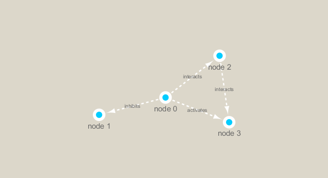

```{r setup, include=FALSE}
knitr::opts_chunk$set(echo = TRUE)
```

```{r}
library(RCy3)
library(igraph)
```

Can we t

```{r}
#cytoscapePing()
```

```{r}
#g <- makeSimpleIgraph()
#createNetworkFromIgraph(g,"myGraph")
```

we can test thigns further by making a ltitle sample network and sending it to cytoscape

```{r}
#setVisualStyle("Marquee")
```

```{r}
#fig <- exportImage(filename="demo_marquee", type="png", height=350)


```

```{r}
#plot(g)
```


```{r}
## scripts for processing located in "inst/data-raw/"
prok_vir_cor <- read.delim("virus_prok_cor_abundant.tsv", stringsAsFactors = FALSE)

## Have a peak at the first 6 rows
head(prok_vir_cor)
```

```{r}
g <- graph.data.frame(prok_vir_cor, directed = FALSE)
```

```{r}
class(g)
```

```{r}
g
```

```{r}
plot(g,vertex.size = 3, vertex.label=NA)
```

```{r}
library(ggraph)
```

```{r}
ggraph(g, layout = 'auto') +
  geom_edge_link(alpha = 0.25) +
  geom_node_point(color="steelblue") +
  theme_graph()
```


```{r}
#createNetworkFromIgraph(g,"myIgraph")
```

```{r}
cb <- cluster_edge_betweenness(g)
```

```{r}
cb
```

```{r}
plot(cb, y=g, vertex.label=NA,  vertex.size=3)

```


```{r}
pr <- page_rank(g)
head(pr$vector)
```
```{r}
# Make a size vector btwn 2 and 20 for node plotting size

v.size <- BBmisc::normalize(pr$vector, range=c(2,20), method="range")
plot(g, vertex.size=v.size, vertex.label=NA)
```


