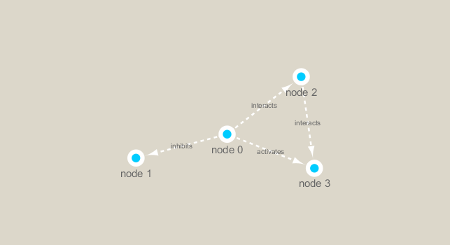

class17\_handsontwo
================
Alberto Carreno
3/4/2020

``` r
library(RCy3)
library(igraph)
```

    ## Warning: package 'igraph' was built under R version 3.6.3

    ## 
    ## Attaching package: 'igraph'

    ## The following objects are masked from 'package:stats':
    ## 
    ##     decompose, spectrum

    ## The following object is masked from 'package:base':
    ## 
    ##     union

Can we t

``` r
#cytoscapePing()
```

``` r
#g <- makeSimpleIgraph()
#createNetworkFromIgraph(g,"myGraph")
```

we can test thigns further by making a ltitle sample network and sending
it to cytoscape

``` r
#setVisualStyle("Marquee")
```

``` r
#fig <- exportImage(filename="demo_marquee", type="png", height=350)


```


``` r
#plot(g)
```

``` r
## scripts for processing located in "inst/data-raw/"
prok_vir_cor <- read.delim("virus_prok_cor_abundant.tsv", stringsAsFactors = FALSE)

## Have a peak at the first 6 rows
head(prok_vir_cor)
```

    ##       Var1          Var2    weight
    ## 1  ph_1061 AACY020068177 0.8555342
    ## 2  ph_1258 AACY020207233 0.8055750
    ## 3  ph_3164 AACY020207233 0.8122517
    ## 4  ph_1033 AACY020255495 0.8487498
    ## 5 ph_10996 AACY020255495 0.8734617
    ## 6 ph_11038 AACY020255495 0.8740782

``` r
g <- graph.data.frame(prok_vir_cor, directed = FALSE)
```

``` r
class(g)
```

    ## [1] "igraph"

``` r
g
```

    ## IGRAPH 3de0837 UNW- 845 1544 -- 
    ## + attr: name (v/c), weight (e/n)
    ## + edges from 3de0837 (vertex names):
    ##  [1] ph_1061 --AACY020068177 ph_1258 --AACY020207233 ph_3164 --AACY020207233
    ##  [4] ph_1033 --AACY020255495 ph_10996--AACY020255495 ph_11038--AACY020255495
    ##  [7] ph_11040--AACY020255495 ph_11048--AACY020255495 ph_11096--AACY020255495
    ## [10] ph_1113 --AACY020255495 ph_1208 --AACY020255495 ph_13207--AACY020255495
    ## [13] ph_1346 --AACY020255495 ph_14679--AACY020255495 ph_1572 --AACY020255495
    ## [16] ph_16045--AACY020255495 ph_1909 --AACY020255495 ph_1918 --AACY020255495
    ## [19] ph_19894--AACY020255495 ph_2117 --AACY020255495 ph_2231 --AACY020255495
    ## [22] ph_2363 --AACY020255495 ph_276  --AACY020255495 ph_2775 --AACY020255495
    ## + ... omitted several edges

``` r
plot(g,vertex.size = 3, vertex.label=NA)
```

<!-- -->

``` r
library(ggraph)
```

    ## Warning: package 'ggraph' was built under R version 3.6.3

    ## Loading required package: ggplot2

``` r
ggraph(g, layout = 'auto') +
  geom_edge_link(alpha = 0.25) +
  geom_node_point(color="steelblue") +
  theme_graph()
```

    ## Using `stress` as default layout

<!-- -->

``` r
#createNetworkFromIgraph(g,"myIgraph")
```

``` r
cb <- cluster_edge_betweenness(g)
```

    ## Warning in cluster_edge_betweenness(g): At community.c:460 :Membership vector
    ## will be selected based on the lowest modularity score.

    ## Warning in cluster_edge_betweenness(g): At community.c:467 :Modularity
    ## calculation with weighted edge betweenness community detection might not make
    ## sense -- modularity treats edge weights as similarities while edge betwenness
    ## treats them as distances

``` r
cb
```

    ## IGRAPH clustering edge betweenness, groups: 18, mod: 0.82
    ## + groups:
    ##   $`1`
    ##   [1] "ph_1061"       "AACY020068177"
    ##   
    ##   $`2`
    ##    [1] "ph_1258"       "ph_5861"       "ph_7172"       "ph_11569"     
    ##    [5] "ph_1291"       "ph_1600"       "ph_2702"       "ph_5790"      
    ##    [9] "ph_5858"       "ph_7594"       "ph_7816"       "ph_784"       
    ##   [13] "ph_1359"       "ph_1534"       "ph_1874"       "ph_2465"      
    ##   [17] "ph_5453"       "ph_900"        "ph_908"        "ph_811"       
    ##   [21] "ph_1367"       "ph_1452"       "ph_1458"       "ph_1723"      
    ##   + ... omitted several groups/vertices

``` r
plot(cb, y=g, vertex.label=NA,  vertex.size=3)
```

<!-- -->

``` r
pr <- page_rank(g)
head(pr$vector)
```

    ##      ph_1061      ph_1258      ph_3164      ph_1033     ph_10996     ph_11038 
    ## 0.0011834320 0.0011599483 0.0019042088 0.0005788564 0.0005769663 0.0005745460

``` r
# Make a size vector btwn 2 and 20 for node plotting size

v.size <- BBmisc::normalize(pr$vector, range=c(2,20), method="range")
plot(g, vertex.size=v.size, vertex.label=NA)
```

<!-- -->
