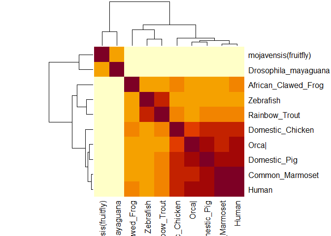

find\_a\_gene
================
Alberto Carreno
2/24/2020

``` r
library(bio3d)
```

``` r
genelist <- read.fasta("20200306_FASTA")
genelist
```

    ##                        1        .         .         .         .         50 
    ## African_Clawed_Frog    ----MERKV-LGLLIALGFLGSCLAEKNCRVDNFEVMKDFNKERYAGVWY
    ## Domestic_Chicken       ----MAYTWRALLLLALAFLGSSMAERDCRVSSFKVKENFDKNRYSGTWY
    ## Orca|                  ----MEWVW-ALVLLAA--LGSVRAERDCRVSSFRVKENFDKDRFSGTWY
    ## Domestic_Pig           ----MEWVW-ALVLLAA--LGSAQAERDCRVSSFRVKENFDKARFSGTWY
    ## Human                  ----MKWVW-ALLLLAA--LGSGRAERDCRVSSFRVKENFDKARFSGTWY
    ## Common_Marmoset        ----MKWVW-ALLLLAV--LGISRAERDCRVSSFRVKENFDKARFSGTWY
    ## Rainbow_Trout          --------------------------SDCQVSNIQVMQNFDRSRYTGRWY
    ## Zebrafish              ----------MLRLCIAVCVLATCWAQDCQVSNFAVQQDFNRTRYQGTWY
    ## Drosophila_mayaguana   ---------------------------------ITSVGNLNMKKYQGIWY
    ## mojavensis(fruitfly)   MLNQVFYISVILMLSLGSHALSTRISRGPCQANLTAVGDLNMRRYEGIWY
    ##                                                                   ^^ * ** 
    ##                        1        .         .         .         .         50 
    ## 
    ##                       51        .         .         .         .         100 
    ## African_Clawed_Frog    AVAKKDPEGLFLLDNIAANFKIEDNGKTT------ATAKGRVRILDKLEL
    ## Domestic_Chicken       AMAKKDPEGLFLQDNVVAQFTVDENGQMS------ATAKGRVRLFNNWDV
    ## Orca|                  AMAKKDPKGLFLQDNIVAQF-MNENGHMT------ATAKGRVRLFNSWDL
    ## Domestic_Pig           AMAKKDPEGLFLQDNIVAEFSVDENGHMS------ATAKGRVRLLNNWDV
    ## Human                  AMAKKDPEGLFLQDNIVAEFSVDETGQMS------ATAKGRVRLLNNWDV
    ## Common_Marmoset        AMAKKDPEGLFLQDNIIAEFSVDETGQMS------ATAKGRVRLLNNWDV
    ## Rainbow_Trout          AVAKKDPVGLFLLDNVVAQFSVDESGKVT------ATAHGRVIILNNWEM
    ## Zebrafish              AVAKKDPVGLFLLDNIVANFKVEEDGTMT------ATAIGRVIILNNWEM
    ## Drosophila_mayaguana   PQLSYPLYLHPLPECAKFNIVKGKNGNYEIHRSDLDGKSGLLRQRTSLIT
    ## mojavensis(fruitfly)   PQFAYPLYHKSLPKCVKYNVTKDISGKYRILRSDIDSQSGNVRRRSTLIL
    ##                                   *             *             * ^         
    ##                       51        .         .         .         .         100 
    ## 
    ##                      101        .         .         .         .         150 
    ## African_Clawed_Frog    CANMVGTFIETNDPAKYRMKYHGALAILERGLDDHWVVDTDYTTYAITYA
    ## Domestic_Chicken       CADMIGSFTDTEDPAKFKMKYWGVASFLQKGNDDHWVVDTDYDTYALHYS
    ## Orca|                  CADMLGTFTDTEDPAKFKMKYWGVASFLQKGNDDHWIIDTDYDTYAVQYS
    ## Domestic_Pig           CADMVGTFTDTEDPAKFKMKYWGVASFLQKGNDDHWIIDTDYDTYAVQYS
    ## Human                  CADMVGTFTDTEDPAKFKMKYWGVASFLQKGNDDHWIVDTDYDTYAVQYS
    ## Common_Marmoset        CADMVGTFTDTEDPAKFKMKYWGVASFLQKGNDDHWIIDTDYDTYAVQYS
    ## Rainbow_Trout          CANMFGTFEDTPDPAKFKMRYWGAASYLQTGNDDHWVIDTDYDNYAIHYS
    ## Zebrafish              CANMFGTFEDTEDPAKFKMKYWGAAAYLQTGYDDHWIIDTDYDNYAIHYS
    ## Drosophila_mayaguana   KVDKKG--------GKYALKMKNSHDGL-----DIYVLDTDYKTFSIQYA
    ## mojavensis(fruitfly)   RVSRKG--------GKYAIRTDNSPDGL-----NMYVLDTDYRTYSIQYA
    ##                             *        ^*^ ^^       *       ^^^****  ^ ^ *  
    ##                      101        .         .         .         .         150 
    ## 
    ##                      151        .         .         .         .         200 
    ## African_Clawed_Frog    CRRRNLDGTCRDSYSFVFSRDINGLPSESQRIVRRRQ-EQLCLDRKYRVV
    ## Domestic_Chicken       CRELNEDGTCADSYSFVFSRDPKGLPPEAQKIVRQRQ-IDLCLDRKYRVI
    ## Orca|                  CRLLNLDGTCADSYSFVFARDLNGFSPEVQRIVRQRQ-EELCLARQYRLI
    ## Domestic_Pig           CRLQNLDGTCADSYSFVFARDPHGFSPEVQKIVRQRQ-EELCLARQYRII
    ## Human                  CRLLNLDGTCADSYSFVFSRDPNGLPPEAQKIVRQRQ-EELCLARQYRLI
    ## Common_Marmoset        CRLLNLDGTCADSYSFVFSRDPNGLPPEAQRIIRQRQ-EELCLARQYRLI
    ## Rainbow_Trout          CREVDLDGTCLDGYSFIFSRHPTGLRPEDQKIVTDKK-KEICFLGKYRRV
    ## Zebrafish              CRELDEDGTCLDGYSFIFSRHPDGLRPEDQAIVTQKK-QDICFLGKYRRV
    ## Drosophila_mayaguana   C--IEVDGNLNLAYAIILTRDRM---PDSKVIKKSRKLAELSGVELRRLI
    ## mojavensis(fruitfly)   C--IELEGILNIAYAVIMTRERM---PSSEVIQKTKQLAELSGIDQKKMV
    ##                        *     ^*     *  ^  *           *   ^    ^      ^ ^ 
    ##                      151        .         .         .         .         200 
    ## 
    ##                      201        .     216 
    ## African_Clawed_Frog    -VHNGYCETN------
    ## Domestic_Chicken       -VHNGFCS--------
    ## Orca|                  -AHNGYCDGESE----
    ## Domestic_Pig           -THNGYCDGKSERNIL
    ## Human                  -VHNGYCDGRSERNLL
    ## Common_Marmoset        -VHNGYCDGKSERNLL
    ## Rainbow_Trout          -GHTGFCESS------
    ## Zebrafish              -AHTGFCEAA------
    ## Drosophila_mayaguana   PISQKSCPKDA-----
    ## mojavensis(fruitfly)   PILQGACPIDV-----
    ##                              *          
    ##                      201        .     216 
    ## 
    ## Call:
    ##   read.fasta(file = "20200306_FASTA")
    ## 
    ## Class:
    ##   fasta
    ## 
    ## Alignment dimensions:
    ##   10 sequence rows; 216 position columns (148 non-gap, 68 gap) 
    ## 
    ## + attr: id, ali, call

``` r
ide.mat <- seqidentity(genelist)
ide.mat
```

    ##                      African_Clawed_Frog Domestic_Chicken Orca| Domestic_Pig
    ## African_Clawed_Frog                1.000            0.610 0.593        0.585
    ## Domestic_Chicken                   0.610            1.000 0.786        0.808
    ## Orca|                              0.593            0.786 1.000        0.903
    ## Domestic_Pig                       0.585            0.808 0.903        1.000
    ## Human                              0.610            0.850 0.878        0.915
    ## Common_Marmoset                    0.600            0.829 0.867        0.900
    ## Rainbow_Trout                      0.562            0.644 0.589        0.614
    ## Zebrafish                          0.547            0.600 0.577        0.579
    ## Drosophila_mayaguana               0.258            0.242 0.252        0.237
    ## mojavensis(fruitfly)               0.251            0.219 0.220        0.213
    ##                      Human Common_Marmoset Rainbow_Trout Zebrafish
    ## African_Clawed_Frog  0.610           0.600         0.562     0.547
    ## Domestic_Chicken     0.850           0.829         0.644     0.600
    ## Orca|                0.878           0.867         0.589     0.577
    ## Domestic_Pig         0.915           0.900         0.614     0.579
    ## Human                1.000           0.960         0.619     0.589
    ## Common_Marmoset      0.960           1.000         0.608     0.579
    ## Rainbow_Trout        0.619           0.608         1.000     0.818
    ## Zebrafish            0.589           0.579         0.818     1.000
    ## Drosophila_mayaguana 0.237           0.237         0.212     0.212
    ## mojavensis(fruitfly) 0.219           0.213         0.247     0.218
    ##                      Drosophila_mayaguana mojavensis(fruitfly)
    ## African_Clawed_Frog                 0.258                0.251
    ## Domestic_Chicken                    0.242                0.219
    ## Orca|                               0.252                0.220
    ## Domestic_Pig                        0.237                0.213
    ## Human                               0.237                0.219
    ## Common_Marmoset                     0.237                0.213
    ## Rainbow_Trout                       0.212                0.247
    ## Zebrafish                           0.212                0.218
    ## Drosophila_mayaguana                1.000                0.575
    ## mojavensis(fruitfly)                0.575                1.000

``` r
plot.dmat(ide.mat, color.palette=mono.colors,
          main="Sequence Identity", xlab="Structure No.",
          ylab="Structure No.")
```

<!-- -->

``` r
x <- as.matrix(ide.mat)
```

``` r
heatmap(x,symm = T)
```

<!-- -->

``` r
heatmap(x, distfun = as.dist,symm=T)
```

<!-- -->

``` r
rc <- rainbow(nrow(x), start = 0, end = .3)
cc <- rainbow(ncol(x), start = 0, end = .3)
hv <- heatmap(x, col = cm.colors(256), scale = "column",
              RowSideColors = rc, ColSideColors = cc, margins = c(12,10),symm= T)
```

<!-- -->

``` r
pdbgenelist <- blast.pdb(genelist)
```

    ## Warning in blast.pdb(genelist): Multiple sequences detected - using only the
    ## first sequence in input object

    ##  Searching ... please wait (updates every 5 seconds) RID = 65KFW3HB01R 
    ##  .
    ##  Reporting 52 hits

``` r
pdbgenelist
```

    ## $hit.tbl
    ##        queryid subjectids identity alignmentlength mismatches gapopens q.start
    ## 1  Query_49083     1JYJ_A   64.571             175         62        0      21
    ## 2  Query_49083     3BSZ_E   63.429             175         64        0      21
    ## 3  Query_49083     2WQA_E   63.068             176         65        0      20
    ## 4  Query_49083     2WR6_A   63.429             175         64        0      20
    ## 5  Query_49083     2WQ9_A   63.793             174         63        0      21
    ## 6  Query_49083     1JYD_A   63.429             175         64        0      21
    ## 7  Query_49083     1BRP_A   63.429             175         64        0      21
    ## 8  Query_49083     4O9S_A   63.429             175         64        0      21
    ## 9  Query_49083     3FMZ_A   63.429             175         64        0      21
    ## 10 Query_49083     1IIU_A   62.791             172         64        0      23
    ## 11 Query_49083     1AQB_A   60.571             175         69        0      21
    ## 12 Query_49083     1QAB_E   62.209             172         65        0      24
    ## 13 Query_49083     1KT5_A   60.571             175         69        0      21
    ## 14 Query_49083     1HBQ_A   60.920             174         68        0      21
    ## 15 Query_49083     1ERB_A   60.571             175         69        0      21
    ## 16 Query_49083     1RLB_E   60.345             174         69        0      21
    ## 17 Query_49083     5EZ2_A   26.174             149         93        8      22
    ## 18 Query_49083     5F6Z_A   26.174             149         93        8      22
    ## 19 Query_49083     2HZQ_A   23.841             151         90        8      25
    ## 20 Query_49083     4ALO_A   29.688             128         76        5      36
    ## 21 Query_49083     1GKA_A   27.692             130         76        5      36
    ## 22 Query_49083     1S2P_A   27.692             130         76        5      36
    ## 23 Query_49083     2XST_A   22.124             113         70        4      31
    ## 24 Query_49083     1I4U_A   28.125             128         78        5      36
    ## 25 Query_49083     1QWD_A   30.612              49         34        0      31
    ## 26 Query_49083     2ACO_A   30.612              49         34        0      31
    ## 27 Query_49083     3MBT_A   30.612              49         34        0      31
    ## 28 Query_49083     3KZA_A   26.786             112         65        6      30
    ## 29 Query_49083     3K4Z_A   24.000             100         55        3      83
    ## 30 Query_49083     3QKG_A   25.893             112         75        4      27
    ## 31 Query_49083     4OS0_A   22.535             142         85        6       6
    ## 32 Query_49083     1JZU_A   26.667             120         58        4      36
    ## 33 Query_49083     4ES7_A   25.893             112         75        4      27
    ## 34 Query_49083     4ORW_A   22.535             142         85        6       6
    ## 35 Query_49083     1YUP_A   27.273             110         67        5      30
    ## 36 Query_49083     4ORR_A   22.535             142         85        6       6
    ## 37 Query_49083     3HF9_1   35.714              42         22        1      86
    ## 38 Query_49083     5LZP_0   35.714              42         22        1      86
    ## 39 Query_49083     2FHH_1   35.714              42         22        1      86
    ## 40 Query_49083     2FHG_1   35.714              42         22        1      86
    ## 41 Query_49083     3H6F_1   35.714              42         22        1      86
    ## 42 Query_49083     3S26_A   19.130             115         78        5      31
    ## 43 Query_49083     3U9P_C   19.130             115         78        5      31
    ## 44 Query_49083     3SAO_A   26.667             120         58        6      36
    ## 45 Query_49083     4ONH_A   31.081              74         39        2      43
    ## 46 Query_49083     1UT9_A   24.658              73         44        2     100
    ## 47 Query_49083     1RQ5_A   24.658              73         44        2     100
    ## 48 Query_49083     4OS8_A   22.148             149         77        7       6
    ## 49 Query_49083     4GH7_A   21.774             124         68        6      31
    ## 50 Query_49083     1GKA_B   38.235              34         18        1     126
    ## 51 Query_49083     5XXU_V   34.146              41         27        0     109
    ## 52 Query_49083     5Z62_I   50.000              20         10        0      28
    ##    q.end s.start s.end   evalue bitscore positives  mlog.evalue pdb.id    acc
    ## 1    195       2   176 7.39e-91    264.0     85.14 207.53511573 1JYJ_A 1JYJ_A
    ## 2    195       1   175 1.52e-88    258.0     84.00 202.20877785 3BSZ_E 3BSZ_E
    ## 3    195       1   176 1.62e-88    258.0     83.52 202.14506203 2WQA_E 2WQA_E
    ## 4    194       1   175 1.75e-88    258.0     83.43 202.06787240 2WR6_A 2WR6_A
    ## 5    194       1   174 1.91e-88    258.0     83.91 201.98038494 2WQ9_A 2WQ9_A
    ## 6    195       2   176 1.99e-88    258.0     84.00 201.93935354 1JYD_A 1JYD_A
    ## 7    195       1   175 2.10e-88    258.0     84.00 201.88555084 1BRP_A 1BRP_A
    ## 8    195      33   207 2.21e-88    259.0     84.00 201.83449567 4O9S_A 4O9S_A
    ## 9    195      30   204 2.25e-88    259.0     84.00 201.81655797 3FMZ_A 3FMZ_A
    ## 10   194       2   173 8.06e-86    251.0     82.56 195.93540444 1IIU_A 1IIU_A
    ## 11   195       1   175 1.87e-85    251.0     82.29 195.09379447 1AQB_A 1AQB_A
    ## 12   195       1   172 9.72e-85    249.0     81.98 193.44554729 1QAB_E 1QAB_E
    ## 13   195       1   175 1.44e-84    248.0     81.71 193.05250470 1KT5_A 1KT5_A
    ## 14   194       1   174 1.67e-84    248.0     82.18 192.90432419 1HBQ_A 1HBQ_A
    ## 15   195       1   175 2.17e-84    248.0     81.71 192.64242064 1ERB_A 1ERB_A
    ## 16   194       1   174 5.76e-84    246.0     81.61 191.66621034 1RLB_E 1RLB_E
    ## 17   168       4   137 9.03e-05     42.4     44.97   9.31237310 5EZ2_A 5EZ2_A
    ## 18   168       4   137 9.08e-05     42.4     44.97   9.30685127 5F6Z_A 5F6Z_A
    ## 19   168       5   137 1.04e-04     42.0     47.68   9.17111966 2HZQ_A 2HZQ_A
    ## 20   162      27   141 2.00e-03     38.5     41.41   6.21460810 4ALO_A 4ALO_A
    ## 21   162      26   140 3.80e-02     34.7     39.23   3.27016912 1GKA_A 1GKA_A
    ## 22   162      27   141 3.90e-02     34.7     39.23   3.24419363 1S2P_A 1S2P_A
    ## 23   138       8   107 4.50e-02     34.3     46.02   3.10109279 2XST_A 2XST_A
    ## 24   162      27   141 7.40e-02     33.9     39.84   2.60369019 1I4U_A 1I4U_A
    ## 25    79      30    78 1.20e-01     33.1     53.06   2.12026354 1QWD_A 1QWD_A
    ## 26    79      26    74 1.30e-01     33.1     53.06   2.04022083 2ACO_A 2ACO_A
    ## 27    79      12    60 1.90e-01     32.7     53.06   1.66073121 3MBT_A 3MBT_A
    ## 28   136       5   104 5.10e-01     31.2     47.32   0.67334455 3KZA_A 3KZA_A
    ## 29   161     182   281 9.80e-01     30.8     41.00   0.02020271 3K4Z_A 3K4Z_A
    ## 30   136       8   113 1.20e+00     30.4     42.86  -0.18232156 3QKG_A 3QKG_A
    ## 31   139       9   133 1.20e+00     30.4     38.73  -0.18232156 4OS0_A 4OS0_A
    ## 32   144       5   105 1.50e+00     30.0     38.33  -0.40546511 1JZU_A 1JZU_A
    ## 33   136      35   140 1.50e+00     30.0     42.86  -0.40546511 4ES7_A 4ES7_A
    ## 34   139       9   133 1.80e+00     29.6     38.73  -0.58778666 4ORW_A 4ORW_A
    ## 35   136       5   104 2.30e+00     29.3     44.55  -0.83290912 1YUP_A 1YUP_A
    ## 36   139       9   133 2.60e+00     29.3     38.73  -0.95551145 4ORR_A 4ORR_A
    ## 37   127     111   147 2.70e+00     29.6     54.76  -0.99325177 3HF9_1 3HF9_1
    ## 38   127     112   148 2.70e+00     29.6     54.76  -0.99325177 5LZP_0 5LZP_0
    ## 39   127     122   158 2.70e+00     29.6     54.76  -0.99325177 2FHH_1 2FHH_1
    ## 40   127     121   157 2.80e+00     29.6     54.76  -1.02961942 2FHG_1 2FHG_1
    ## 41   127     119   155 2.80e+00     29.6     54.76  -1.02961942 3H6F_1 3H6F_1
    ## 42   138      18   124 3.80e+00     28.9     44.35  -1.33500107 3S26_A 3S26_A
    ## 43   138      20   126 3.90e+00     28.9     44.35  -1.36097655 3U9P_C 3U9P_C
    ## 44   144       4   104 5.00e+00     28.5     40.83  -1.60943791 3SAO_A 3SAO_A
    ## 45   115      33    95 5.20e+00     28.5     43.24  -1.64865863 4ONH_A 4ONH_A
    ## 46   161      28   100 5.90e+00     28.9     43.84  -1.77495235 1UT9_A 1UT9_A
    ## 47   161      28   100 5.90e+00     28.9     43.84  -1.77495235 1RQ5_A 1RQ5_A
    ## 48   139       9   133 6.30e+00     28.1     38.26  -1.84054963 4OS8_A 4OS8_A
    ## 49   141      18   125 8.10e+00     27.7     41.94  -2.09186406 4GH7_A 4GH7_A
    ## 50   159     105   135 8.70e+00     27.7     61.76  -2.16332303 1GKA_B 1GKA_B
    ## 51   149      27    67 8.80e+00     26.6     48.78  -2.17475172 5XXU_V 5XXU_V
    ## 52    47      53    72 9.60e+00     26.2     80.00  -2.26176310 5Z62_I 5Z62_I
    ## 
    ## $raw
    ##        queryid subjectids identity alignmentlength mismatches gapopens q.start
    ## 1  Query_49083     1JYJ_A   64.571             175         62        0      21
    ## 2  Query_49083     3BSZ_E   63.429             175         64        0      21
    ## 3  Query_49083     2WQA_E   63.068             176         65        0      20
    ## 4  Query_49083     2WR6_A   63.429             175         64        0      20
    ## 5  Query_49083     2WQ9_A   63.793             174         63        0      21
    ## 6  Query_49083     1JYD_A   63.429             175         64        0      21
    ## 7  Query_49083     1BRP_A   63.429             175         64        0      21
    ## 8  Query_49083     4O9S_A   63.429             175         64        0      21
    ## 9  Query_49083     3FMZ_A   63.429             175         64        0      21
    ## 10 Query_49083     1IIU_A   62.791             172         64        0      23
    ## 11 Query_49083     1AQB_A   60.571             175         69        0      21
    ## 12 Query_49083     1QAB_E   62.209             172         65        0      24
    ## 13 Query_49083     1KT5_A   60.571             175         69        0      21
    ## 14 Query_49083     1HBQ_A   60.920             174         68        0      21
    ## 15 Query_49083     1ERB_A   60.571             175         69        0      21
    ## 16 Query_49083     1RLB_E   60.345             174         69        0      21
    ## 17 Query_49083     5EZ2_A   26.174             149         93        8      22
    ## 18 Query_49083     5F6Z_A   26.174             149         93        8      22
    ## 19 Query_49083     2HZQ_A   23.841             151         90        8      25
    ## 20 Query_49083     4ALO_A   29.688             128         76        5      36
    ## 21 Query_49083     1GKA_A   27.692             130         76        5      36
    ## 22 Query_49083     1S2P_A   27.692             130         76        5      36
    ## 23 Query_49083     2XST_A   22.124             113         70        4      31
    ## 24 Query_49083     1I4U_A   28.125             128         78        5      36
    ## 25 Query_49083     1QWD_A   30.612              49         34        0      31
    ## 26 Query_49083     2ACO_A   30.612              49         34        0      31
    ## 27 Query_49083     3MBT_A   30.612              49         34        0      31
    ## 28 Query_49083     3KZA_A   26.786             112         65        6      30
    ## 29 Query_49083     3K4Z_A   24.000             100         55        3      83
    ## 30 Query_49083     3QKG_A   25.893             112         75        4      27
    ## 31 Query_49083     4OS0_A   22.535             142         85        6       6
    ## 32 Query_49083     1JZU_A   26.667             120         58        4      36
    ## 33 Query_49083     4ES7_A   25.893             112         75        4      27
    ## 34 Query_49083     4ORW_A   22.535             142         85        6       6
    ## 35 Query_49083     1YUP_A   27.273             110         67        5      30
    ## 36 Query_49083     4ORR_A   22.535             142         85        6       6
    ## 37 Query_49083     3HF9_1   35.714              42         22        1      86
    ## 38 Query_49083     5LZP_0   35.714              42         22        1      86
    ## 39 Query_49083     2FHH_1   35.714              42         22        1      86
    ## 40 Query_49083     2FHG_1   35.714              42         22        1      86
    ## 41 Query_49083     3H6F_1   35.714              42         22        1      86
    ## 42 Query_49083     3S26_A   19.130             115         78        5      31
    ## 43 Query_49083     3U9P_C   19.130             115         78        5      31
    ## 44 Query_49083     3SAO_A   26.667             120         58        6      36
    ## 45 Query_49083     4ONH_A   31.081              74         39        2      43
    ## 46 Query_49083     1UT9_A   24.658              73         44        2     100
    ## 47 Query_49083     1RQ5_A   24.658              73         44        2     100
    ## 48 Query_49083     4OS8_A   22.148             149         77        7       6
    ## 49 Query_49083     4GH7_A   21.774             124         68        6      31
    ## 50 Query_49083     1GKA_B   38.235              34         18        1     126
    ## 51 Query_49083     5XXU_V   34.146              41         27        0     109
    ## 52 Query_49083     5Z62_I   50.000              20         10        0      28
    ##    q.end s.start s.end   evalue bitscore positives
    ## 1    195       2   176 7.39e-91    264.0     85.14
    ## 2    195       1   175 1.52e-88    258.0     84.00
    ## 3    195       1   176 1.62e-88    258.0     83.52
    ## 4    194       1   175 1.75e-88    258.0     83.43
    ## 5    194       1   174 1.91e-88    258.0     83.91
    ## 6    195       2   176 1.99e-88    258.0     84.00
    ## 7    195       1   175 2.10e-88    258.0     84.00
    ## 8    195      33   207 2.21e-88    259.0     84.00
    ## 9    195      30   204 2.25e-88    259.0     84.00
    ## 10   194       2   173 8.06e-86    251.0     82.56
    ## 11   195       1   175 1.87e-85    251.0     82.29
    ## 12   195       1   172 9.72e-85    249.0     81.98
    ## 13   195       1   175 1.44e-84    248.0     81.71
    ## 14   194       1   174 1.67e-84    248.0     82.18
    ## 15   195       1   175 2.17e-84    248.0     81.71
    ## 16   194       1   174 5.76e-84    246.0     81.61
    ## 17   168       4   137 9.03e-05     42.4     44.97
    ## 18   168       4   137 9.08e-05     42.4     44.97
    ## 19   168       5   137 1.04e-04     42.0     47.68
    ## 20   162      27   141 2.00e-03     38.5     41.41
    ## 21   162      26   140 3.80e-02     34.7     39.23
    ## 22   162      27   141 3.90e-02     34.7     39.23
    ## 23   138       8   107 4.50e-02     34.3     46.02
    ## 24   162      27   141 7.40e-02     33.9     39.84
    ## 25    79      30    78 1.20e-01     33.1     53.06
    ## 26    79      26    74 1.30e-01     33.1     53.06
    ## 27    79      12    60 1.90e-01     32.7     53.06
    ## 28   136       5   104 5.10e-01     31.2     47.32
    ## 29   161     182   281 9.80e-01     30.8     41.00
    ## 30   136       8   113 1.20e+00     30.4     42.86
    ## 31   139       9   133 1.20e+00     30.4     38.73
    ## 32   144       5   105 1.50e+00     30.0     38.33
    ## 33   136      35   140 1.50e+00     30.0     42.86
    ## 34   139       9   133 1.80e+00     29.6     38.73
    ## 35   136       5   104 2.30e+00     29.3     44.55
    ## 36   139       9   133 2.60e+00     29.3     38.73
    ## 37   127     111   147 2.70e+00     29.6     54.76
    ## 38   127     112   148 2.70e+00     29.6     54.76
    ## 39   127     122   158 2.70e+00     29.6     54.76
    ## 40   127     121   157 2.80e+00     29.6     54.76
    ## 41   127     119   155 2.80e+00     29.6     54.76
    ## 42   138      18   124 3.80e+00     28.9     44.35
    ## 43   138      20   126 3.90e+00     28.9     44.35
    ## 44   144       4   104 5.00e+00     28.5     40.83
    ## 45   115      33    95 5.20e+00     28.5     43.24
    ## 46   161      28   100 5.90e+00     28.9     43.84
    ## 47   161      28   100 5.90e+00     28.9     43.84
    ## 48   139       9   133 6.30e+00     28.1     38.26
    ## 49   141      18   125 8.10e+00     27.7     41.94
    ## 50   159     105   135 8.70e+00     27.7     61.76
    ## 51   149      27    67 8.80e+00     26.6     48.78
    ## 52    47      53    72 9.60e+00     26.2     80.00
    ## 
    ## $url
    ##                                                                                                                                                        65KFW3HB01R 
    ## "https://blast.ncbi.nlm.nih.gov/Blast.cgi?CMD=Get&FORMAT_OBJECT=Alignment&ALIGNMENT_VIEW=Tabular&RESULTS_FILE=on&FORMAT_TYPE=CSV&ALIGNMENTS=20000&RID=65KFW3HB01R" 
    ## 
    ## attr(,"class")
    ## [1] "blast"

``` r
plot.blast(pdbgenelist)
```

    ##   * Possible cutoff values:    191 -3 
    ##             Yielding Nhits:    16 52 
    ## 
    ##   * Chosen cutoff value of:    191 
    ##             Yielding Nhits:    16

<!-- -->

``` r
pdb.annotate("3FMZ_A")
```

    ## Warning in pdb.annotate("3FMZ_A"): ids should be standard 4 character PDB-IDs:
    ## trying first 4 characters...

    ##        structureId chainId experimentalTechnique resolution ligandId
    ## 3FMZ_A        3FMZ       A     X-RAY DIFFRACTION        2.9      2T1
    ##                                                                          ligandName
    ## 3FMZ_A 2-[({4-[2-(trifluoromethyl)phenyl]piperidin-1-yl}carbonyl)amino]benzoic acid
    ##              source scopDomain    classification                  compound
    ## 3FMZ_A Homo sapiens       <NA> TRANSPORT PROTEIN Retinol-binding protein 4
    ##                                                                                                                                                          title
    ## 3FMZ_A Identification and Characterization of a Non-retinoid Ligand for Retinol-binding Protein 4 Which Lowers Serum Retinol-binding Protein 4 Levels in Vivo.
    ##                                                                                                                                                                                citationAuthor
    ## 3FMZ_A Motani, A., Wang, Z., Conn, M., Siegler, K., Zhang, Y., Liu, Q., Johnstone, S., Xu, H., Thibault, S., Wang, Y., Fan, P., Connors, R., Le, H., Xu, G., Walker, N., Shan, B., Coward, P.
    ##         journalName publicationYear
    ## 3FMZ_A J.Biol.Chem.            2009
    ##                                                                                   structureTitle
    ## 3FMZ_A Crystal Structure of Retinol-Binding Protein 4 (RBP4) in complex with non-retinoid ligand
    ##        depositionDate structureMolecularWeight macromoleculeType entityId
    ## 3FMZ_A     2008-12-22                  50025.7           Protein        1
    ##                                                                                                                                                                                                                    sequence
    ## 3FMZ_A MASMSYYHHHHHHDYDIPTTENLYFQGAMERDCRVSSFRVKENFDKARFSGTWYAMAKKDPEGLFLQDNIVAEFSVDETGQMSATAKGRVRLLNNWDVCADMVGTFTDTEDPAKFKMKYWGVASFLQKGNDDHWIVDTDYDTYAVQYSCRLLNLDGTCADSYSFVFSRDPNGLPPEAQKIVRQRQEELCLARQYRLIVHNGYCDGRSERNLL
    ##        chainLength  db_id db_name rObserved rFree spaceGroup
    ## 3FMZ_A         212 P02753 UniProt     0.226 0.286       P 65
    ##                                 citation
    ## 3FMZ_A Motani et al. J.Biol.Chem. (2009)

``` r
pdb.annotate("4O9S_A")
```

    ## Warning in pdb.annotate("4O9S_A"): ids should be standard 4 character PDB-IDs:
    ## trying first 4 characters...

    ##        structureId chainId experimentalTechnique resolution       ligandId
    ## 4O9S_A        4O9S       A     X-RAY DIFFRACTION        2.3 2RY,CL,EDO,PEG
    ##                                                                                                                                                                                        ligandName
    ## 4O9S_A 1-[4-(7-thia-9,11-diazatricyclo[6.4.0.0^{2,6}]dodeca-1(12),2(6),8,10-tetraen-12-yl)piperazin-1-yl]-2-[2-(trifluoromethyl)phenyl]ethanone,CHLORIDE ION,1,2-ETHANEDIOL,DI(HYDROXYETHYL)ETHER
    ##              source scopDomain  classification                  compound
    ## 4O9S_A Homo sapiens       <NA> PROTEIN BINDING Retinol-binding protein 4
    ##                                                                                                title
    ## 4O9S_A Structure-assisted discovery of the first non-retinoid ligands for Retinol-Binding Protein 4.
    ##                                                                                                                                                                                                              citationAuthor
    ## 4O9S_A Wang, Y., Connors, R., Fan, P., Wang, X., Wang, Z., Liu, J., Kayser, F., Medina, J.C., Johnstone, S., Xu, H., Thibault, S., Walker, N., Conn, M., Zhang, Y., Liu, Q., Grillo, M.P., Motani, A., Coward, P., Wang, Z.
    ##                  journalName publicationYear
    ## 4O9S_A Bioorg.Med.Chem.Lett.            2014
    ##                                                                                    structureTitle
    ## 4O9S_A Crystal structure of Retinol-Binding Protein 4 (RBP4)in complex with a non-retinoid ligand
    ##        depositionDate structureMolecularWeight macromoleculeType entityId
    ## 4O9S_A     2014-01-02                 52636.94           Protein        1
    ##                                                                                                                                                                                                                       sequence
    ## 4O9S_A HISMASMSYYHHHHHHDYDIPTTENLYFQGAMERDCRVSSFRVKENFDKARFSGTWYAMAKKDPEGLFLQDNIVAEFSVDETGQMSATAKGRVRLLNNWDVCADMVGTFTDTEDPAKFKMKYWGVASFLQKGNDDHWIVDTDYDTYAVQYSCRLLNLDGTCADSYSFVFSRDPNGLPPEAQKIVRQRQEELCLARQYRLIVHNGYCDGRSERNLL
    ##        chainLength  db_id db_name rObserved rFree spaceGroup
    ## 4O9S_A         215 P02753 UniProt     0.233 0.261       P 65
    ##                                        citation
    ## 4O9S_A Wang et al. Bioorg.Med.Chem.Lett. (2014)

``` r
pdb.annotate("1JYD_A")
```

    ## Warning in pdb.annotate("1JYD_A"): ids should be standard 4 character PDB-IDs:
    ## trying first 4 characters...

    ##        structureId chainId experimentalTechnique resolution ligandId ligandName
    ## 1JYD_A        1JYD       A     X-RAY DIFFRACTION        1.7      GOL   GLYCEROL
    ##              source              scopDomain    classification
    ## 1JYD_A Homo sapiens Retinol binding protein TRANSPORT PROTEIN
    ##                              compound
    ## 1JYD_A PLASMA RETINOL-BINDING PROTEIN
    ##                                                                                                                                                    title
    ## 1JYD_A Role of conserved residues in structure and stability: Tryptophans of human serum  retinol-binding protein, a model for the lipocalin superfamily
    ##                                                                                citationAuthor
    ## 1JYD_A Greene, L.H., Chrysina, E.D., Irons, L.I., Papageorgiou, A.C., Acharya, K.R., Brew, K.
    ##         journalName publicationYear
    ## 1JYD_A Protein Sci.            2001
    ##                                                                                  structureTitle
    ## 1JYD_A Crystal Structure of Recombinant Human Serum Retinol-Binding Protein at 1.7 A Resolution
    ##        depositionDate structureMolecularWeight macromoleculeType entityId
    ## 1JYD_A     2001-09-12                 21668.21           Protein        1
    ##                                                                                                                                                                                       sequence
    ## 1JYD_A MERDCRVSSFRVKENFDKARFSGTWYAMAKKDPEGLFLQDNIVAEFSVDETGQMSATAKGRVRLLNNWDVCADMVGTFTDTEDPAKFKMKYWGVASFLQKGNDDHWIVDTDYDTYAVQYSCRLLNLDGTCADSYSFVFSRDPNGLPPEAQKIVRQRQEELCLARQYRLIVHNGYCDGRSERNL
    ##        chainLength  db_id db_name rObserved rFree spaceGroup
    ## 1JYD_A         183 P02753 UniProt     0.251  0.27        H 3
    ##                                 citation
    ## 1JYD_A Greene et al. Protein Sci. (2001)

``` r
mayaguana <- read.fasta("mayaguana.txt")
mayaguana_blast <- blast.pdb(mayaguana)
```

    ##  Searching ... please wait (updates every 5 seconds) RID = 65KG4WZZ01R 
    ##  .
    ##  Reporting 40 hits

``` r
mayaguana_blast
```

    ## $hit.tbl
    ##        queryid subjectids identity alignmentlength mismatches gapopens q.start
    ## 1  Query_34273     1GKA_B   24.691             162         97        8       6
    ## 2  Query_34273     2HZQ_A   20.779             154        119        3       6
    ## 3  Query_34273     1KT5_A   35.294              68         38        3      88
    ## 4  Query_34273     1RLB_E   34.328              67         40        2      88
    ## 5  Query_34273     1HBQ_A   35.294              68         38        3      88
    ## 6  Query_34273     1ERB_A   35.294              68         38        3      88
    ## 7  Query_34273     2WR6_A   32.836              67         39        3      88
    ## 8  Query_34273     2WQ9_A   32.836              67         39        3      88
    ## 9  Query_34273     2WQA_E   32.836              67         39        3      88
    ## 10 Query_34273     3BSZ_E   32.836              67         39        3      88
    ## 11 Query_34273     1BRP_A   32.836              67         39        3      88
    ## 12 Query_34273     1JYD_A   32.836              67         39        3      88
    ## 13 Query_34273     4O9S_A   32.836              67         39        3      88
    ## 14 Query_34273     3FMZ_A   32.836              67         39        3      88
    ## 15 Query_34273     1JYJ_A   32.836              67         39        3      88
    ## 16 Query_34273     1QAB_E   32.836              67         39        3      88
    ## 17 Query_34273     1IIU_A   32.727              55         32        2      88
    ## 18 Query_34273     4ALO_A   26.761              71         51        1      91
    ## 19 Query_34273     5F6Z_A   25.157             159         98        6       6
    ## 20 Query_34273     5EZ2_A   25.786             159         97        6       6
    ## 21 Query_34273     1AQB_A   36.842              38         22        1      88
    ## 22 Query_34273     1GKA_A   20.958             167        102        7       8
    ## 23 Query_34273     1S2P_A   25.352              71         52        1      91
    ## 24 Query_34273     1I4U_A   25.352              71         52        1      91
    ## 25 Query_34273     2RD7_C   26.829              41         28        1      74
    ## 26 Query_34273     3OJY_C   26.829              41         28        1      74
    ## 27 Query_34273     2OVA_A   26.829              41         28        1      74
    ## 28 Query_34273     2OVD_A   26.829              41         28        1      74
    ## 29 Query_34273     1IW2_A   26.829              41         28        1      74
    ## 30 Query_34273     2QOS_C   26.829              41         28        1      74
    ## 31 Query_34273     2XST_A   40.741              27         16        0      87
    ## 32 Query_34273     1Z24_A   31.579              57         36        2      72
    ## 33 Query_34273     1JPD_X   33.333              54         30        2      25
    ## 34 Query_34273     3SAO_A   27.835              97         56        4      75
    ## 35 Query_34273     5IT9_S   35.849              53         27        2     108
    ## 36 Query_34273     3J80_S   35.849              53         27        2     108
    ## 37 Query_34273     2J4B_A   28.125              64         46        0      20
    ## 38 Query_34273     3EBW_A   24.852             169         97        7       2
    ## 39 Query_34273     4HVZ_A   34.615              52         30        1     110
    ## 40 Query_34273     2W4L_A   32.432              37         25        0     118
    ##    q.end s.start s.end   evalue bitscore positives mlog.evalue pdb.id    acc
    ## 1    155      20   168 1.63e-07     49.3     42.59 15.62951564 1GKA_B 1GKA_B
    ## 2    158      14   165 6.82e-07     47.8     43.51 14.19823618 2HZQ_A 2HZQ_A
    ## 3    150     103   169 7.23e-06     44.7     58.82 11.83727152 1KT5_A 1KT5_A
    ## 4    150     103   169 7.83e-06     44.7     58.21 11.75754805 1RLB_E 1RLB_E
    ## 5    150     103   169 7.88e-06     44.7     58.82 11.75118265 1HBQ_A 1HBQ_A
    ## 6    150     103   169 8.03e-06     44.7     58.82 11.73232603 1ERB_A 1ERB_A
    ## 7    149     104   169 2.55e-04     40.4     59.70  8.27424701 2WR6_A 2WR6_A
    ## 8    149     103   168 2.66e-04     40.4     59.70  8.23201425 2WQ9_A 2WQ9_A
    ## 9    149     104   169 2.83e-04     40.4     59.70  8.17006366 2WQA_E 2WQA_E
    ## 10   149     103   168 2.95e-04     40.4     59.70  8.12853520 3BSZ_E 3BSZ_E
    ## 11   149     103   168 2.97e-04     40.4     59.70  8.12177842 1BRP_A 1BRP_A
    ## 12   149     104   169 3.23e-04     40.0     59.70  8.03785823 1JYD_A 1JYD_A
    ## 13   149     135   200 3.52e-04     40.4     59.70  7.95187938 4O9S_A 4O9S_A
    ## 14   149     132   197 3.62e-04     40.4     59.70  7.92386635 3FMZ_A 3FMZ_A
    ## 15   149     104   169 3.74e-04     40.0     59.70  7.89125476 1JYJ_A 1JYJ_A
    ## 16   149     100   165 6.37e-04     39.3     58.21  7.35874090 1QAB_E 1QAB_E
    ## 17   137     102   156 1.00e-03     38.5     63.64  6.90775528 1IIU_A 1IIU_A
    ## 18   160     107   177 2.00e-03     37.7     47.89  6.21460810 4ALO_A 4ALO_A
    ## 19   155      16   162 3.00e-03     37.4     42.77  5.80914299 5F6Z_A 5F6Z_A
    ## 20   155      16   162 4.00e-03     37.0     42.77  5.52146092 5EZ2_A 5EZ2_A
    ## 21   123     103   140 4.00e-03     37.0     65.79  5.52146092 1AQB_A 1AQB_A
    ## 22   160      26   176 5.00e-03     37.0     39.52  5.29831737 1GKA_A 1GKA_A
    ## 23   160     107   177 6.00e-03     36.6     47.89  5.11599581 1S2P_A 1S2P_A
    ## 24   160     107   177 6.00e-03     36.6     47.89  5.11599581 1I4U_A 1I4U_A
    ## 25   114      92   130 7.50e-01     30.4     65.85  0.28768207 2RD7_C 2RD7_C
    ## 26   114      90   128 7.80e-01     30.4     65.85  0.24846136 3OJY_C 3OJY_C
    ## 27   114      90   128 9.50e-01     30.0     63.41  0.05129329 2OVA_A 2OVA_A
    ## 28   114      90   128 1.00e+00     30.0     63.41  0.00000000 2OVD_A 2OVD_A
    ## 29   114      90   128 1.10e+00     30.0     63.41 -0.09531018 1IW2_A 1IW2_A
    ## 30   114      81   119 1.40e+00     29.6     63.41 -0.33647224 2QOS_C 2QOS_C
    ## 31   113      91   117 1.50e+00     29.6     74.07 -0.40546511 2XST_A 2XST_A
    ## 32   125      84   140 1.80e+00     29.3     54.39 -0.58778666 1Z24_A 1Z24_A
    ## 33    73     219   271 2.00e+00     29.6     51.85 -0.69314718 1JPD_X 1JPD_X
    ## 34   159      60   154 2.00e+00     28.9     44.33 -0.69314718 3SAO_A 3SAO_A
    ## 35   153      21    73 2.70e+00     28.5     54.72 -0.99325177 5IT9_S 5IT9_S
    ## 36   153      22    74 2.80e+00     28.5     54.72 -1.02961942 3J80_S 3J80_S
    ## 37    83      33    96 4.80e+00     27.7     43.75 -1.56861592 2J4B_A 2J4B_A
    ## 38   156       8   160 6.50e+00     27.7     38.46 -1.87180218 3EBW_A 3EBW_A
    ## 39   157     130   181 6.70e+00     27.7     55.77 -1.90210753 4HVZ_A 4HVZ_A
    ## 40   154     122   158 8.60e+00     27.3     48.65 -2.15176220 2W4L_A 2W4L_A
    ## 
    ## $raw
    ##        queryid subjectids identity alignmentlength mismatches gapopens q.start
    ## 1  Query_34273     1GKA_B   24.691             162         97        8       6
    ## 2  Query_34273     2HZQ_A   20.779             154        119        3       6
    ## 3  Query_34273     1KT5_A   35.294              68         38        3      88
    ## 4  Query_34273     1RLB_E   34.328              67         40        2      88
    ## 5  Query_34273     1HBQ_A   35.294              68         38        3      88
    ## 6  Query_34273     1ERB_A   35.294              68         38        3      88
    ## 7  Query_34273     2WR6_A   32.836              67         39        3      88
    ## 8  Query_34273     2WQ9_A   32.836              67         39        3      88
    ## 9  Query_34273     2WQA_E   32.836              67         39        3      88
    ## 10 Query_34273     3BSZ_E   32.836              67         39        3      88
    ## 11 Query_34273     1BRP_A   32.836              67         39        3      88
    ## 12 Query_34273     1JYD_A   32.836              67         39        3      88
    ## 13 Query_34273     4O9S_A   32.836              67         39        3      88
    ## 14 Query_34273     3FMZ_A   32.836              67         39        3      88
    ## 15 Query_34273     1JYJ_A   32.836              67         39        3      88
    ## 16 Query_34273     1QAB_E   32.836              67         39        3      88
    ## 17 Query_34273     1IIU_A   32.727              55         32        2      88
    ## 18 Query_34273     4ALO_A   26.761              71         51        1      91
    ## 19 Query_34273     5F6Z_A   25.157             159         98        6       6
    ## 20 Query_34273     5EZ2_A   25.786             159         97        6       6
    ## 21 Query_34273     1AQB_A   36.842              38         22        1      88
    ## 22 Query_34273     1GKA_A   20.958             167        102        7       8
    ## 23 Query_34273     1S2P_A   25.352              71         52        1      91
    ## 24 Query_34273     1I4U_A   25.352              71         52        1      91
    ## 25 Query_34273     2RD7_C   26.829              41         28        1      74
    ## 26 Query_34273     3OJY_C   26.829              41         28        1      74
    ## 27 Query_34273     2OVA_A   26.829              41         28        1      74
    ## 28 Query_34273     2OVD_A   26.829              41         28        1      74
    ## 29 Query_34273     1IW2_A   26.829              41         28        1      74
    ## 30 Query_34273     2QOS_C   26.829              41         28        1      74
    ## 31 Query_34273     2XST_A   40.741              27         16        0      87
    ## 32 Query_34273     1Z24_A   31.579              57         36        2      72
    ## 33 Query_34273     1JPD_X   33.333              54         30        2      25
    ## 34 Query_34273     3SAO_A   27.835              97         56        4      75
    ## 35 Query_34273     5IT9_S   35.849              53         27        2     108
    ## 36 Query_34273     3J80_S   35.849              53         27        2     108
    ## 37 Query_34273     2J4B_A   28.125              64         46        0      20
    ## 38 Query_34273     3EBW_A   24.852             169         97        7       2
    ## 39 Query_34273     4HVZ_A   34.615              52         30        1     110
    ## 40 Query_34273     2W4L_A   32.432              37         25        0     118
    ##    q.end s.start s.end   evalue bitscore positives
    ## 1    155      20   168 1.63e-07     49.3     42.59
    ## 2    158      14   165 6.82e-07     47.8     43.51
    ## 3    150     103   169 7.23e-06     44.7     58.82
    ## 4    150     103   169 7.83e-06     44.7     58.21
    ## 5    150     103   169 7.88e-06     44.7     58.82
    ## 6    150     103   169 8.03e-06     44.7     58.82
    ## 7    149     104   169 2.55e-04     40.4     59.70
    ## 8    149     103   168 2.66e-04     40.4     59.70
    ## 9    149     104   169 2.83e-04     40.4     59.70
    ## 10   149     103   168 2.95e-04     40.4     59.70
    ## 11   149     103   168 2.97e-04     40.4     59.70
    ## 12   149     104   169 3.23e-04     40.0     59.70
    ## 13   149     135   200 3.52e-04     40.4     59.70
    ## 14   149     132   197 3.62e-04     40.4     59.70
    ## 15   149     104   169 3.74e-04     40.0     59.70
    ## 16   149     100   165 6.37e-04     39.3     58.21
    ## 17   137     102   156 1.00e-03     38.5     63.64
    ## 18   160     107   177 2.00e-03     37.7     47.89
    ## 19   155      16   162 3.00e-03     37.4     42.77
    ## 20   155      16   162 4.00e-03     37.0     42.77
    ## 21   123     103   140 4.00e-03     37.0     65.79
    ## 22   160      26   176 5.00e-03     37.0     39.52
    ## 23   160     107   177 6.00e-03     36.6     47.89
    ## 24   160     107   177 6.00e-03     36.6     47.89
    ## 25   114      92   130 7.50e-01     30.4     65.85
    ## 26   114      90   128 7.80e-01     30.4     65.85
    ## 27   114      90   128 9.50e-01     30.0     63.41
    ## 28   114      90   128 1.00e+00     30.0     63.41
    ## 29   114      90   128 1.10e+00     30.0     63.41
    ## 30   114      81   119 1.40e+00     29.6     63.41
    ## 31   113      91   117 1.50e+00     29.6     74.07
    ## 32   125      84   140 1.80e+00     29.3     54.39
    ## 33    73     219   271 2.00e+00     29.6     51.85
    ## 34   159      60   154 2.00e+00     28.9     44.33
    ## 35   153      21    73 2.70e+00     28.5     54.72
    ## 36   153      22    74 2.80e+00     28.5     54.72
    ## 37    83      33    96 4.80e+00     27.7     43.75
    ## 38   156       8   160 6.50e+00     27.7     38.46
    ## 39   157     130   181 6.70e+00     27.7     55.77
    ## 40   154     122   158 8.60e+00     27.3     48.65
    ## 
    ## $url
    ##                                                                                                                                                        65KG4WZZ01R 
    ## "https://blast.ncbi.nlm.nih.gov/Blast.cgi?CMD=Get&FORMAT_OBJECT=Alignment&ALIGNMENT_VIEW=Tabular&RESULTS_FILE=on&FORMAT_TYPE=CSV&ALIGNMENTS=20000&RID=65KG4WZZ01R" 
    ## 
    ## attr(,"class")
    ## [1] "blast"
