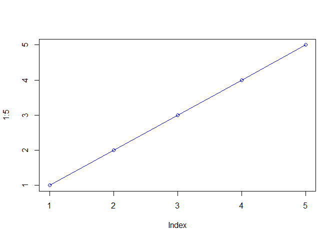

class05
================
Alberto Carreno
3/6/2020

``` r
plot(1:5, col = "blue" , typ="o")
```

<!-- -->

``` r
baby <- read.table("bimm143_05_rstats/weight_chart.txt", header = TRUE)
plot(baby$"Age",baby$"Weight", type = "o", col = "blue", cex = 1.5, pch = 15,lwd = 2, ylim = c(2,10),xlab = "Months", ylab = "Weight(kg)",main = "Weight of baby over time")
```

<!-- -->

``` r
mouse <- read.table("bimm143_05_rstats/feature_counts.txt", header = TRUE, sep = "\t")
par(mar = c(5,11,4,4))
barplot(mouse$Count,horiz = TRUE, ylab = "A title",col ="blue", names.arg = mouse$Feature, main = "Some title", las = 1, xlim = c(0,80000) )
```

<!-- -->

``` r
mf <- read.delim("bimm143_05_rstats/male_female_counts.txt")
par(mar = c(5,4,3,2))
barplot(mf$Count,col = rainbow(nrow(mf)),names.arg = mf$Sample,las = 2)
```

<!-- -->

``` r
barplot(mf$Count,col = c("red","blue"),names.arg = mf$Sample,las = 2)
```

<!-- -->
